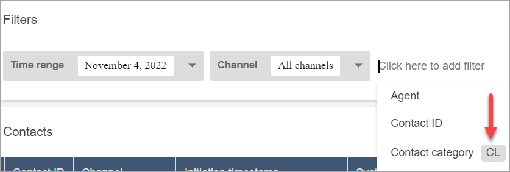
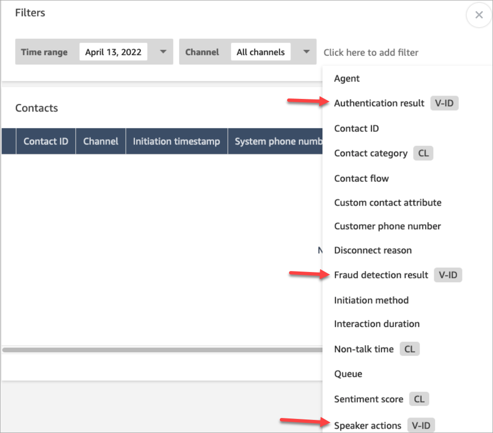

# Search for completed and in-progress contacts in

Amazon Connect

###### Note

End of support notice: On May 20, 2026, AWS will end support for Amazon Connect
Voice ID. After May 20, 2026, you will no longer be able to access Voice ID on the
Amazon Connect console, access Voice ID features on the Amazon Connect admin website or Contact Control Panel, or access Voice ID
resources. For more information, visit [Amazon Connect
Voice ID end of support](amazonconnect-voiceid-end-of-support.md "amazonconnect-voiceid-end-of-support.md").

This topic is for administrators and contact center managers who need to search for
contacts using the Amazon Connect admin website. For the APIs used to search for contacts programmatically, see
[APIs to search contacts](#apis-search-contacts "#apis-search-contacts").

###### Contents

- [Important things to know](#important-contact-search "#important-contact-search")
- [Key search features](#key-search-features "#key-search-features")
- [Manage who can search for
  contacts and access detailed information](#required-permissions-search-contacts "#required-permissions-search-contacts")
- [How to search for a contact](#how-to-search-contacts "#how-to-search-contacts")
- [Additional fields: Add columns to your search
  results](#additional-fields "#additional-fields")
- [Download search results](#download-search-results "#download-search-results")
- [APIs to search contacts](#apis-search-contacts "#apis-search-contacts")
- [Search for in-progress contacts in
  Amazon Connect](search-in-progress-contacts.md "search-in-progress-contacts.md")
- [Search for contacts in Amazon Connect by using custom
  contact attributes or contact segment attributes](search-custom-attributes.md "search-custom-attributes.md")

## Important things to know

- You can search for contacts as far back as two years ago.
- You can search for both completed and in-progress contacts.
  For contacts handled by agents, a contact is only marked as completed
  after the agent has completed After Contact Work (ACW).
- The ability to search for in-progress contacts varies by channel (see [Contact events data model](contact-events.md#contact-events-data-model "contact-events.md#contact-events-data-model") for reference):
  - **Voice**
    - You can search for in-progress queued callbacks after
      they are queued, connected to an agent or disconnected.
    - For other voice contacts, you can search them only after
      they are connected to an agent, or have been disconnected.
      Queued in-progress voice contacts (with the exception of callbacks)
      are not shown on the **Contact search** page.

  - **Chat**: You can search for contacts
    after they are connected to system, queued, connected to an agent or
    disconnected.
  - **Tasks** and **Email**: You can search for all in-progress after they are
    initiated.

- The search results for a given query are limited to the first 10K results
  returned.
- You cannot search for multiple contact IDs at the same time.

## Key search features

- [Search by custom contact
  attributes](search-custom-attributes.md "search-custom-attributes.md") (user-defined attributes).
- [Search for contacts that are in
  progress](search-in-progress-contacts.md "search-in-progress-contacts.md") or completed using the **Contact status**
  filter.
- Search a time range up to 8 weeks. Within the time range filter, you can
  specify the **Timestamp type**. This enables you to specify the
  time range. You can choose from initiated, connected to agent, disconnected, and
  scheduled timestamps.

###### Important

    + Time range filter on Contact search has Timestamp type set to
     "Initiated" by default. Before the Timestamp type selection was
     introduced, the Timestamp type used by the Time Range filter was
     "Disconnected".
    + Saved searches on Contact search created prior to the launch of
     the ability to search for in-progress contacts (launched September
     2023) have been updated with the filters Contact status =
     "Completed" and Timestamp type = "Disconnected". These selections
     were implied before the launch of in-progress contacts.

- Multi-select filters for agent names, contact queues and the name of the
  initial flow for the contact.
- Filter for agent hierarchy. You can progressively apply filters to drill-down
  into agent hierarchy levels.

###### Note

When you select multiple values at any hierarchy level, you cannot filter
on the next hierarchy level(s).

- Filter contacts by channel and channel subtype, such as SMS.
- Filter to search for email contacts using email address (To, From and CC) and
  email subject. Searching on an email subject is not case sensitive. Also,
  searching for a subset of words within an email subject provides search results.
  For example, if you enter **inquiry**, Amazon Connect return emails with
  the subject **Customer Inquiry**.
- Filters for [conversation analytics](analyze-conversations.md "analyze-conversations.md").
  You can search for contacts that have conversational analytics enabled.
  e.g. **Conversational analytics: Voice - Agent interaction** returns contacts where the agent interaction has been analyzed by conversational analytics.
  You can [search for Contact categories](search-conversations.md#contact-category-search "search-conversations.md#contact-category-search") by specifying the full category name. Choose to search using
  **Match any** or **Match all** or **Match none**.
  For example, you can search contacts with both "category A" and "category B", or with either one of the two categories.

You can refer to the complete list of conversational analytics filters [here](search-conversations.md "search-conversations.md"). You can apply these filters only if your organization has enabled Contact Lens.

In the **Add filter** drop-down box, the Contact Lens
filters have **CL** next to them. You can apply these filters
only if your organization has enabled Contact Lens.

If you want to remove the Contact Lens filters from a user's drop-down
list, remove the following permissions from their security profile:

    + **Search contacts by conversation**: This controls
     access to the sentiment scores, non-talk time, and category
     searches.
    + **Search contacts by keywords**: This controls access
     to the keywords search.
    + **Contact Lens - conversational analytics**: On
     the **Contact details** page, this displays graphs that
     summarize conversational analytics.

- Filters for recordings. Using the **recording** filter, you can filter for contacts with a screen recording (video) or audio recording (voice).
- Filters for [Voice ID](voice-id.md "voice-id.md"). You can search for the
  Voice ID authentication and fraud detection status of contacts, if your
  organization has enabled Voice ID. To access this functionality, on your
  security profile, you need **Analytics and Optimization**,
  **Voice ID - attributes and search** -
  **View** permission.

The following image shows the filters available to search Voice ID:
**Authentication result**, **Fraud detection
result**, **Speaker actions**.

## Manage who can search for

contacts and access detailed information

Before users can search for contacts in Amazon Connect, or access detailed contact information,
they need to be assigned to the **CallCenterManager** security profile,
or have the following **Analytics and Optimization**
permissions:

- At least one of the following permissions is required to view contacts on
  **Contact search** and **Contact details**
  pages:
  - **Contact search - View**: Allows a user to access
    all contacts on **Contact search** and
    **Contact details** pages.
  - **View my contacts - View**: On the **Contact
    search** and **Contact details** pages,
    allows agents to view only those contacts that they handled.

- **Restrict contact access** (Optional): Manage a user's
  access to results on the **Contact search** page based on their
  agent hierarchy group. For example:

      + Agents who are assigned to AgentGroup-1 can only view contact
       records for contacts handled by agents in that hierarchy group, and any groups
       below them. (If they have permissions for **Recorded
       conversations**, they can also listen to call recordings and view
       transcripts.)
      + Agents assigned to AgentGroup-2 can only access contact records
       for contacts handled by their group, and any groups below them.
      + Managers and others who are in higher level groups can view contact records
       for contacts handled by all the groups below them, such as AgentGroup-1 and
       2.

  For this permission, **All** = **View**
  since **View** is the only action granted.

For more information about hierarchy groups, see [Organize agents into teams and groups for reporting
and access by creating hierarchies](agent-hierarchy.md "agent-hierarchy.md").

###### Important

    + Deleting a hierarchy level severs the link to existing contacts.
     This action can not be reversed.
    + When you change a user's hierarchy group, it may take a couple of
     minutes for their contact search results to reflect their new
     permissions.

The following table lists the typical permissions and what contacts can be
views on **Contact search** and **Contact
details** pages.

| Contact search permission | View My Contacts permission | Restrict Contact Access permission | Which contacts can be viewed                                                                       |
| ------------------------- | --------------------------- | ---------------------------------- | -------------------------------------------------------------------------------------------------- |
| Enabled                   | Disabled                    | Disabled                           | All                                                                                                |
| Enabled                   | Disabled                    | Enabled                            | All contacts within your agent hierarchy, handled by an agent at your hierarchy level or below. |
| Disabled                  | Enabled                     | Disabled                           | Only contacts handled by the user (agent) to whom the permission is granted.                    |
| Disabled                  | Disabled                    | Disabled                           | No contacts                                                                                        |

###### Important

We do not recommend assigning permissions in any other combination than
what is shown in the preceding table.

- **Contact Lens - conversational analytics**: On the
  **Contact details** page for a contact, you can view
  graphs that summarize conversational analytics: customer sentiment trend,
  sentiment, and non-talk time.
- **Call recordings (redacted) - Access**: If your organization
  uses Contact Lens, you can assign this permission so agents access only
  those agent call recordings in which sensitive data has been redacted.
- **Contact transcripts (redacted) - Access**: If your
  organization uses Contact Lens, you can assign this permission so agents
  access only those contact transcripts in which sensitive data has been
  redacted.
- **Call recordings (unredacted) - Access**: Use this
  permission to manage who can access recordings on the **Contact
  search** and **Contact details** pages. If
  desired, you can use **Restrict contact access** to ensure they
  only have access to detailed information for those contacts handled by their
  hierarchy group.
- **Contact transcripts (unredacted) - Access**: Use this
  permission to manage who can view unredacted chat and email conversations, and
  unredacted voice transcripts produced by Contact Lens on the
  **Contact search** and **Contact details**
  pages. If desired, you can use **Restrict contact access** to
  ensure they only have access to detailed information for those contacts handled
  by their hierarchy group.
- **Evaluation forms - perform evaluations**: Allows users to
  [search for](search-evaluations.md "search-evaluations.md") evaluations by
  evaluation form, score, last updated date/range, evaluator, and status.
- **Voice ID - attributes and search**: If your organization
  uses Voice ID, users with this permission can search for and view Voice ID
  results in the **Contact detail** page.
- **Users - View** permission: You must have this permission to
  use the **Agent** filter on the **Contact
  search** page.

By default, the Amazon Connect **Admin** and
**CallCenterManager** security profiles have these
permissions.

For information about how to add more permissions to an existing security profile,
see [Update security profiles in Amazon Connect](update-security-profiles.md "update-security-profiles.md").

## How to search for a contact

1. Log in to Amazon Connect with a user account that has [permissions to access contact
   records](#required-permissions-search-contacts "#required-permissions-search-contacts").
2. In Amazon Connect choose **Analytics and optimization**,
   **Contact search**.
3. Use the filters on the page to narrow your search. For date, you can search up
   to 8 weeks at a time.

###### Tip

To see if a conversation was recorded, you need to be assigned to a profile that
has **Manager monitor** permissions. If a conversation was
recorded, by default the search result will indicate so with an icon in the
**Recording** column. You won't see this icon if you don't have
permission to review the recordings.

## Additional fields: Add columns to your search

results

Use the options under **Additional fields** to add columns in your
search results. These options are not used to filter your search.

For example, if you want to include columns for **Agent Name** and
**Routing profile** in your search output, choose those columns
here.

###### Tip

The **Is transferred out** option indicates whether the contact
was transferred to an external number. For the date and time (in UTC time) when the
transfer was connected, see `TransferCompletedTimestamp` in the [ContactTraceRecord](ctr-data-model.md#ctr-ContactTraceRecord "ctr-data-model.md#ctr-ContactTraceRecord").

## Download search results

You can download up to 3,000 search results at a time.

## APIs to search contacts

Use the following APIs to search contacts programmatically:

- [SearchContacts](../APIReference/API_SearchContacts.md "../APIReference/API_SearchContacts.md")
- [DescribeContact](../APIReference/API_DescribeContact.md "../APIReference/API_DescribeContact.md")
- [DescribeContactEvaluation](../APIReference/API_DescribeContactEvaluation.md "../APIReference/API_DescribeContactEvaluation.md")
