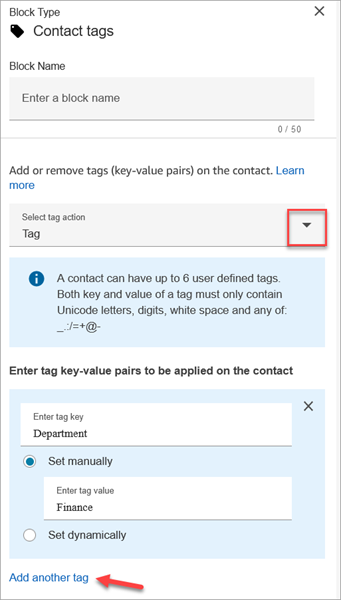
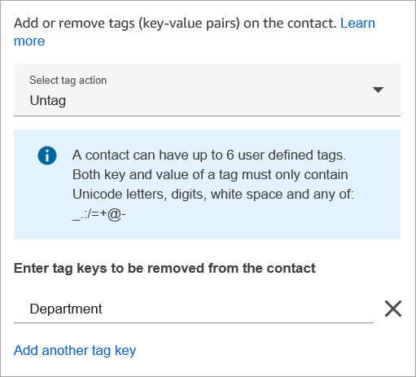
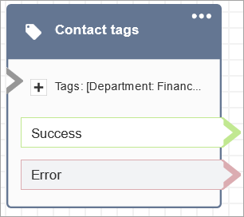

# Flow block in Amazon Connect: Contact tags

This topic defines the flow block for creating and applying tags to your
contacts.

## Description

- Use this block to create and apply user-defined tags (key:value pairs) to
  your contacts.
- You can create up to 6 user-defined tags.
- You set a value that can be referenced later in a flow. You can also
  remove tags in a flow, for example, if the tags aren't relevant to the
  segment anymore.
- For more information about how to use tags to obtain a more detailed view
  of your Amazon Connect usage, see [Set up granular billing for a detailed view of your Amazon Connect
  usage](granular-billing.md "granular-billing.md").

## Supported channels

The following table lists how this block routes a contact who is using the
specified channel.

| Channel | Supported? |
| ------- | ---------- |
| Voice   | Yes        |
| Chat    | Yes        |
| Task    | Yes        |
| Email   | Yes        |

## Flow types

You can use this block in the following [flow
types](create-contact-flow.md#contact-flow-types "create-contact-flow.md#contact-flow-types"):

- All

## Properties

The following image shows the **Properties** page of the
**Contact tags** block. It is configured to set a tag on the
current contact with the key **Department** and the value
**Finance**.

You can also configure the block to untag a contact, as shown in the following
image.

## Configuration tips

- For more information about how Amazon Connect processes user-defined tags, see
  [Things to know about user-defined tags](granular-billing.md#about-user-defined-tags "granular-billing.md#about-user-defined-tags").

## Configured block

The following image shows an example of what this block looks like when it is
configured. It has two branches: **Success** and
**Error**.

