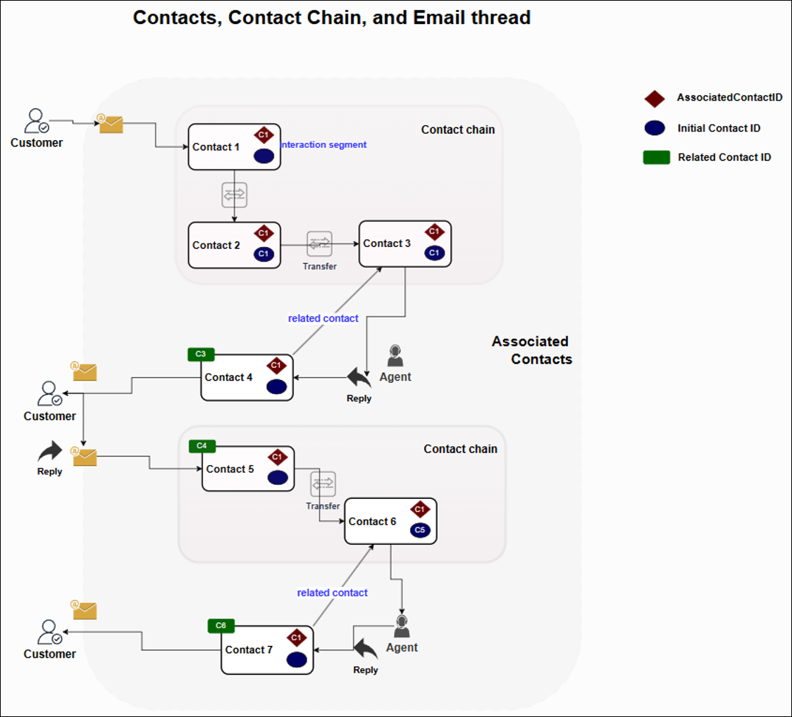

# Contacts, contact chains, and contact

attributes

This topic explains how Amazon Connect organizes and tracks
customer interactions while maintaining relevant contextual information throughout the
customer journey.

###### Contents

- [Contacts](#contacts-defined "#contacts-defined")
- [Contact chains](#contact-chains "#contact-chains")
- [Contact attributes](#contact-attributes-overview "#contact-attributes-overview")

## Contacts

In Amazon Connect a _contact_ represents either a segment of customer
interaction, or it represents an agent's designated task.

## Contact chains

As a customer interaction proceeds through the Amazon Connect infrastructure, it is represented
by a _contact chain_. A contact chain encompasses the complete
pathway from initial engagement to final resolution. This journey is orchestrated by a
_flow_, a sophisticated routing mechanism that governs both the
directional flow of calls, chats, or emails, and the methodology of handling
interactions, whether through human agents or automated systems.

For example, consider the following voice interaction scenario: A customer call
transfers from an initial agent to a secondary agent, and then subsequently requires
escalation to a subject matter expert. This scenario creates three distinct contacts
within a single interaction chain. Each participant's involvement constitutes an
individual contact segment.

Similarly, in email communications, multiple exchanges between customers and business
representatives form comprehensive email threads. Within these threads, each incoming
correspondence has the potential to generate its own contact chain, particularly when
routing occurs across multiple queues or agent transfers.

The following image illustrates the hierarchical relationship among initial contact
ID, related contact ID, and associated contact ID within the Amazon Connect contact management
framework. This hierarchical relationship enables you to trace and analyze the complete
lifecycle of customer interactions.

## Contact attributes

There are two types of contact attributes: system-defined attributes and user-defined
attributes.

### System-defined attributes

Amazon Connect defines attribute names (such as channel), and manages attribute values
(such as voice and chat). You can create personalized customer experiences in your
contact center by leveraging these system-defined contact attributes.

For example, you can customize welcome messages based on the customer's
communication channel, for example, whether they're connecting through phone or
chat. Essential system-defined attributes include customer endpoints (phone numbers
or email addresses), agent names, communication channels (voice or chat), and more.
These system-defined attributes enable you to build effective decision-making for
processing customer interactions.

### User-defined attributes

You can capture specific contextual information for your business through
user-defined attributes. These attributes encompass details such as line-of-business
names, customer account types, and contact drivers. Amazon Connect offers two types of
user-defined attributes:

- **Contact attributes**: These allow you to
  attach your own business attributes (key-value pairs) to a specific contact
  ID.

Use contact attributes in use cases that require consistent information
sharing across interaction segments during transfers and conferences. For
example, when a third agent discovers customer account information during a
transfer scenario, storing it as contact attributes on the third agent's
contact records would automatically reflect back to the first and second
agents' contact records.

Important things to know about contact attributes:

    + For transfers and conference scenarios, the attributes and values
     are immediately propagated to all interaction segments within the
     contact chain.
    + When you update an attribute's value for a specific interaction
     segment, Amazon Connect automatically applies this change across all
     interaction segments in the contact chain.

For more information, see [How contact attributes work in Amazon Connect](what-is-a-contact-attribute.md "what-is-a-contact-attribute.md").

- **Contact segment attributes**: Unlike
  contact attributes, contact segment attributes keep the values that remain
  specific to individual contact segments.

Use contact segment attributes in use cases where information varies
between transfers or conferences, such as business unit names that may
change as a contact moves between departments. You can use contact segment
attributes for common information such as account details as well, as long
as you don't need to propagate the information to previous interaction
segments in the customer journey.

Important things to know about contact segment attributes:

    + Changes to segment attributes in one contact segment (such as C3)
     remain isolated from other segments (such as C1 and C2).
    + To maintain the continuity of the business context, Amazon Connect
     transfers attributes and values from previous contacts to subsequent
     ones. This allows a value to be changed in each new segment.

For more information, see [Use contact segment attributes](use-contact-segment-attributes.md "use-contact-segment-attributes.md").
