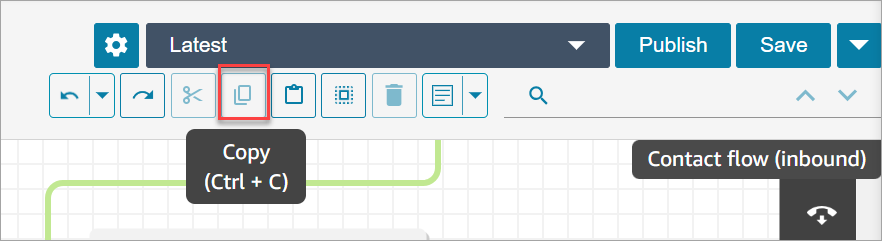

# Copy and paste flows in Amazon Connect

You can select, cut, copy, and paste a complete flow or multiple blocks within or
across flows. The following information is copied:

- All configured settings in the selected flow blocks.
- The layout arrangements.
- The connections.
  The following image shows the copy item on the flow designer toolbar.

Or, if desired, use the shortcut keys.

###### Windows: CTRL+C to copy, CTRL+V to paste, and CTRL+X to cut

1. To select multiple blocks at the same time, press the
   **Ctrl** key, and choose the blocks you want.
2. With your cursor on the flow designer canvas, press
   **Ctrl+C** to copy the blocks.
3. Press **CTRL+V** to paste the blocks.

###### Mac: Cmd+C to copy, Cmd+V to paste, and Cmd+X to cut

1. To select multiple blocks at the same time, press the **Cmd**
   key, and choose the blocks you want.
2. Press **Cmd+C** to copy the blocks.
3. Press **Cmd+V** to paste the blocks.

###### Tip

Amazon Connect uses the clipboard for this feature. Paste won't work if you edit the JSON
in your clipboard and introduce a typo or other error, or if you have multiple items
saved to your clipboard.
