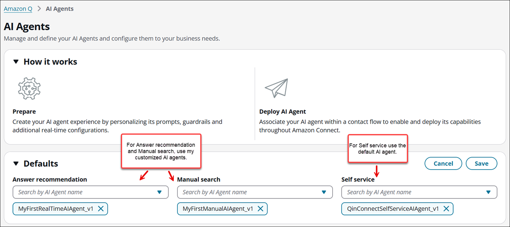

# Create AI agents in Amazon Connect

An _AI agent_ is an Amazon Q in Connect resource that configures and customizes
the end-to-end Amazon Q in Connect experience. For example, the AI agent tells the AI Assistant how to
handle a manual search: which AI prompts and AI guardrails it should use, and which
locale to use for the response.

Amazon Q in Connect provides a system AI agent for each use case:

- Answer recommendation
- Manual search
- Self service
- Email overview
- Email generative answer
  The system AI agents are populated with the default AI prompts for each use case.

For example, the following image shows an Amazon Q in Connect experience that is configured to use
customized AI agents for answer recommendations and manual searches, but uses the system
default AI agent for self service use cases.


Here's how customized AI agents work:

- You can override one or more of the system AI agents with your customized AI
  agents.
- Your customized AI agent then becomes default for the specified use
  case.
- When you create a customized AI agent, you can specify one or more of your own
  customized AI prompts, and one guardrail.
- Most use cases—**Answer recommendation**,
  **Self service**, **Email response**, and
  **Email generative answer**—support two types of AI
  prompts. If you choose to create a new AI prompt for one type but not the other,
  then the AI agent continues using the system default for the AI prompt you
  didn't override. This way you can choose to override only specific parts of the
  default Amazon Q in Connect experience.

## How to create AI agents

1. Log in to the Amazon Connect admin website at https://`instance
name`.my.connect.aws/. Use an admin account, or an account with
   **Amazon Q** - **AI agents** -
   **Create** permission in it's security profile.
2. On the navigation menu, choose **Amazon Q**, **AI
   agents**.
3. On the **AI Agents** page, choose **Create AI
   Agent**.
4. On the **Create AI Agent** dialog box, for **AI
   Agent type**, use the dropdown box to choose from one of the
   following types:
   - **Answer recommendation**: An AI agent that
     drives the automatic intent-based recommendations that are pushed to
     agents when they engage in a contact with customers. It uses the
     following types of AI prompt:
     - **Intent labelling generation** AI prompt
       to generate the intents for the customer service agent to
       choose as a first step.
     - **Query reformulation** AI prompt after
       an intent has been chosen. It uses this prompt to formulate
       an appropriate query which is then used to fetch relevant
       knowledge base excerpts.
     - **Answer generation**, the generated
       query and excerpts are fed into this prompt using the
       `$.query` and `$.contentExcerpt`
       variables respectively.

   - **Manual search**: An AI agent that produces
     solutions in response to on-demand searches initiated by an agent.
     It uses the **Answer generation** type of AI
     prompt.
   - **Self-service**: An AI agent produces solutions
     for self-service. It uses the **Self-service answer
     generation** and **Self-service
     pre-processing** types of AI prompt.
   - **Email response**: An AI agent that facilitates
     sending an email response of a conversation script to the end
     customer.
   - **Email overview**: An AI agent that provides an
     overview of email content.
   - **Email generative answer**: An AI agent that
     generates answers for email responses.

###### Important

**Answer recommendation** and **Self
service** support two types of AI prompts. If you choose to
create a new AI prompt for one type but not the other, then the AI agent
continues using the system default for the one you didn't replace. This
way you can choose to override only specific parts of the default Amazon Q in Connect
experience. 5. On the **Agent builder** page, you can specify the locale
to use for the response. For a list of supported locales, see [Supported locale codes](configure-language-support-for-q-in-connect.md#supported-locale-codes-q "configure-language-support-for-q-in-connect.md#supported-locale-codes-q").

You can choose the locale for **Answer recommendation**,
**Manual search**, **Email response**,
**Email overview**, and **Email generative
answer** types of AI agents. You cannot choose the locale for
**Self-service**; only English is supported. 6. Choose the AI prompts you want to override the defaults. Note that you're
choosing a published AI prompt _version_, not just a
saved AI prompt. If desired, add an AI guardrail to your AI agent.

###### Note

If you don't specifically override a default AI prompt with a
customized one, the default continues to be used. 7. Choose **Save**. You can continue updating and saving the
AI agent until you're satisfied it is complete. 8. To make the new AI agent version available as a potential default, choose
**Publish**.

## Associate an AI agent with a flow

To use the default out-of-the-box Amazon Q in Connect functionality, you add a [Amazon Q in Connect](q-block.md "q-block.md") block to your flows. This
block associates the Assistant and the default mapping of AI agents.

To override this default behavior, create a Lambda, and then use the [AWS Lambda
function](invoke-lambda-function-block.md "invoke-lambda-function-block.md") block to add it to your
flows.

## Sample CLI commands to create and manage AI

agents

This section provides several sample AWS CLI commands to help you create and
manage AI agents.

###### Contents

- [Create an AI agent that uses every
  customized AI prompt version](#cli-ai-agents-sample1 "#cli-ai-agents-sample1")
- [Partially configure an AI agent](#cli-ai-agents-sample2 "#cli-ai-agents-sample2")
- [Configure an AI prompt version for
  manual searches](#cli-ai-agents-sample3 "#cli-ai-agents-sample3")
- [Use AI agents to override the knowledge
  base configuration](#cli-ai-agents-sample4 "#cli-ai-agents-sample4")
- [Create AI agent versions](#cli-ai-agents-sample5 "#cli-ai-agents-sample5")
- [Set AI agents for use with Amazon Q in Connect](#cli-ai-agents-sample6 "#cli-ai-agents-sample6")
- [Revert to system defaults](#cli-ai-agents-sample6b "#cli-ai-agents-sample6b")

### Create an AI agent that uses every

customized AI prompt version

Amazon Q in Connect uses the AI prompt version for its functionality if one is specified
for an AI agent. Otherwise it defaults to the system behavior.

Use the following sample AWS CLI command to create an AI agent that uses
every customized AI prompt version for answer recommendations.

```

aws qconnect create-ai-agent \
  --assistant-id <YOUR_Q_IN_CONNECT_ASSISTANT_ID> \
  --name example_answer_recommendation_ai_agent \
  --visibility-status PUBLISHED \
  --type ANSWER_RECOMMENDATION \
  --configuration '{
    "answerRecommendationAIAgentConfiguration": {
      "answerGenerationAIPromptId": "<ANSWER_GENERATION_AI_PROMPT_ID_WITH_VERSION_QUALIFIER>",
      "intentLabelingGenerationAIPromptId": "<INTENT_LABELING_AI_PROMPT_ID_WITH_VERSION_QUALIFIER>",
      "queryReformulationAIPromptId": "<QUERY_REFORMULATION_AI_PROMPT_ID_WITH_VERSION_QUALIFIER>"
    }
  }'
```

### Partially configure an AI agent

You can partially configure an AI agent by specifying it should use some
customized AI prompt versions. For what's not specified, it uses the default AI
prompts.

Use the following sample AWS CLI command to create an answer recommendation
AI agent that uses a customized AI prompt version and lets the system defaults
handle the rest.

```

aws qconnect create-ai-agent \
  --assistant-id <YOUR_Q_IN_CONNECT_ASSISTANT_ID> \
  --name example_answer_recommendation_ai_agent \
  --visibility-status PUBLISHED \
  --type ANSWER_RECOMMENDATION \
  --configuration '{
    "answerRecommendationAIAgentConfiguration": {
      "answerGenerationAIPromptId": "<ANSWER_GENERATION_AI_PROMPT_ID_WITH_VERSION_QUALIFIER>"
    }
  }'
```

### Configure an AI prompt version for

manual searches

The manual search AI agent type only has one AI prompt version so there is no
partial configuration possible.

Use the following sample AWS CLI command to specify an AI prompt version for
manual search.

```

aws qconnect create-ai-agent \
  --assistant-id <YOUR_Q_IN_CONNECT_ASSISTANT_ID> \
  --name example_manual_search_ai_agent \
  --visibility-status PUBLISHED \
  --type MANUAL_SEARCH \
  --configuration '{
    "manualSearchAIAgentConfiguration": {
      "answerGenerationAIPromptId": "<ANSWER_GENERATION_AI_PROMPT_ID_WITH_VERSION_QUALIFIER>"
    }
  }'
```

### Use AI agents to override the knowledge

base configuration

You can use AI agents to configure which assistant associations Amazon Q in Connect should
use and how it should use them. The association supported for customization is
the knowledge base which supports:

- Specifying the knowledge base to be used by using its
  `associationId`.
- Specifying content filters for the search performed over the
  associated knowledge base by using a `contentTagFilter`.
- Specifying the number of results to be used from a search against the
  knowledge base by using `maxResults`.
- Specifying an `overrideKnowledgeBaseSearchType` that can
  be used to control the type of search performed against the knowledge
  base. The options are `SEMANTIC` which uses vector embeddings
  or `HYBRID` which uses vector embeddings and raw text.

For example, use the following AWS CLI command to create an AI agent with a
customized knowledge base configuration.

```
aws qconnect create-ai-agent \
  --assistant-id <YOUR_Q_IN_CONNECT_ASSISTANT_ID> \
  --name example_manual_search_ai_agent \
  --visibility-status PUBLISHED \
  --type MANUAL_SEARCH \
  --configuration '{
    "manualSearchAIAgentConfiguration": {
      "answerGenerationAIPromptId": "<ANSWER_GENERATION_AI_PROMPT_ID_WITH_VERSION_QUALIFIER>",
      "associationConfigurations": [
        {
          "associationType": "KNOWLEDGE_BASE",
          "associationId": "<ASSOCIATION_ID>",
          "associationConfigurationData": {
            "knowledgeBaseAssociationConfigurationData": {
              "overrideKnowledgeBaseSearchType": "SEMANTIC",
              "maxResults": 5,
              "contentTagFilter": {
                "tagCondition": { "key": "<KEY>", "value": "<VALUE>" }
              }
            }
          }
        }
      ]
    }
  }'
```

### Create AI agent versions

Just like AI prompts, after an AI agent has been created, you can create a
version which is an immutable instance of the AI agent that can be used by Amazon Q in Connect
at runtime.

Use the following sample AWS CLI command to create an AI agent
version.

```
aws qconnect create-ai-agent-version \
  --assistant-id <YOUR_Q_IN_CONNECT_ASSISTANT_ID> \
  --ai-agent-id <YOUR_AI_AGENT_ID>
```

After a version has been created, the Id of the AI agent can be qualified by
using the following format:

```
 <AI_AGENT_ID>:<VERSION_NUMBER>
```

### Set AI agents for use with Amazon Q in Connect

After you have created AI prompt versions and AI agent versions for your use
case, you can set them for use with Amazon Q in Connect.

#### Set AI agent versions in the Amazon Q in Connect

Assistant

You can set an AI agent version as the default to be used in the Amazon Q in Connect
Assistant.

Use the following sample AWS CLI command to set the AI agent version as
the default. After the AI agent version is set, it will be used when the
next Amazon Connect contact and associated Amazon Q in Connect session are created.

```
aws qconnect update-assistant-ai-agent \
  --assistant-id `<YOUR_Q_IN_CONNECT_ASSISTANT_ID>` \
  --ai-agent-type MANUAL_SEARCH \
  --configuration '{
    "aiAgentId": "<MANUAL_SEARCH_AI_AGENT_ID_WITH_VERSION_QUALIFIER>"
  }'
```

#### Set

AI agent versions in Amazon Q in Connect sessions

You can also set an AI agent version for every distinct Amazon Q in Connect session
when creating or updating a session.

Use the following sample AWS CLI command to set the AI agent version for
every distinct session.

```
aws qconnect update-session \
  --assistant-id `<YOUR_Q_IN_CONNECT_ASSISTANT_ID>` \
  --session-id `<YOUR_Q_IN_CONNECT_SESSION_ID>` \
  --ai-agent-configuration '{
    "ANSWER_RECOMMENDATION": { "aiAgentId": "<ANSWER_RECOMMENDATION_AI_AGENT_ID_WITH_VERSION_QUALIFIER>" },
    "MANUAL_SEARCH": { "aiAgentId": "<MANUAL_SEARCH_AI_AGENT_ID_WITH_VERSION_QUALIFIER>" }
  }'
```

AI agent versions set on sessions take precedence over those set at the
level of the Amazon Q in Connect Assistant, which in turn takes precedence over system
defaults. This order of precedence can be used to set AI agent versions on
sessions created for particular contact center business segments. For
example, by using flows to automate the setting of AI agent versions for
particular Amazon Connect queues [using a
Lambda flow block](connect-lambda-functions.md "connect-lambda-functions.md").

### Revert to system defaults

You can revert to the default AI agent versions if erasing customization is
required for any reason.

Use the following sample AWS CLI command to list AI agent versions and
revert to the original ones.

```
aws qconnect list-ai-agents \
  --assistant-id `<YOUR_Q_IN_CONNECT_ASSISTANT_ID>` \
  --origin SYSTEM
```

###### Note

`--origin SYSTEM` is specified as an argument to fetch the system
AI agent versions. Without this argument, your customized AI agent versions
will be listed. After the AI agent versions are listed, use them to reset to
the default Amazon Q in Connect experience at the level of the Amazon Q in Connect Assistant or session;
use the CLI command described in [Set AI agents for use with Amazon Q in Connect](#cli-ai-agents-sample6 "#cli-ai-agents-sample6").
