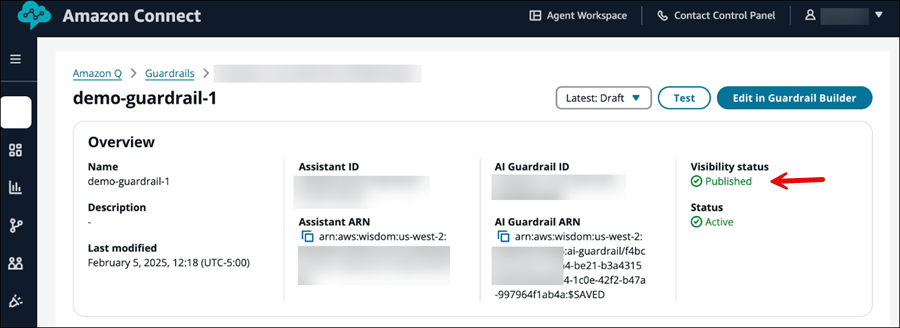
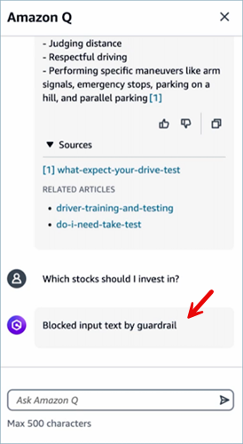
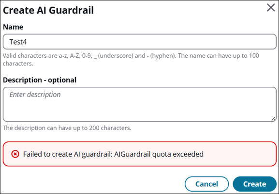

# Create AI guardrails for Amazon Q in Connect

An _AI guardrail_ is a resource that enables you to implement
safeguards based on your use cases and responsible AI policies.

Amazon Connect uses Amazon Bedrock guardrails. You can create and edit these guardrails in the
Amazon Connect admin website.

###### Contents

- [Important things to know](#important-ai-guardrail "#important-ai-guardrail")
- [How to create an AI guardrail](#create-ai-guardrail "#create-ai-guardrail")
- [Change the default blocked
  message](#change-default-blocked-message "#change-default-blocked-message")
- [Sample CLI commands to configure
  AI guardrail policies](#guardrail-policy-configurations "#guardrail-policy-configurations")

## Important things to know

- You can create up to three custom guardrails.
- Amazon Q in Connect guardrails supports the same languages as Amazon Bedrock guardrails classic tier.
  For a complete list of supported languages, see
  [Languages supported by Amazon Bedrock Guardrails](../../../bedrock/latest/userguide/guardrails-supported-languages.md "../../../bedrock/latest/userguide/guardrails-supported-languages.md").
  Evaluating text content in other languages will be ineffective.
- When configuring or editing a guardrail, we strongly recommend that you
  experiment and benchmark with different configurations. It's possible that
  some of your combinations may have unintended consequences. Test the
  guardrail to ensure that the results meet your use-case requirements.

## How to create an AI guardrail

1.  Log in to the Amazon Connect admin website with an account that has **Amazon
    Q**, **AI guardrails - Create** permission in its
    security profile.
2.  In the Amazon Connect admin website, on the left navigation menu, choose **Amazon
    Q**, **AI guardrails**.
3.  On the **Guardrails** page, choose **Create
    Guardrail**.
4.  On the **Create AI Guardrail** dialog box, enter a name
    and description of the guardrail, and then choose
    **Create**.
5.  On the **AI Guardrail builder** page, complete the
    following fields as needed to create policies for your guardrail:

        * **Content filters**: Adjust filter strengths to
         help block input prompts or model responses containing harmful
         content. Filtering is done based on detection of certain predefined
         harmful content categories - Hate, Insults, Sexual, Violence,
         Misconduct and Prompt Attack.
        * **Denied topics**: Define a set of topics that
         are undesirable in the context of your application. The filter will
         help block them if detected in user queries or model responses. You
         can add up to 30 denied topics.
        * **Contextual grounding check**: Help detect and
         filter hallucinations in model responses based on grounding in a
         source and relevance to the user query.
        * **Word filters**: Configure filters to help block
         undesirable words, phrases, and profanity (exact match). Such words
         can include offensive terms, competitor names, etc.
        * **Sensitive information filters**: Configure
         filters to help block or mask sensitive information, such as
         personally identifiable information (PII), or custom regex in user
         inputs and model responses.


        Blocking or masking is done based on probabilistic detection of
         sensitive information in standard formats in entities such as SSN
         number, Date of Birth, address, etc. This also allows configuring
         regular expression based detection of patterns for
         identifiers.
        * **Blocked messaging**: Customize the default
         message that's displayed to the user if your guardrail blocks the
         input or the model response.

    Amazon Connect does not support **Image content filter** to help
    detect and filter inappropriate or toxic image content.

6.  When your guardrail is complete, choose **Save**.

When selecting from the versions dropdown,
**Latest:Draft** always returns the saved state of the
AI guardrail. 7. Choose **Publish**. Updates to the AI guardrail are
saved, the AI guardrail Visibility status is set to
**Published**, and a new AI Guardrail version is
created.



When selecting from the versions dropdown,
**Latest:Published** always returns the saved state of
the AI guardrail.

## Change the default blocked

message

This section explains how to access the AI guardrail builder and editor in the
Amazon Connect admin website, using the example of changing the blocked message that is displayed to
users.

The following image shows an example of the default blocked message that is
displayed to a user. The default message is "Blocked input text by
guardrail."



###### To change the default blocked message

1. Log in to the Amazon Connect admin website at https://`instance
name`.my.connect.aws/. Use an admin account, or an account with
   **Amazon Q** - **AI guardrails** -
   **Create** permission in it's security profile.
2. On the navigation menu, choose **Amazon Q**, **AI
   guardrails**.
3. On the **AI Guardrails** page, choose **Create AI
   Guardrail**. A dialog is displayed for to you assign a name and
   description.
4. In the **Create AI Guardrail** dialog box, enter a name
   and description, and then choose **Create**. If your
   business already has three guardrails, you'll get an error message, as shown
   in the following image.



If you receive this message, instead of creating another guardrail,
consider editing an existing guardrail to meet your needs. Or, delete one so
you can create another. 5. To change the default message that's displayed when guardrail blocks the
model response, scroll to the **Blocked messaging**
section. 6. Enter the block message text that you want to be displayed, choose
**Save**, and then **Publish**.

## Sample CLI commands to configure

AI guardrail policies

Following are examples of how to configure the AI guardrail policies by using the
AWS CLI.

### Block undesirable

topics

Use the following sample AWS CLI command to block undesirable topics.

```
aws qconnect update-ai-guardrail
--cli-input-json {
    "assistantId": "a0a81ecf-6df1-4f91-9513-3bdcb9497e32",
    "aiGuardrailId": "9147c4ad-7870-46ba-b6c1-7671f6ca3d95",
    "blockedInputMessaging": "Blocked input text by guardrail",
    "blockedOutputsMessaging": "Blocked output text by guardrail",
    "visibilityStatus": "PUBLISHED",
    "topicPolicyConfig": {
        "topicsConfig": [
            {
                "name": "Financial Advice",
                "definition": "Investment advice refers to financial inquiries, guidance, or recommendations with the goal of generating returns or achieving specific financial objectives.",
                "examples": ["- Is investment in stocks better than index funds?", "Which stocks should I invest into?", "- Can you manage my personal finance?"],
                "type": "DENY"
            }
        ]
    }
}
```

### Filter harmful

and inappropriate content

Use the following sample AWS CLI command to filter harmful and
inappropriate content.

```
aws qconnect update-ai-guardrail
--cli-input-json {
    "assistantId": "a0a81ecf-6df1-4f91-9513-3bdcb9497e32",
    "aiGuardrailId": "9147c4ad-7870-46ba-b6c1-7671f6ca3d95",
    "blockedInputMessaging": "Blocked input text by guardrail",
    "blockedOutputsMessaging": "Blocked output text by guardrail",
    "visibilityStatus": "PUBLISHED",
    "contentPolicyConfig": {
        "filtersConfig": [
            {
                "inputStrength": "HIGH",
                "outputStrength": "HIGH",
                "type": "INSULTS"
            }
        ]
    }
}
```

### Filter harmful and

inappropriate words

Use the following sample AWS CLI command to filter harmful and inappropriate
words. 

```
aws qconnect update-ai-guardrail
--cli-input-json {
    "assistantId": "a0a81ecf-6df1-4f91-9513-3bdcb9497e32",
    "aiGuardrailId": "9147c4ad-7870-46ba-b6c1-7671f6ca3d95",
    "blockedInputMessaging": "Blocked input text by guardrail",
    "blockedOutputsMessaging": "Blocked output text by guardrail",
    "visibilityStatus": "PUBLISHED",
    "wordPolicyConfig": {
        "wordsConfig": [
            {
                "text": "Nvidia",
            },
        ]
    }
}
```

### Detect hallucinations in the model response

Use the following sample AWS CLI command to detect hallucinations in the
model response. 

```
aws qconnect update-ai-guardrail
--cli-input-json {
    "assistantId": "a0a81ecf-6df1-4f91-9513-3bdcb9497e32",
    "aiGuardrailId": "9147c4ad-7870-46ba-b6c1-7671f6ca3d95",
    "blockedInputMessaging": "Blocked input text by guardrail",
    "blockedOutputsMessaging": "Blocked output text by guardrail",
    "visibilityStatus": "PUBLISHED",
    "contextualGroundPolicyConfig": {
        "filtersConfig": [
            {
                "type": "RELEVANCE",
                "threshold": 0.50
            },
        ]
    }
}
```

### Redact sensitive information

Use the following sample AWS CLI command to redact sensitive information
such as personal identifiable information (PII).

```
aws qconnect update-ai-guardrail
--cli-input-json {
    "assistantId": "a0a81ecf-6df1-4f91-9513-3bdcb9497e32",
    "aiGuardrailId": "9147c4ad-7870-46ba-b6c1-7671f6ca3d95",
    "blockedInputMessaging": "Blocked input text by guardrail",
    "blockedOutputsMessaging": "Blocked output text by guardrail",
    "visibilityStatus": "PUBLISHED",
    "sensitiveInformationPolicyConfig": {
        "piiEntitiesConfig": [
            {
                "type": "CREDIT_DEBIT_CARD_NUMBER",
                "action":"BLOCK",
            },
        ]
    }
}
```
