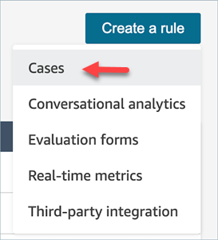
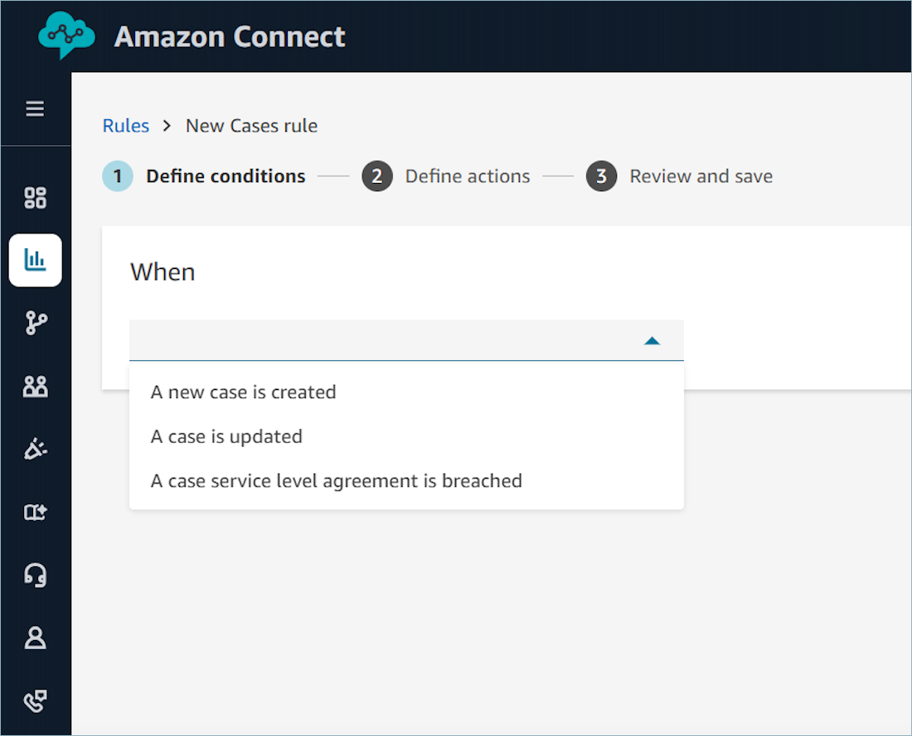
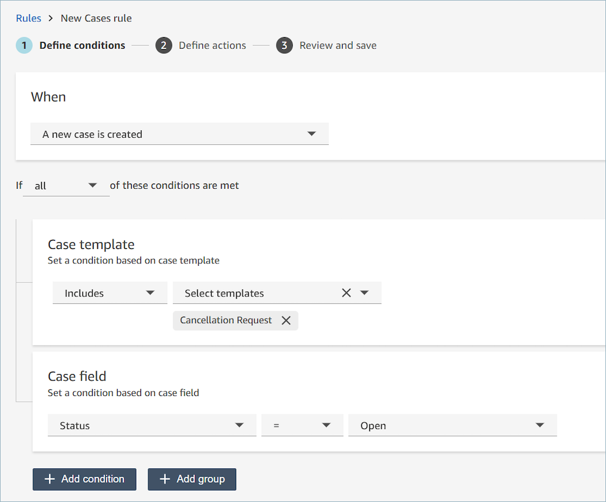
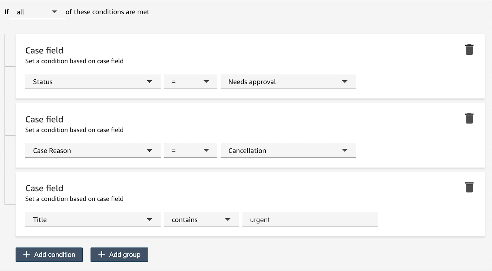
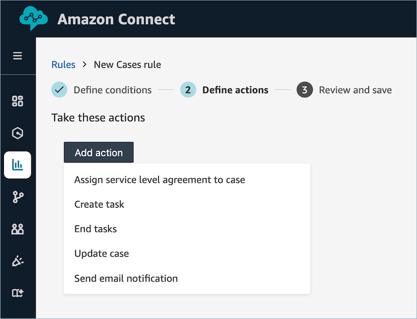

# Automatically monitor and update cases in

Amazon Connect Cases

You can easily set up case notifications and automation. You can create rules that
automatically run whenever a case is created or updated. You can create rules that:

- Assign service level agreements to cases
- Create tasks
- End associated tasks
- Update cases
- Send email alerts to Amazon Connect users
  For example, you can set up an alert that automatically sends an email to a manager
  when a high-priority case is created or updated.

###### Tip

A developer needs to enable this feature. For instructions, see [Allow Amazon Connect Cases to send
updates to Contact Lens rules](cases-rules-integration-onboarding.md "cases-rules-integration-onboarding.md").

###### Contents

- [Step 1: Define rule
  conditions](#conditions-alerts-on-cases "#conditions-alerts-on-cases")
- [Step 2: Define rule
  actions](#rule-actions-alerts-on-cases "#rule-actions-alerts-on-cases")

## Step 1: Define rule conditions

1. On the navigation menu, choose **Analytics and
   optimization**, **Rules**.
2. Select **Create a rule**,
   **Cases**.

 3. Under **When**, use the dropdown list to choose from two
event sources: **A new case is created**, **A case
is updated**, or **A case service level agreement is
breached**. These options are shown in the following
image.

 4. Choose **Add condition**. You can define conditions based
on the case template value, such as when the case template equals
**Billing**, or based on case field values, such as
when Priority equals **high**.

You can combine multiple conditions to build very specific rules.

The following image shows a sample rule with multiple conditions:

 5. Choose **Next**.

## Step 2: Define rule actions

1. Choose **Add action**. You can choose the following
   actions:
   - [Assign service level agreement to
     case](cases-sla.md#cases-sla-adding "cases-sla.md#cases-sla-adding")
   - [Create
     task](contact-lens-rules-create-task.md "contact-lens-rules-create-task.md")
   - [End
     tasks](contact-lens-rules-ends-tasks.md "contact-lens-rules-ends-tasks.md")
   - [Update
     case](contact-lens-rules-update-case.md "contact-lens-rules-update-case.md")
   - [Send email
     notification](contact-lens-rules-email.md "contact-lens-rules-email.md")

 2. Choose **Next**. 3. Review and make any edits, then choose **Save**.
