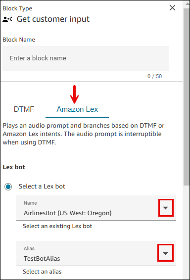
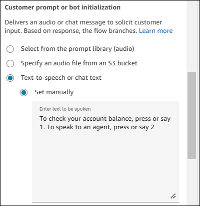
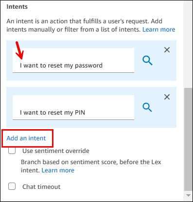
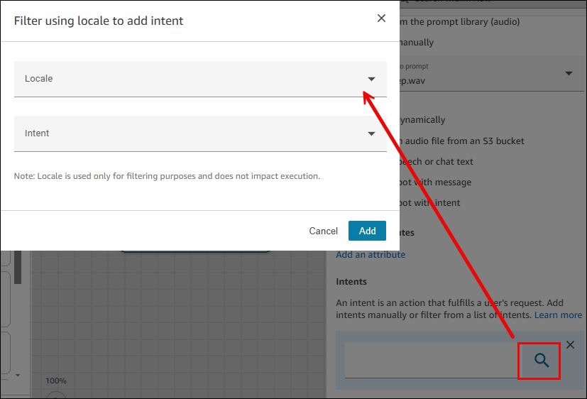

# Create a flow and add your conversational AI bot

This topic explains how to add a previously created conversational AI bot to a flow.

1. On the navigation menu in Amazon Connect, choose **Routing**,
   **Flows**, **Create flow**, and type a name for the
   flow.
2. Under **Interact**, drag a [Get customer input](get-customer-input.md "get-customer-input.md") block onto the designer, and connect it to
   the **Entry** point block.
3. Choose the [Get customer input](get-customer-input.md "get-customer-input.md")
   block to open it.
4. On the Amazon Lex tab, use the dropdown menus to select the bot you created earlier and the
   alias, as shown in the following image.

 5. Under **Customer prompt or bot initialization**, choose
**Text-to-speech or chat text**. 6. Type a message that provides callers with information about what they can do. For
example, use a message that matches the intents used in the bot, such as _To
check your account balance, press or say 1. To speak to an agent, press or say
2_. The following image shows this message on the properties page of the
[Get customer input](get-customer-input.md "get-customer-input.md")
block.

 7. Under **Intents**, choose **Add an intent**, and then
enter or search for the customer intents that should trigger the bot.

When you search for intents, you can filter by the locale. The locale is only used for
filtering, it is not tied to the locale when the bot is triggered. For example, you might
find the BookHotel intent by using the English (US) locale, but the intent can be
successfully returned in both English (US) and English (GB).

For more information on finding intents, see [How to find intents](#find-notlisted-intents "#find-notlisted-intents").

The following image shows the dialog box to filter intents by locale.

 8. Choose **Save**.

###### Important

If you're using an Amazon Lex V2 bot, your language attribute in Amazon Connect must match the language
model used to build your Lex bot. This is different than Amazon Lex (Classic). Use a [Set voice](set-voice.md#set-voice-lexv2bot "set-voice.md#set-voice-lexv2bot") block to indicate the Amazon Connect language model,
or use a [Set contact
attributes](set-contact-attributes.md "set-contact-attributes.md")
block.

## How to find intents for Amazon Lex V1 bots, cross-Region

bots, or dynamically set bots

The **Intents** dropdown box does not list intents for Amazon Lex V1 bots, cross
region bots, or if the bot ARN is dynamically set. For these intents, try the following
options to find them.

- Check whether the **AmazonConnectEnabled** tag is set to
  true:
  1.  Open the Amazon Lex console, choose **Bots**, select the bot,
      then choose **Tags**.
  2.  If the **AmazonConnectEnabled** tag is not present, add
      **AmazonConnectEnabled = true**.
  3.  Return to the Amazon Connect admin website. Refresh the flow designer to see the selections in
      **Get customer input** block.

- Check if the version is associated with the alias:
  1.  In Amazon Connect admin website, choose **Routing**, **Flows**,
      the bot, **Aliases**. Verify that **Use in flow and
      flow modules** is enabled, as shown in the following
      image.

   2. Refresh the flow designer to see the selections in **Get customer
  input** block.
