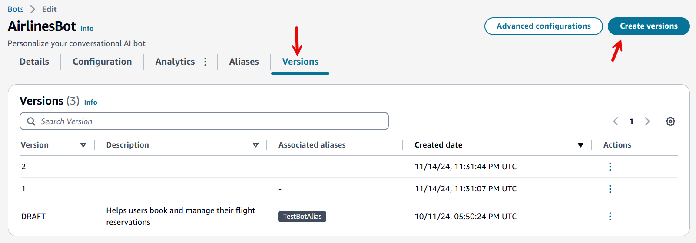
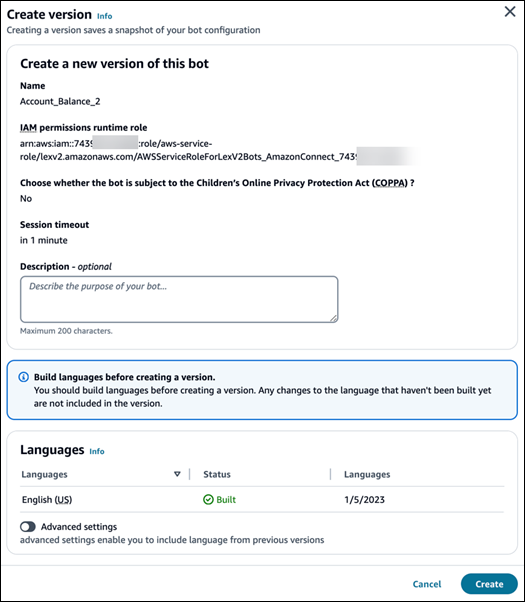
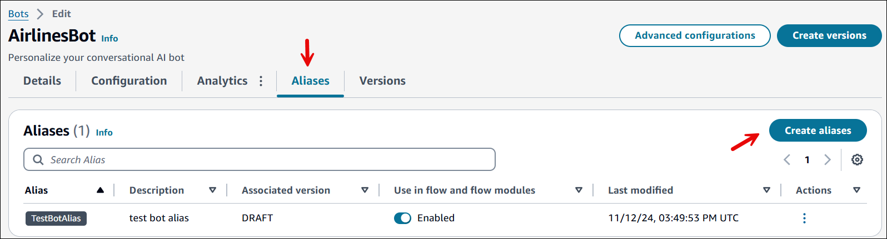
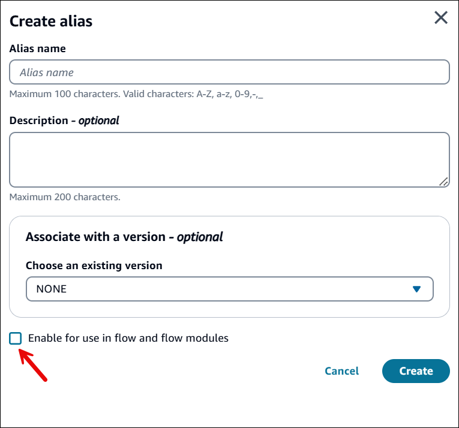

# Create bot versions and aliases in Amazon Connect

To control which bot implementation your client uses, you create versions and aliases.

- A version acts as a numbered snapshot of your work.
- You can point an alias to the version of your bot that you want to be available to your
  customers.
  In between creating versions, you can continue to update the Draft version of your bot without
  affecting your customer's experience. This process is crucial for deploying bots in a production
  environment.

## Create a version

Creating a new version preserves the current state of your bot configuration. Complete the
following steps to create a new version of your Amazon Lex bot in Amazon Connect.

1. Open the bot for which you want to create a new version.
2. Choose the **Versions** tab, and then choose **Create
   version**.

 3. In the **Create version** dialog box:

    1. Enter a version description (optional, but recommended for tracking
     changes)
    2. Choose **Create**. The following image shows an example
     **Create version** dialog box.

    

After the version is created, you can associate it with aliases or you can use it to revert
to a previous state of your bot.

## Create an alias

An alias is a pointer to a specific version of a bot. With an alias, you can easily update
the version that your client applications are using. For example, you can point an alias to
version 1 of your bot. When you are ready to update the bot, you create version 2 and change
the alias to point to the new version. Because your applications use the alias instead of a
specific version, all of your clients get the new functionality without needing to be updated.
This allows for controlled rollouts and easy version management.

###### Important

If you want to use the bot in a flow, be sure to choose **Enable for use in flow
and flow modules** when you create an alias.

Complete the following steps to create an alias for your Amazon Lex bot.

1. Open the bot for which you want to add the alias.
2. Choose the **Aliases** tab, and then choose **Create
   aliases**.

 3. In the **Create Alias** dialog box:

    1. Enter a unique name for the alias.
    2. Provide a description for the alias (optional, but recommended).
    3. Select the bot version you want to associate with this alias.
    4. (Recommended) Choose **Enable for use in flow and flow
     modules**. This is required if you want to use the bot in a
     flow.
    5. Choose **Create**. The following image shows an example
     **Create alias** dialog box.

    

For more information about versioning and aliasing in Amazon Lex V2, see [Versioning and aliases
with your Lex V2 bot](../../../lexv2/latest/dg/versions-aliases.md "../../../lexv2/latest/dg/versions-aliases.md") in the _Amazon Lex V2 Developer Guide_.
