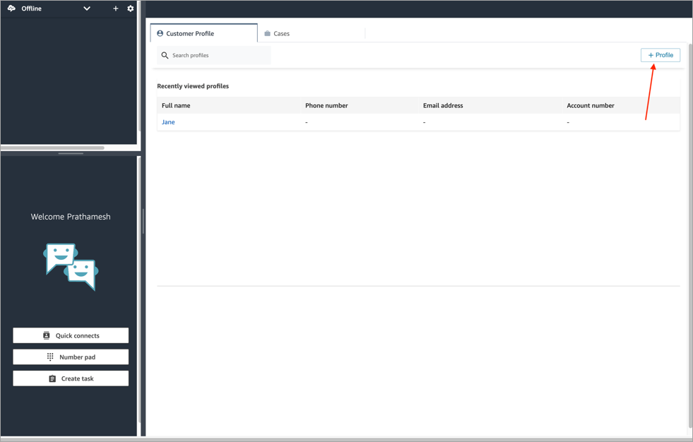
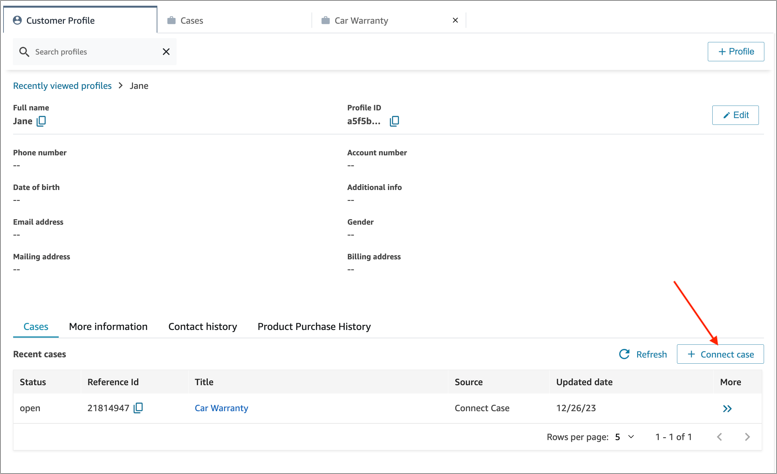
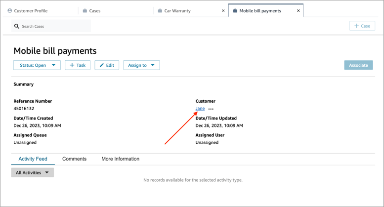
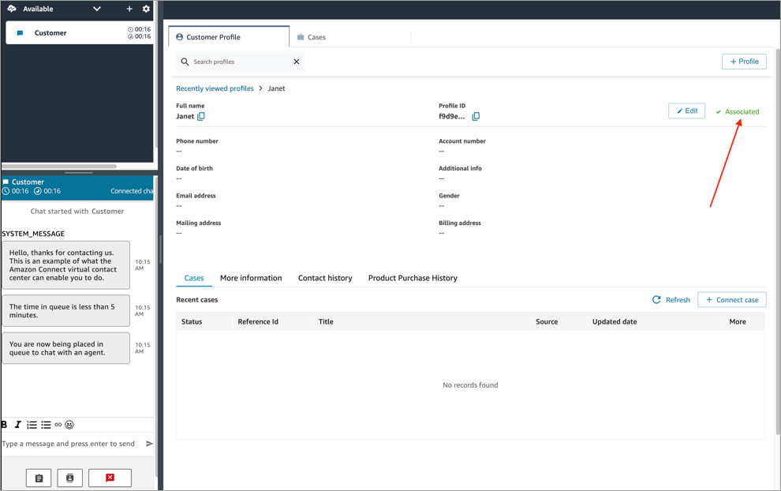
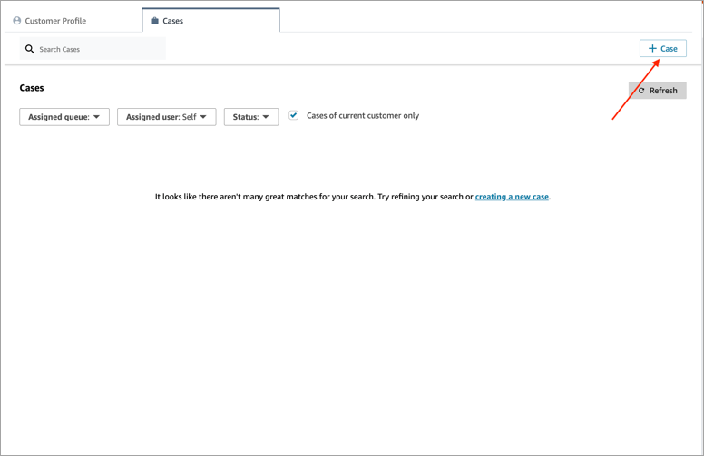
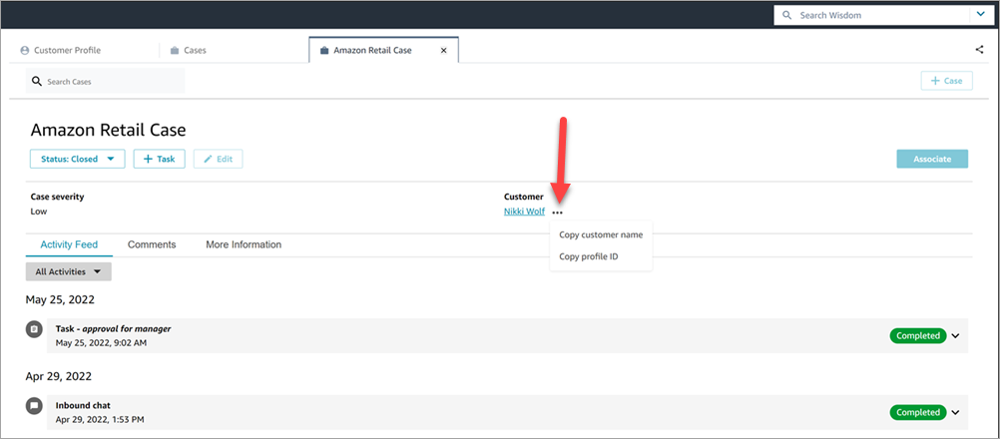

# Create a case in Amazon Connect Cases or a customer profile to

document a customer's issue

You can create a case either by choosing **+ Case** from the
**Cases** page or by choosing **+ Connect
case** directly from a customer profile. If you are not on active
contact, you can still create a case directly from the customer profile.

###### To create a case while on the **Customer Profile**

page

1. Choose **+ Profile** to create a customer profile, as
   shown in the following image.

 2. Choose **+ Connect Case** to create a case, as shown in
the following image.

 3. Complete the required information for the case, and then choose
**Save**. A case is created for the customer, as shown
in the following image.

###### To create a case while on the **Cases** page

1. You must be on a contact (call, chat, or task) and the contact must
   already be **Associated** with a customer profile, as shown
   in the following image.

 2. Choose the **Cases** tab and then choose **+
Case**, as shown in the following image.

 3. Complete the required information for the case, and then choose
**Save**. A case is created for the customer.

## Customer name

Each case that is created is connected to a customer profile from your Amazon Connect
instance. While viewing the case details page, an agent can click or tap the
customer's name to open the associated Customer Profile in a different tab. Or,
the agent can choose **More (...)** to copy the customer name
or profile ID to the clipboard. On new case templates, the customer name appears
by default on the case details page. You can rearrange this field on your case
template, or even remove it entirely.

