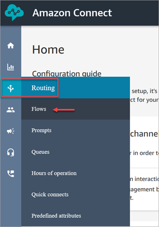
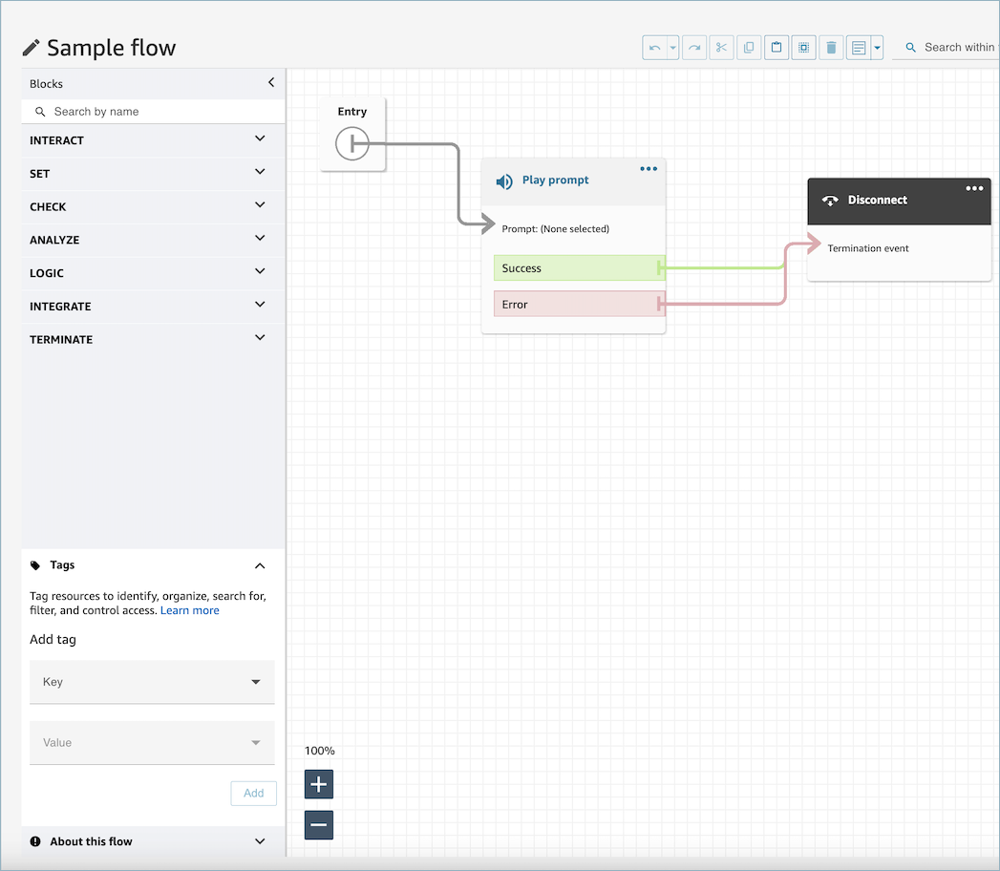
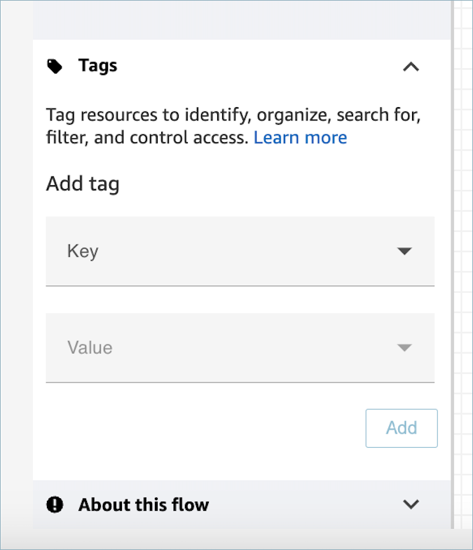

# Use the flow designer in Amazon Connect to create flows

The starting point for creating all flows is the flow designer. It's a drag-and-drop work
surface that enables you to link together blocks of actions. For example, when a customer
first enters your contact center, you can ask for some input and then play a prompt such as
"Thank you."

For descriptions of the available flow blocks, see [Flow block definitions in the flow designer in
Amazon Connect](contact-block-definitions.md "contact-block-definitions.md").

###### Contents

- [Before you begin: develop a naming
  convention](#before-create-contact-flow "#before-create-contact-flow")
- [Choose a flow type](#contact-flow-types "#contact-flow-types")
- [Create an inbound flow](#create-inbound-contact-flow "#create-inbound-contact-flow")
- [Add tags to flows and flow modules](#tag-flows-and-flow-modules "#tag-flows-and-flow-modules")
- [Use the mini-map to navigate a
  flow](flow-minimap.md "flow-minimap.md")
- [Customize the name of a
  block](set-custom-flow-block-name.md "set-custom-flow-block-name.md")
- [Undo and redo history](undo-redo-history.md "undo-redo-history.md")
- [Add notes to a block](add-notes-to-block.md "add-notes-to-block.md")
- [Copy and paste
  flows](copy-paste-contact-flows.md "copy-paste-contact-flows.md")
- [Archive, delete, and restore
  flows](delete-contact-flow.md "delete-contact-flow.md")
- [Generate logs for published flows](logs.md "logs.md")
- [Roll back a flow](flow-version-control.md "flow-version-control.md")
- [Best practices for flows](bp-contact-flows.md "bp-contact-flows.md")
- [Contact initiation methods and flow
  types](contact-initiation-methods.md "contact-initiation-methods.md")

## Before you begin: develop a naming

convention

Chances are you're going to create tens or hundreds of flows. To help you stay
organized, it's important to develop a naming convention. After you start creating
flows, we strongly recommend against renaming them.

## Choose a flow type

Amazon Connect includes a set of specific flow types. **Each type has only
those blocks for a specific scenario.** For example, the flow type for
transferring to a queue contains only the appropriate flow blocks for that type of flow.

###### Important

- When you create a flow, you need to choose the right type for your
  scenario. Otherwise, the blocks you need may not be available.
- You can't import flows of different types. This means if you start with
  one type and need to switch to another to get the right blocks, you have to
  start over.

The following flow types are available.

| Type                       | When to use                                                                                                                                                                                                                                                                                                                                                                                                                                                                                                                                                               |
| -------------------------- | ------------------------------------------------------------------------------------------------------------------------------------------------------------------------------------------------------------------------------------------------------------------------------------------------------------------------------------------------------------------------------------------------------------------------------------------------------------------------------------------------------------------------------------------------------------------------- | -------------------------------------------------------------------------------------------------------------------------------------------------------------------------------------------------------------------------------------------------------------------------------------------------------------------------------------------------------------------------------------------------------------------------------------------------------------------------------------------------------------------------------------------------------------------------------------------------------------------------------------------------------------------------------------------------------------------------------------------------------------------------------------------------------------------------------------------------------------------------------------------------------------------------------------------------------------------------------------------------------------------------------------------------------------------------------------------------------------------------------------------------------------------------------------------------------------------------------------------------------------------------------------------------------------------------------------------------------------------------------------------------------------------------------------------------------------------------------------------------------------------------------------------------------------------------------------------------------------------------------------------------------------------------------------------------------------------------------------------------------------------------------------------------------------------------------------------------------------------------------------------------------------------------------------------------------------------------------------------------------------------------------------------------------------------------------------------------------------------------------------------------------------------------------------------------------------------------------------------------------------------------------------------------------------------------------------------------------------------------------------------------------------------------------------------------------------------------------------------------------------------------------------------------------------------------------------------------------------------------------------------------------------------------------------------------------------------------------------------------------------------------------------------------------------------------------------------------------------------------------------------------------------------------------------------------------------------------------------------------------------------------------------------------------------------------------------------------------------------------------------------------------------------------------------------------------------- |
| **Inbound flow**           | This is the generic flow type that's created when you choose the **Create flow** button, and don't select a type using the drop-down arrow. It creates an inbound flow. This flow works with voice, chat, and tasks.                                                                                                                                                                                                                                                                                                                                                      |
| **Campaign flow**          | Use to manage what the customer experiences during an outbound campaign. This flow only works with outbound campaigns.                                                                                                                                                                                                                                                                                                                                                                                                                                                    |
| **Customer queue flow**    | Use to manage what the customer experiences while in queue, before being joined to an agent. Customer queue flows are interruptible and can include actions such as an audio clip apologizing for a delay and offering an option to receive a callback, leveraging the **Transfer to queue** block. This flow works with voice, chat, and tasks.                                                                                                                                                                                                                          |
| **Customer hold flow**     | Use to manage what the customer experiences while the customer is on hold. With this flow, one or more audio prompts can be played to a customer using the **Loop prompts** block while waiting on hold. This flow works with voice.                                                                                                                                                                                                                                                                                                                                      |
| **Customer whisper flow**  | Use to manage what the customer experiences as part of an inbound call immediately before being joined with an agent. The agent and customer whispers are played to completion, then the two are joined. This flow works with voice and chat.                                                                                                                                                                                                                                                                                                                             |
| **Outbound whisper flow**  | Use to manage what the customer experiences as part of an outbound call before being connected with an agent. In this flow, the customer whisper is played to completion, then the two are joined. For example, this flow can be used to enable call recordings for outbound calls with the **Set recording behavior** block. This flow works with voice and chat.                                                                                                                                                                                                        |
| **Agent hold flow**        | Use to manage what the agent experiences when on hold with a customer. With this flow, one or more audio prompts can be played to an agent using the **Loop prompts** block while the customer is on hold. This flow works with voice.                                                                                                                                                                                                                                                                                                                                    |
| **Agent whisper flow**     | Use to manage what the agent experiences as part of an inbound call immediately before being joined with a customer. The agent and customer whispers are played to completion, then the two are joined. This flow works with voice, chat, and tasks.                                                                                                                                                                                                                                                                                                                      |
| **Transfer to agent flow** | Use to manage what the agent experiences when transferring to another agent. This type of flow is associated with transfer to agent quick connects, and often plays messaging, then completes the transfer using the **Transfer to agent** block. This flow works with voice, chat, and tasks. ImportantDo not place any sensitive information in this flow. When a cold transfer occurs, the transferring agent disconnects before transfer is completed, and this flow is run on the caller. This means information in the flow is played to the caller, not the agent. |
| **Transfer to queue flow** | Use to manage what the agent experiences when transferring to another queue. This type of flow is associated with transfer to queue quick connects, and often plays messaging, then completes the transfer using the **Transfer to queue** block. This flow works with voice, chat, and tasks.                                                                                                                                                                                                                                                                            | ## Create an inbound flow Use these steps to create an inbound flow. 1. In the left navigation menu, choose **Routing**, **Flows**.  2. Choose **Create flow**. This opens the flow designer and creates an inbound flow (Type = Flow). 3. Type a name and a description for your flow. 4. Search for a flow block using the **Search** bar, or expand the relevant group to locate the block. For descriptions of the flow blocks, see [Flow block definitions in the flow designer in Amazon Connect](contact-block-definitions.md "contact-block-definitions.md"). 5. Drag and drop contact blocks onto the canvas. You can add blocks in any order or sequence, as connections between elements aren't required to be strictly linear. ###### Tip You can move blocks around the canvas so the layout aligns to your preferences. To select multiple blocks at the same time, press the **Ctrl** key on your laptop (or the **Cmd** key on a Mac), choose the blocks you want, and then use your mouse to drag them as a group within the flow. You can also use the **Ctrl**/**Cmd** key to start at one point on the canvas and drag your pointer across the canvas to select all blocks included in the frame. 6. Double-click the title of the block. In the configuration pane, configure settings for that block and then choose **Save** to close the pane. 7. Back on the canvas, click on the first (the originating) block. 8. Choose the circle for the action to perform, such as Success. 9. Drag the arrow to the connector of the group that performs the next action. For groups that support multiple branches, drag the connector to the appropriate action. 10. Repeat the steps to create a flow that meets your requirements. 11. Choose **Save** to save a draft of the flow. Choose **Publish** to activate the flow immediately. ###### Note All connectors must be connected to a block in order to successfully publish your flow. ## Add tags to flows and flow modules A _tag_ is a custom metadata label that you can add to a resource to make it easier to identify, organize, and find in a search. Tags are comprised of two individual parts: A tag key and a tag value. This is referred to as a key:value pair. A tag key typically represents a larger category, while a tag value represents a subset of that category. For example you could have tag key=Color and tag value=Blue, which would produce the key:value pair `Color:Blue`. You can add resource tags to your flows and flow modules. Use the following steps to add a resource tag from the flow designer. 1. Open the tag section on flow designer page for a chosen flow or flow module.  2. Enter a **Key** and **Value** combination to tag the resource.  3. Choose **Add**. Tags are not persisted until you save or publish the flow. For more information, see [Apply tag-based access control in Amazon Connect](tag-based-access-control.md "tag-based-access-control.md") |
