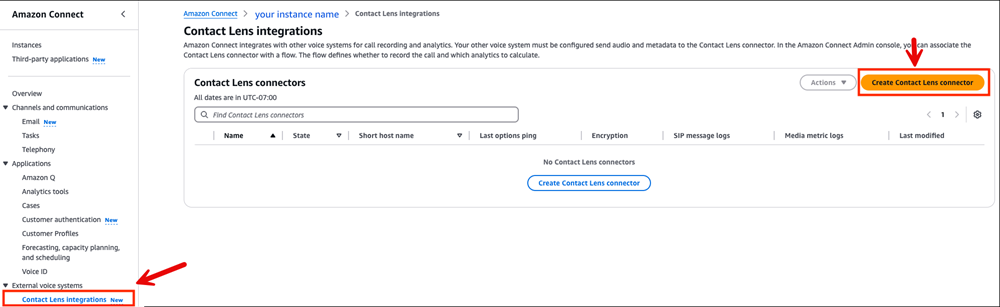
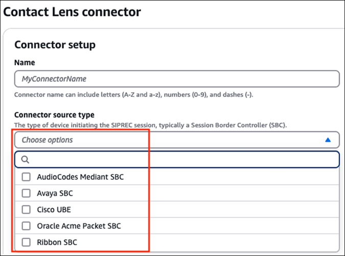
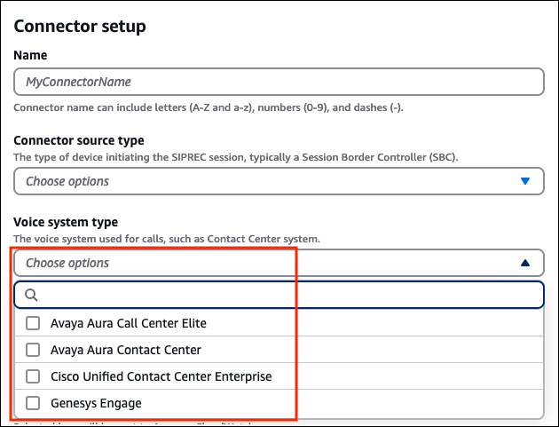
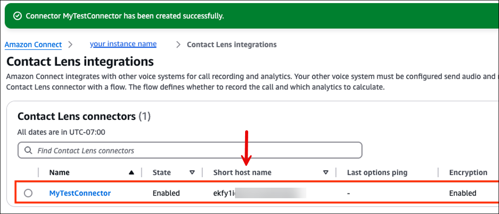

# Create a Contact Lens connector

to integrate with your external voice system

This topic explains how to create a Contact Lens connector to integrate with
your external voice system. Complete the following steps.

1. Open the Amazon Connect console at
   [https://console.aws.amazon.com/connect/](https://console.aws.amazon.com/connect/ "https://console.aws.amazon.com/connect/").
2. On the instances page, choose the instance alias. The instance alias is also
   your **instance name**, which appears in your Amazon Connect
   URL. The following image shows the **Amazon Connect virtual contact center instances** page, with a box
   around the instance alias.

 3. In the Amazon Connect console, in the navigation pane, choose **External voice
systems**, **Contact Lens integrations**,
and then choose **Create Contact Lens connector**, as
shown in the following image.

 4. On the **Contact Lens connector** page, type a
friendly name for the connector. 5. Under **Connector source type**, use the dropdown menu to
select from a list of available connector source types. Usually this is an
external Session Boarder Controller (SBC) that will initiate the SIPREC session.
The following image shows a sample dropdown list of source types.

 6. Under **Voice system type**, use the dropdown list to select
the voice system used for the call. Usually this is your external contact center
system. The following image shows a sample dropdown list of voice system
types.

 7. Enable **Encryption** and **Logging** of the
SIP and Media metric messages.

    * If you enable encryption, import the wildcard root certificate into
     your SIP infrastructure. You can download it from [here](https://s3.amazonaws.com/voice-connector-certs/combined-ca-bundle.pem "https://s3.amazonaws.com/voice-connector-certs/combined-ca-bundle.pem").
    * Although logging is optional, we recommend you enable it to help you
     debug integration issues.

8. In the **Source IP addresses** section, you can configure a
   range of Source IP addresses that are allowed to send voice to this
   connector.
9. In the **Credentials - optional** section, we recommend that
   you create credentials. They can help authenticate the SIPREC sessions.

###### Note

If you do this, you'll need to provide the same credentials when you
configure your external system. 10. Optionally, add tags to identify, organize, search for, filter, and control
who can access this connector. For more information, see [Add tags to resources in Amazon Connect](tagging.md "tagging.md"). 11. Choose **Create Contact Lens connector** to create the
connector. After the connector is created, a success message is
displayed. 12. On the **Contact Lens integrations** page you'll see
the short host name. This is the host that your external voice system will send
SIPREC voice traffic to.

When you configure your external voice system, you'll use the fully qualified
domain name of the host, not this short host name.

 13. You're done creating the Contact Lens connector. Continue to the next
step: [Configure your external
voice system for integration with Contact Lens](configure-external-voice-system.md "configure-external-voice-system.md").
