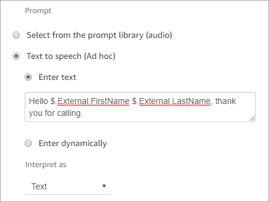

# Create dynamic text strings in Play prompt

blocks in Amazon Connect

Use a [Play prompt](play.md "play.md") block to use an audio file to
play as a greeting or message to callers. You can also use contact attributes to specify
the greeting or message delivered to callers. To use the values of a contact attribute
to personalize a message for a customer, include references to stored or external
contact attributes in the text-to-speech message.

For example, if you retrieved the customer’s name from a Lambda function, and it
returns values from your customer database for FirstName and LastName, you could use
these attributes to say the customer’s name in the text-to-speech block by including
text similar to the following:

- Hello $.External.FirstName $.External.LastName, thank you for calling.
  This message is shown in the following image of the text-to-speech box of the [Play prompt](play.md "play.md") block.

Alternatively, you could store the attributes returned from the Lambda function using a
**Set contact attributes** block, and then reference the
user-defined attribute created in the text-to-speech string.

If you are referencing a user-defined attribute that was previously set as a contact
attribute in the flow using the API, you can reference the attribute using the
$.Attributes.nameOfAttribute syntax.

For example, if the contact in question has attributes "FirstName" and "LastName" set
previously, reference them as follows:

- Hello $.Attributes.FirstName $.Attributes.LastName, thank you for
  calling.

## Resolution using backticks

You can also use backticks (`) to resolve keys dynamically. 
 For example, suppose you retrieve a customer's name from a Lambda function that returns 
 FirstName and LastName values from your customer database. 
 If the customer's preference for which name to use is stored in $.Attributes.NameToPlay, 
 you can dynamically select the appropriate name by enclosing the dynamic key in backticks (`).

- Hello $.External.['`$.Attributes.NameToPlay`'], thank you for calling.
