# Create an evaluation form in Amazon Connect

In Amazon Connect, you can create [many different
evaluation forms](feature-limits.md#evaluationforms-feature-specs "feature-limits.md#evaluationforms-feature-specs"). For example, you may need a different evaluation form for
each business unit and type of interaction.

Each form can contain multiple sections and questions.

- You can assign [weights](about-scoring-and-weights.md "about-scoring-and-weights.md") to
  each question and section to indicate how much their score impacts the agent's
  total score.
- You can configure automation on each question so that answers to those
  questions are automatically filled using insights and metrics from
  Contact Lens conversational analytics.
  This topic explains how to create a form and configure automation using the Amazon Connect admin website. To
  create and manage forms programmatically, see [Evaluation actions](../APIReference/evaluation-api.md "../APIReference/evaluation-api.md") in
  the _Amazon Connect API Reference_.

###### Contents

- [Step 1: Create an evaluation form with a title](#step-title "#step-title")
- [Step 2: Add sections and questions](#step-sections "#step-sections")
- [Step 3: Add answers](#step-answers "#step-answers")
- [Step 4: Conditionally enable
  questions](#step-conditionally-enable-questions "#step-conditionally-enable-questions")
- [Step 5: Assign scores and ranges to
  answers](#step-assignscores "#step-assignscores")
- [Step 6: Enable automated evaluations](#step-automate "#step-automate")
- [Step 7: Preview the evaluation form](#step-preview "#step-preview")
- [Step 8: Assign weights for final score](#step-weights "#step-weights")
- [Step 9: Activate an evaluation form](#step-activateform "#step-activateform")

## Step 1: Create an evaluation form with a title

The following steps explain how to create or duplicate an evaluation form and set
a title.

1. Log in to Amazon Connect with a user account that has the following security
   profile permission: **Analytics and Optimization** -
   **Evaluation forms - manage form definitions** -
   **Create**.
2. Choose **Analytics and optimization**, then choose
   **Evaluation forms**.
3. On the **Evaluation forms** page, choose **Create
   new form**.

—or—

Select an existing form and choose **Duplicate**. 4. Enter a title for the form, such as _Sales evaluation_,
or change the existing title. When finished, choose **Ok**.

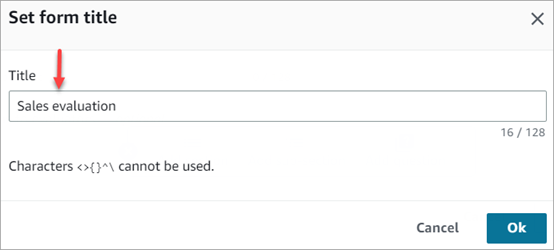

The following tabs appear at the top of the evaluation form page:

    * **Sections and questions**. Add sections,
     questions, and answers to the form.
    * **Scoring**. Enable scoring on the form. You can
     also apply scoring to sections or questions.

5. Choose **Save** at any time while creating your form.
   This enables you to navigate away from the page and return to the form
   later.
6. Continue to the next step to add sections and questions.

## Step 2: Add sections and questions

1. While on the **Sections and questions** tab, add a title
   to the section 1, for example, _Greeting_.

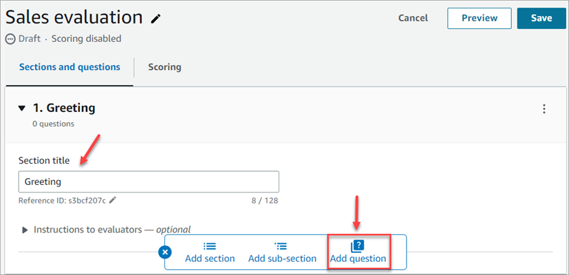 2. Choose **Add question** to add a question. 3. In the **Question title** box, enter the question that
will appear on the evaluation form. For example, _Did the agent
state their name and say they are here to assist?_

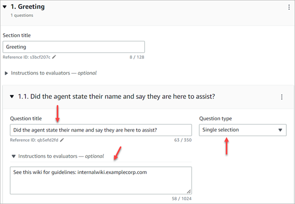 4. In the **Instructions to evaluators** box, add
information to help the evaluators or generative AI to answer the
question.

For example, for the question _Did the agent try to validate the
customer identity?_ you may provide additional instructions
such as, _The agent is required to always ask a customer their
membership ID and postal code before addressing the customer's
questions_. 5. In the **Question type** box, choose one of the following
options to appear on the form:

    * **Single selection**: The evaluator can choose
     from a list of options, such as **Yes**,
     **No**, or **Good**,
     **Fair**, **Poor**.
    * **Text field**: The evaluator can enter free form
     text.
    * **Number**: The evaluator can enter a number from
     a range that you specify, such as 1-10.

6. Continue to the next step to add answers.

## Step 3: Add answers

1. On the **Answers** tab, add answer options that you want
   to display to evaluators, such as **Yes**,
   **No**.
2. To add more answers, choose **Add option**.

The following image shows example answers for a **Single
selection** question.

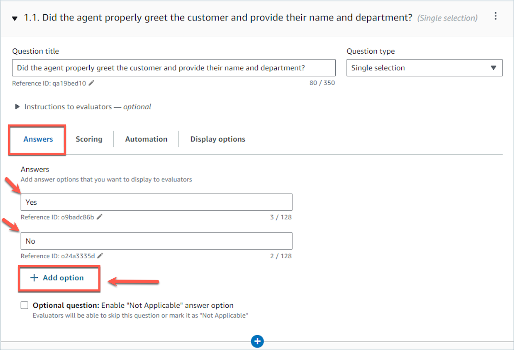

The following image shows an answer range for a
**Number** question.

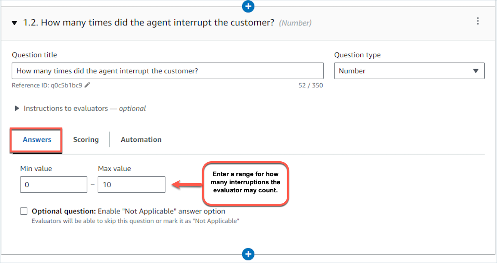 3. You can also mark a question as optional. This enables managers to skip
the question (or mark it as **Not applicable**) while
performing an evaluation.

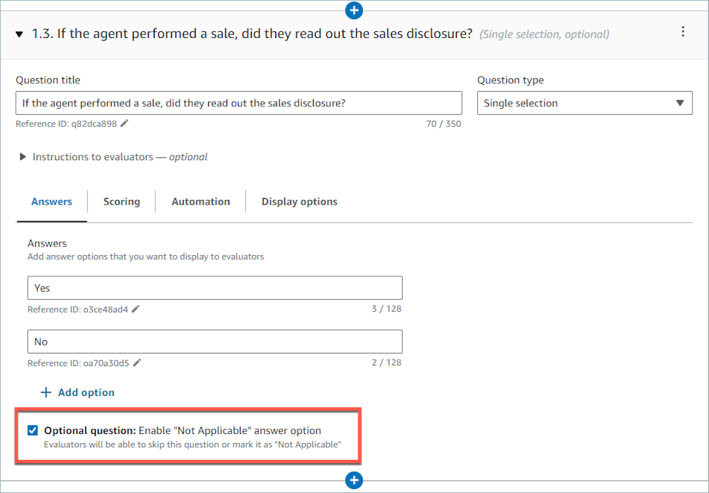

## Step 4: Conditionally enable

questions

Evaluation forms can have questions that are conditionally enabled or disabled,
based on answers to other questions. For example, you can configure a follow-up
question to appear in the form only if it is needed.

1. Choose a question that needs a follow-up question. The question type must
   be **Single selection**, and it must be not be an optional
   question (do not select the **Optional question**
   checkbox).

For example, in the following image, question 1.1 is _What was
the reason for the call?_ and the **Optional
question** checkbox is not selected.

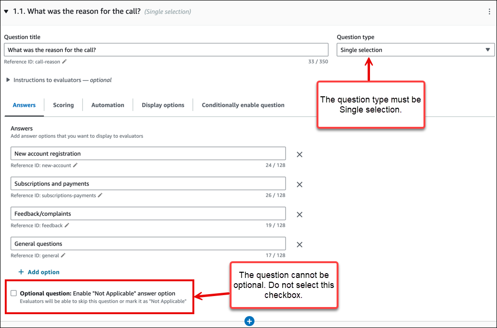 2. Add a follow-up question and now select the **Optional
question** checkbox.

In the following image, the follow-up question is question 1.2
_Did the agent check if the customer attempted new account
registration online?_ and the **Optional
question** checkbox is selected.

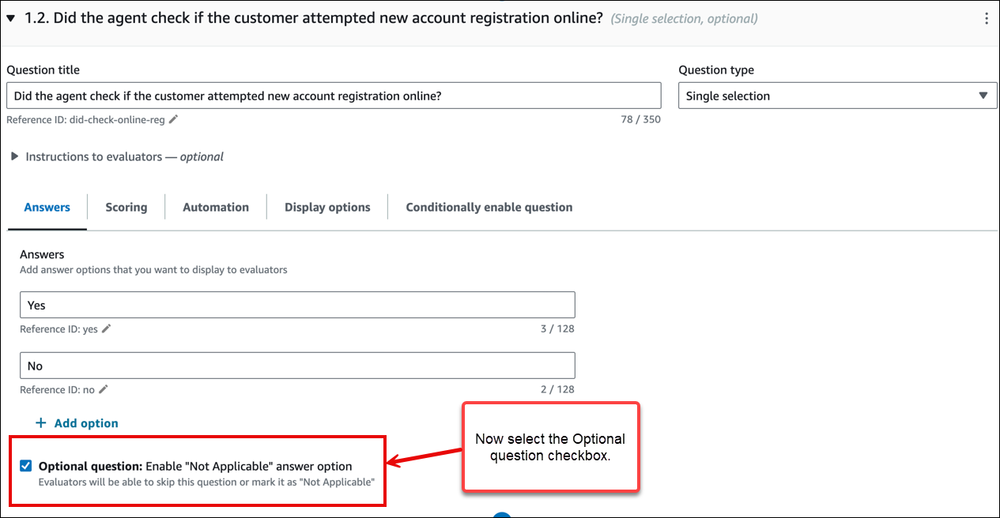 3. Choose the **Conditionally enable question** tab and then
turn on **Conditional question**. The toggle is shown in
the following image.

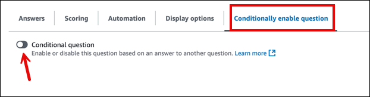 4. Configure the follow-up question to be enabled only if answer to question
1.1. _What was the reason for the call?_ is **New
account registration**. These options are shown in the
following image.

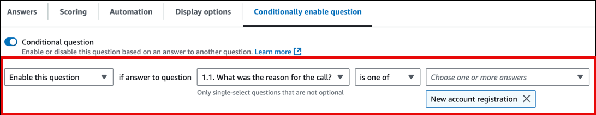

With this configuration, the follow-up question _Did the agent
check if the customer attempted new account registration
online?_ is dynamically added to the form only if the answer
to _What was the reason for the call?_ is **New
account registration**. In all other cases this question is not
present in the form and does not need to be answered. 5. To verify that this configuration works as expected, use the
**Preview** action.

Following are a few things to keep in mind when creating conditional
questions:

- When a question is conditionally enabled, it is by default
  disabled.
- When a question is conditionally disabled, it is by default
  enabled.
- You can only use **Single-select** questions to
  conditionally enable or disable other questions. The question cannot be
  optional.
- You can choose one or more answer options to trigger the condition of a
  conditional question.

###### Note

If Gen AI-powered automation is enabled on a question that is conditionally
enabled, then the use of Gen AI on that question counts towards the usage limit
of questions that can be evaluated on a contact using Gen AI. It counts even if
the question was conditionally disabled.

For the default limit of the **Number of evaluation questions that can
be answered automatically on a contact using generative AI**, see
[Contact Lens service quotas](amazon-connect-service-limits.md#contactlens-quotas "amazon-connect-service-limits.md#contactlens-quotas").

## Step 5: Assign scores and ranges to

answers

1. Go to the top of the form. Choose the **Scoring** tab,
   and then select the **Enable scoring** checkbox.

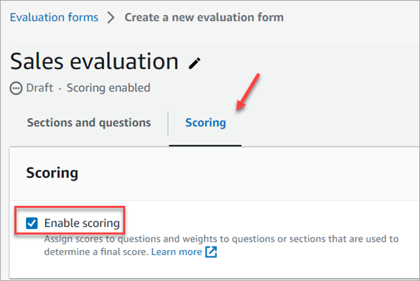

This enables scoring for the entire form. It also enables you to add
ranges for answers to **Number** question types. 2. Return to the **Sections and questions** tab. Now you
have the option to assign scores to **Single selection**,
and add ranges for **Number** question types.

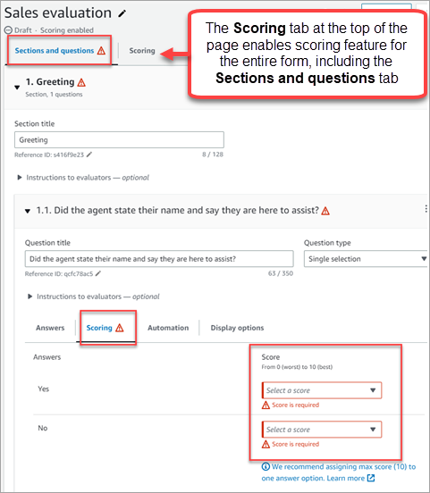 3. When you create a **Number** type question, on the
**Scoring** tab, choose **Add range**
to enter a range of values. Indicate the worst to best score for the answer.

The following image shows an example of ranges and scoring for a
**Number** question type.

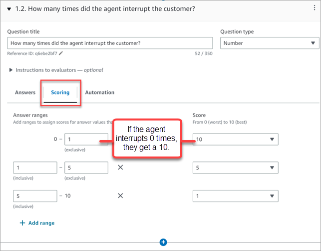

    * If the agent interrupted the customer 0 times, they get a score of
     10 (best).
    * If the agent interrupted the customer 1-4 times, they get a score
     of 5.
    * If the agent interrupted the customer 5-10 times, they get a score
     of 1 (worst).

###### Note

You can configure a score of **0 (Automatic fail)**
for an answer option. You can choose to apply **Automatic
fail** to the section, the subsection, or the entire form.
This means that selecting the answer on an evaluation will assign a
score of zero to the corresponding section, the subsection, or the
entire form. The **Automatic fail** option is shown in
the following image.

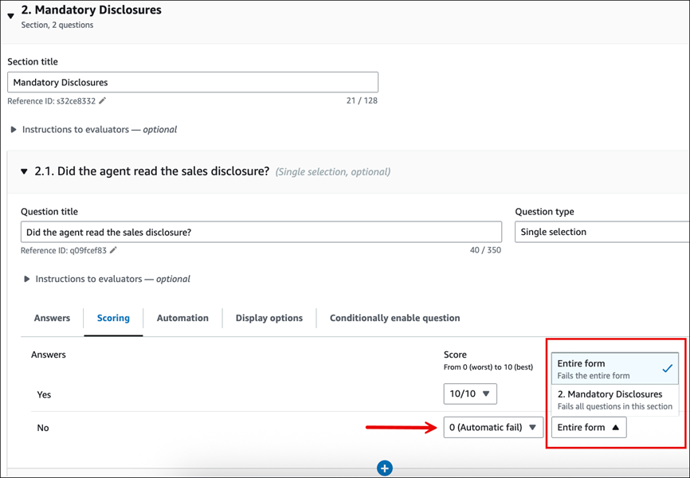 4. After you assign scores to all the answers, choose
**Save**. 5. When you're finished assigning scores, continue to the next step to
automate the question of certain questions, or continue to [preview the evaluation form](#step-preview "#step-preview").

## Step 6: Enable automated evaluations

Contact Lens enables you to automatically answer questions within
evaluation forms (for example, did the agent adhere to the greeting script?) using
insights and metrics from conversational analytics. Automation can be used
to:

- **Assist evaluators with performance
  evaluations**: Evaluators are provided with automated answers
  to questions on evaluation forms while performing evaluations. Evaluators
  can override automated answers before submission.
- **Automatically fill and submit
  evaluations**: Administrators can configure evaluation forms to
  automate responses to all questions within an evaluation form and
  automatically submit evaluations for up to 100% of agents’ customer
  interactions. Evaluators can edit and re-submit evaluations (if
  needed).

For both scenarios, you need to first setup automation on individual questions
within an evaluation form. Contact Lens provides 3 ways of automating
evaluations:

- **Contact Lens categories**:
  _Single selection_ questions (for example, did the
  agent properly greet the customer (Yes/ No)?), can be automatically answered
  using categories defined with Contact Lens rules. For more
  information, see [Create Contact Lens rules
  using the Amazon Connect admin website](build-rules-for-contact-lens.md "build-rules-for-contact-lens.md").
- **Generative AI**: Both _Single
  selection_ and _Text field_ questions can
  be automatically answered using generative AI.
- **Metrics**: _Numeric_
  questions (for example, what was the longest that the customer was put on
  hold?) can be automatically answered using metrics such as longest hold
  time, sentiment score, etc.

Following are examples of each type of automation for each type of
question.

###### Example automation for a Single selection question using Contact Lens

categories

- The following image shows that the answer to the evaluation question is
  yes when Contact Lens has categorized the contact with a label
  **ProperGreeting**. To label contacts as
  **ProperGreeting**, you must first setup a rule that
  detects the words or phrases expected as part of a proper greeting, for
  example, the agent mentioned "Thank you for calling" in the first 30 seconds
  of the interaction. For more information, see [Automatically categorize
  contacts](rules.md "rules.md").

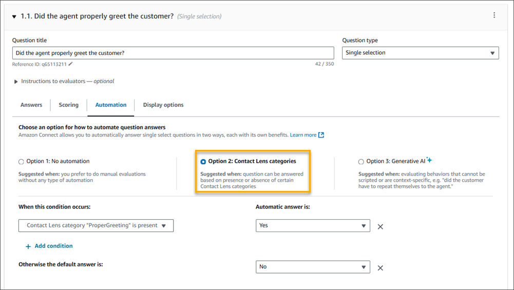

For information about setting up Contact Lens categories, see [Automatically categorize
contacts](rules.md "rules.md").

###### Example automation for an _optional_ Single selection

question using Contact Lens categories

- The following image shows example automation of an optional Single
  selection question. The first check is whether the question is applicable or
  not. A rule is created to check whether the contact is about opening a new
  account. If so, the contact is categorized as
  **CallReasonNewAccountOpening**. If the call is not
  about opening a new account, the question is marked as **Not
  Applicable**.

The subsequent conditions run only if the question is applicable. The
answer is marked as **Yes** or **No**
based on the Contact Lens category
**NewAccountDisclosures**. This category checks whether
the agent provided the customer with disclosures about opening a new
account.

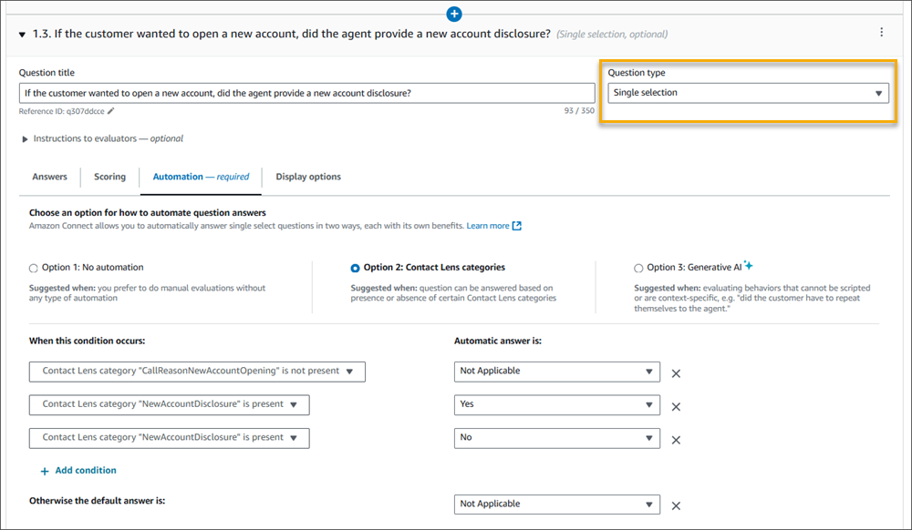

For information about setting up Contact Lens categories, see [Automatically categorize
contacts](rules.md "rules.md").

###### Example automation for an _optional_ Single selection

question using Generative AI

- The following image show example automation using Generative AI.
  Generative AI will automatically answer the evaluation question by
  interpreting the question title and evaluation criteria specified in the
  instructions of the evaluation question, and using it to analyze the
  conversation transcript. Using complete sentences to phrase the evaluation
  question and clearly specifying the evaluation criteria within the
  instructions improves accuracy of generative AI. For information, see [Evaluate agent performance in
  Amazon Connect using generative AI](generative-ai-performance-evaluations.md "generative-ai-performance-evaluations.md").

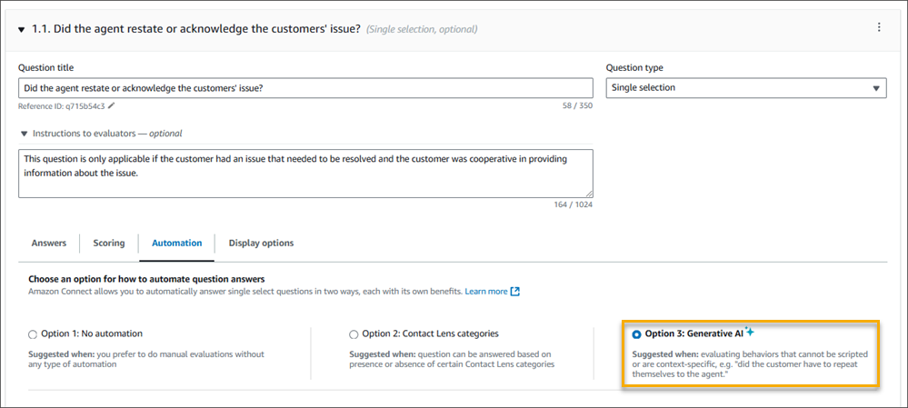

###### Example automation for a Numeric question

- If the agent interaction duration was less than 30 seconds, score the
  question as a 10.

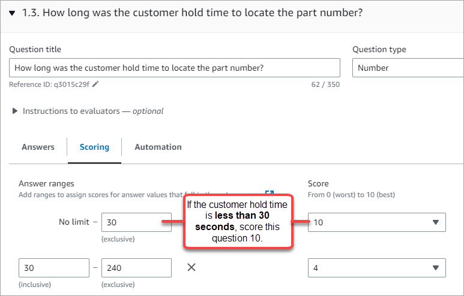

- On the **Automation** tab, choose the metric that is used
  to automatically evaluate the question.

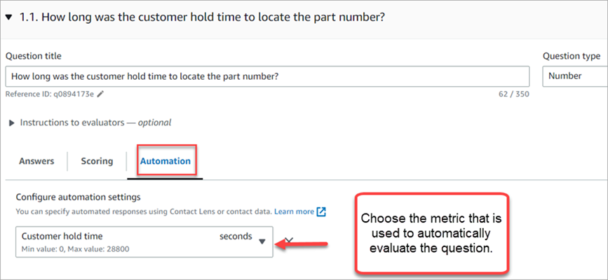

- You can automate responses to numeric questions using Contact Lens
  metrics (such as sentiment score of the customers, non-talk time percentage,
  and number of interruptions) and contact metrics (such as longest hold
  duration, number of holds, and agent interaction duration).

After an evaluation form is activated with automation configured on some of the
questions, then you will receive automated responses to those questions when you
start an evaluation from within the Amazon Connect admin website.

###### To automatically fill and submit evaluations

1. Set up automation on every question within an evaluation form as
   previously described.
2. Turn on **Enable fully automated submission of
   evaluations** before activating the evaluation form. This
   toggle is shown in the following image.

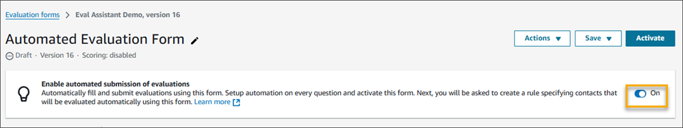 3. Activate the evaluation form. 4. Upon activation you will be asked to create a rule in Contact Lens
that submits an automated evaluation. For more information, see [Create a rule
in Contact Lens that submits an automated evaluation](contact-lens-rules-submit-automated-evaluation.md "contact-lens-rules-submit-automated-evaluation.md"). The
rule enables you to specify which contacts should be automatically evaluated
using the evaluation form.

## Step 7: Preview the evaluation form

The **Preview** button is active only after you have assigned
scores to answers for all of the questions.

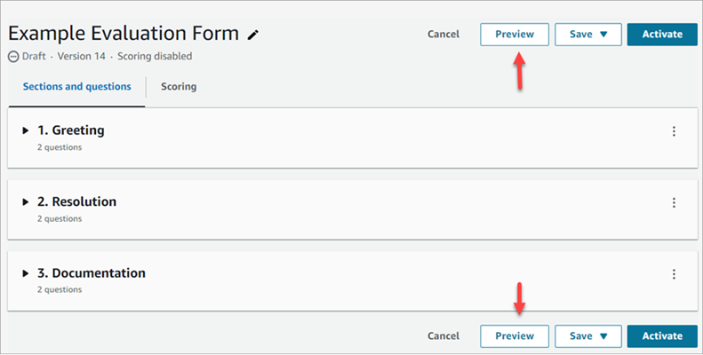

The following image shows the form preview. Use the arrows to collapse sections
and make the form easier to preview. You can edit the form while viewing the
preview, as shown in the following image.

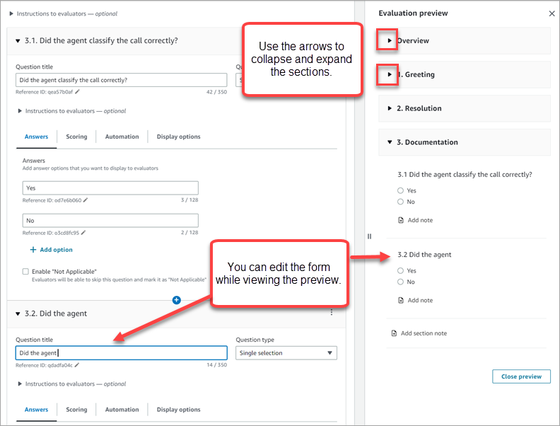

## Step 8: Assign weights for final score

When scoring is enabled for the evaluation form, you can assign
_weights_ to sections or questions. The weight raises or
lowers the impact of a section or question on the final score of the
evaluation.

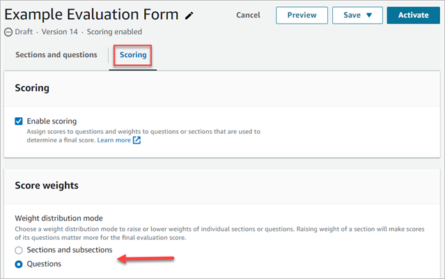

### Weight distribution mode

With **Weight distribution mode**, you choose whether to
assign weight by section or question:

- **Weight by section**: You can evenly distribute the
  weight of each question in the section.
- **Weight by question**: You can lower or raise the
  weight of specific questions.

When you change a weight of a section or question, the other weights are
automatically adjusted so the total is always 100 percent.

For example, in the following image, question 2.1 was manually set to 50
percent. The weights that display in italics were adjusted automatically. In
addition, you can turn on **Exclude optional questions from
scoring**, which assigns all optional questions a weight of zero
and redistributes the weight among the remaining questions.

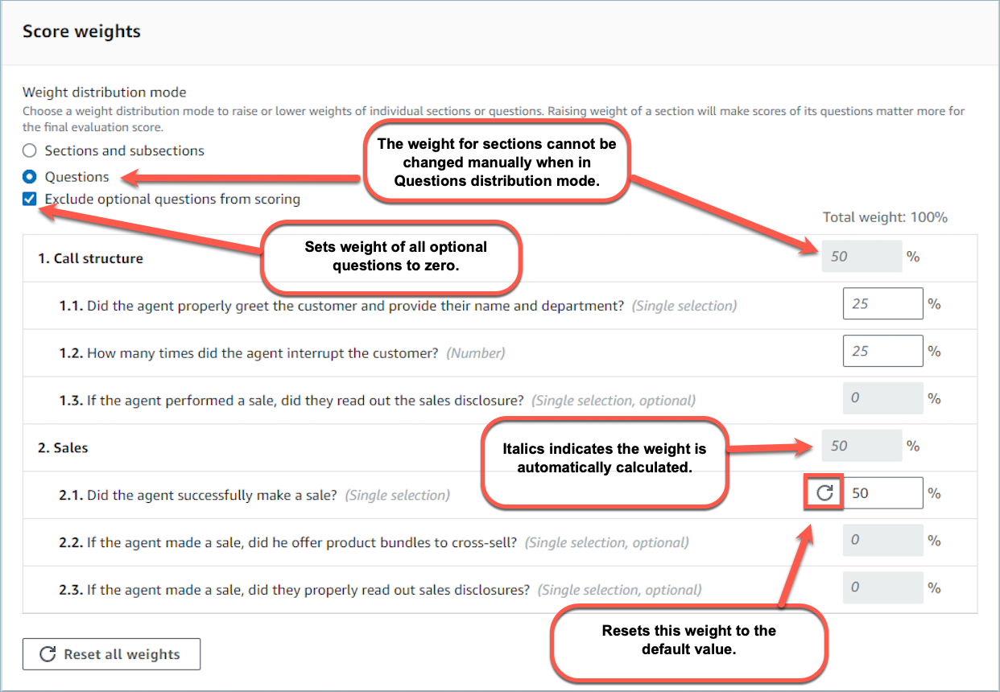

## Step 9: Activate an evaluation form

Choose **Activate** to make the form available to evaluators.
Evaluators will no longer be able to choose the previous version of the form from
the dropdown list when starting new evaluations. For any evaluations that were
completed using previous versions, you will still be able to view the version of the
form on which the evaluation was based on.

If you are still working on setting up the evaluation form and want to save your
work at any point you can choose **Save**, **Save
draft**.

If you want to check whether the form has been correctly set up, but not activate
it, select **Save**, **Save and validate**.
