# Create an evaluation form in Connect Customer

In Connect Customer, you can create [many different
evaluation forms](feature-limits.md#evaluationforms-feature-specs "feature-limits.md#evaluationforms-feature-specs"). For example, you might need a different evaluation form for
each business unit, and for different queues. You can also create different evaluation forms for evaluating the agent interaction and the self-service interaction with a Lex bot or AI agent.

Each form can contain multiple sections and questions.

- You can assign [weights](about-scoring-and-weights.md "about-scoring-and-weights.md") to
  each question and section to indicate how much their score impacts the overall score of the evaluation form.
- You can configure automation on each question so that answers to those
  questions are automatically filled using insights and metrics from
  conversational analytics.
  This topic explains how to create a form and configure automation using the Connect Customer admin website. To
  create and manage forms programmatically, see [Evaluation actions](../APIReference/evaluation-api.md "../APIReference/evaluation-api.md") in
  the _Connect Customer API Reference_.

###### Contents

- [Step 1: Create an evaluation form with a title](#step-title "#step-title")
- [Step 2: Add sections and questions](#step-sections "#step-sections")
- [Step 3: Add answers](#step-answers "#step-answers")
- [Step 4: Conditionally enable questions](#step-conditionally-enable-questions "#step-conditionally-enable-questions")
- [Step 5: Assign scores and ranges to answers](#step-assignscores "#step-assignscores")
- [Step 6: Enable automated evaluations](#step-automate "#step-automate")
- [Step 7: Preview the evaluation form](#step-preview "#step-preview")
- [Step 8: Assign weights for final score](#step-weights "#step-weights")
- [Step 9: Validate the evaluation form](#step-validateform "#step-validateform")
- [Step 10: Activate an evaluation form](#step-activateform "#step-activateform")
  Before you begin, make sure you have the required security profile permissions. For
  more information, see [Assign security profile permissions for performance evaluations and coaching](evaluation-and-coaching-permissions.md "evaluation-and-coaching-permissions.md").

## Step 1: Create an evaluation form with a title

The following steps explain how to create or duplicate an evaluation form and set
a title.

1. Log in to Connect Customer with a user account that has the following security
   profile permission: **Analytics and Optimization** -
   **Evaluation forms - manage form definitions** -
   **Create**.
2. Choose **Analytics and optimization**, then choose
   **Evaluation forms**.
3. On the **Evaluation forms** page, choose **Create
   new form**.

—or—

Select an existing form and choose **Duplicate**. 4. Enter a title for the form, such as _Sales evaluation_,
or change the existing title. Add any tags to the form for controlling access
to the form (see [Set up tag-based-access controls on performance evaluations](tag-based-access-control-performance-evaluations.md "tag-based-access-control-performance-evaluations.md"))
When finished, choose **Ok**.

The following tabs appear at the top of the evaluation form page:

    * **Sections and questions**. Add sections,
     questions, and answers to the form.
    * **Scoring**. Enable scoring on the form. You can
     also apply scoring to sections or questions.

5. Choose **Save** at any time while creating your form.
This enables you to navigate away from the page and return to the form
later. 6. Continue to the next step to add sections and questions.

###### Import evaluation forms from another instance

You can export an evaluation form from one Connect Customer instance
(say a test instance) and import it into another instance (say a production instance).

###### To import an evaluation form from JSON

1. While viewing an existing evaluation form, choose **Actions**, **Export as JSON**.

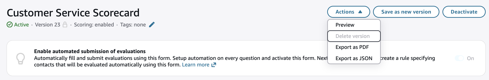 2. Open the instance where you want to import this form. 3. On the **Evaluation forms** page, choose
**Import form**. Choose **Choose File**
to upload the previously exported JSON, then choose **Import**.

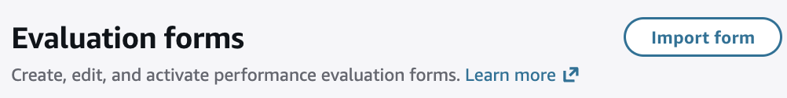
The form is created including questions, instructions, answers, scoring, and automation configuration.
Instance-specific settings such as rule categories and tags are not present in the exported file.

###### Import an evaluation form from a PDF using AI

You can import an evaluation form from any quality management system by
uploading a PDF. Connect Customer uses AI to extract the sections, questions, answer
options, and scoring from the PDF and create a draft evaluation form that you
can review and edit.

###### To import an evaluation form from a PDF

1. On the **Evaluation forms** page, choose
   **Import form**, then choose **From PDF**.

The following image shows the **Import form** menu with
the **From PDF** option.

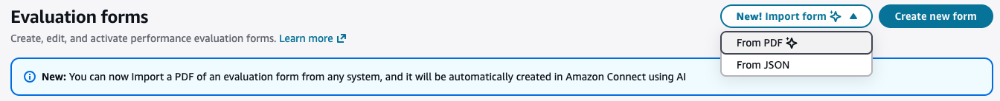 2. In the **Import evaluation form with AI** dialog:

    * **Evaluation form PDF** – Choose a PDF file (max 2 MB).
    * **Scoring method** – Choose **Points-based**, **Percentage-based**, or **Not scored**.
    * **Instructions (optional)** – Provide context to guide the extraction, for example: "This form is for outbound sales calls. Focus on upselling questions."

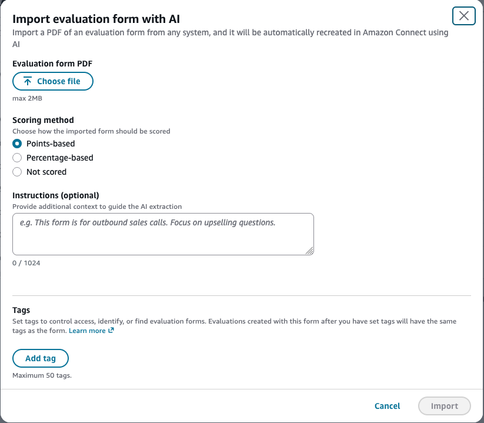 3. Choose **Import**. The import typically completes within one minute. 4. After the import completes, the form appears as a draft. Open it to review
that the sections, questions, and scoring were extracted correctly. 5. Edit the form as needed, then activate it.

## Step 2: Add sections and questions

1. While on the **Sections and questions** tab, add a title
   to the section 1, for example, _Greeting_.

 2. Choose **Add question** to add a question. 3. In the **Question title** box, enter the question that
will appear on the evaluation form. For example, _Did the agent
state their name and say they are here to assist?_

 4. In the **Instructions to evaluators** box, add
information to help the evaluators or generative AI to answer the
question.

For example, for the question _Did the agent try to validate the
customer identity?_ you might provide additional instructions
such as, _The agent is required to always ask a customer their
membership ID and postal code before addressing the customer's
questions_. 5. In the **Question type** box, choose one of the following
options to appear on the form:

    * **Single selection**: The evaluator can choose
     from a list of options, such as **Yes**,
     **No**, or **Good**,
     **Fair**, **Poor**.
    * **Multiple selection**: The evaluator can choose
     multiple answers from a list of options, such as list of products that
     the customer was interested in purchasing, or non-compliant agent behaviours.
    * **Text field**: The evaluator can enter free form
     text.
    * **Number**: The evaluator can enter a number from
     a range that you specify, such as 1-10.
    * **Date**: The evaluator can choose a date as an answer.

6. Continue to the next step to add answers.

## Step 3: Add answers

1. On the **Answers** tab, add answer options that you want
   to display to evaluators, such as **Yes**,
   **No**.
2. To add more answers, choose **Add option**.

The following image shows example answers for a **Single
selection** question.

The following image shows an answer range for a
**Number** question.

 3. You can also mark a question as optional. This enables managers to skip
the question (or mark it as **Not applicable**) while
performing an evaluation.

## Step 4: Conditionally enable questions

Evaluation forms can have questions that are conditionally enabled or disabled,
based on answers to other questions. For example, you can configure a follow-up
question to appear in the form only if it is needed.

1. Choose a question that needs a follow-up question. The question type must
   be **Single selection** or **Multiple selection**,
   and it must be not be an optional question (do not select the **Optional question** checkbox).

For example, in the following image, question 1.1 is _What was
the reason for the call?_ and the **Optional
question** checkbox is not selected.

 2. Add a follow-up question and now select the **Optional
question** checkbox.

In the following image, the follow-up question is question 1.2
_Did the agent check if the customer attempted new account
registration online?_ and the **Optional
question** checkbox is selected.

 3. Choose the **Conditionally enable question** tab and then
turn on **Conditional question**. The toggle is shown in
the following image.

 4. Configure the follow-up question to be enabled only if answer to question
1.1. _What was the reason for the call?_ is **New
account registration**. These options are shown in the
following image.

With this configuration, the follow-up question _Did the agent
check if the customer attempted new account registration
online?_ is dynamically added to the form only if the answer
to _What was the reason for the call?_ is **New
account registration**. In all other cases this question is not
present in the form and does not need to be answered. 5. To verify that this configuration works as expected, use the
**Preview** action.

Following are a few things to keep in mind when creating conditional
questions:

- When a question is conditionally enabled, it is by default
  disabled.
- When a question is conditionally disabled, it is by default
  enabled.
- You can only use **Single selection** or **Multiple selection** questions to conditionally enable or disable
  other questions. The question cannot be optional.
- You can choose one or more answer options to trigger the condition of a
  conditional question.

###### Note

If generative AI-powered automation is enabled on a question that is conditionally
enabled, then the use of generative AI on that question counts towards the usage limit
of questions that can be evaluated on a contact using generative AI. It counts even if
the question was conditionally disabled.

For the default limit of the **Number of evaluation questions that can
be answered automatically on a contact using generative AI**, see
[Conversational analytics service quotas](amazon-connect-service-limits.md#contactlens-quotas "amazon-connect-service-limits.md#contactlens-quotas").

## Step 5: Assign scores and ranges to answers

1. Go to the top of the form. Choose the **Scoring** tab,
   and then select the **Enable scoring** checkbox.

This enables scoring for the entire form. It also enables you to add
ranges for answers to **Number** question types. 2. For **Scoring mode**, choose one of the following
options:

    * **Percentage** – Calculate
     scores as percentages using weighted sections or questions.
    * **Point-based** – Calculate
     scores using points assigned to answer options.

###### Important

We recommend creating a new evaluation form rather than switching the
scoring mode on an existing form. Changing the scoring mode resets all
previously configured scoring values, and historical evaluations
completed with the previous scoring mode cannot be directly compared
with evaluations using the new mode.

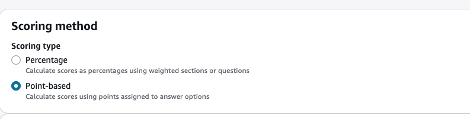

### Step 5.1: Percentage-based scoring

If you selected **Percentage** scoring mode,
follow these steps to configure scoring for your evaluation form.

1. Return to the **Sections and questions** tab. You
   can assign scores to **Single
   selection**, **Multiple selection**, and
   add ranges for **Number** question types.

 2. When you create a **Number** type question, on the
**Scoring** tab, choose **Add
range** to enter a range of values. Indicate the worst to
best score for the answer.

The following image shows an example of ranges and scoring for a
**Number** question type.

    * If the agent interrupted the customer 0 times, they get a
     score of 10 (best).
    * If the agent interrupted the customer 1-4 times, they get a
     score of 5.
    * If the agent interrupted the customer 5-10 times, they get a
     score of 1 (worst).

3. For **Multiple selection** questions, assign a score
value (0-10) to each option. When multiple options are selected, the
total score is the sum of selected options' scores, capped at 10. 4. (Optional) Configure **Automatic fail** for an
answer option. You can choose to apply automatic fail to the section,
the subsection, or the entire form. When the evaluator selects this
answer during an evaluation, the score for the affected scope is set to
zero.

 5. (Optional) Exclude individual questions or entire sections from
scoring. When a question or section is excluded, it is automatically
assigned a weight of 0%, similar to a non-scorable question. The
remaining weight is redistributed among the other scored items.

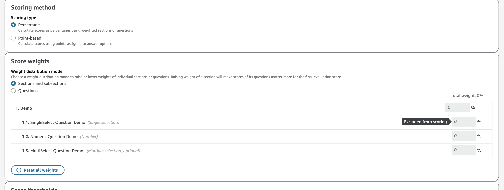 6. After you assign scores to all the answers, choose
**Save**.

###### Updating existing forms with multiple selection questions

If you have existing evaluation forms that were created with multiple
selection questions before scoring support was added, you will receive a
validation error when creating a new version or activating the form. To
resolve this, follow these steps:

1. Open the evaluation form and navigate to the multiple selection
   question.
2. Choose the **Scoring** tab for the
   question.
3. Do one of the following:

   - Assign score values to each answer option (0-10), or
   - Select the **Exclude from scoring**
     checkbox to remove the question from the scoring
     calculation.

4. Choose **Save** and then activate the
   form.

### Step 5.2: Point-based scoring

If you selected **Point-based** scoring mode,
follow these steps to configure scoring for your evaluation form.

1. Return to the **Sections and questions** tab. For
   each question, choose the **Scoring** tab and assign
   point values to each answer option. Point values can range from
   **0 to 100**.

The following image shows an example of point values assigned to a
**Single selection** question.

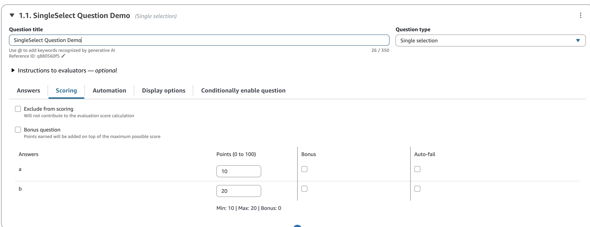 2. For **Number** type questions, choose
**Add range** to define answer ranges and assign a
point value to each range.

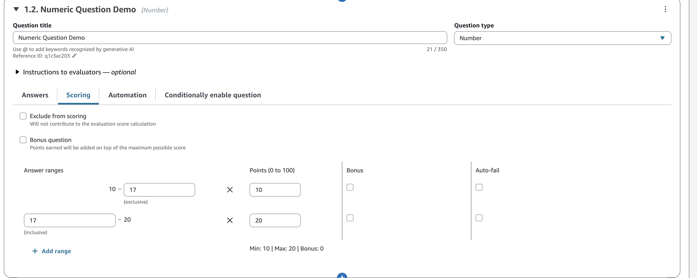 3. For **Multiple selection** questions, assign point
values to each option. When multiple options are selected, their point
values are summed. Optionally, select **Set cap** to
configure a maximum point value cap for the question.

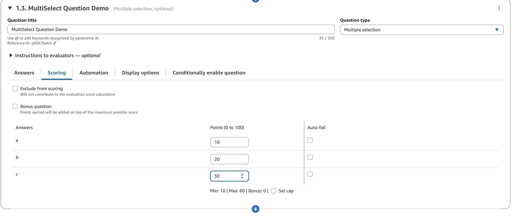 4. (Optional) Configure bonus options or bonus questions. Bonus points
allow you to award extra credit without increasing the maximum possible
score.

    * **Bonus options** – An
     individual answer option that awards extra points on top of the
     question's maximum base score. When a bonus option is selected,
     the earned points can exceed the question's normal maximum.
     Bonus options are only supported on single selection and numeric
     questions.
    * **Bonus questions** – An
     entire question that does not contribute to the maximum possible
     score. The earned points from a bonus question are added to the
     total, but the question's maximum points are not counted in the
     base total. Bonus questions cannot have automatic fail
     options.

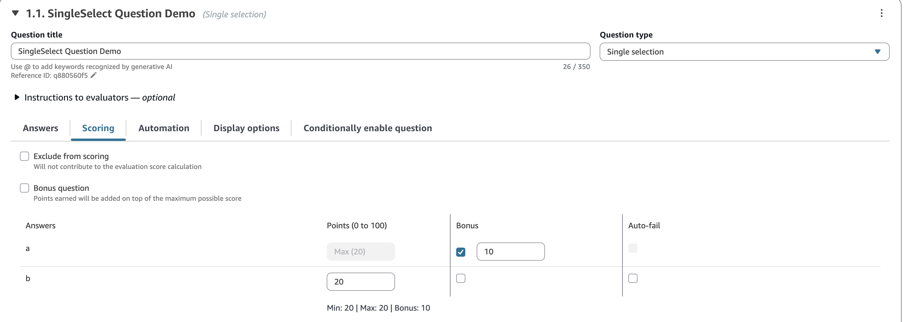

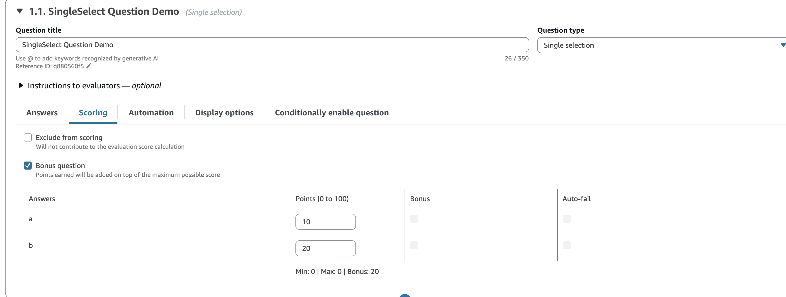 5. (Optional) Configure automatic fail. When an automatic fail option
is selected during an evaluation, the score for the affected scope is
set to zero. You can choose to apply automatic fail to the
**Section** or **Entire form**.
Automatic fail is supported on single selection, numeric, and multiple
selection questions. Bonus questions and bonus options cannot have
automatic fail.

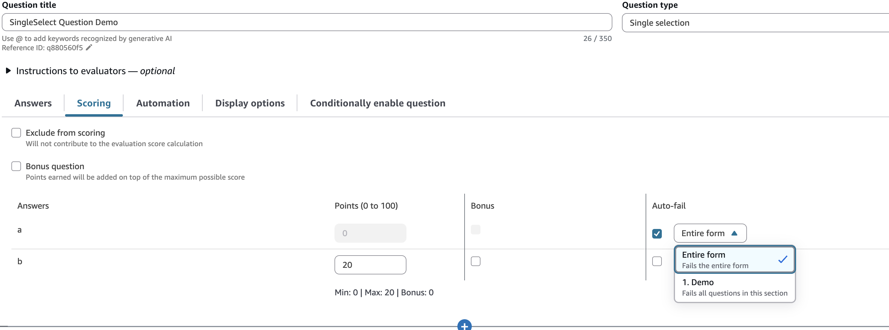 6. (Optional) Exclude individual questions or entire sections from
scoring. Excluded items do not contribute to the total score or the
maximum possible score.

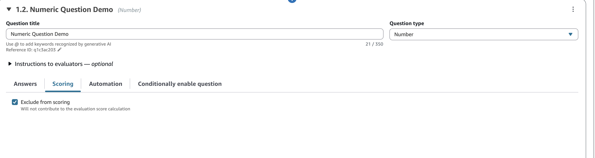 7. After you assign scores to all the answers, choose
**Save**. 8. When you're finished assigning scores, continue to the next step to
automate the answer of certain questions, or continue to [preview the evaluation form](#step-preview "#step-preview").

### Step 5.3: Assign performance thresholds

Performance thresholds allow you to classify evaluation results into
categories such as "Needs Improvement" or "Exceeds Expectations" based on
score thresholds. This feature is supported in both percentage-based and
point-based scoring modes.

You can configure performance thresholds at the form level, section level,
or question level.

Performance thresholds are not inherited. If you set thresholds at the
form level, those thresholds apply only to the overall form score. Sections
and questions do not automatically inherit the form-level thresholds. You
must explicitly configure thresholds at each level where you want them to
apply.

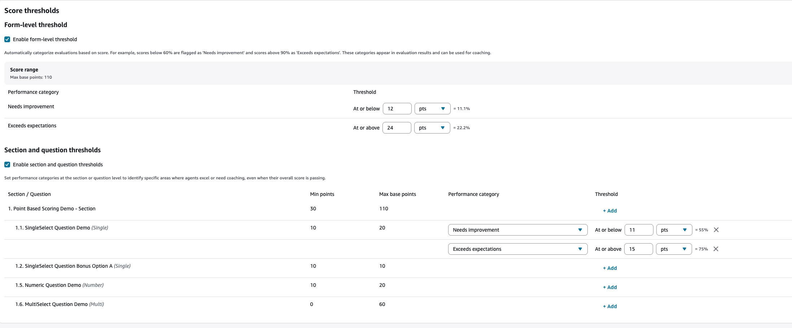

## Step 6: Enable automated evaluations

Connect Customer enables you to automatically answer questions within
evaluation forms (for example, did the agent adhere to the greeting script?) using
insights and metrics from conversational analytics. Automation can be used
to:

- **Assist evaluators with performance
  evaluations**: Evaluators receive automated answers
  to questions on evaluation forms while performing evaluations. Evaluators
  can override automated answers before submission.
- **Automatically fill and submit
  evaluations**: Administrators can configure evaluation forms to
  automate responses to all questions within an evaluation form and
  automatically submit evaluations for up to 100% of customer
  interactions. Evaluators can edit and re-submit evaluations (if
  needed).

The ways of automation vary by whether you are evaluating the agent interaction or automated interaction (for example, self-service while interacting with a Lex bot or AI agent). You can choose between agent and automated interaction by choosing the **Additional settings**, under **Contact interaction type**.

Both for assisting evaluators, and for automated submission of evaluations, you need to first set up automation on individual questions
within an evaluation form. Connect Customer provides three ways of automating
evaluations:

- **Contact categories**:
  _Single selection_ questions (for example, did the
  agent properly greet the customer (Yes/ No)?), and _Multiple selection_
  questions (for example, what parts of the greeting script did the agent state correctly?)
  can be automatically answered using contact categories defined with rules. For more
  information, see [Create conversational analytics rules using the Connect Customer admin website](build-rules-for-contact-lens.md "build-rules-for-contact-lens.md").
- **Generative AI**: Both _Single
  selection_ and _Text field_ questions can
  be automatically answered using generative AI.

For information about automating evaluations of self-service
(automated) interactions, see [Performance evaluations of self-service interactions in Connect Customer](performance-evaluations-automated-interactions.md "performance-evaluations-automated-interactions.md").

- **Metrics**: _Numeric_
  questions (for example, what was the longest that the customer was put on
  hold?) can be automatically answered using metrics such as longest hold
  time, sentiment score.

Following are examples of each type of automation for each type of
question.

###### Example automation for a Single selection question using conversational analytics categories

- The following image shows that the answer to the evaluation question is
  yes when conversational analytics has categorized the contact with a label
  **ProperGreeting**. To label contacts as
  **ProperGreeting**, you must first setup a rule that
  detects the words or phrases expected as part of a proper greeting, for
  example, the agent mentioned "Thank you for calling" in the first 30 seconds
  of the interaction. For more information, see [Automatically categorize
  contacts](rules.md "rules.md").

For information about setting up contact categories, see [Automatically categorize
contacts](rules.md "rules.md").

###### Example automation for an _optional_ Single selection question using contact categories

- The following image shows example automation of an optional Single
  selection question. The first check is whether the question is applicable or
  not. A rule is created to check whether the contact is about opening a new
  account. If so, the contact is categorized as
  **CallReasonNewAccountOpening**. If the call is not
  about opening a new account, the question is marked as **Not
  Applicable**.

The subsequent conditions run only if the question is applicable. The
answer is marked as **Yes** or **No**
based on the contact category
**NewAccountDisclosures**. This category checks whether
the agent provided the customer with disclosures about opening a new
account.

For information about setting up contact categories, see [Automatically categorize
contacts](rules.md "rules.md").

###### Example automation for an _optional_ Single selection question using Generative AI

- The following image show example automation using Generative AI.
  Generative AI will automatically answer the evaluation question by
  interpreting the question title and evaluation criteria specified in the
  instructions of the evaluation question, and using it to analyze the
  conversation transcript. Using complete sentences to phrase the evaluation
  question and clearly specifying the evaluation criteria within the
  instructions improves accuracy of generative AI. For information, see [Evaluate agent performance in Connect Customer using generative AI](generative-ai-performance-evaluations.md "generative-ai-performance-evaluations.md").

###### Example automation for a Multiple selection question using conversational analytics categories

- Multiple selection questions can be used to capture answer reasoning for a
  single select question. It can also be used to trigger conditional questions, by
  checking for customer scenarios, such as call reasons. The following example shows
  how you can use rules that capture customer call reasons to automatically fill
  answers to a multiple selection question. Unlike single select questions, all of the
  conditions are executed sequentially to answer a multiple selection question. In the
  following example, if the categories **StatusCheck** and **ChangeExistingRequest** are both present on the contact, then the answer
  would be both "Checking status of existing service request" and "Changing a service
  request".

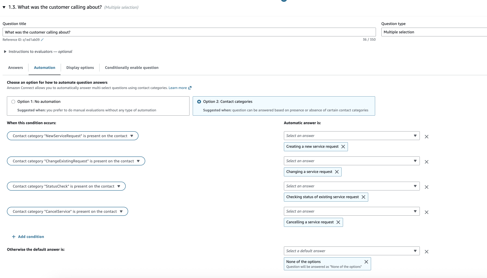

For information about setting up contact categories, see [Automatically categorize
contacts](rules.md "rules.md").

###### Example automation for a Numeric question

- If the agent interaction duration was less than 30 seconds, score the
  question as a 10.

- On the **Automation** tab, choose the metric that is used
  to automatically evaluate the question.

- You can automate responses to numeric questions using conversational analytics
  metrics (such as sentiment score of the customers, non-talk time percentage,
  and number of interruptions) and contact metrics (such as longest hold
  duration, number of holds, and agent interaction duration).

After an evaluation form is activated with automation configured on some of the
questions, then you will receive automated responses to those questions when you
start an evaluation from within the Connect Customer admin website.

###### To automatically fill and submit evaluations

1. Set up automation on every question within an evaluation form as
   previously described.
2. Turn on **Enable fully automated submission of
   evaluations** before activating the evaluation form. This
   toggle is shown in the following image.

 3. Activate the evaluation form. 4. Upon activation you will be asked to create a rule in conversational analytics
that submits an automated evaluation. For more information, see [Create a rule in conversational analytics that submits an automated evaluation](contact-lens-rules-submit-automated-evaluation.md "contact-lens-rules-submit-automated-evaluation.md"). The
rule enables you to specify which contacts should be automatically evaluated
using the evaluation form.

## Step 7: Preview the evaluation form

The **Preview** button is active only after you have assigned
scores to answers for all of the questions.

The following image shows the form preview. Use the arrows to collapse sections
and make the form easier to preview. You can edit the form while viewing the
preview, as shown in the following image.

## Step 8: Assign weights for final score

When percentage-based scoring is enabled for the evaluation form, you can
assign _weights_ to sections or questions. The weight raises or
lowers the impact of a section or question on the final score of the evaluation.
This step applies only to the **Percentage** scoring
mode. If you selected **Point-based** scoring, weights
are not used; instead, the score is calculated from earned points versus maximum
possible points.

### Weight distribution mode

With **Weight distribution mode**, you choose whether to
assign weight by section or question:

- **Weight by section**: You can evenly distribute the
  weight of each question in the section.
- **Weight by question**: You can lower or raise the
  weight of specific questions.

When you change a weight of a section or question, the other weights are
automatically adjusted so the total is always 100 percent.

For example, in the following image, question 2.1 was manually set to 50
percent. The weights that display in italics were adjusted automatically. In
addition, you can turn on **Exclude optional questions from
scoring**, which assigns all optional questions a weight of zero
and redistributes the weight among the remaining questions.

## Step 9: Validate the evaluation form

Choose **Save and validate** to save the evaluation form and run
it through the validation pipeline. Results appear in a side panel. Validation
happens in two stages. First, the validation pipeline checks the form against the
same structural and configuration rules that govern activation—for example,
section and question limits, weight and scoring consistency, and unique identifiers.
The pipeline reports any issues found here as **Errors**, because they would prevent the form from being activated and
you must resolve them before you can proceed.

If the pipeline finds no structural **Errors** and
the form contains Gen AI–automated questions, validation moves to a second
stage. This stage evaluates the content of those questions against best practices
for Gen AI automation. The pipeline reports anything identified here as a **Warning**. Warnings do not block activation, but we
recommend addressing them to improve the quality and reliability of automated
answers.

Validation checks each Gen AI–automated question against the following best
practices:

- **Question phrasing** – The question
  title reads as a complete question (ending in a question mark), not a
  statement or heading.
- **Instructions present** – Every Gen
  AI–answered question includes instructions telling the AI how to
  evaluate and answer it.
- **Answer option language** – Answer
  options use plain, everyday language with no acronyms or
  abbreviations.
- **Answer option conciseness** – Answer
  options are short labels only, with no extra commentary or
  conditions.
- **Transcript answerability** – The
  question can be answered from the transcript and instructions alone, without
  external data or system lookups.
- **Positive action framing** – The
  question asks what the agent did rather than asking the AI to detect the
  absence of an action.
- **Plain language** – Instructions
  avoid abbreviations, acronyms, and company-specific jargon.
- **Spelling** – Question titles,
  instructions, and answer options are free of misspelled words.
- **No external system references** –
  Instructions don't reference actions or states in external systems the AI
  can't see in the transcript.
- **No non-textual cues** – Questions
  don't require assessing audio-only qualities (volume, pitch, speaking speed,
  vocal tone). Text-assessable qualities like professionalism or empathy are
  fine.
- **No PII references** – Questions and
  instructions don't contain specific PII values. Evaluating the agent's
  PII-handling behavior is fine.

###### Note

Gen AI validation is rate limited per Connect Customer instance: no more than 3 Gen AI
validations can run in parallel, and no more than 30 can run per hour. If you
exceed either limit, an error message appears in the side panel. Try again
later. These limits don't affect structural validation.

###### To validate an evaluation form

1. Choose **Save**, **Save and
   validate**.

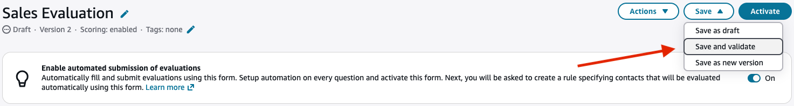 2. When validation completes, the results appear at the top of the
form:

    * If no recommendations are found, a green banner appears at the top
     of the form confirming that validation passed.
    * If recommendations are found, they are listed in the side panel,
     grouped as **Errors** or **Warnings**.

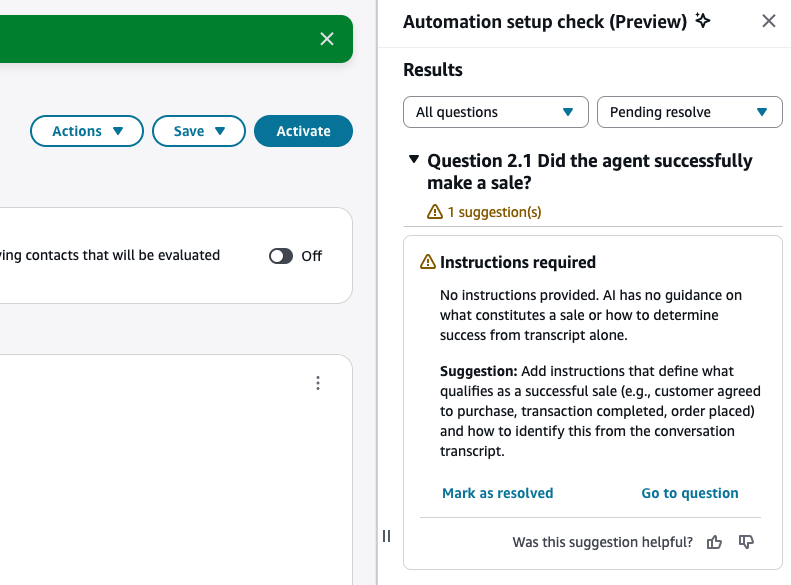 3. You can close the side panel at any time. To reopen it, either choose the
**Findings** button next to a question, or choose
**Save and validate** again.

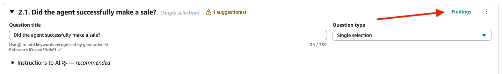 4. On the side panel, you can mark each finding as resolved after you have
addressed it. Choose the **Pending resolve** filter to
focus on the findings that still need attention.

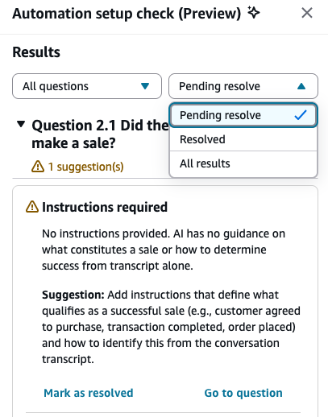

###### Note

Marking a finding as resolved only visually hides it on the panel so you can
clearly see which findings are left to address. It does not re-run validation or
change the form's activation state.

## Step 10: Activate an evaluation form

Choose **Activate** to make the form available to evaluators.
Evaluators will no longer be able to choose the previous version of the form from
the dropdown list when starting new evaluations. For any evaluations that were
completed using previous versions, you will still be able to view the version of the
form on which the evaluation was based on.

###### Important

After you activate a new version, evaluators can no longer start new
evaluations with the previous version.

If you are still working on setting up the evaluation form and want to save your
work at any point you can choose **Save**, **Save
draft**.

If you want to check whether the form has been correctly set up, but not activate
it, select **Save**, **Save and validate**.
