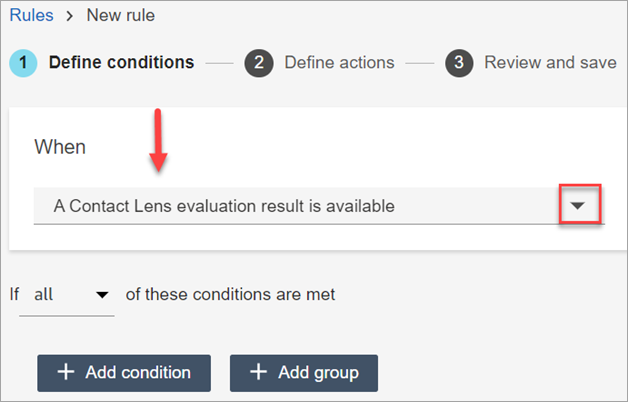
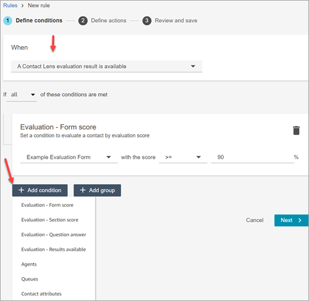
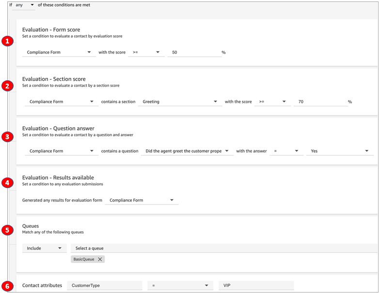

# Notify supervisors and agents about

performance evaluations

You can create rules that automatically send emails or tasks to supervisors and agents
based on evaluation results.

- Supervisor notifications can drive timely coaching based on performance
  evaluations. For example, you can notify supervisors if an agent receives an
  evaluation score below a certain threshold.
- Agent notifications can be used to prompt agents to review and acknowledge
  their evaluations.

###### Contents

- [Step 1: Define rule conditions
  for evaluation forms](#rule-conditions-eval "#rule-conditions-eval")
- [Step 2: Define rule
  actions](#rule-actions-eval "#rule-actions-eval")
- [Example rule with multiple
  conditions](#rule-example-eval "#rule-example-eval")

## Step 1: Define rule conditions for evaluation

forms

1. On the navigation menu, choose **Analytics and
   optimization**, **Rules**.
2. Select **Create a rule**, **Evaluation
   forms**.
3. Under **When**, use the dropdown list to choose
   **A Contact Lens evaluation result is
   available**, as shown in the following image.

 4. Choose **Add condition**.

You can combine criteria from a set of conditions to build very specific
Contact Lens rules. The following are some of the available conditions:

    * **Evaluation - Form score**: Build rules that run
     when the score for a specific evaluation form is met.
    * **Evaluation - Section score**: Build rules that
     run when the score for a specific section is met.
    * **Evaluation - Question answer**: Build rules
     that run when the score for a specific question and answer is met.
    * **Evaluation - Results available**: Build rules
     that run on any evaluation submissions.
    * **Agent hierarchy**: Build rules that run on a specific agent hierarchy. Agent hierarchies may represent geographical locations, departments, products, or teams.

    To see list of agent hierarchies so you can add them to rules, you need **Agent hierarchy - View** permissions in your security profile.
    * **Agent**: Build rules that run on a subset of agents. For example, receive notifications on agents belonging to your team.

    To see agent names so you can add them to rules, you need
     **Users - View** permissions in your security
     profile.
    * **Queues**: Build rules that run on a subset of queues. Often organizations use queues to indicate a line of business, topic, or domain. For example, you could build rules specifically for the evaluations of those agents assigned to sales queues.

    To see the queue names so you can add them to rules, you need
     **Queues - View** permissions in your security
     profile.
    * **Contact attributes**: Build rules that run on
     the values of custom [contact attributes](what-is-a-contact-attribute.md "what-is-a-contact-attribute.md"). For example, you can build rules for
     agent evaluations for a particular line of business or for specific
     customers, such as based on their membership level, their current
     country of residence, or if they have an outstanding order.
    * **Contact segment attributes**: You can identify contacts within rules using custom contact segment attributes with values populated from other systems or using custom logic. You can [define an attribute](predefined-attributes.md#predefined-attributes-create-web-admin "predefined-attributes.md#predefined-attributes-create-web-admin") and set its value in flows. Custom segment attributes are only present on that specific contact ID, and not the entire contact chain. For example, you can build a rule that identifies that customer closed their account during the conversation.

    To see the list of contact segment attributes to add to a rule, you need **Predefined attributes - View** permission.

5. Choose **Next**.

## Step 2: Define rule actions

1. Choose **Add action**. You can choose the following
   actions:
   - [Create
     Task](contact-lens-rules-create-task.md "contact-lens-rules-create-task.md")
   - [Send email
     notification](contact-lens-rules-email.md "contact-lens-rules-email.md")
   - [Generate an
     EventBridge event](contact-lens-rules-eventbridge-event.md "contact-lens-rules-eventbridge-event.md")

 2. Choose **Next**. 3. Review and make any edits, then choose **Save**. 4. After you add rules, they are applied to new evaluation submissions that
occur after the rule was added. You cannot apply rules to past, stored
evaluations.

## Example rule with multiple conditions

The following image shows a sample rule with six conditions. If any of these
conditions are met, the action is triggered.

1. **Evaluation - Form score**: Does the Compliance Form
   have a score greater than or equal to 50%?
2. **Evaluation - Section score**: In a Compliance Form,
   does the Greeting section have a score greater than or equal to 70%?
3. **Evaluation - Question score**: Does the Compliance Form
   question _Did the agent greet the customer properly_
   equal **Yes**?
4. **Evaluation - Results available**: Have any results been
   generated for the Compliance Form?
5. **Queues**: Is this for the
   **BasicQueue**?
6. **Contact attributes**: Does CustomerType equal
   VIP?
