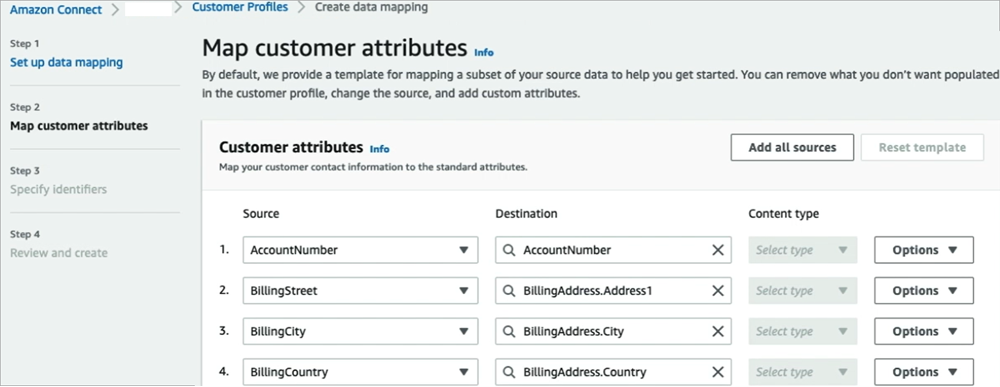
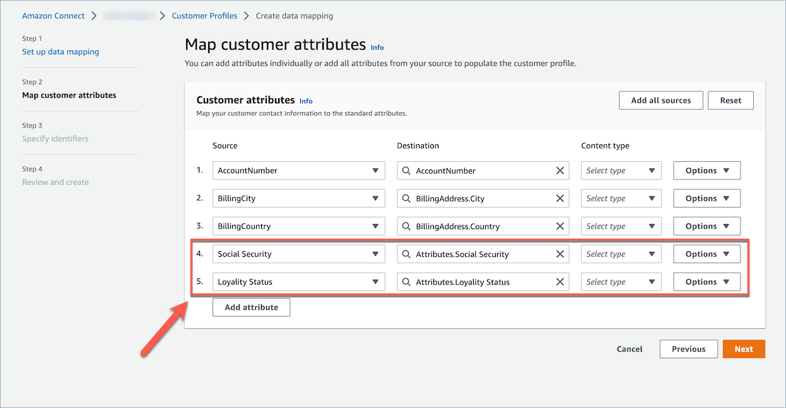
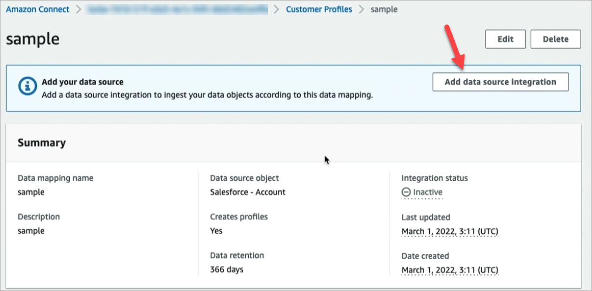

# Create an object type mapping in Amazon Connect

Customer Profiles

An object type mapping tells Customer Profiles how to ingest a specific type of data from a
source application—such as Salesforce, Zendesk, or S3—into a unified
standard profile object. You can then display data in that object (for example,
customer address and email) to your agents using the [Amazon Connect agent application](customer-profile-access.md "customer-profile-access.md").

The object type mapping provides Customer Profiles with the following information:

- How data should be populated from the object and ingested into the
  standard profile object.
- What fields should be indexed in the object and how those fields should
  then be used to assign objects of this type to a specific profile.
  There are two ways you can create an object type mapping:

- Use the Amazon Connect console. The user interface makes data mapping features
  readily accessible. For example, you can add custom attributes, and define
  search and unique identifiers for contact models. No coding required!
- Use the Customer Profiles API. For more information, see the [Amazon Connect Customer Profiles API
  Reference](../../../customerprofiles/latest/APIReference/Welcome.md "../../../customerprofiles/latest/APIReference/Welcome.md").
  This topic explains how to create a mapping using the Amazon Connect console.

## Create a data mapping using the

Amazon Connect console

Amazon Connect provides a no-code experience for mapping customer data from homegrown
and third-party applications with Amazon S3, Salesforce, ServiceNow, Zendesk, and
Marketo.

To create a data mapping, you define an object type mapping that describes
what the custom profile object looks like. This mapping defines how fields from
your data can be used to either populate fields in the standard profile or how
they can be used to assign the data to a specific profile.

### Step 1: Set up data

mapping

1. Open the Amazon Connect console at
   [https://console.aws.amazon.com/connect/](https://console.aws.amazon.com/connect/ "https://console.aws.amazon.com/connect/").
2. On the instances page, choose the instance alias. The instance alias is also
   your **instance name**, which appears in your Amazon Connect
   URL. The following image shows the **Amazon Connect virtual contact center instances** page, with a box
   around the instance alias.

 3. In the navigation pane, choose **Customer
profiles**, **Data mappings**. 4. Choose **Create data mapping** to get
started. 5. At the **Set up data mapping** page, in the
**Description** section, add a name that will
help you identify the source or purpose of this mapping. This is the
meta-data of the object type. 6. In the **Data source** section:

    1. Choose where the data is coming from, such as Salesforce
     or Zendesk. Based on your selection, Amazon Connect automatically
     selects the available destinations based on the predefined
     template.
    2. Choose the source object. This is used for you to build
     your unified profile.
    3. In the **Mapping destination** section,
     choose the data that you want to use to build your unified
     customer profile. This information can be surfaced to your
     flows and agents to personalize the interactions with
     contacts.

    For more information about supported mapping destinations,
     see [About mapping destinations in
     Amazon Connect](about-mapping-destinations.md "about-mapping-destinations.md").
    4. In the **Additional options** section,
     you can choose when to opt out of creating new profiles, and
     how long to retain them. These options help you manage
     costs.

    ###### Note

    By default the domain retention period is 366 days. To
     change the retention period set on your domain, use the
     [UpdateDomain](../../../customerprofiles/latest/APIReference/API_UpdateDomain.md "../../../customerprofiles/latest/APIReference/API_UpdateDomain.md") API.

7. If you chose a source other than S3, in the **Establish a
   connection with**
   `application` section, choose an existing
   Amazon AppFlow or Amazon EventBridge connection to connect your data, or create a new
   connection. You can create a new connection by entering details
   about your account for this data source.

After the connection is established, you will choose the objects
that you want to ingest from your data source. 8. Choose **Next**.

### Step 2: Map attributes

On the **Map _type_ attributes** page,
you'll see the field mappings table filled with the predefined template,
based on the mapping destination. For example, it's filled with customer,
product, case, or order attributes. You can change the predefined template
by choosing an attribute (such as AccountNumber) and then selecting a
different destination, or enter one of your own custom attributes.

The following image shows an example of the page filled with customer
attributes from the template.

You can remove what you don’t want populated in the customer profile,
change the source, and add custom attributes.

This mapping uses your data source to populate customer contact
information, such as a phone number in the customer profile. It uses
attributes from the standard profile template.

###### Tip

- If you choose to add custom attributes, the destination will
  always have the prefix `Attributes.` added to it.
  This enables Amazon Connect to recognize that it is a custom attribute.

- Agents can now view custom attributes in the Connect Agent
  Application under the **Additional
  Information** tab sorted in alphabetical order. You
  can create the name of your choice for each attribute that will
  be displayed to agents by using the following format:
  `/^Attributes\.[a-zA-Z0-9]+(?:[
_\-]+[a-zA-Z0-9]+)*$/`
- All ingested custom attributes will be displayed in the
  Connect Agent Application. If you do not wish to show certain
  information to your agents, do not ingest custom attributes at
  this time.

### Step 3: Specify

identifiers

On the **Specify identifiers** page, complete the
following sections. Depending on what data you're mapping, it's possible not
all of these will appear on your page.

###### Note

The names `_profileId`, `_orderId`,
`_caseId`, and `_assetId` are reserved for
internal use. If you decide to use these names as one of your identifier
names, they must be declared as `LOOKUP_ONLY`, which means
our system will not save them to match with profiles, standard assets,
standard orders, standard cases, or save them for searching your
profile, asset, case, or order. If you would like these keys to be
usable for searching and matching, you must rename your key. For more
information on the `LOOKUP_ONLY` standard identifier, see
[Standard identifiers for setting
attributes on the key in Customer Profiles](standard-identifiers.md "standard-identifiers.md").

- **Unique identifier**: You must have a unique
  identifier for your data in order to avoid an error when it is
  ingested. This identifier is also known as the unique key. Customer Profiles uses
  it to distinguish this data from other data source objects, and to
  index for search and update data.

There can be only one unique identifier.

- **Customer identifier**: You must have at least
  one customer identifier for your data in order to avoid an error
  when it is ingested. The identifier is also known as the profile
  key.

Customer Profiles uses it to determine if the data case be associated to an
existing profile or used to create a new profile by searching other
profiles for this identifier.

You can have multiple customer identifiers.

###### Tip

Agents can use any of these customer Identifiers in the Agent
Workspace to find the profile that belongs to customer on the
interaction.

- **Product identifier**: You must have at least
  one product identifier for your data in order to avoid an error when
  it is ingested. The identifier is also known as the asset
  key.

Customer Profiles uses it to distinguish this data from other customer product
purchase data. It is also used to determine if the data can be
associated to an existing profile or used to create a new profile by
searching other profiles for this identifier.

You can have multiple product identifiers.

- **Case identifier**: You must have at least one
  case identifier for your data in order to avoid an error when it is
  ingested. The identifier is also known as the case key.

Customer Profiles uses it to distinguish this data from other customer case
data. It is also used to determine if the data can be associated to
an existing profile or used to create a new profile by searching
other profiles for this identifier.

You can have multiple case identifiers.

- **Order identifier**: You must have at least one
  order identifier for your data in order to avoid an error when it is
  ingested. The identifier is also known as the order key.

Customer Profiles uses it to distinguish this data from other customer order
data. It is also used to determine if the data can be associated to
an existing profile or used to create a new profile by searching
other profiles for this identifier.

You can have multiple order identifiers.

- **Additional search attributes - optional**: You
  can choose attributes in your data source object that you want to
  index to be searchable. By default, all your identifiers are
  indexed.

###### Tip

If the search attributes in your data source objects contain
mostly the same value, it may result in slower data ingestion.
We recommend creating search attributes that are unique in your
data source objects.

- **Data object timestamp**: The data object
  timestamp is used to resolve profile conflicts when Identity Resolution is enabled
  for consolidating similar profiles. When two or more similar
  profiles have conflicting records, the records from the profile with
  the most recently updated timestamp will be used.

You can choose an attribute in your object to reference for when
your object was last updated.

### Step 4: Review and create

After the data mapping is created, you can choose **Add data
source integration** to use this object type.

