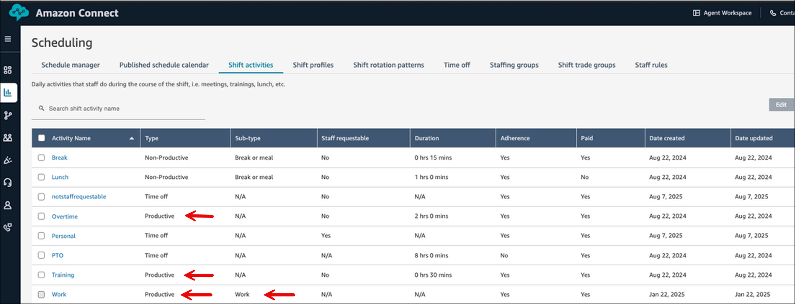
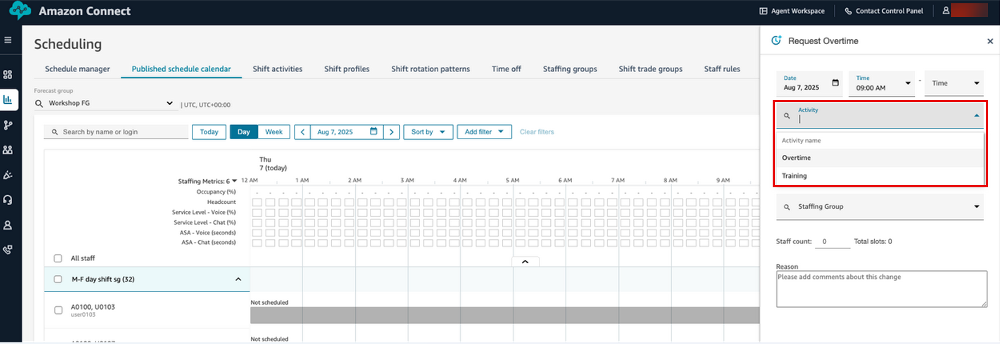

# Create overtime slots for contact center agents in

Amazon Connect

You can create overtime slots for specific activities. This feature applies to
activities that aren't the **Work** sub-type. Activities with the
**Work** sub-type are not available in the Activity list
dropdown where a user requests overtime.

For example, the following image shows three different
**Productive** shifts: Overtime, Training, and Work. The
activity named Work has the sub-type **Work**.

The following image shows that while requesting Overtime, in the Activity
dropdown, only Overtime and Training activities are shown. The productive activity
Work with the sub-type **Work** is not shown.

###### To create overtime slots

1. Choose the **Make Request** button in the
   **Published schedule calendar** UI and select
   **OT**.
2. A supervisor or manager enters the date and time range for
   overtime.
3. Select the productive activity from the Activity list.
4. Select by Staffing group or by Staff rules.
   - Staffing Groups send a notification to all agents regarding
     availability of overtime slots. Agents are approved based on a first
     come, first served model.
   - Staff rules allow supervisors to select specific agents to send
     overtime notifications to.

5. Select the number of required overtime slots.
6. Provide the reason for requesting overtime in the
   **Reason** text box. Agents can view the reason before
   accepting or declining the overtime request.
7. Choose **Request**.
