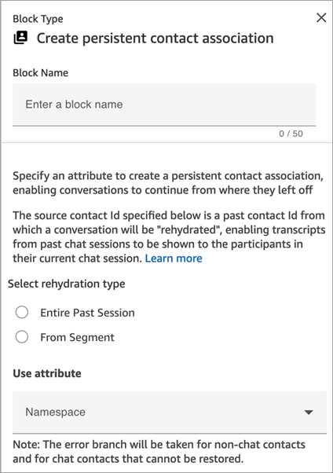
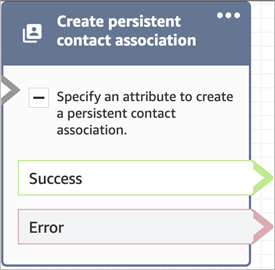

# Flow block in Amazon Connect:

Create persistent contact association

This topic defines the flow block for creating a persistent contact association,
enabling conversations with contacts to continue where they left off.

## Description

- Enables persistent chat experience on the current chat.
- This allows you to select the required rehydration mode. For more
  information about chat rehydration, see [Enable customers to resume chat conversations in
  Amazon Connect](chat-persistence.md "chat-persistence.md").

## Supported

channels

The following table lists how this block routes a contact who is using the
specified channel.

| Channel | Supported?        |
| ------- | ----------------- | ------------------------------------------------------------------------------------------------------------------------------------------------------------------------------------------------------------------------------------------------------------------------------------------------------------------------------------------------------------------------------------------------------------------------------------------------------------------------------------------------------------------------------------------------------------------------------------------------------------------------------------------------------------------------------------------------------------------------------------------------------------------------------------------------------------------------------------------------------------------------------------------------------------------------------------------------------------------------------------------------------------------------------------------------------------------------------------------------------------------------------------------------------------------------------------------------------------------------------------------------------------------------------------------------------------------------------------------------------------------------------------------------------------------------------------------------------------------------------------------------------------------------------------------------------------------------------------------------------------------------------------------------------------------------------------------------------------------------------------------------------------------------------------------------------------------------------------------------------------------------------------------------------------------------------------------------------------------------------------------------------------------------------------ |
| Voice   | No - Error branch |
| Chat    | Yes               |
| Task    | No - Error branch | ## Flow types You can use this block in the following [flow types](create-contact-flow.md#contact-flow-types "create-contact-flow.md#contact-flow-types"):  • Inbound flow  • Customer Queue flow  • Customer hold flow  • Customer whisper flow  • Outbound whisper flow  • Agent hold flow  • Agent whisper flow  • Transfer to agent flow  • Transfer to queue flow ## Properties The following image shows the **Properties** page of the **Create persistent contact association** block.  ## Configuration tips  • To enable persistent chat you can add the **Create persistent contact association** block to your flow, or provide the previous `contactId` in the `SourceContactId` parameter of the [StartChatContact](../APIReference/API_StartChatContact.md "../APIReference/API_StartChatContact.md") API, but not both. You can enable persistence of a `SourceContactID` on a new chat only once. We recommend that you enable persistent chat by using the **Create persistent contact association** block when using the following features: + [Amazon Connect chat widget](add-chat-to-website.md "add-chat-to-website.md") + [Apple Messages for Business](apple-messages-for-business.md "apple-messages-for-business.md")  • You can configure persistent chats to rehydrate the entire past chat conversation or rehydrate from a specific segment of a past chat conversation. For information about rehydration types, see [Enable customers to resume chat conversations in Amazon Connect](chat-persistence.md "chat-persistence.md"). ## Configured block The following image shows an example of what this block looks like when it is configured. It has two branches: **Success** and **Error**.  |
