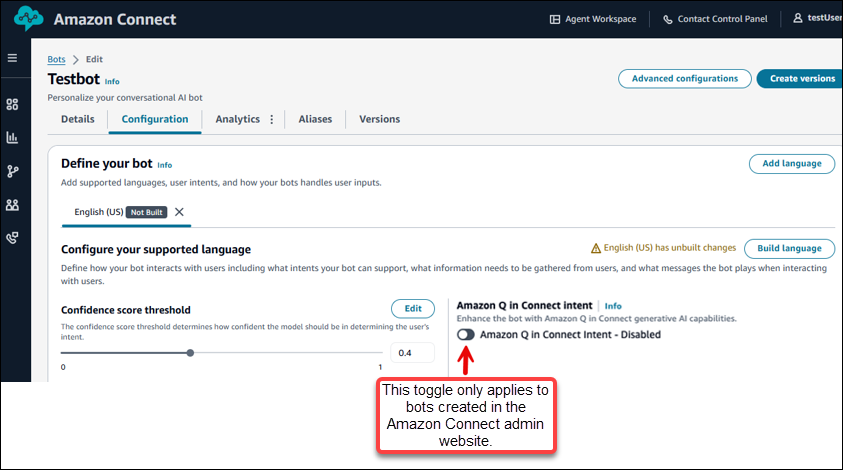
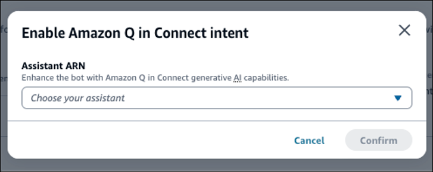

# Create an Amazon Q in Connect intent from an Amazon Connect

instance

You can use the generative AI capabilities powered by Amazon Q in Connect for your bot by enabling the
[AMAZON.QinConnectIntent](../../../lexv2/latest/dg/built-in-intent-qinconnect.md "../../../lexv2/latest/dg/built-in-intent-qinconnect.md") in your bot. This is an Amazon Lex built-in intent.

Complete the following steps to enable Amazon Q in Connect.

1. Open the bot for which you want to add the **AMAZON.QinConnectIntent**
   intent.
2. Navigate to the **Configuration** tab in the bot builder
   interface.
3. Enable the **AMAZON.QinConnectIntent** intent by setting the toggle to
   on. The following image shows the location of the toggle.

The **Amazon Q in Connect intent** toggle is only supported for bots created
directly within the Amazon Connect admin website. To add Amazon Q capabilities to intents for bots created
outside of Amazon Connect admin website, use the Amazon Lex console to update the configuration. 4. In the **Enable Amazon Q in Connect intent** dialog box, use the dropdown menu to
choose the Amazon Resource Name (ARN) of the Amazon Q in Connect intent.

 5. Choose **Confirm** to add **AMAZON.QinConnectIntent**
intent support.

###### Important

You cannot use **AMAZON.QInConnectIntent** along with intents
without specific utterances such as **AMAZON.QnAIntent**,
**AMAZON.BedrockAgentIntent** in the same bot locale. For more
information, see [AMAZON.QinConnectIntent](../../../lexv2/latest/dg/built-in-intent-qinconnect.md "../../../lexv2/latest/dg/built-in-intent-qinconnect.md") in the _Amazon Lex V2 Developer
Guide_.
