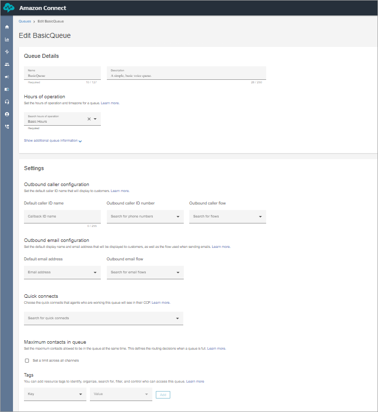

# Create a queue using the Amazon Connect admin website

This topic explains how to create a queue using the Amazon Connect admin website. To create queues
programmatically, see the [create-queue](https://awscli.amazonaws.com/v2/documentation/api/latest/reference/connect/create-queue.html "https://awscli.amazonaws.com/v2/documentation/api/latest/reference/connect/create-queue.html") AWS CLI or [CreateQueue](../APIReference/API_CreateQueue.md "../APIReference/API_CreateQueue.md") in the
_Amazon Connect API Reference_.

**How many queues can I create?** To view your quota of
**Queues per instance**, open the Service Quotas console at [https://console.aws.amazon.com/servicequotas/](https://console.aws.amazon.com/servicequotas/ "https://console.aws.amazon.com/servicequotas/").

###### To create a queue

1. Log in to the Amazon Connect admin website at https://`instance name`.my.connect.aws/. Use an **Admin** account, or an account that
   has **Routing** - **Queues** -
   **Create** permission in its security profile.
2. On the Amazon Connect admin website, on the navigation menu, choose **Routing**,
   **Queues**, **Add new queue**.
3. Add the appropriate information about your queue and choose **Add new
   queue**.

The following image shows the queue information for the BasicQueue.

See the following topics for detailed information about each of the above
areas:

    1. [Set the hours of operation and time zone for a
     queue using Amazon Connect](set-hours-operation.md "set-hours-operation.md")
    2. [Set up outbound caller ID in Amazon Connect](queues-callerid.md "queues-callerid.md")
    3. [Set up email in Amazon Connect](setup-email-channel.md "setup-email-channel.md")
    4. [Set the limit of maximum contacts in a queue
     using Amazon Connect](set-maximum-queue-limit.md "set-maximum-queue-limit.md")
    5. [Create quick connects in Amazon Connect](quick-connects.md "quick-connects.md")

The queue is automatically active. 4. Assign the queue to a routing profile; for information, see [Create a routing profile in Amazon Connect to link queues to
agents](routing-profiles.md "routing-profiles.md"). The routing
profile links the queue and agents together. 5. Add tags to identify, organize, search for, filter and control who can access
this queue. For more information, see [Add tags to resources in Amazon Connect](tagging.md "tagging.md").
To learn how queues work, see [How Amazon Connect uses routing profiles](concepts-routing.md "concepts-routing.md") and [Queue-based routing to route customers to
a specific contact center agent](concepts-queue-based-routing.md "concepts-queue-based-routing.md").

## APIs to create and manage queues

Use the following APIs to create and manage queues programmatically:

- [CreateQueue](../APIReference/API_CreateQueue.md "../APIReference/API_CreateQueue.md")
- [DeleteQueue](../APIReference/API_DeleteQueue.md "../APIReference/API_DeleteQueue.md")
- [DescribeQueue](../APIReference/API_DescribeQueue.md "../APIReference/API_DescribeQueue.md")
- [ListQueues](../APIReference/API_ListQueues.md "../APIReference/API_ListQueues.md")
- [SearchQueues](../APIReference/API_SearchQueues.md "../APIReference/API_SearchQueues.md")
- [UpdateQueueHoursOfOperation](../APIReference/API_UpdateQueueHoursOfOperation.md "../APIReference/API_UpdateQueueHoursOfOperation.md")
- [UpdateQueueMaxContacts](../APIReference/API_UpdateQueueMaxContacts.md "../APIReference/API_UpdateQueueMaxContacts.md")
- [UpdateQueueName](../APIReference/API_UpdateQueueName.md "../APIReference/API_UpdateQueueName.md")
- [UpdateQueueOutboundCallerConfig](../APIReference/API_UpdateQueueOutboundCallerConfig.md "../APIReference/API_UpdateQueueOutboundCallerConfig.md")
- [UpdateQueueOutboundEmailConfig](../APIReference/API_UpdateQueueOutboundEmailConfig.md "../APIReference/API_UpdateQueueOutboundEmailConfig.md")
- [UpdateQueueStatus](../APIReference/API_UpdateQueueStatus.md "../APIReference/API_UpdateQueueStatus.md")
