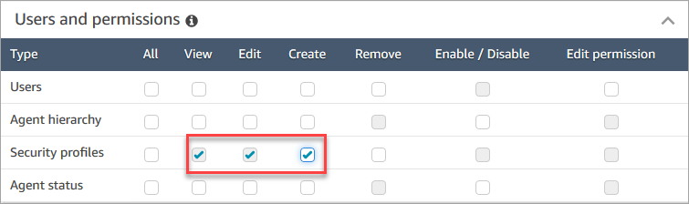
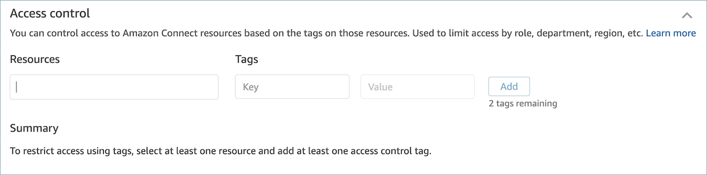
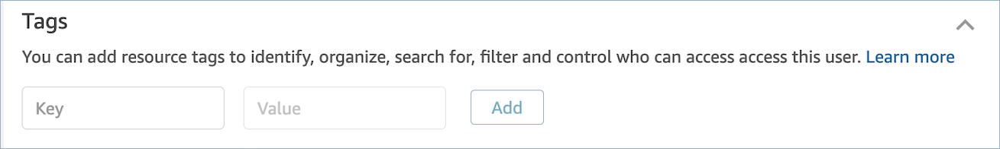

# Create a security profile in Amazon Connect

Creating a security profile enables you to grant your users only the permissions that
they need.

For each permission group, there is a set of resources and supported set of actions.
For example, users are part of the **Users and permissions** group,
which supports the following actions: view, edit, create, remove, enable/disable, and
edit permission.

Some actions depend on other actions. When you choose an action that depends on
another action, the dependent action is automatically chosen and must also be granted.
For example, if you add permission to edit users, we also add permission to view
users.

## Required permissions

to create security profiles

Before you can create a new security profile, you must be logged in with an Amazon Connect
account that has **Security profiles - Create** permissions, as
shown in the following image.

By default, the Amazon Connect **Admin** security profile has these
permissions.

## How to create

security profiles

1. Log in to the Amazon Connect admin website at https://`instance name`.my.connect.aws/.
2. Choose **Users**, **Security
   profiles**.
3. Choose **Add new security profile**.
4. Type a name and description for the security profile.
5. Choose the appropriate permissions for the security profile from each
   permission group. For each permission type, choose one or more actions.
   Selecting some actions results in other actions being selected. For example,
   selecting **Edit** also selects **View**
   for the resource and any dependent resources.
6. Choose **Save**.

## Tag-based access

controls

You create a security profile with access control tags. Use these steps to create
a security profile that enforces tag-based access controls.

1. Choose **Show advanced settings** at the bottom of the
   security profile.
2. In the **Access control** section, in the
   **Resources** box, enter the resources to be restricted
   using tags.

 3. Enter the **Key** and **Value**
combination for the resource tags that you want to restrict access
to. 4. Ensure that you have enabled _View_ permissions for the
resources that you have selected. 5. Choose **Save**.

###### Note

It is mandatory to specify both a resource type and an access control tag when
configuring tag-based access controls. As a best practice, ensure that you have
matching resource tags on a security profile that has tag-based access controls
configured. To learn more about tag-based access controls in Amazon Connect, see [Apply tag-based access control in
Amazon Connect](tag-based-access-control.md "tag-based-access-control.md").

## Tag security profiles

You can create a new security profile with resource tags. Use these steps to add a
resource tag to a security profile.

1. Choose **Show advanced settings** at the bottom of the
   security profile.
2. Enter a **Key** and **Value**
   combination to tag the resource, as shown in the following image.

 3. Choose **Save**.

For more information about tagging resources, see [Add tags to resources in Amazon Connect](tagging.md "tagging.md").
