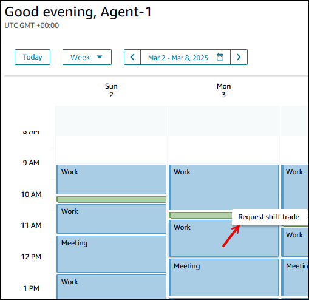
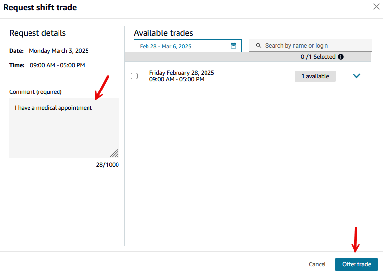
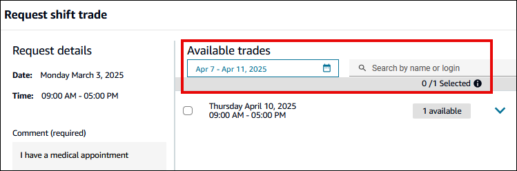
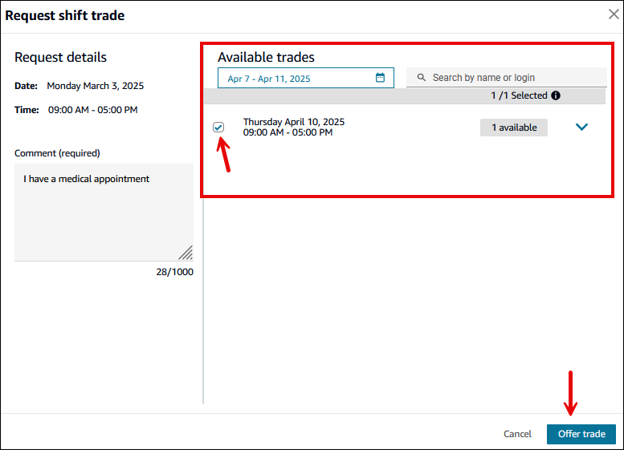
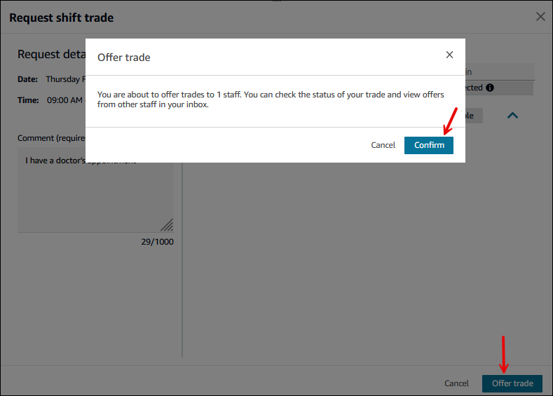
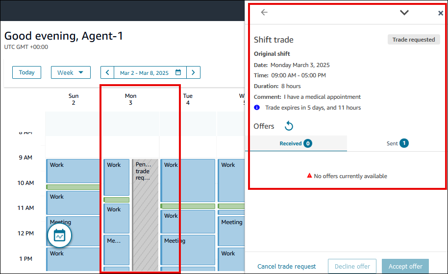

# How agents create shift trade

requests

###### Tip

Check out this video that shows how agents use shift exchange: [How Agents Use the
Shift Exchange Feature to Trade Shifts](https://www.youtube.com/watch?v=Q6i-DW5g-GM "https://www.youtube.com/watch?v=Q6i-DW5g-GM") on the Amazon Connect Enablement
channel on YouTube.

Agents can exchange shifts when:

- Their shift is in the future.
- Their staffing group is in a trade group.
- The staff rules have **Eligible to trade shift** =
  **Yes**.
  The option to **Request shift trade** only appears to agents
  when this criteria is met.

###### To initiate a shift trade request

1. Navigate to your schedule and choose the shift that you want to trade.
   The **Request shift trade** option appears. Click or
   tap on it.

The following image shows a **Work** shift and the
**Request shift trade** option.

 2. On the **Request shift trade** dialog box, you can
either offer a trade or request a shift trade. You can see your selected
shift details on the left side of the screen.

    * **To offer a trade**: Enter a
     comment. This comment can be viewed by your manager and other
     agents who want trade shifts. Choose **Offer
     trade**, as shown in the following image.

    
    * **To trade your shift with another
     shift**

    	1. If no available trades appear automatically for your
    	 time range you can search for offered shifts in other
    	 time ranges or search by agent. The following image
    	 shows a search for shifts in April.

    	
    	2. Select the shift(s) to trade, and then choose
    	 **Offer trade**. You can choose
    	 multiple requests to trade.

    	The following image shows there's a shift offered by
    	 another agent that you can trade for your Monday March
    	 3rd shift.

    	
    If you don't like any of the shifts that other agents are
     offering for trade, for example, choose **Offer
     trade** to add your shift to the pool, and then
     choose **Confirm**, as shown in the following
     image

    

3. After you offer a trade, your calendar shows a pending trade request.
   You can click on that item to get the details on the right side of the
   pane, as shown in the following image. The image shows you have offered
   a shift to trade but you haven't received any offers from other
   agents.

Using the **Shift trade** pane you can:

    * View all the trade offers that you have received or
     sent.
    * **Cancel trade request** any time before it
     has been approved (either automatically or by the
     supervisor).
    * **Decline offer**. This declines an incoming
     trade request from another agent.
