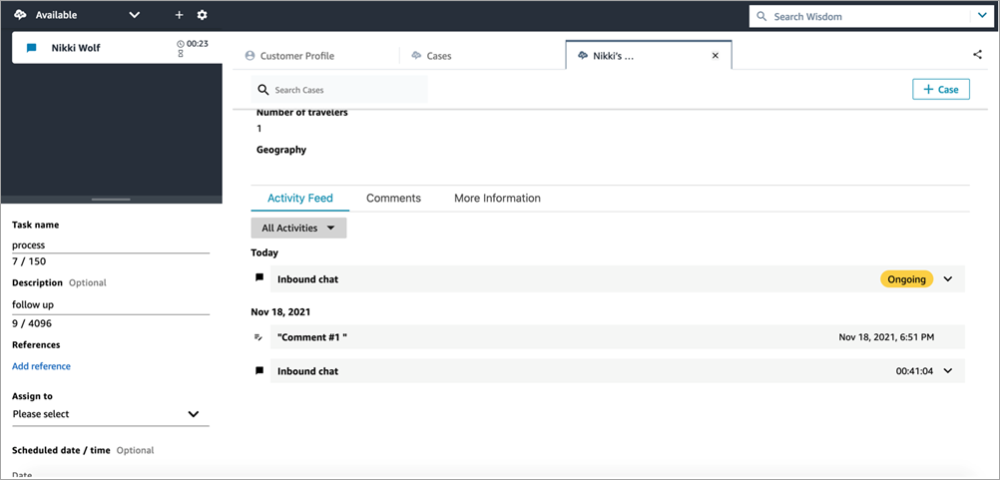

# Create a task in the Contact Control Panel

(CCP) agent workspace from a case

In the agent workspace, you can add a task from a case. In the Contact Control
Panel (CCP), you will see the task creation form.

When you create a task from a case, the task is automatically associated with the
case and it appears on the activity feed.

