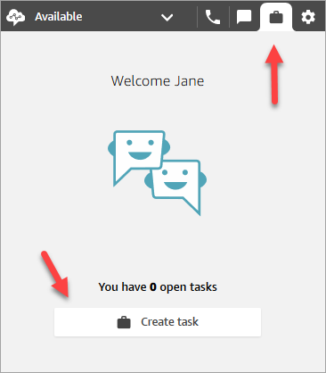
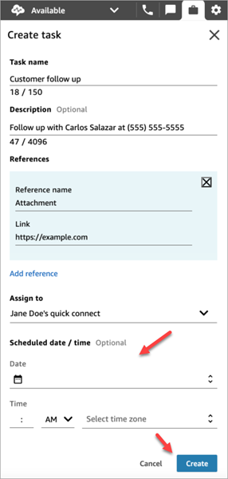
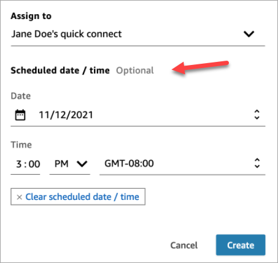

# Create a new task in the Contact Control Panel

(CCP)

You can create a task any time, even when your status is Offline. And you can
assign a task to anyone who has a quick connect, including yourself.

You can create a task, which starts the task immediately. Or you can schedule the
task to start on a future date and time.

1. Open the CCP. Select the **Task** tab, and then choose
   **Create task**.

 2. Complete the **Create task** page. When you choose
**Assign to**, you can assign a task only to someone or
a queue that has quick connect.

Choose **Create**.

CCP only
The following image shows the option to create a task in the
CCP.

 3. If you chose yourself, the task is routed to you. Choose **Accept
task**.

## Create a scheduled task

You can schedule a task to start on a future date and time.

1. Complete the steps to create a task. For example, add a **Task
   name** and **Assign to** a quick
   connect.
2. In the **Scheduled date / time** section, choose a
   future date and time, and specify the timezone. You can schedule a task
   up to six days in future.
3. If you want to clear all values in the **Scheduled date /
   time** section and start over, choose **Clear
   scheduled date / time**.

