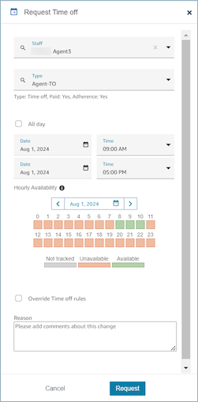

# Create a time off request in Amazon Connect

## Supervisor or manager initiated time off

request

1. Supervisors or managers can create a time off request by choosing the
   requests icon and then selecting **Request Time
   off**.

 2. Select **Staff** and the time off
**Type**. To select a time off range, you can
either select **All day** or select specific start and
end date times. Select **Override time off rules** if
you wish to override the system and allow time off while dismissing
group allowance and other rules specified in Staff, Staffing Group or
Shift profile rules. Enter a **Reason** and choose
**Request**. 3. **Hourly Availability**

    * **Hourly Availability** shows if there is
     adequate allowance for the time-off activity during that day.
    * **Not tracked** implies no hourly
     availability has been uploaded for that hour. **Not
     available** implies all available allowance has
     been used for that hour. Available implies there is time-off
     allowance available for that hour.

4. The request will enter a _pending_ state to allow
   the system to analyze existing rules (even thought rules checks are
   overridden) and will display a list of any rule failures.
5. The agent will see the pending request in their schedule UI and will
   receive an in-app notification next to the **Request**
   icon which displays as an inbox icon at the top right above the metrics
   view. This allows the agent to view the request details under the
   **Time off** tab.
6. After the rules validation completes, the time off request status of
   **Approved** or **Rejected** will
   be displayed in both the agent and supervisor views.

###### Tip

When Amazon Connect evaluates time off requests, it factors in the [Forecast group allowance for
time off](config-group-allowance-to.md "config-group-allowance-to.md") and the [individual agent's allowance
for time off](config-group-allowance-to.md "config-group-allowance-to.md"), if they've been specified.

## Agent initiated time off request

Agents can go to the schedule calendar view and choose the floating icon to
create a time off request. The request drawer opens and allows the agent to
enter details related to their time off request.

