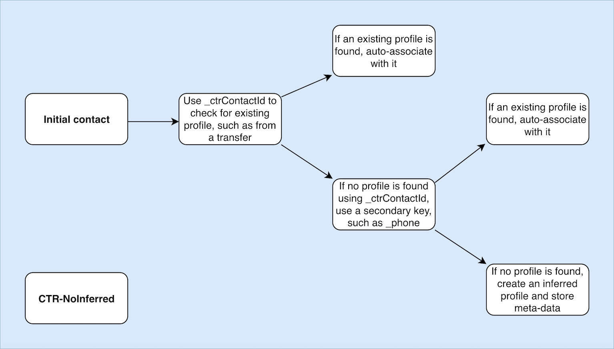
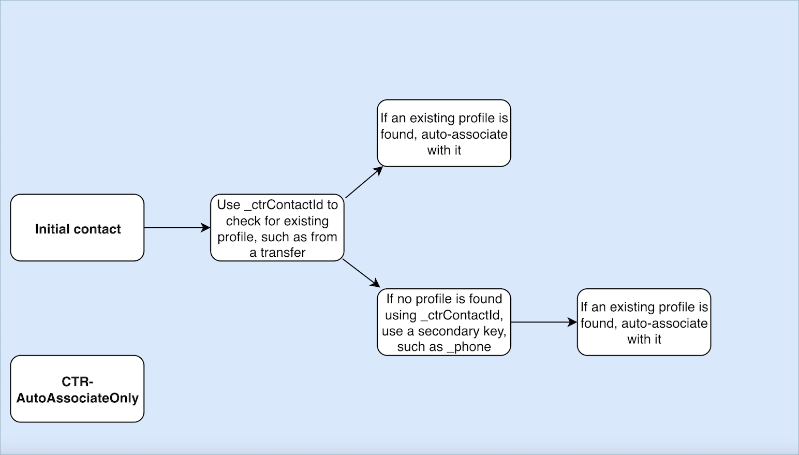
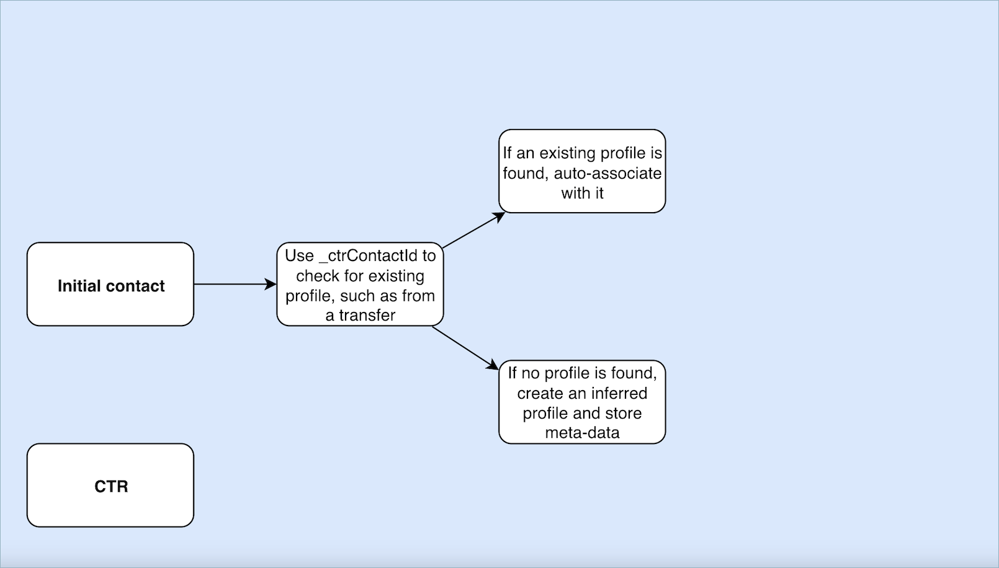
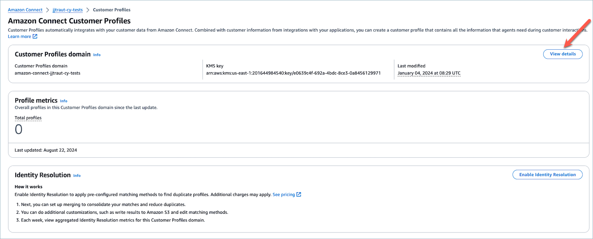
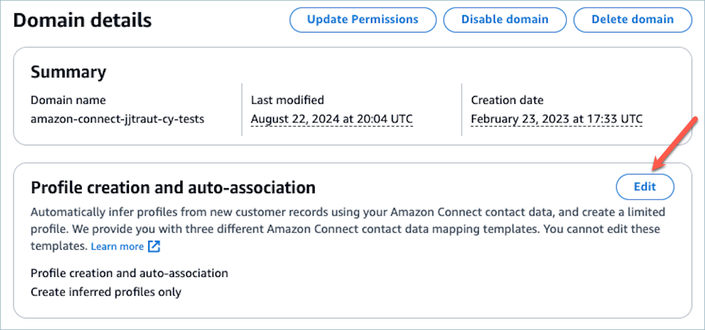
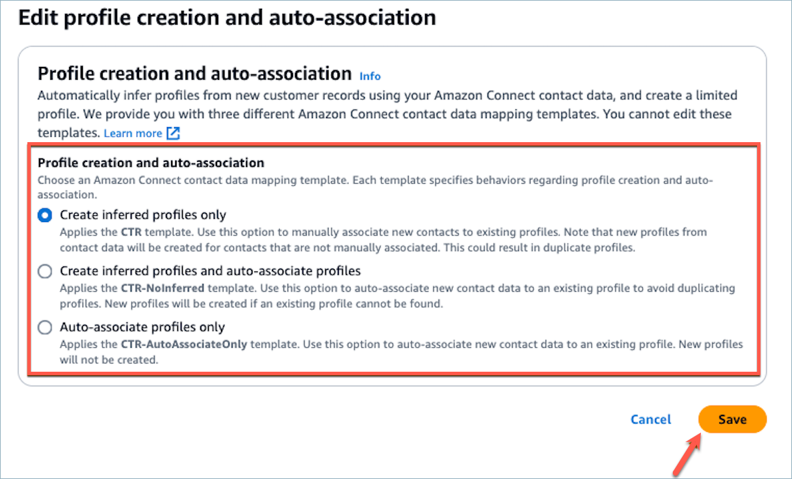

# Contact record templates in Amazon Connect

Customer Profiles

A Contact Record serves as a profile object that captures essential meta-data from
various contact events, such as phone calls or chats. It plays a vital role in
documenting and analyzing interactions with customers.

When a contact event takes place, there are three distinct default templates that
can be applied to your domain. These templates serve as configuration options,
governing how the contact event is handled within the system. Each template defines
specific rules and actions, allowing you to tailor the processing of contact events
according to your business needs.

###### Contents

- [Create inferred
  profiles and auto-associate profiles (CTR-NoInferred)](#ctr-contact-record-template-no-inferred "#ctr-contact-record-template-no-inferred")
- [Auto-associate
  profiles only (CTR-AutoAssociateOnly)](#ctr-contact-record-template-auto-associate "#ctr-contact-record-template-auto-associate")
- [Create inferred
  profiles only (CTR)](#ctr-contact-record-template-inferred-only "#ctr-contact-record-template-inferred-only")
- [Contact record
  template usage examples](#ctr-contact-record-template-usage-examples "#ctr-contact-record-template-usage-examples")
- [How to
  update Contact Record type in the AWS Console](#ctr-contact-record-template-usage-examples-console "#ctr-contact-record-template-usage-examples-console")
- [Automatically add names from email
  contacts to a profile](#add-email-names-to-profile "#add-email-names-to-profile")

## Create inferred

profiles and auto-associate profiles (CTR-NoInferred)

**Description**

When the CTR-NoInferred template is used and a contact event, such as a phone
call takes place, a specific process is initiated to handle the data. Initially,
the system uses the `_ctrContactId` key to search for an existing
profile associated with the contact event. If a matching profile is found, the
contact event is automatically associated with that profile. However, if no
existing profile is found using the `_ctrContactId` key, the system
proceeds to search for a profile using a secondary key called
`_phone`. This key is used to locate an existing profile based on
the phone number associated with the contact event. When a matching profile is
found, the contact event is automatically associated with that profile.

In cases where neither the `_ctrContactId` key nor the
`_phone` key yield an existing profile, the system creates a new
inferred profile. This inferred profile is then populated with the meta-data
from the contact event, ensuring that the information is captured and stored
within the system.

This process ensures efficient handling of contact events, promoting
auto-association with existing profiles and enabling the creation of inferred
profiles when necessary. By leveraging these mechanisms, organizations can
maintain a comprehensive record of customer interactions and effectively manage
their contact event data within the system.

It is recommended to use the CTR-NoInferred template as the default behavior
due to its significant advantages, especially in reducing duplicate
profiles

## Auto-associate

profiles only (CTR-AutoAssociateOnly)

**Description**

The CTR-AutoAssociateOnly template functions similarly to the CTR-NoInferred
template with one important distinction: it does not create an inferred profile
when no existing profile can be found for auto-association.

When a contact event, such as a phone call, takes place, the
CTR-AutoAssociateOnly template uses the `_ctrContactId` key to search
for a matching existing profile. If a profile is found, the contact event is
automatically associated with that profile.

However, if no existing profile is found using the `_ctrContactId`
key, the template employs a secondary search mechanism using the
`_phone` key. It searches for an existing profile associated with
the same phone number as the contact event. If a matching profile is found, the
contact event is auto-associated with that profile.

The purpose of using the CTR-AutoAssociateOnly template is to enable automatic
association with existing profiles while maintaining strict control over profile
creation. Unlike the CTR-NoInferred template, this template prevents the
creation of inferred profiles when no match is found. It ensures that profiles
are only created manually, providing organizations with a higher level of
control and accuracy in profile management.

By utilizing the CTR-AutoAssociateOnly template, organizations can leverage
auto-association while adhering to specific rules regarding profile creation.
This approach allows for streamlined contact event handling and precise control
over the profile ecosystem, ensuring accurate data representation and
facilitating efficient customer management.

## Create inferred

profiles only (CTR)

**Description**

The CTR template relies solely on the `_ctrContactId` key to search
for an existing profile, and it automatically associates the contact event with
the profile if a match is found. However, in cases where no existing profile is
found, the template creates an inferred profile and populates it with the
contact event meta-data.

Although this behavior ensures that contact events are captured even when no
pre-existing profile exists, it can potentially result in the creation of
numerous inferred profiles. This abundance of inferred profiles may lead to the
issue of duplicate profiles within the system.

To address this concern and promote better profile management practices, we
highly recommend utilizing the CTR-NoInferred template as the default option. By
using the CTR-NoInferred template, the system eliminates the creation of
inferred profiles, thereby reducing the occurrence of duplicate profiles. This
template allows for a more streamlined and efficient handling of contact events,
resulting in improved data integrity and accuracy.

By adopting the CTR-NoInferred template as the default choice, organizations
can optimize their profile management processes, minimize data duplication, and
ensure a more reliable representation of customer interactions.

## Contact record

template usage examples

**Amazon Connect admin website**

- In the Amazon Connect admin website, when creating a new domain,
  you have the option to select the desired CTR behavior. This can be done
  through the radio button options available in the **Profile
  creation and auto-association** section. Similarly, when
  selecting an existing domain, the radio button option will reflect the
  behavior previously associated with that domain.
- When editing a currently enabled domain, the Domain details page will
  display the currently applied behavior in the **Profile creation
  and auto-association** section. By choosing the
  **Edit** button in the header of this section, you
  will be redirected to the **Edit**
  **Profile creation and auto-association** page. Here,
  you can choose a different behavior according to your
  requirements.
- Alternatively, if you are viewing the CTR mapping from the
  **Data mapping** page, you can choose the
  **Change template** button. This action will also
  take you to the **Edit**
  **Profile creation and auto-association** page, where
  you can select a different behavior that suits your needs.

These options provide you with flexibility in managing the CTR behavior for
your domains, allowing you to easily customize and modify the settings based on
your specific preferences or evolving business requirements.

**AWS CLI**

- To use the **CTR-NoInferred** template,
  run the following command on the CLI:

`aws customer-profiles put-profile-object-type --domain-name
 {domain} --object-type-name CTR --description "Creates inferred
 profiles and auto-associates profiles" --template-id CTR-NoInferred`

- To use the **CTR-AutoAssociateOnly**
  template, run the following command on the CLI:

`aws customer-profiles put-profile-object-type --domain-name
 {domain} --object-type-name CTR --description "Auto-associate with
 profiles only" --template-id CTR-AutoAssociateOnly`

- To use the **CTR** template, run the
  following command on the CLI:

`aws customer-profiles put-profile-object-type --domain-name
 {domain} --object-type-name CTR --description "Creates inferred
 profiles only" --template-id CTR`

**API**

For information on using the API, see [PutProfileObjectType](../../../customerprofiles/latest/APIReference/API_PutProfileObjectType.md "../../../customerprofiles/latest/APIReference/API_PutProfileObjectType.md")

## How to

update Contact Record type in the AWS Console

1. In the Customer Profiles console, select **View Details** in the
   **Customer Profiles domain** section.

 2. On the **Domain details** page, choose
**Edit** in the **Profile creation and
auto-association** section.

 3. Select the desired Contact Record behavior you would like to apply to
your Domain and choose **Save**.

## Automatically add names from email

contacts to a profile

You can set up a flow to populate a name from an email contact to the
customer's profile. Use the [Customer profiles](customer-profiles-block.md "customer-profiles-block.md") block, configured to use the
[Update
profile](customer-profiles-block.md#customer-profiles-block-properties-update-profile "customer-profiles-block.md#customer-profiles-block-properties-update-profile") action.
