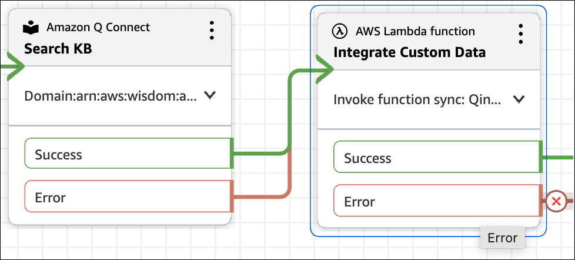

# Add custom data to an Amazon Q in Connect session

Amazon Q in Connect supports adding custom data to an Amazon Q in Connect session so that it can be used to drive
the generative AI driven solutions presented to agents. Custom data can be used by first
adding it to a session using the [UpdateSessionData](../APIReference/API_amazon-q-connect_UpdateSessionData.md "../APIReference/API_amazon-q-connect_UpdateSessionData.md") API, and then using the data added to customize AI
prompts.

## Add and update data on

a session

You add data to a session by using the [UpdateSessionData](../APIReference/API_amazon-q-connect_UpdateSessionData.md "../APIReference/API_amazon-q-connect_UpdateSessionData.md") API. Use the following sample AWS CLI command.

```

aws qconnect update-session-data \
  --assistant-id `<YOUR_Q_IN_CONNECT_ASSISTANT_ID>` \
  --session-id `<YOUR_Q_IN_CONNECT_SESSION_ID>` \
  --data '[
    { "key": "productId", "value": { "stringValue": "ABC-123" }},
  ]'

```

Since sessions are created for contacts while customer service agents are using
Amazon Connect and Amazon Q in Connect, a useful way to add session data is by using a flow: Use a [AWS Lambda
function](invoke-lambda-function-block.md "invoke-lambda-function-block.md") block to call the [UpdateSessionData](../APIReference/API_amazon-q-connect_UpdateSessionData.md "../APIReference/API_amazon-q-connect_UpdateSessionData.md") API. The API can add information to the session.

Here's what you do:

1. Add a [Amazon Q in Connect](q-block.md "q-block.md") block to
   your flow. It associates an Amazon Q in Connect domain to a contact so Amazon Connect can search
   knowledge bases for real-time recommendations.
2. Place the [AWS Lambda
   function](invoke-lambda-function-block.md "invoke-lambda-function-block.md") block after your
   [Amazon Q in Connect](q-block.md "q-block.md") block. The
   [UpdateSessionData](../APIReference/API_amazon-q-connect_UpdateSessionData.md "../APIReference/API_amazon-q-connect_UpdateSessionData.md") API requires the sessionId from Amazon Q in Connect. You
   can retrieve the sessionId by using the [DescribeContact](../APIReference/API_DescribeContact.md "../APIReference/API_DescribeContact.md") API and the assistantId that is associated with
   the [Amazon Q in Connect](q-block.md "q-block.md") block.

The following image shows the two blocks, first [Amazon Q in Connect](q-block.md "q-block.md") and then
[AWS Lambda
function](invoke-lambda-function-block.md "invoke-lambda-function-block.md").



## Use custom data with an AI

prompt

After data is added to a session, you can customize your AI prompts to use the
data for the generative AI results.

You specify the custom variable for the data by using the following format:

- `{{$.Custom.<KEY>}}`

For example, say a customer needs information related to a specific product. You
can create a **Query reformulation** AI prompt that uses the
productId that the customer provided during the session.

The following excerpt from an AI prompt shows {{$.Custom.productId}} being
provided to the LLM.

```

anthropic_version: bedrock-2023-05-31
system: You are an intelligent assistant that assists with query construction.
messages:
- role: user
  content: |
    Here is a conversation between a customer support agent and a customer

    <conversation>
      {{$.transcript}}
    </conversation>

    And here is the productId the customer is contacting us about

    <productId>
      {{$.Custom.productId}}
     </productId>

    Please read through the full conversation carefully and use it to formulate a query to find
    a relevant article from the company's knowledge base to help solve the customer's issue. Think
    carefully about the key details and specifics of the customer's problem. In <query> tags,
    write out the search query you would use to try to find the most relevant article, making sure
    to include important keywords and details from the conversation. The more relevant and specific
    the search query is to the customer's actual issue, the better. If a productId is specified,
    incorporate it in the query constructed to help scope down search results.

    Use the following output format

    <query>search query</query>

    and don't output anything else.

```

If the value for the custom variable is not available in the session, Amazon Q in Connect
interpolates it as an empty string. We recommend providing instructions in the AI
prompt so the system considers the presence of the value for any fallback
behavior.
