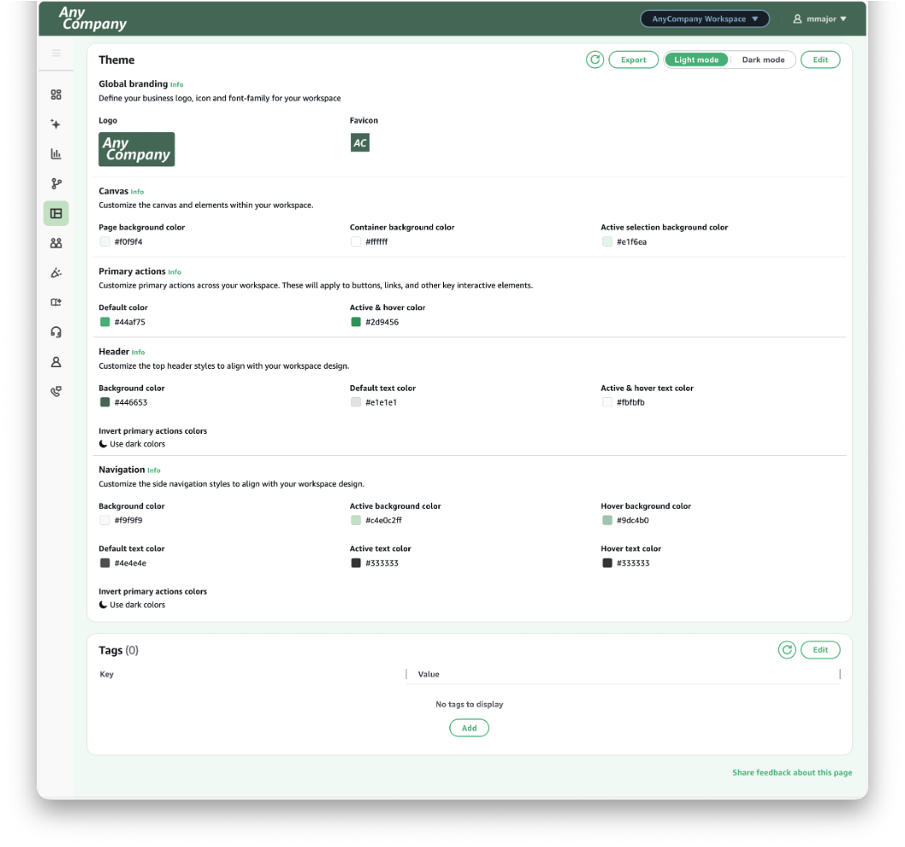
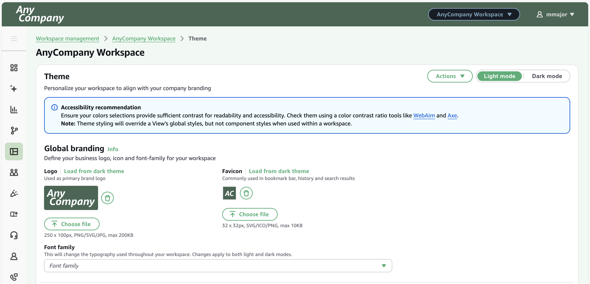
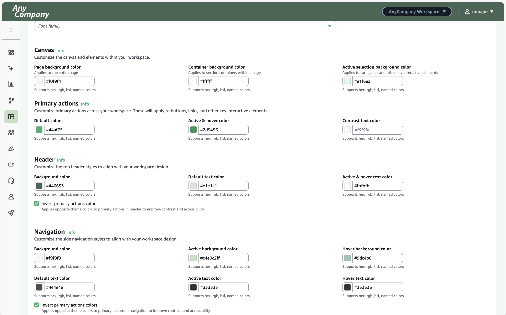
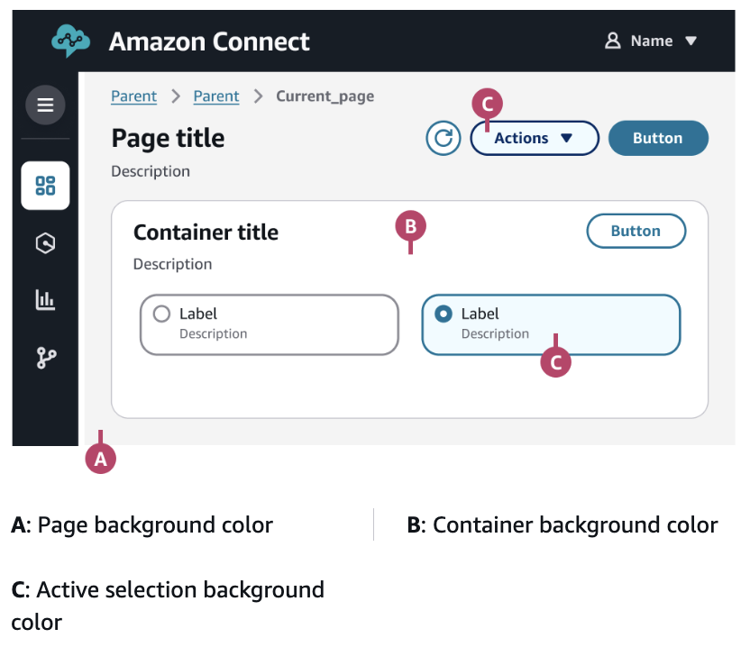
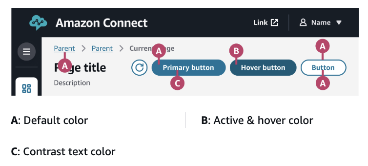
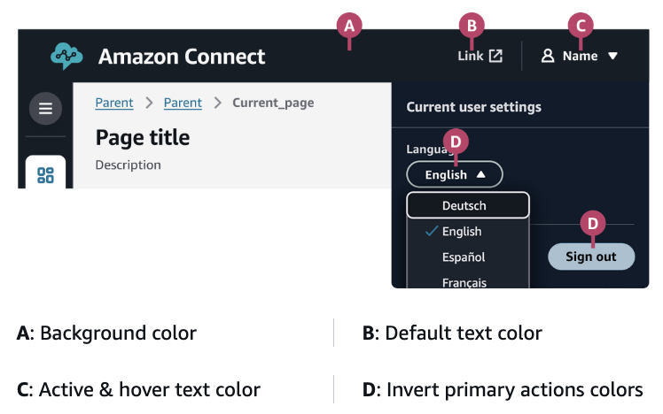
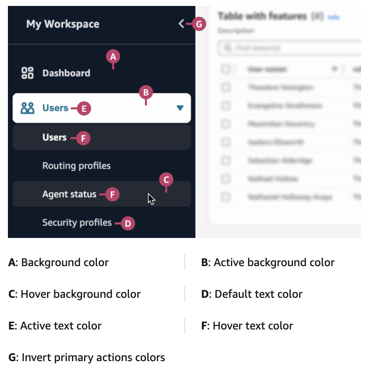

# Customize the theme of a workspace

You can use themes to customize the visual appearance of a workspace, so it aligns with the brand identity of your organization. Custom themes can serve multiple purposes:

- **Support multiple brand identities:** If your organization manages multiple products or services with unique branding, you can create a unique workspace for each, so users that are assigned to more than one see the logo, font and color scheme aligned with the brand they are currently managing.
- **Differentiate between departments or business units:** Design different themes for different departments or business units, to help users quickly identify their current context.
- **Create client-specific user interfaces:** For businesses serving multiple clients, create branded workspaces that match each client's brand identity.
  Themes consist of a logo, a favicon, a font family, and a set of colors. By default, your workspace will use Amazon Connect's theme. In this example, the default settings have been replaced for 'Any Company', including the logo and color scheme.

- **Logo** — You can replace the default Amazon Connect logo that appears at the top left of a workspace. To set a new logo, prepare and upload an image file in the specified dimensions and format.
- **Favicon** — You can also replace the default Amazon Connect favicon that commonly appears in your browser's tab and bookmark bars, history, and search results. To set a new favicon, prepare and upload an image file in the specified dimensions and format.
- **Font family** — Change the typography used throughout your workspace. To use a different font family, select one of the options from the drop-down menu.

###### Actions

The actions drop-down menu provides the following options:

- **Export** — Outputs theme configurations into a JSON file (in the same format as required for import) so it can be easily uploaded into another workspace.
- **Import** — Import theming configurations either from other workspaces directly or upload a JSON file with these configurations. The format of the JSON file follows the same structure as the export file and the theme object on the workspace resource.
- **Reset** — Similar to Cancel, this reverts changes back to what was last saved.
- **Reset to default** — Changes the theme back to the standard theme offered by Amazon Connect.

###### Customize the colors

You can customize the palette of colors that are applied throughout a workspace. You can set a color with its hex code; Red, Green, and Blue (RGB) values; hue, saturation, and lightness (HSL) values; or name.

###### Note

Default colors provide sufficient contrast to ensure that content is readable and usable by all individuals, including those with visual impairments. _If colors are changed, they should be tested for accessibility_.

Colors for the **canvas** will apply to the background elements on your workspace.

Colors for **primary actions** will apply to buttons, links, and other key interactive elements.

Colors for the **header** will apply to elements of the header bar and settings menu at the top of a workspace.

Colors for the **navigation** will apply to the navigation bar on the left side of a workspace.

**Important considerations**

1. Test thoroughly to ensure the desired appearance, as well as accessibility (e.g. sufficient contrast).
2. If a style element is inconsistent with your workspace configuration, check for component-level configurations in its View. Component styling takes precedence over workspace styling. (View styling is only considered in the absence of workspace and/or component styling).
3. Users can specify light and dark mode, so test theme changes in both modes. If certain elements are not clear then specify a different logo, favicon, and set of colors for light and dark modes.
