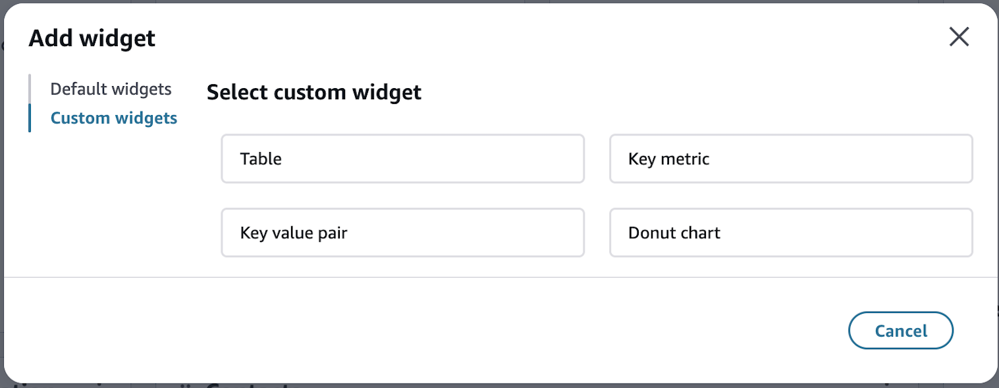
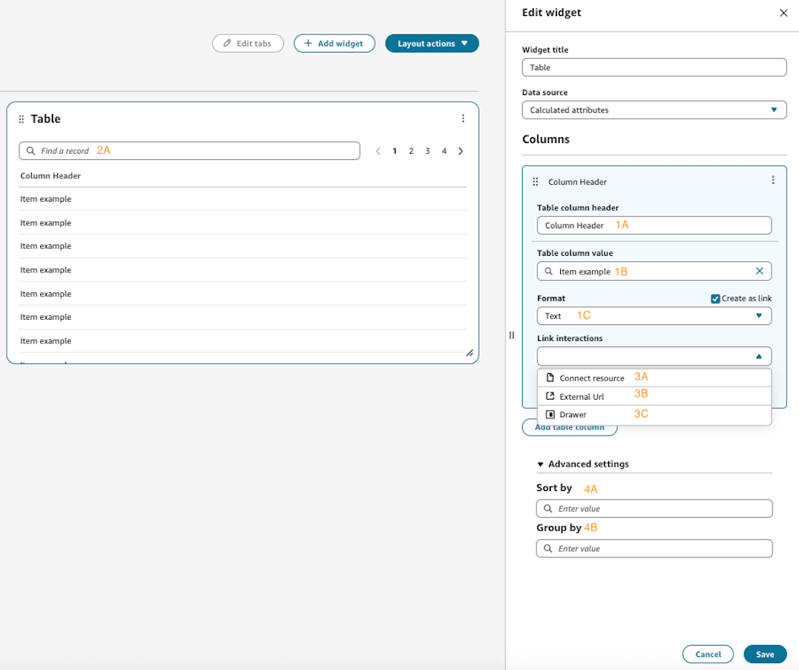
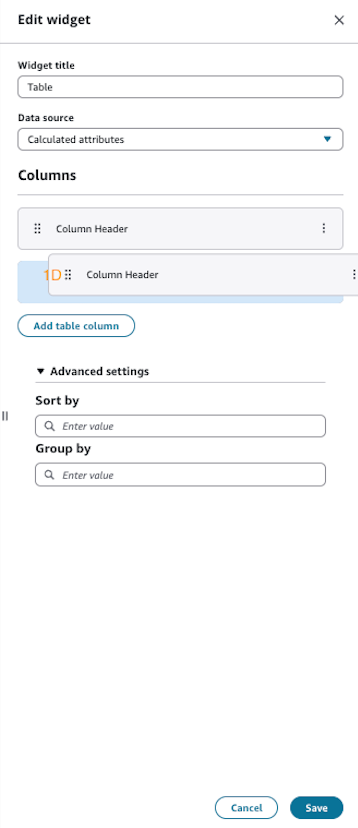
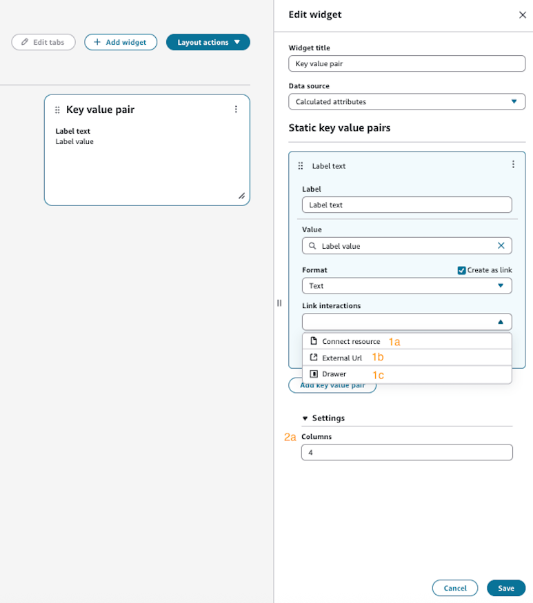
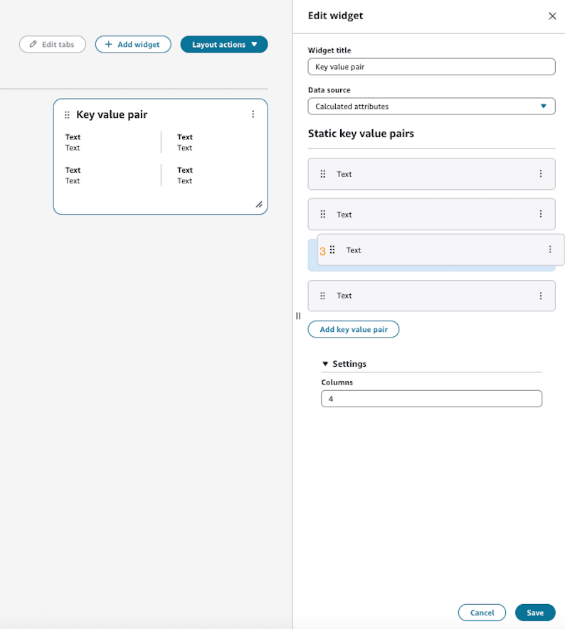
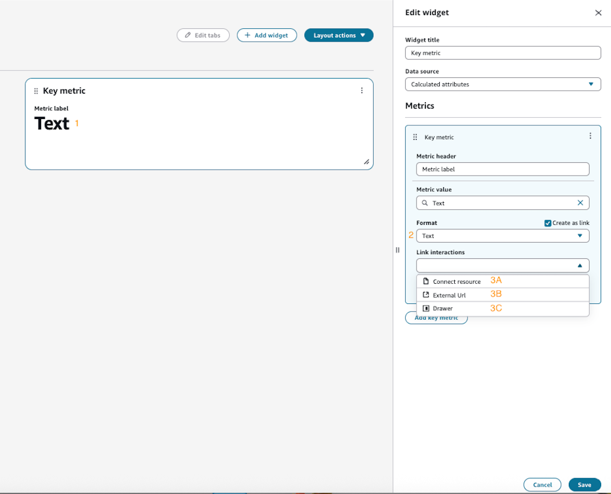
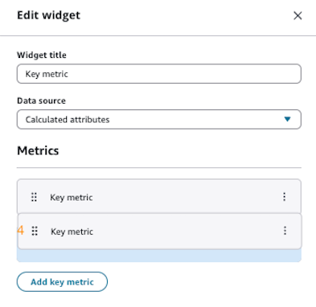
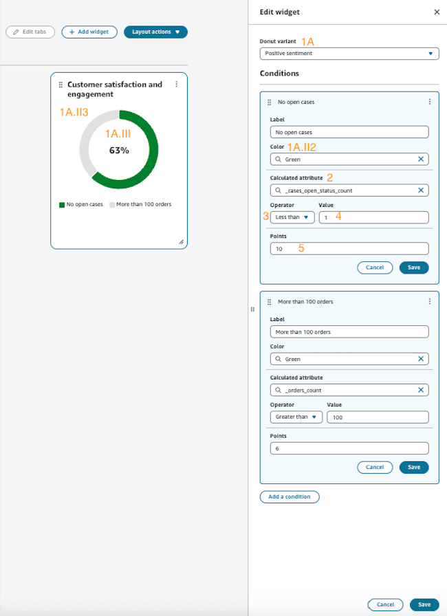
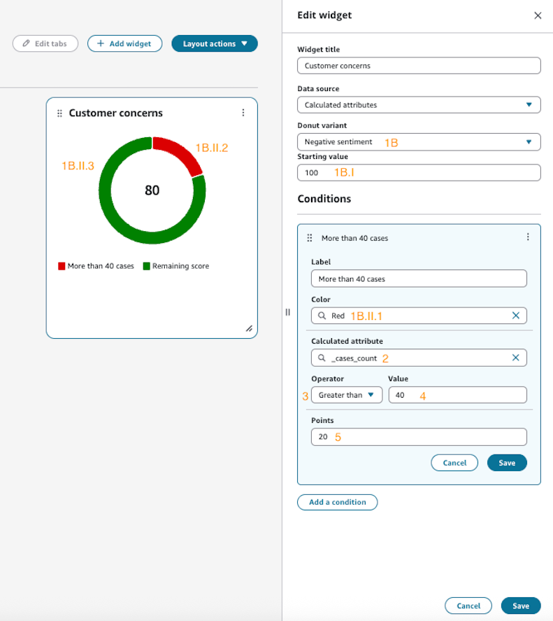

# Custom widgets

Create tailored dashboard components from the ground up to meet your specific
business needs. Custom widgets allow you to build unique visualizations without
any predefined data.



## Available custom

components

- [Table](#table-widget "#table-widget")
- [Key value pair](#key-value-pair "#key-value-pair")
- [Key metric](#key-metric "#key-metric")
- [Donut chart](#donut-chart "#donut-chart")

## Building custom widgets

**Each custom widget can be configured
with:**

- Custom data sources
- Custom displays
- Custom fields
- Custom item interactions

## Table

The custom table component provides flexible configuration options for
displaying your data in a tabular format, with advanced features for
interaction and organization.

### Features

1. **Column configurations**
   - Define custom column headers
   - Specify data for each column
   - Set data formatting options
   - Define column placement

2. **Filtering**
   - Quickly filter items within your table

3. **Linking**
   - Connect Resource Links
     - Seamless navigation to:
       - Segments
       - Calculated attributes

     - Opens in new tab

   - **External URL
     links**
     - Convert row item value into URLs that you can
       choose
     - Opens in new tab
     - Dynamically generate links based on row
       data

   - Drawer view links
     - Open detailed information in side
       drawer
     - View complete record details without leaving
       the page

4. Data organization
   - Grouping
     - Group rows by specific field names
     - Persistent group settings

   - Sorting
     - Sort by any column field
     - Ascending order organization
     - Persistent sort settings

**Figure 1**



**Figure 2**



### Example

configuration

```
{
    "Type": "Table",
    "Props": {
        "ColumnDefinitions": [
            {
                "Header": "Table column header"
                "Cell": {
                    "Content": {
                        "Props": {
                            "Variant": "Link",
                            "LinkOptions": {
                                "LinkType": "Drawer"
                            }
                        },
                        "Type": "TextContent",
                        "Children": ["string"]
                    }
                },
            }
        ]
    }
}
```

## Key value pair

The Key Value Pair component enables you to create organized displays of
related data points in a flexible, readable format.

### Overview

Create dynamic data displays by defining custom key-value
relationships. This component is particularly useful for showing
attribute pairs such as:

- Customer details
- Account information

### Features

1. **Interactive link
   options**
   - Connect resource links
     - Link directly to related resources
     - Seamless navigation to:
       - Calculated attributes
       - Segments

     - Opens in new tab

   - External URL Links
     - Convert item value into URLs that you can
       choose
     - Opens in new tab

   - Drawer View Links
     - Open detailed information in side
       drawer
     - View complete details without leaving the
       page

2. Column configuration
   - Define 1-4 columns of key-value pairs

3. Organize pairs in logical groupings

**Figure 1**



**Figure 2**



### Example

configuration

```
{
    "Type": "KeyValuePair",
    "Id": "UniqueId",
    "Props": {
        "Columns": 2,
        "Items": [
            {
                "Label": {
                    "Content": {
                        "Type": "TextContent",
                        "Id": "UniqueId",
                        "Props": {
                            "FontWeight": "bold"
                        },
                        "Children": ["Profile id"]
                    }
                },
                "Value": {
                    "Content": {
                        "Type": "TextContent",
                        "Id": "UniqueId",
                        "Props": {},
                        "Children": ["[string]"]
                    }
                }
            }
        ]
    }
}
```

###### Note

This component does not currently support
`ProfileObjects` in the UI builder.

## Key metric

The Key Metric component enables you to prominently display critical
business metrics, KPIs, and vital statistics in an easily digestible
format.

### Overview

Create high-visibility metric displays that highlight important data
points, trends, or status indicators. This component is ideal for
showcasing:

- Performance indicators
- Critical measurements
- Status summaries
- Trend indicators

### Features

1. **Large display text**
2. **Metric format**
3. **Interactive link
   options**
   - Connect resource links
     - Link directly to related resources
     - Seamless navigation to:
       - Calculated attributes
       - Segments

     - Opens in new tab

   - External URL links
     - Convert item value into URLs that you can
       choose
     - Opens in new tab

   - Drawer view links
     - Open detailed information in side
       drawer
     - View complete details without leaving the
       page

4. **Organize metrics
   layout**

**Figure 1**



**Figure 2**



### Example

configuration

```
{
    "Type": "KeyMetrics",
    "Props": {
        "MetricDefinitions": [
            {
                "MetricLabel": "Total Revenue",
                "MetricValue": {
                    "Content": {
                        "Type": "TextContent",
                        "Props": {
                            "Format": "USD",
                            "FontSize": "large",
                            "FontWeight": "bold"
                        },
                        "Children": ["[string]"]
                    }
                },
                "Columns": 1
            }
        ]
    }
}
```

###### Note

This component does not currently support
`ProfileObjects` in the UI builder.

## Donut chart

The donut chart component enables visualization of sentiment scoring
through a circular donut chart.

### Overview

Create dynamic sentiment visualizations by defining custom scoring
criteria. This component is particularly useful for showing:

- Success metrics
- Achievement rates
- Risk assessments
- Performance indicators

### Features

1. Sentiment Analysis Options
   - Positive Sentiment
     - Starts from zero
     - Tracks achievement against criteria:
       - Custom point values
       - Color-coded segments
       - Grey for unmet conditions

     - Shows success rate percentage

   - Negative Sentiment
     - Starts from maximum value
     - Tracks deductions:
       - Color-coded segments
       - Point reduction system
       - Green for remaining value

     - Shows final score

2. Calculated attribute value
3. Operator Options
   - Equal To
   - Not Equal To
   - Greater Than
   - Less Than

4. Value Condition
5. Allotted points per condition

**Figure 1: Positive sentiment
example**



**Figure 2: Negative sentiment
example**



### Example

configuration

```
{
    "Type": "DonutChart",
    "Props": {
        "Variant": "PositiveSentiment",
        "ConditionDefinitions": [
            {
                "Title": "Customer Satisfaction",
                "Color": "#4CAF50",
                "CalculatedAttribute": "satisfaction_score",
                "Operator": "GREATER_THAN",
                "ValueCondition": 8,
                "Points": 10
            }
        ]
    }
}
```

###### Note

- **Donuts only support Calculated
  attributes as a data source at this
  time.**
- **All condition definitions must
  include a title, color, calculated attribute, operator,
  value condition, and points value.**
