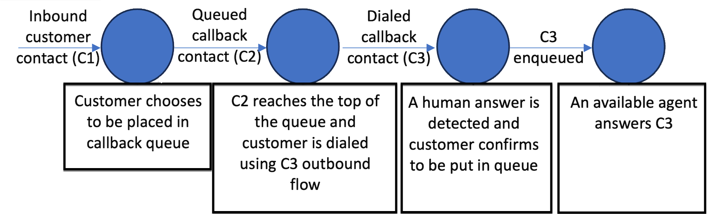
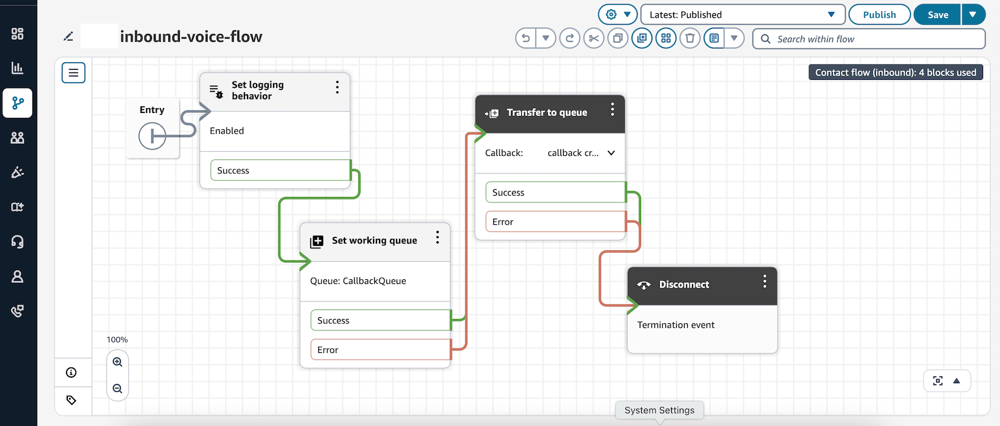
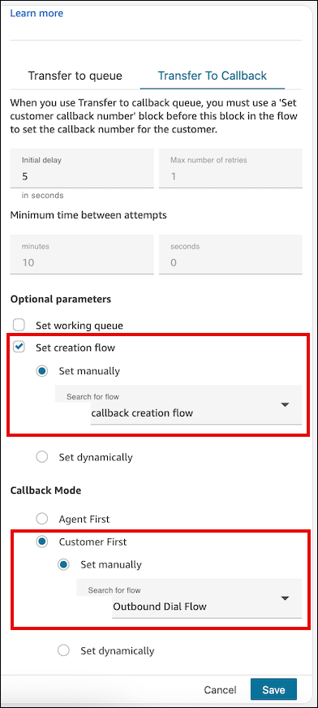
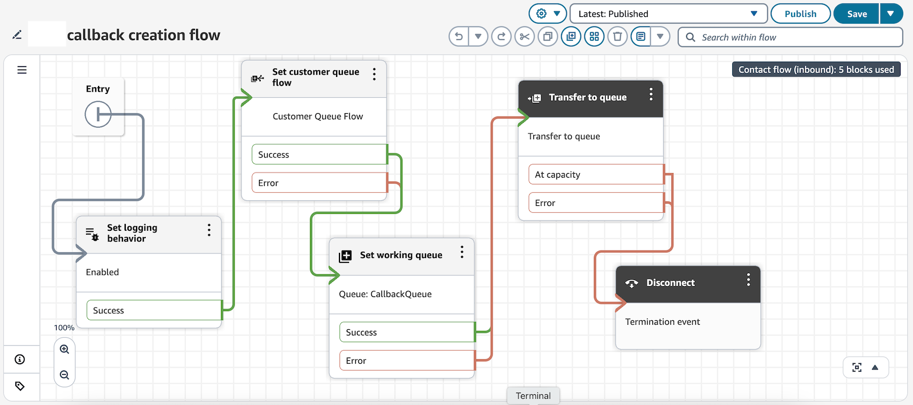
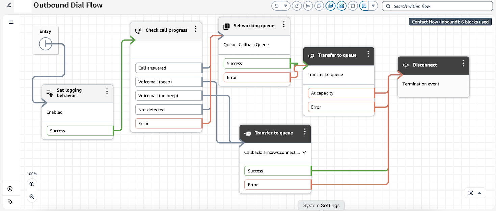

# Use customer first callback mode in Amazon Connect

When you set up queued callbacks, you have the additional choice of whether to use agent
first callback mode or customer first callback mode.

- **Agent first callback mode** is the default. The
  callback is offered to an agent to accept or reject before the call is dialed to a
  customer.
- **Customer first callback mode** is available only
  when Next Generation Amazon Connect is [enabled](enable-nextgeneration-amazonconnect.md "enable-nextgeneration-amazonconnect.md") for your Amazon Connect instance. In this mode, Amazon Connect dials the customer
  first and only offers the callback to an agent if the customer answers the callback
  that they've received.

###### Important

- Customer first callback mode is not available in the pay-per-feature pricing
  model.
- If you disable Next Generation Amazon Connect after you've already activated and
  started using customer first callback, customer first callback mode is also
  disabled.

###### Contents

- [The lifecycle of a customer first callback](#queued-callback-customer-first-callback-contact-lifecycle "#queued-callback-customer-first-callback-contact-lifecycle")
- [Metrics for customer first callbacks](#customer-first-callback-metrics "#customer-first-callback-metrics")
- [Example contact records](#customer-first-callback-contact-lifecycle-contact-model "#customer-first-callback-contact-lifecycle-contact-model")
- [Sample flows](#customer-first-callback-contact-lifecycle-sample-flows "#customer-first-callback-contact-lifecycle-sample-flows")

## The

lifecycle of a customer first callback

The lifecycle for customer first callbacks is spread across three different contacts,
as shown in the following diagram.



Following is a description of each contact.

1. **Inbound customer contact (C1)** is an inbound
   voice contact. It looks like every other inbound customer contact.
2. **Queued callback contact (C2)** is the queued
   leg of the customer first callback. It has a new initiation method of
   CALLBACK_CUSTOMER_FIRST_QUEUED.
   - C2 triggers the creation flow, if you selected **Set creation
     flow** in the [Transfer to queue](transfer-to-queue.md "transfer-to-queue.md") block. It does this before
     it is queued in the working queue, and after the **Initial
     delay**, if that is specified in the [Transfer to queue](transfer-to-queue.md "transfer-to-queue.md") block.
   - C2 does not support the **Maximum number of retries**
     and **Minimum time between attempts** settings in the
     [Transfer to queue](transfer-to-queue.md "transfer-to-queue.md") block. That functionality
     is only available for agent first callbacks.

3. **Dialed callback contact (C3)** is the dialed
   leg of the customer first callback. It has a new initiation method of
   CALLBACK_CUSTOMER_FIRST_DIALED.
   - C3 triggers the required outbound callback flow that you specified in
     the [Transfer to queue](transfer-to-queue.md "transfer-to-queue.md") flow block. You only
     specify an outbound callback flow for customer first callback mode, not
     for agent first callback mode.
   - For customer first callbacks, you configure retries and time between
     attempts in the outbound flow specified for C3, based on the output of
     the [Check call progress](check-call-progress.md "check-call-progress.md") flow block. The purpose
     of this is to determine whether a contact has been answered by a
     voicemail or human voice.
   - After the customer's presence is confirmed, the flow for C3 should
     have a [Transfer to queue](transfer-to-queue.md "transfer-to-queue.md") flow block configured to
     place the contact in its queue to find the next available agent.
   - You can customize the routing priority of this contact within the flow
     by using the [Set routing criteria](set-routing-criteria.md "set-routing-criteria.md") or [Change routing priority /
     age](change-routing-priority.md "change-routing-priority.md") blocks.

###### Note

- You must set the final working queue at least once before C2 is created.
  - You can do this in the C1 inbound flow by using the [Set working queue](set-working-queue.md "set-working-queue.md"). Or, while configuring
    C2 you can specify the queue in the [Transfer to queue](transfer-to-queue.md "transfer-to-queue.md") block.
  - You can modify the final working queue by using **Set
    creation flow** for C2, or by using the outbound flow
    that you specify for C3.

- When you set the final working queue for the callback at any point in the
  contact's lifecycle (step C1, C2, or C3), the following stages inherit it.

## Metrics for

customer first callbacks

You can access the following metrics in either the Queue performance dashboard or by
using the [GetMetricDataV2](../APIReference/API_GetMetricDataV2.md "../APIReference/API_GetMetricDataV2.md")
API.

- [Average queue
  abandon time - customer first callback](metrics-definitions.md#average-queue-abandon-time-customer-first-callback "metrics-definitions.md#average-queue-abandon-time-customer-first-callback")
- [Average queue answer
  time - customer first callback](metrics-definitions.md#average-queue-answer-time-customer-first-callback "metrics-definitions.md#average-queue-answer-time-customer-first-callback")
- [Average speed
  of answer - customer first callback dialed](metrics-definitions.md#average-speed-of-answer-customer-first-callback-dialed "metrics-definitions.md#average-speed-of-answer-customer-first-callback-dialed")
- [Average wait time after customer connection - customer first callback](metrics-definitions.md#average-wait-time-after-customer-connection-customer-first-callback "metrics-definitions.md#average-wait-time-after-customer-connection-customer-first-callback")
- [Callback attempts - customer
  first callback](metrics-definitions.md#callback-attempts-customer-first-callback "metrics-definitions.md#callback-attempts-customer-first-callback")
- [Contact volume - agent first
  callback](metrics-definitions.md#contact-volume-agent-first-callback "metrics-definitions.md#contact-volume-agent-first-callback")
- [Contact volume - customer first
  callback](metrics-definitions.md#contact-volume-customer-first-callback "metrics-definitions.md#contact-volume-customer-first-callback")
- [Contacts abandoned -
  customer first callback](metrics-definitions.md#contacts-abandoned-customer-first-callback "metrics-definitions.md#contacts-abandoned-customer-first-callback")
- [Contacts handled - customer
  first callback](metrics-definitions.md#contacts-handled-customer-first-callback "metrics-definitions.md#contacts-handled-customer-first-callback")

## Example

contact records for customer first callbacks

Following are example contact records to show what information is stored for the C2
and C3 legs of a customer first callback.

### Example

C2 queued customer first callback contact record

```

InitialContactId : C1 (Inbound contact)
ContactId : C2 (this contact)
PreviousContactId : C1 (Inbound contact)
NextContactId : C3 (Dialed customer first callback contact)
Channel : VOICE,
InitiationMethod : CALLBACK_CUSTOMER_FIRST_QUEUED,

ConnectedToSystemTimeStamp : time // Timestamp when callback creation flow got started

CustomerEndpoint : customer phone number endpoint

DisconnectTimestamp : time // Timestamp indicating contact is disconnected and customer will be dialed

DisconnectReason : // Disconnect reason code

InitiationTimeStamp : time // Timestamp indicating customer first callback has been created in connect systems

QueueInfo : {
    Arn : arn // Queue arn representing customer first callback queue
    EnqueueTimeStamp : time // Timestamp indicating customer first callback has been put in queue and waiting out to dial.
    DequeueTimeStamp : time // Timestamp indicating customer first callback has been taken out from queue to dial out end customer.
    Duration : time // total time it took connect systems to dial out end customer.
}
```

### Example

C3 dialed customer first callback contact

```

InitialContactId : C1 (Inbound contact)
ContactId : C3 (this contact)
PreviousContactId : C2 (Queued customer first callback contact)
Channel : VOICE,
InitiationMethod : CALLBACK_CUSTOMER_FIRST_DIALED,

ConnectedToSystemTimeStamp : time // Timestamp when the outbound call associated with callback was connected with customer.

CustomerEndpoint : customer phone number endpoint

SystemEndpoint : Outbound caller id assigned to the outbound queue

Agent : {
    // All agent information associated with the outbound call.
    // Like Agent Arn, ConnectToAgentTimestamp, ACW duration etc.
}

AgentConnectionAttempts : number

DisconnectTimestamp : time // Timestamp indicating outbound call for the callback is disconnected

DisconnectReason : // Disconnect reason code

SegmentAttributes : {
    'connect:TrafficType' : 'CUSTOMER_FIRST_CALLBACK'
},

AnsweringMachineDetectionStatus : HUMAN_ANSWERED|VOICEMAIL_BEEP|VOICEMAIL_NO_BEEP|AMD_UNANSWERED|AMD_UNRESOLVED|AMD_NOT_APPLICABLE|SIT_TONE_BUSY|SIT_TONE_INVALID_NUMBER|SIT_TONE_DETECTED|FAX_MACHINE_DETECTED|AMD_ERROR|AMD_UNRESOLVED_SILENCE(WIP)

CustomerVoiceActivity : {
    GreetingStartTimestamp : timestamp
    GreetingEndTimestamp : timestamp
}

InitiationTimeStamp : time // Timestamp indicating start of outbound call to customer

QueueInfo : {
    Arn : arn // Queue arn representing customer first callback queue
    EnqueueTimeStamp : time // Timestamp indicating customer first callback has been put in queue to join with agent.
    DequeueTimeStamp : time // Timestamp indicating customer first callback has been taken out from queue to join with agent.
    Duration : time // total time it took connect systems to join dialed end customer with agent.
    CallbackTotalQueueDuration : time // total time the customer first callback spent in queue (Includes the total queued time for C2 and C3.)
}
```

## Sample flows

for customer first callbacks

The following sample flows show how you can configure a flow for customer first
callbacks.

### Sample Inbound call flow

The following image shows a [Transfer to queue](transfer-to-queue.md "transfer-to-queue.md") block in a flow.



In this flow, the [Transfer to queue](transfer-to-queue.md "transfer-to-queue.md") has **Set creation
flow** configured and an outbound dial flow is specified.



### Sample callback creation flow configuration

The following image shows a sample callback creation flow. The [Set customer queue
flow](set-customer-queue-flow.md "set-customer-queue-flow.md") block is configured so a customer queue flow runs while the callback contact is
in queue waiting for agent availability to dial out to customers.



### Example outbound dial flow for callbacks

In the outbound dial flow shown in the following image, Amazon Connect evaluates the
presence of the customer by using a [Check call progress](check-call-progress.md "check-call-progress.md") block. If voicemail is detected, a
callback contact is recreated. If a customer is detected on other end of the call,
the call is transferred to queue for the agent to be joined to the customer.


