# Flow block in Amazon Connect: Customer profiles

This topic defines the flow block for retrieving, creating, and updating a customer
profile.

## Description

- Enables you to retrieve, create, and update a customer profile.
  - You can configure the block to retrieve profiles using up to five
    search identifiers of your choice.

- Enables you to retrieve a Customer Profile's object and calculated
  attributes.
  - You can configure the block to retrieve objects using a search
    identifier of your choice.
  - You must provide a profile ID in this block. You can provide a
    **profileID** manually, or use the
    **profileID** saved in the Customer namespace
    after you have found a profile using the **Get
    profile** action.

- Enables you to associate the contact, such as voice, chat, and tasks, to
  an existing customer profile.
- When customer profile data is retrieved, the **Response
  fields** are stored in the [contact attributes for that
  customer](connect-attrib-list.md#customer-profiles-attributes "connect-attrib-list.md#customer-profiles-attributes"), allowing you to use them in subsequent blocks.
- You can also reference the **Response fields** by using
  the following JSONPath: `$.Customer.` For example,
  `$.Customer.City` and
  `$.Customer.Asset.Status`.
- The following examples show how you might use this block:
  - Use a [Play prompt](play.md "play.md") block
    after retrieving a profile to provide a personalized call or chat
    experience by referencing the supported profile fields.
  - Use a [Check contact
    attributes](check-contact-attributes.md "check-contact-attributes.md") block after
    retrieving profile data to route a contact conditional on the
    value.
  - See [How to persist fields
    throughout the flow](#customer-profiles-block-persist-fields "#customer-profiles-block-persist-fields") for
    more details.

## Supported channels

The following table lists how this block routes a contact that is using the
specified channel.

| Channel | Supported? |
| ------- | ---------- |
| Voice   | Yes        |
| Chat    | Yes        |
| Task    | Yes        |
| Email   | Yes        |

## Flow types

You can use this block in the following [flow
types](create-contact-flow.md#contact-flow-types "create-contact-flow.md#contact-flow-types"):

- All flow types

## Configuration tips

- Before using this block, make sure Customer Profiles is enabled for your Amazon Connect
  instance. For instructions, see [Use Amazon Connect Customer Profiles](customer-profiles.md "customer-profiles.md").
- A contact is routed down the **Error** branch in the
  following situations:
  - Customer Profiles is not enabled for your Amazon Connect instance.
  - Request data values are not valid. The request values cannot be
    over 255 characters.
  - The Customer Profiles API request has been throttled.
  - Customer Profiles is having availability issues.

- The total size of [Customer Profiles
  contact attributes](connect-attrib-list.md#customer-profiles-attributes "connect-attrib-list.md#customer-profiles-attributes") is limited to 14,000 characters (56 attributes
  assuming max size of 255 each) for the entire flow. This includes all values
  persisted as **Response fields** in Customer Profiles blocks during the
  flow.

## Properties

The following property types are available in the Customer Profiles flow block:

- **[Get
  Profile](#customer-profiles-block-properties-get-profile "#customer-profiles-block-properties-get-profile")**
- **[Create
  Profile](#customer-profiles-block-properties-create-profile "#customer-profiles-block-properties-create-profile")**
- **[Update
  Profile](#customer-profiles-block-properties-update-profile "#customer-profiles-block-properties-update-profile")**
- **[Get
  Profile Object](#customer-profiles-block-properties-get-profile-object "#customer-profiles-block-properties-get-profile-object")**
- **[Get Calculated Attributes](#customer-profiles-block-properties-get-calculated-attributes "#customer-profiles-block-properties-get-calculated-attributes")**
- **[Associate Contact to Profile](#customer-profiles-block-properties-associate.title "#customer-profiles-block-properties-associate.title")**

## Properties: Get

profile

When configuring properties to **Get profile**, consider the
following:

- You must provide at least one search identifier, up to five total.
- If multiple search identifiers are provided, you must provide one logical
  operator, either **AND** or **OR**. The
  logical operator is applied across all search identifiers like one of the
  following expressions:
  - (a **AND** b **AND** c)
  - (x **OR** y **OR** z)

- Define attributes to persist in subsequent blocks, storing them in contact
  attributes under **Response fields**.
- Contacts can be routed down the following branches
  - **Success:** one profile was found.
    Response fields are stored to contact attributes
  - **Error:** An error was encountered
    while trying to find the profile. This may be due to a system error
    or how **Get profile** is configured.
  - **Multiple Found:** multiple profiles
    were found.
  - **None Found:** no profile was found.

The following image shows an example of a Customer Profiles **Properties** page that is configured for the **Get
profile** action.

The example block is configured to search for profiles that either match the
caller's **Phone** number or share the same **Account** number stored in the user-defined attribute named
"Account." When one profile is located, the following fields are stored in the
contact attributes for that specific customer: **Response
fields** - **AccountNumber**, **FirstName**, **LastName**,
**PhoneNumber**, and **Attributes.LoyaltyPoints**.

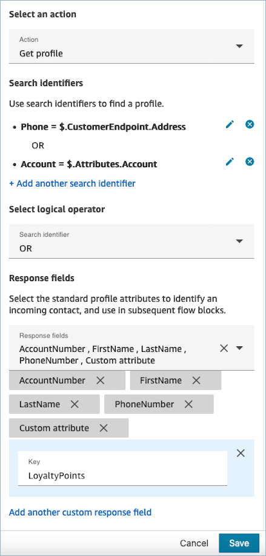

## Properties:

Create profile

When configuring properties for **Create profile**, consider the
following:

- Specify the attributes you intend to populate during profile creation in
  the **Request fields**
- Define attributes to persist in subsequent blocks, storing them in contact
  attributes under **Response fields**.

Contacts can be routed down the following branches:

- **Success:** A profile is successfully
  created, and **Response fields** are stored in contact
  attributes.
- **Error:** An error occurred during the profile
  creation process, possibly due to a system error or misconfiguration of the
  **Create profile** action.

The following example block is configured to create a profile with a
**PhoneNumber** and a custom attribute named “Language".
Following the profile creation, the **Attributes.Language**
response field is stored in contact attributes, making it available for use in
subsequent blocks.

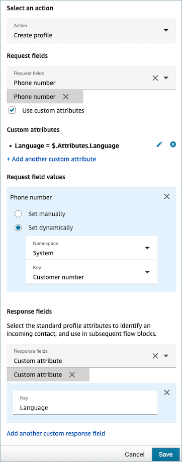

## Properties:

Update profile

When configuring properties to **Update profile**, consider the
following:

- Before using an **Update profile** block, use a
  **Get profile** block, as shown in the following image.
  Use the **Get profile** block to locate the specific
  profile you intend to update.

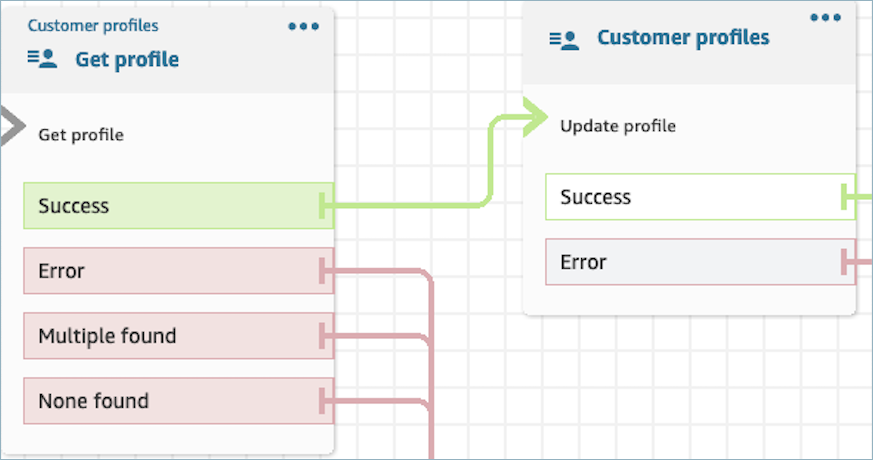

- Provide the attributes and values you wish to update the profile with
  **Request fields** and **Request field values**.
- Define attributes to persist in subsequent blocks, storing them in contact
  attributes under **Response fields**.

Contacts can be routed down the following branches:

- **Success:** The profile has been successfully
  updated, and **Response fields** are stored in contact
  attributes.
- **Error:** An error occurred during the attempt
  to update the profile. This could result from a system error or
  misconfiguration of the **Update profile**
  action.

The displayed block below is configured to update a Profile with a **MailingAddress1** with user input as value. When a profile
is updated, the **MailingAddress1** response field is
stored in contact attributes, making it available for use in subsequent
blocks.

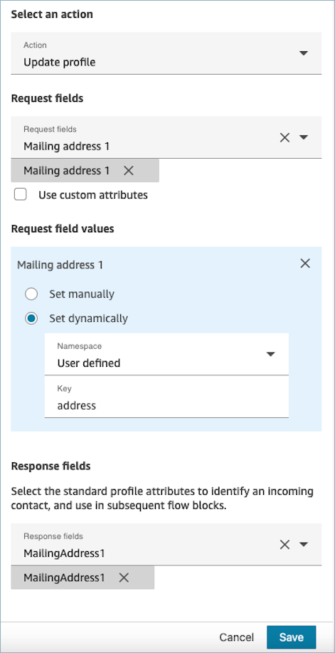

## Properties: Check segment membership

###### Important

To use this action, your Amazon Connect instance must have permission for the
following APIs: ListSegmentDefinitions, GetSegmentMembership, BatchGetProfile,
and BatchGetCalculatedAttributeForProfile in either of the following Policies:
**AmazonConnectServiceLinkedRolePolicy** or
**AmazonConnectServiceCustomerProfileAccess**.

###### Important

If you are checking segment membership for a segment powered by Spark SQL, the segment checked is the last segment created and not updated in real-time. The lastComputedAt API attributes provides the last time the segment snapshot was created. You can run a new segment snapshot to refresh the segment. If you receive a 4XX error, ensure you have created a segment snapshot.

When configuring properties to **Check segment
membership**, consider the following:

- **Mandatory Profile ID:** A Profile ID is
  required for this block to function. The **Get profile
  object** action retrieves an object associated with the
  provided **ProfileID**. Ensure you provide the
  **ProfileID** by using a preceding
  **Get profile** block. Use the **Get profile** block to pinpoint the specific
  profile before moving forward to retrieve the profile's object in the
  subsequent block.
  - You have the option to manually input the Profile ID or use a
    pre-defined value stored in a pre-defined or user attribute.

  The following image shows an example flow configured to get
  profile, and then check segment membership.

  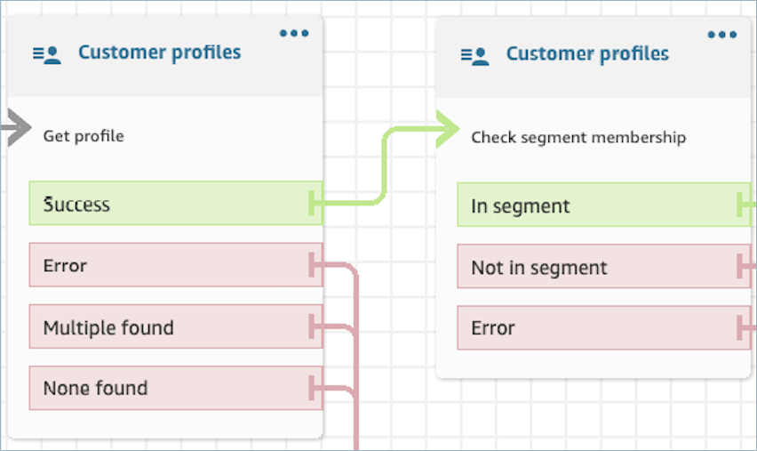

- You must provide a value for segment. You have the option to manually
  select the segment or set dynamically by using a pre-defined value stored in
  a pre-defined or user attribute.
- When you set a segment dynamically, provide an attribute that refers to
  the customer segment's identifier. You can find the identifier on the
  **View segment detail** page or as
  SegmentDefinitionName in the [ListSegmentDefinitions](../../../customerprofiles/latest/APIReference/API_ListSegmentDefinitions.md "../../../customerprofiles/latest/APIReference/API_ListSegmentDefinitions.md") operation in the Customer Profiles API.

The following image shows the location of **Segment ID**
on the **View segment details** page.

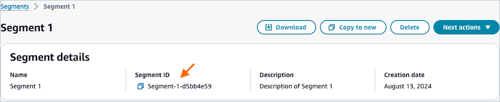

- The following image shows an example of checking segment membership.
  **Profile ID** is set to be checked dynamically and
  **Segment** manually.

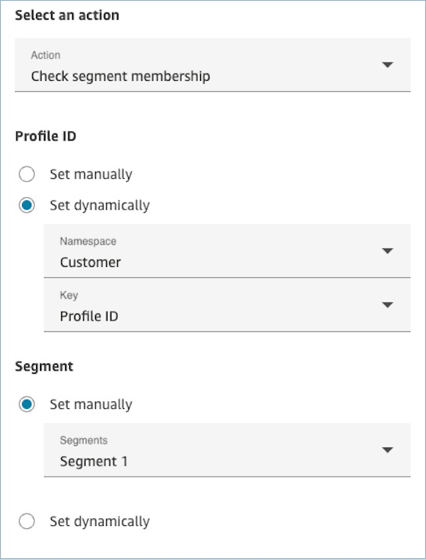

###### Contacts can be routed down the following branches

- **In segment**: The profile belongs to the
  customer segment.
- **Not in segment**: The profile does not belong
  to the customer segment.
- **Error**: An error occurred while attempting
  to check the segment membership. This may be due to a system error or
  misconfiguration of the **Check segment
  membership** action. To learn more about flow error logging,
  see [Enable Amazon Connect flow logs in an Amazon CloudWatch log
  group](contact-flow-logs.md "contact-flow-logs.md").

## Properties:

Get profile object

When configuring properties to **Get profile object**, consider
the following:

- **Mandatory Profile ID:** A Profile ID is required for
  this block to function. The **Get profile object** action
  retrieves an object associated with the provided
  **ProfileID**. Ensure you provide the
  **ProfileID** by using a preceding **Get
  profile** block, as illustrated in the following image. Use the
  **Get profile** block to pinpoint the specific profile
  before moving forward to retrieve the profile’s object in the subsequent
  block.
  - You have the option to manually input the Profile ID or use a
    pre-defined value stored in a pre-defined or user attribute.

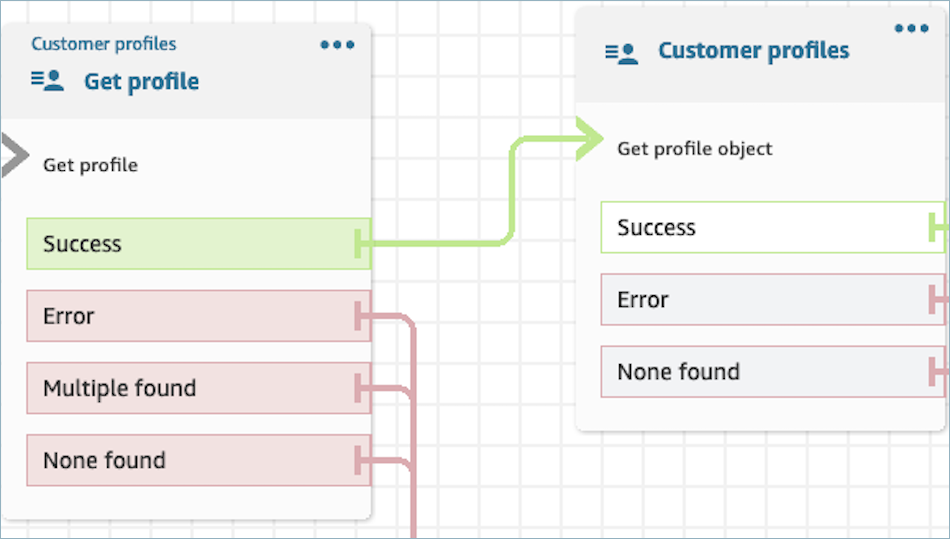

- You must indicate the object type from which you intend to retrieve
  information.
- You must choose one of the following options for object retrieval:
  - **Use latest profile object:** This
    option consistently retrieves the most recent object.
  - **Use search identifier:** This option
    involves searching for and retrieving the object using the provided
    search identifier.

- Define attributes to persist in subsequent blocks, storing them in
  contact attributes under **Response fields** .

Contacts can be routed down the following branches:

- **Success:** The profile object is successfully
  located, and **Response fields** are stored in contact
  attributes.
- **Error:** An error occurred during the attempt
  to retrieve the profile object. This may be due to a system error or
  misconfiguration of the **Get Profile** action.
- **None Found:** no object is found.

The displayed block below is configured to retrieve a profile object of type
"Asset" associated with the **ProfileId** saved under
the "Customer" namespace. In this specific scenario, the block is will search for an
Asset using the Asset ID. After the Asset is located, **Asset.Price** and **Asset.PurchaseDate**
are stored in contact attributes, making them available for subsequent
blocks.

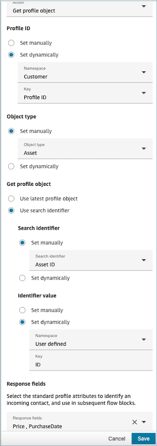

## Properties: Get calculated attributes

###### Important

To use this action, your Amazon Connect instance must have permission for the following
APIs: `ListCalculatedAttributeDefinitions` and
`GetCalculatedAttributeForProfile` in either of the following
Policies: **AmazonConnectServiceLinkedRolePolicy** or
**AmazonConnectServiceCustomerProfileAccess**.

When configuring properties to **Get calculated attributes**,
consider the following:

- **Mandatory Profile ID:** A Profile ID is required for
  this block to function. The **Get calculated attributes**
  action retrieves an object associated with the provided
  **ProfileID**. Ensure you provide the
  **ProfileID** by using a preceding **Get
  profile** block, as illustrated in the following image. Use the
  **Get profile** block to pinpoint the specific profile
  before moving forward to retrieve the profile's calculated attributes in the
  subsequent block.
  - You have the option to manually input the Profile ID or use a
    pre-defined value stored in a pre-defined or user attribute.

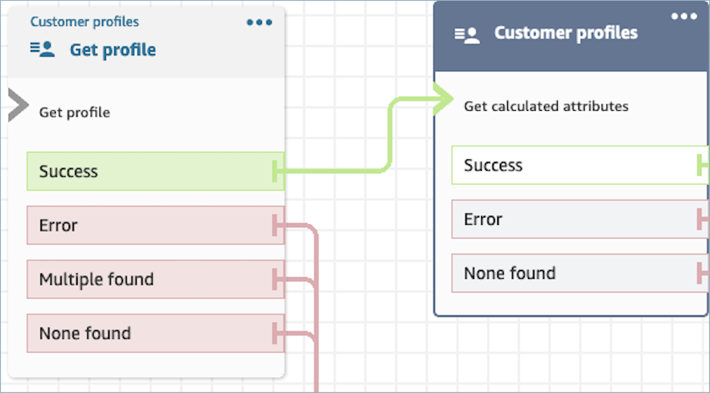

- Define attributes to persist in subsequent blocks, storing them in contact
  attributes under **Response fields**.
  - The options under **Response fields** are the
    Calculated Attribute definitions defined for your Customer Profiles
    domain
  - If the definition of calculated attributes uses a threshold, the
    calculated attribute value with be a Boolean and either return a
    True/False. Otherwise, they will return a numeric or string value.
    The return value of the calculated attribute can be used for
    branching purposes in a **Check Contact
    Attributes** block by using conditions such as
    **Equals** , **Is greater than** , **Is less
    than** , and **Contains**.

Contacts can be routed down the following branches:

- **Success:** A calculated attribute is found,
  and Response fields are stored in contact attributes.
- **Error:** An error occurred while attempting
  to retrieve the calculated attribute. This may be due to a system error or
  misconfiguration of the **Get calculated
  attribute** action.
- **None Found:** no calculated attribute is
  found.

The displayed block below is configured to get calculated attributes belonging to
the provided **ProfileId** in contact attributes. The
following **Response fields** will be retrieved and stored in
contact attributes: **Average Call Duration**, and
**Frequent Caller**.

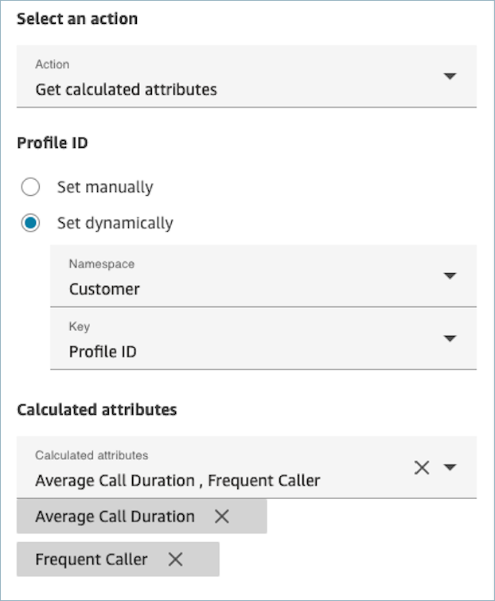

## Properties: Associate

contact to profile

###### Important

To use this action, your Amazon Connect instance must have permission for the following
APIs: `ListCalculatedAttributeDefinitions` and
`GetCalculatedAttributeForProfile` in either of the following
Policies: **AmazonConnectServiceLinkedRolePolicy** or
**AmazonConnectServiceCustomerProfileAccess**.

To use this action, you must also enable the Customer Profiles View permission in your security
profile.

When configuring properties to **Associate contact to profile**,
consider the following:

- Add a **Get profile** block before an
  **Associate contact to profile** , as
  shown in the following image. Use the **Get
  profile** block to find the profile first, then associate the
  contact and profile in the next block.
- **Mandatory Profile ID:** A Profile ID is required for
  this block to function. Ensure you provide the
  **ProfileID** by using a preceding **Get
  profile** block, as illustrated in the following image. Use the
  **Get profile** block to pinpoint the specific profile
  you wish to associate the contact to in the next block.
  - You have the option to manually input the Profile ID or use a
    pre-defined value stored in a pre-defined or user attribute.

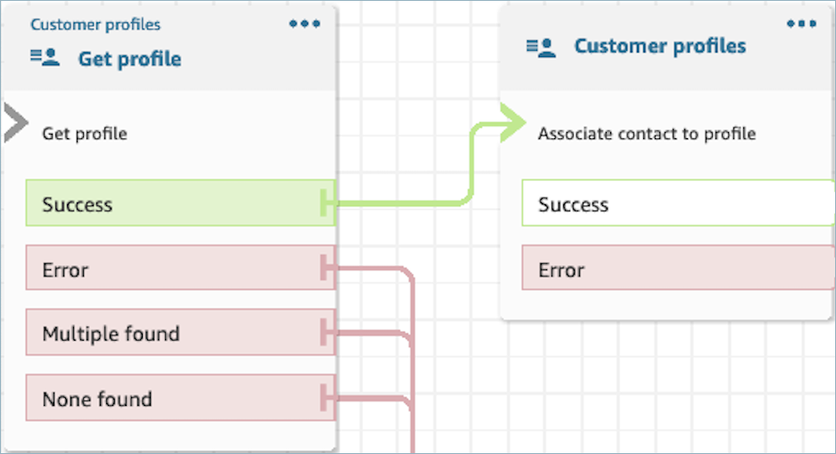

- You must provide a value for Contact ID.

Contacts can be routed down the following branches:

- **Success:** Associated the contact to
  profile.
- **Error:** An error was encountered while
  attempting to associate the contact to profile. This may be due to a system
  error or misconfiguration of the **Associate contact to
  profile** action.

The following block is configured to associate the profile with **Profile
ID** stored in contact attributes to the current Contact ID stored in
contact attributes.

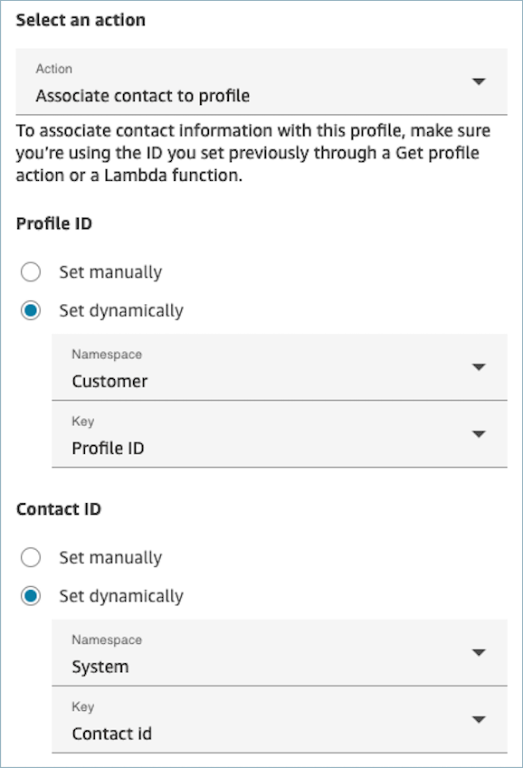

## Properties: Get profile

recommendations

###### Important

To use this action, your Amazon Connect instance must have permission for the following
API: `GetProfileRecommendations` in either of the following Policies:
**AmazonConnectServiceLinkedRolePolicy** or
**AmazonConnectServiceCustomerProfileAccess**.

For more details on how to set up and use the **Get profile
recommendations** block, please refer to [Step 4: Using Predictive
Insights across customer engagement channels](predictive-insights-get-started.md#use-across-customer-engagement-channels "predictive-insights-get-started.md#use-across-customer-engagement-channels") .

## How to persist fields

throughout the flow

Let’s say you want customers to interact with your contact center and learn the
status of their delivery order without directly communicating with an agent.
Additionally, let’s say you want to prioritize incoming calls from customers who
have experienced more than 10 minutes delay in the past.

In these scenarios, the IVR needs to fetch the relevant information about the
customer. This is achieved through the Customer Profiles block. Secondly, the IVR
needs to leverage this customer data in other Flow blocks in order to personalize
the experience and proactively service the customer.

1. Use **Play Prompt** to personalize the experience by
   greeting the customer by name and informing them of their status.

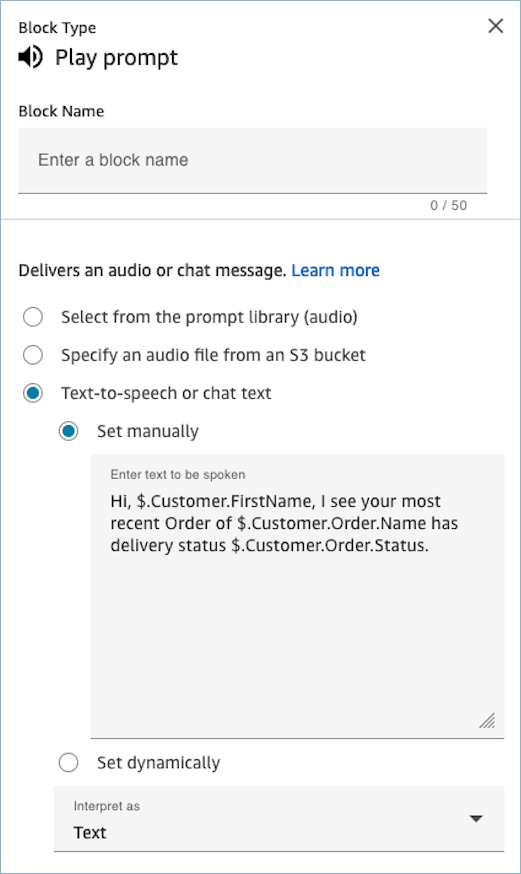 2. Use **Check contact attributes** to conditionally route
customers based on their Average Hold Time from previous interactions

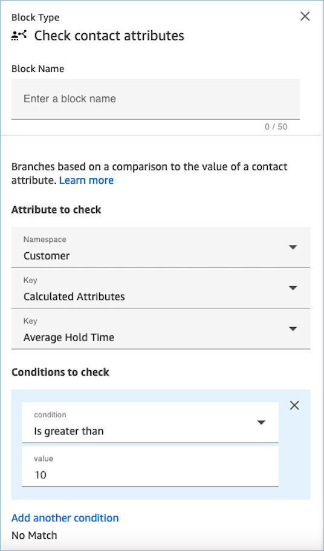

## Configured block

The following image shows an example of what this block looks like when it is
configured. It shows four branches: **Success**,
**Error**, **Multiple found**, and
**None found**.

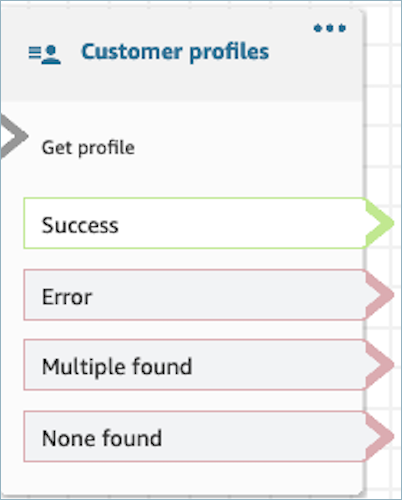
