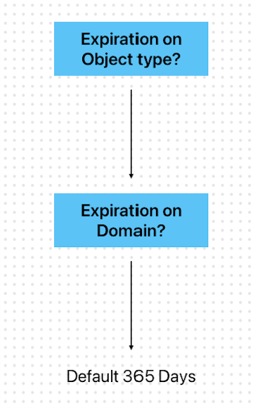

# Amazon Connect Customer Profiles data expiration

If a profile has not been updated within a specified amount of time, it will expire.
This will cause the profile to be cleaned up, and removed from the Customer Profiles
domain.

The time for Customer Profiles Data expiry can be broken down into two different
categories:

## Profiles created via

CreateProfile

Profiles created by using the `CreateProfile` API will expire based on
the timestamp assigned by **DefaultExpirationDays** on a Customer
Profiles Domain. If no Expiration has been configured it will default to 365
days.

## Profiles created or updated

via PutProfileObject

Profiles created or updated by using `PutProfileObject` will always
respect the **ExpirationDays** defined on the object type
associated to them. If no Expiration is defined on the object type, the Customer
Profiles domain expiration date will be used. Finally, if neither are provided, the
profile or profile object will expire to the default 365 days.

## Mental model visualized

## Import profile expiration

If a profile has been imported into a Customer Profile domain by using Segment
Import, its expiry will fall into two different scenarios.

1. **Explicit definition of expiry when calling
   CreateUploadJob**

By default profiles imported by using Segment import will expire in 14
days if no updates have been performed. This number [can be defined](customer-segments-imported-files.md#set-profile-expiry "customer-segments-imported-files.md#set-profile-expiry") by using the API, or
within the Amazon Connect admin website during import creation, with a max of 90 days. 2. **Importing profiles that already exist within your
Customer Profiles Domain from a previous import job**

If two import jobs have been ran, and a duplicate profile has been found,
Customer profiles will always respect the longest expiry time.
