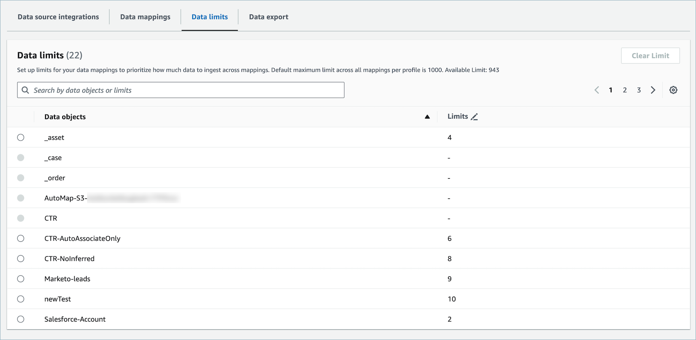
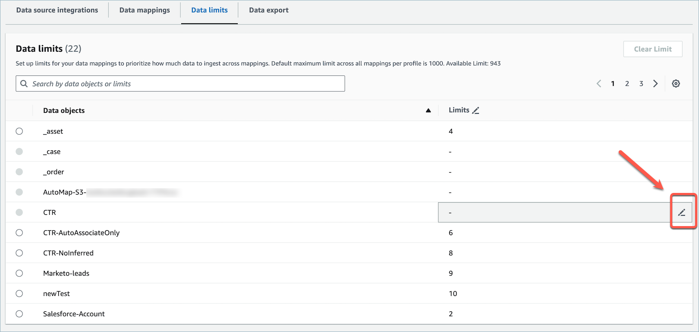
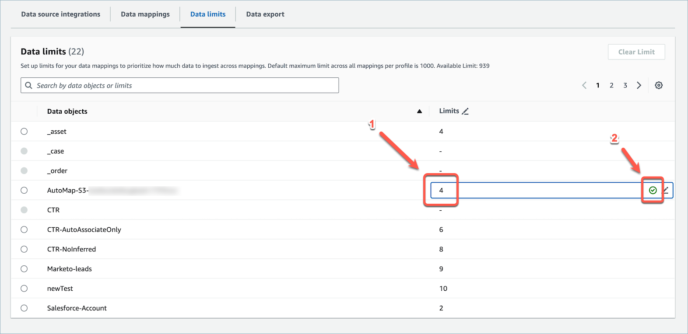
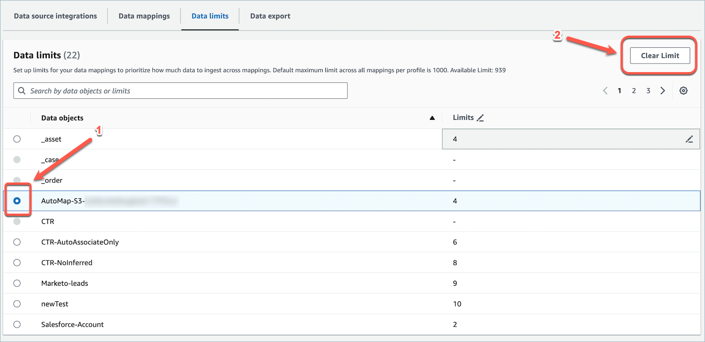
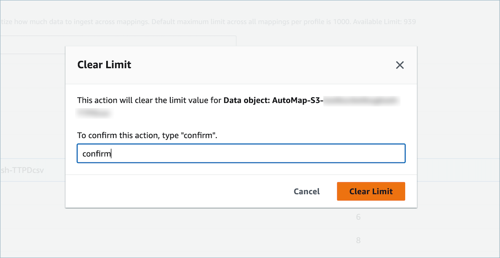

# Amazon Connect Customer Profiles data limits

Amazon Connect Customer Profiles allows you to customize your data onboarding by setting data ingestion
limits on various types of customer data that you use to create a unified profile.
Setting limits on your data mappings enables you to prioritize how much data to
ingest across mappings. The default maximum limit across all mappings per profile is 1000.

###### Note

Data limits are estimates and may vary slightly, with a possible deviation of
a few units in either direction during periods of high ingestion on a single
profile.

## How to configure Customer Profiles

data limits

1. Open the Amazon Connect Customer Profiles console.
2. Choose the **Data limits** tab to configure limits
   for data objects.

 3. Hover over the desired data object's limit and choose the edit
icon.

 4. Enter the limit and choose the check-mark icon to save or update the
limit.

## How to clear Customer Profiles data

limits

1. Select the radio button for the data object whose limit you want to
   clear. You will then be able to choose **Clear
   limit**.

 2. Type _confirm_ to clear the limit value of the data
object that you selected.

