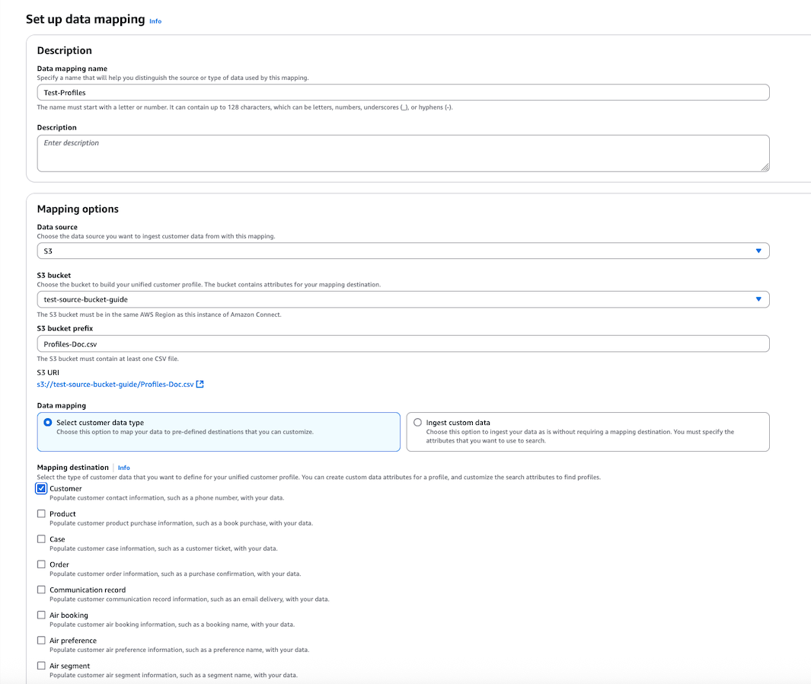
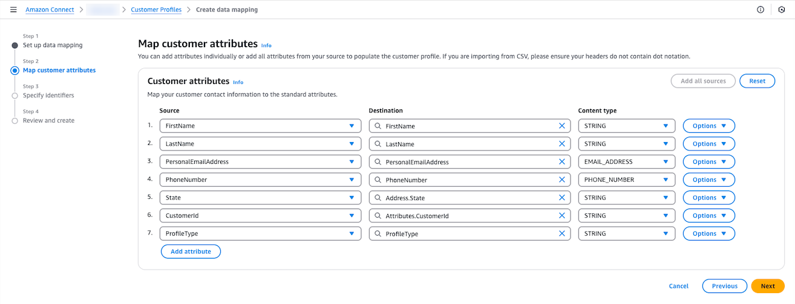
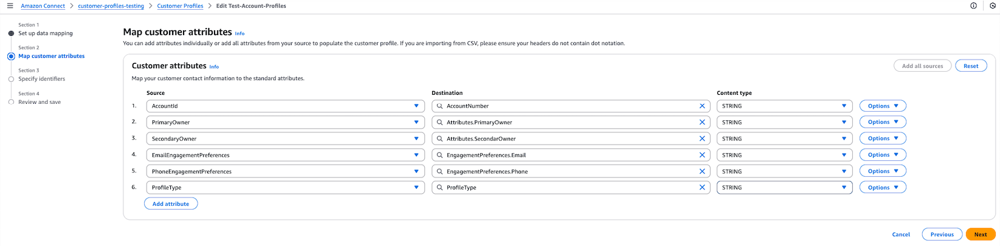

# Create and ingest customer data

into Customer Profiles

You can define data from any source using Amazon S3 and seamlessly enrich a customer
profile without the need for custom or pre-built integrations. For example, say you want
to provide agents with relevant purchase history information. You can import purchase
transaction data from an internal application into a spreadsheet file on S3 and then
link it to a customer profile.

To set this up, you need to define an [object type mapping](customer-profiles-object-type-mapping.md "customer-profiles-object-type-mapping.md") that
describes what the custom profile object looks like. This mapping defines how fields
from your data can be used to either populate fields in the standard profile or how it
can be used to assign the data to a specific profile.

After you create the object type mapping, you can use the [PutProfileObject](../../../customerprofiles/latest/APIReference/API_PutProfileObject.md "../../../customerprofiles/latest/APIReference/API_PutProfileObject.md") API to upload the custom profile data from your CRM into
the custom profile object.

###### Note

Customer Profiles does not support ingesting data from CSV headers that contain dot
notation.

For a list of the required IAM permissions needed for Customer Profiles to access data from the
Amazon S3 bucket for data mapping, see `PutProfileObject` in the table in [Actions defined by Amazon Connect Customer Profiles](../../../service-authorization/latest/reference/list_amazonconnectcustomerprofiles.md#amazonconnectcustomerprofiles-actions-as-permissions "../../../service-authorization/latest/reference/list_amazonconnectcustomerprofiles.md#amazonconnectcustomerprofiles-actions-as-permissions").

## Customer

Profile ingestion

###### Ingesting account-based profiles

1. Upload data files to S3. Ingestion for profiles referenced in
   account-profiles and the account-profiles itself should happen
   separately.
2. The new file used for account-profile ingestion should include new
   attributes: profile type and engagement preferences for email and
   phone.
3. Ingest files from S3 to Customer profile by using AWS console

**Sample Profiles (referenced in the following
account-based profiles) CSV**

| FirstName | LastName | PersonalEmailAddress | PhoneNumber | State | CustomerId | ProfileType |
| --------- | -------- | -------------------- | ----------- | ----- | ---------- | ----------- |
| Sam       | Joe      | sam@example.com      | 1111111111  | WA    | 456        | PROFILE     |
| John      | Doe      | john@example.com     | 2222222222  | IL    | 789        | PROFILE     |
| Sally     | Doe      | sally@example.com    | 3333333333  | OR    | 111        | PROFILE     |

**Sample account-based profiles CSV**

| AccountId | ProfileType     | PrimaryOwner | SecondaryOwner | EmailEngagementPreferences                                                                                                                                      | PhoneEngagementPreferences                                                                                                                    |
| --------- | --------------- | ------------ | -------------- | --------------------------------------------------------------------------------------------------------------------------------------------------------------- | --------------------------------------------------------------------------------------------------------------------------------------------- |
| ACC111    | ACCOUNT_PROFILE | Sam Joe      | John Doe       | [{"KeyName":"CustomerId","KeyValue":"456","ContactType":"PersonalEmailAddress"},{"KeyName":"CustomerId","KeyValue":"789","ContactType":"PersonalEmailAddress"}] | [{"KeyName":"CustomerId","KeyValue":"456","ContactType":"PhoneNumber"},{"KeyName":"CustomerId","KeyValue":"789","ContactType":"PhoneNumber"}] |
| ACC112    | ACCOUNT_PROFILE | John Doe     | Sally Doe      | [{"KeyName":"CustomerId","KeyValue":"111","ContactType":"PersonalEmailAddress"}]                                                                                | [{"KeyName":"CustomerId","KeyValue":"111","ContactType":"PhoneNumber"}]                                                                       |

**Example of engagement preferences with
Email**:

```

[
 {"KeyName": "CustomerId", "KeyValue": "456", "ContactType": "PersonalEmailAddress"},
 {"KeyName": "CustomerId", "KeyValue": "789", "ContactType": "PersonalEmailAddress"}
]

```

**Example of engagement preferences with
Phone**:

```

[
 {"KeyName": "CustomerId", "KeyValue": "456", "ContactType": "PhoneNumber"},
 {"KeyName": "CustomerId", "KeyValue": "789", "ContactType": "PhoneNumber"}
]

```

###### Note

For **ProfileType**
`PROFILE`, you can ingest and add engagement preferences
using the same method. 4. Create two data mappings - one for sub-profiles and one for account-based
profiles.

 5. Next, map customer profile attributes. Note the destination called
`ProfileType`.



**Sample object-type mapping for ingesting profiles
referenced in account-based profiles**

```

{
    "AllowProfileCreation": true,
    "Description": "Standard Profile Object Type",
    "Fields": {
        "FirstName": {
            "ContentType": "STRING",
            "Source": "_source.FirstName",
            "Target": "_profile.FirstName"
        },
        "LastName": {
            "ContentType": "STRING",
            "Source": "_source.LastName",
            "Target": "_profile.LastName"
        },
        "PhoneNumber": {
            "ContentType": "PHONE_NUMBER",
            "Source": "_source.PhoneNumber",
            "Target": "_profile.PhoneNumber"
        },
        "PersonalEmailAddress": {
            "ContentType": "EMAIL_ADDRESS",
            "Source": "_source.PersonalEmailAddress",
            "Target": "_profile.PersonalEmailAddress"
        },
        "State": {
            "ContentType": "STRING",
            "Source": "_source.State",
            "Target": "_profile.Address.State"
        },
        "CustomerId": {
            "ContentType": "STRING",
            "Source": "_source.CustomerId",
            "Target": "_profile.Attributes.CustomerId"
        },
        "ProfileType": {
            "ContentType": "STRING",
            "Source": "_source.ProfileType",
            "Target": "_profile.ProfileType"
        }
    },
    "Keys": {
        "CustomerId": [
            {
                "FieldNames": [
                    "CustomerId"
                ],
                "StandardIdentifiers": [
                    "PROFILE",
                    "UNIQUE"
                ]
            }
        ]
    }
}

```

6. Repeat the process to ingest account-based profiles. Note
   EngagementPreferences.Email and EngagementPreference.Phone.



**Sample object-type mapping for ingesting account
based profiles**

```

{
    "AllowProfileCreation": true,
    "Description": "Account-based profiles Object Type",
    "Fields": {
        "AccountNumber": {
            "ContentType": "STRING",
            "Source": "_source.AccountId",
            "Target": "_profile.AccountNumber"
        },
        "PrimaryOwner": {
            "ContentType": "STRING",
            "Source": "_source.PrimaryOwner",
            "Target": "_profile.Attributes.PrimaryOwner"
        },
        "SecondaryOwner": {
            "ContentType": "STRING",
            "Source": "_source.SecondaryOwner",
            "Target": "_profile.Attributes.SecondaryOwner"
        },
        "ProfileType": {
            "ContentType": "STRING",
            "Source": "_source.ProfileType",
            "Target": "_profile.ProfileType"
        },
        "EmailEngagementPreferences": {
            "ContentType": "STRING",
            "Source": "_source.EmailEngagementPreferences",
            "Target": "_profile.EngagementPreferences.Email"
        },
        "PhoneEngagementPreferences": {
            "ContentType": "STRING",
            "Source": "_source.PhoneEngagementPreferences",
            "Target": "_profile.EngagementPreferences.Phone"
        }
    },
    "Keys": {
        "Account": [
            {
                "FieldNames": [
                    "AccountNumber"
                ],
                "StandardIdentifiers": [
                    "PROFILE",
                    "UNIQUE"
                ]
            }
        ]
    }
}

```

7. Create two data source integration that will each create a mapping based
   off the relationship described. For example, accounts/profiles.

###### Note

- Ingesting account-based profiles should only happen after verifying
  successful ingestion of profiles referenced in account-based profiles by
  using the [SearchProfiles](../APIReference/API_connect-customer-profiles_SearchProfiles.md "../APIReference/API_connect-customer-profiles_SearchProfiles.md") API or Profile metrics in the Amazon Connect Customer Profiles
  console.
- Auto-generate mapping doesn't work for ingesting account-based
  profiles and it's sub-profiles.
- Email and phone list of contact preferences can either have
  `KeyName` and `KeyValue` or
  `ProfileId` to reference child profiles.
  `KeyName` should be the unique identifier.
- Updates to sub-profiles doesn't update the engagement preferences in
  account-based profiles. Updates have to be through ingestion
  path.
