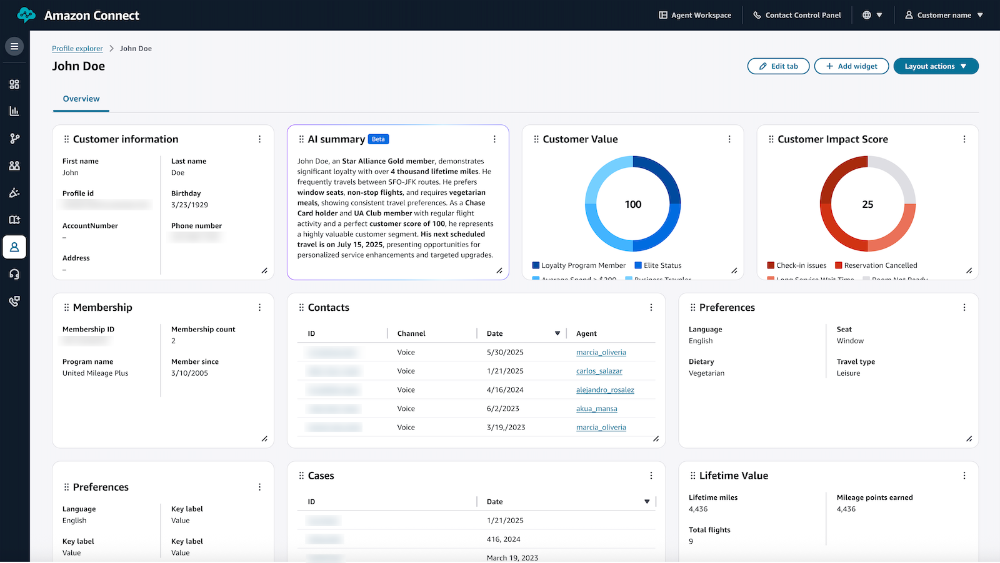

# Set up Profile explorer in

Amazon Connect Customer Profiles

Amazon Connect Customer Profiles Explorer is a dynamic, all-in-one dashboard that provides a comprehensive 360°
view of your customers. It unifies fragmented customer data and allows organizations to
customize data displays, track interactions, and transform customer information into
actionable insights that drive business value and customer loyalty. Organizations in
industries like travel and hospitality can use Profile explorer to better understand and
engage with their customers through this intuitive interface.

- **Find customers instantly** using multiple
  identifiers simultaneously (email, phone, booking reference etc.) with real-time
  search results.
- **Customize views** to prioritize the most relevant
  information for specific business needs, design a domain-specific layout that
  highlights the most relevant customer data defined by you.
- **Access complete customer context** including
  demographic data, communication history, behavioral interactions, and segment
  membership with interactive visualizations and data displays.
- **Leverage AI-powered insights** with customer
  summaries highlighting key patterns, and personalized behavioral inferences.

###### Contents

- [Enable Profile explorer](enabling-profile-explorer.md "enabling-profile-explorer.md")
- [Get started](getting-started-profile-explorer.md "getting-started-profile-explorer.md")
- [Layout definition](layout-definition.md "layout-definition.md")
- [Add Profile explorer to the
  agent workspace](add-profileexplorer-to-agentworkspace.md "add-profileexplorer-to-agentworkspace.md")
