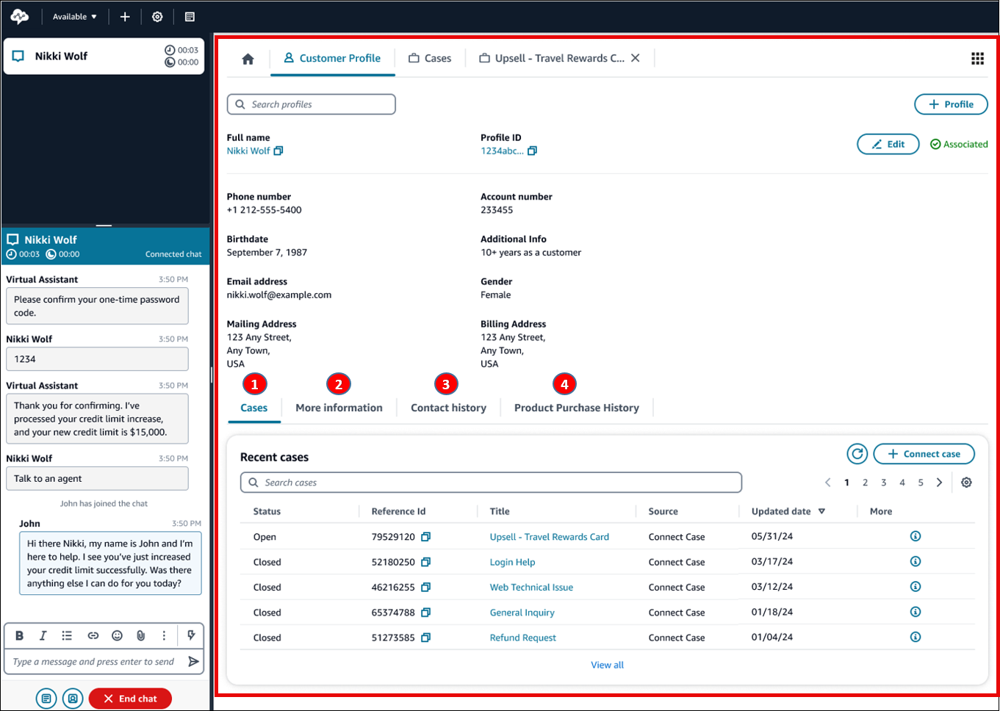

# Use Amazon Connect Customer Profiles

To help agents deliver more efficient and personalized customer service, Amazon Connect enables you
to combine information from external applications, such as Salesforce, Zendesk, ServiceNow,
or other Customer relationship management (CRM) products, with contact history from Amazon Connect. This creates a customer profile that has all the information agents need
during customer interactions in a single place.

With a single view of customer information including their product, case, and contact
history, agents can quickly confirm the customer's identity and determine the reason for the
call or chat.

Currently,
Amazon Connect Customer Profiles can be used in compliance with [GDPR](https://aws.amazon.com/compliance/gdpr-center "https://aws.amazon.com/compliance/gdpr-center")
and is pending additional certifications held by
Amazon Connect.

The following image shows the agent workspace; for the purposes of this documentation, an
Amazon Connect Customer Profiles image is featured. The agent workspace is designed for efficient
multi-tasking, enabling simultaneous handling of calls, chats, and tasks, while providing
quick access to customer profile information all within the same browser window.

1. **Cases**: Status, reference Id, title, source, updated date, and
   more information related to cases ingested from 3P application such as Zendesk and
   ServiceNow, in addition to cases created and managed using Amazon Connect
   Cases.
2. **More information**: Additional information contained in the
   customer defined _Attributes_ field of [the
   profile](standard-profile-definition.md "standard-profile-definition.md"), as well as further profile information such as cell phone
   number and shipping address. This information will be sorted alphabetically to help
   an agent quickly locate the information they need.
3. **Contact history**: Date, times, and duration when this customer
   contacted your contact center in the past.
4. **Product purchase history**: All the assets purchased by a
   customer can be populated here. The data is ingested from an external app such as
   Salesforce or Zendesk that you've [integrated](integrate-external-apps-customer-profiles.md "integrate-external-apps-customer-profiles.md") with
   Customer Profiles.
