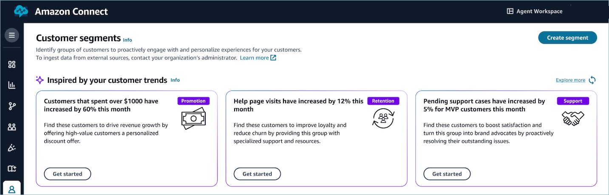
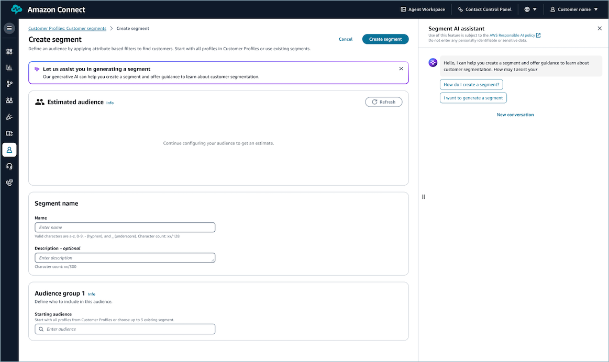
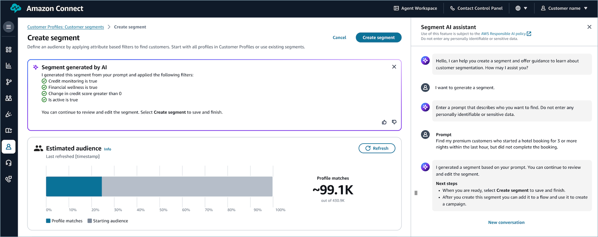
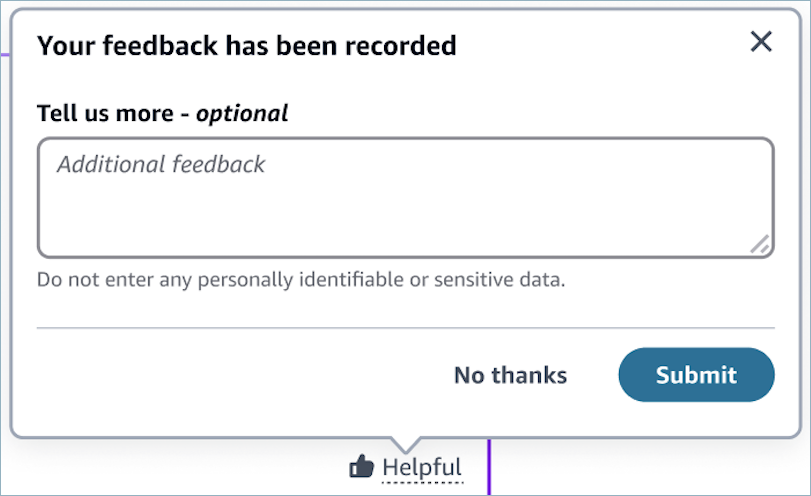
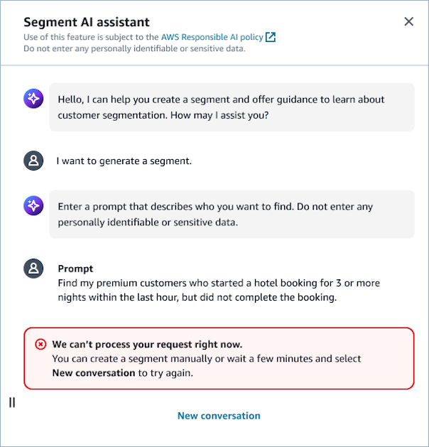

# Use the segment AI assistant in

Amazon Connect

Amazon Connect Customer Profiles supports generative AI-powered segmentation, enabling non-technical
business users to build audiences using natural language queries ([segment AI assistant](#generating-a-segment-by-prompt "#generating-a-segment-by-prompt")), and to
receive recommendations based on trends in the customer data ([inspiration cards for segment
creation](#inspiration-cards-for-segment-creation "#inspiration-cards-for-segment-creation")). These capabilities leverage advanced AI algorithms from [Amazon Bedrock](https://aws.amazon.com/bedrock/ "https://aws.amazon.com/bedrock/") that help you improve
customer satisfaction and drive revenue through proactive and personalized
outreach. For example, you can create a segment of customers who reached out to
customer support frequently last week with personalized service offers. You can also
identify customers whose total spending increased and offer personalized
discounts, fostering loyalty and also driving growth.

The following benefits are added by incorporating generative AI into the
segmentation workflow:

- **Simplified segment creation**: Build complex
  customer segments using conversational language, making the process
  accessible to non-technical users and driving the efficiency.
- **Data-driven segment creation inspirations**:
  Receive AI-empowered segment inspirations based on trends in the customer
  data.
- **Enhanced personalization:** Easily identify
  and target specific customer groups for tailored communications and offers.
  The following sections explain each feature, how to use them, and the benefits
  they provide to help you improve your customer segmentation efforts.

###### Note

- To use the segment AI assistant, users will need the permission for
  segment creation **CustomerProfiles.Segments.Create**.
- While these AI-powered tools offer valuable suggestions, it's
  important to review and adjust the recommended segments to ensure they
  align with the organization's specific business objectives and comply
  with its data usage policies.

## Inspiration Cards for

Segment Creation

Inspiration Cards are an AI-powered feature on the **Customer
segments** page. They simplify and enhance the segment creation
process. The following image shows an example of three inspiration cards.

These cards generate up to three categories of segment ideas each time, based
on the Amazon Connect Customer Profile data to inspire and streamline your segment
creation process. 

###### Note

The trend data is based on event ingestion dates of default calculated
attributes.

**Key features**

- **Data-driven inspirations**: Each
  inspiration card presents a segment idea tailored to specific customer
  data and trends.
- Inspiration cards offer ideas across three business-focused themes:
  - **Promotion**: Ideas for targeting
    customers with specific promotional strategies.
  - **Retention**: Identify segments
    for customer retention efforts.
  - **Support**: Highlight customer
    groups that may need specialized attention for customer service.

- **Insight-based recommendations**: Leverage
  historical trends, data insights and generative AI to create meaningful,
  actionable insights.

**How to use inspiration cards**

1. Navigate to the **Customer segments** page.
2. Locate the inspiration cards section. It displays three segment
   suggestions.
3. Review each card to understand the proposed segment and its potential
   applications.
4. When you find a card you want to use, choose **Get
   started** on that card.
5. Choose **Explore more** to generate additional
   inspiration cards. These can offer fresh segment ideas based on your
   Amazon Connect Customer Profiles data.
6. When you choose **Get started**, you are
   automatically directed to the **Create Segment** page.
7. Your selected segment idea is populated in the segment builder, ready
   for your review and refinement.

## Generate a segment by using

natural language prompts

The segment AI assistant offers a guided approach to creating segments using
natural language prompts, which simplifies the process of creating complex
segments, allowing you to describe your target audience in natural language and
receive a structured, actionable segment definition.

The following image shows an example of a segment AI assistant prompt.

**To access this feature:**

1. Navigate to the **Customer segment** page, and then
   choose **Create segment**.
2. Locate the segment AI assistant panel on the right side of the page,
   as shown in the following image.

**Use the segment AI assistant**

1. The assistant guides users through a series of questions to
   understand segmentation needs, all interaction paths with the assistant
   lead to generating a prompt.
2. Users can provide a textual description of the desired segment.
3. The prompt action step offers sample prompts as references for
   writing detailed descriptions.
4. Based on your input, Amazon Connect generates a structured segment definition.
5. The generated segment definition is automatically applied to the
   segment builder.
6. You can further refine the generated segment using the standard
   segment builder tools. Modifying the filters on the segment builder
   overwrites the existing conditions previously generated.
7. After reviewing the generated segment and making any necessary
   adjustments, you can finalize the process by choosing **Create
   segment**. This action saves your segment and makes it
   available for use in your campaigns.

**Best practices**

As you use the segment AI assistant, keep the following best practices in
mind:

- Write specific descriptions. Segment AI assistant generates more
  accurate conditions when you use the names of existing attributes.
- Ensure that all attributes you reference exist in your domain.
- Start with simple prompts and try different prompts. If you don't
  receive what you want on the first try, rewrite your prompt. Submitting
  a new prompt replaces existing conditions, or by choosing **New
  conversation**.
- Allocate time for segment refinement and validation on the segment
  builder to ensure segments accurately reflect your actual data values.

###### Note

The segment AI assistant is designed to work with general descriptors and
criteria. Always adhere to data protection regulations and company policies
when describing segments. Ensure that your prompts and descriptions do not
contain any sensitive or personal information. 

## Provide feedback on

generated segments

After a segment is generated, users are encouraged to evaluate the feature's
performance and provide feedback. This feedback mechanism helps improve the
segment generation process and ensures it meets business needs effectively. The
following image shows a feedback page.

The feedback process consists of two stages:

1. **Initial reaction**: In the bottom right
   corner of the alert section, you'll find thumbs up and thumbs down
   icons. Click on either of these to indicate your general satisfaction
   with the generated segment.
2. **Additional feedback**: After selecting
   either the thumbs up or thumbs down icon, you are presented with an
   option to provide more detailed feedback. This takes the form of a text
   input field where you can leave free-form comments.

We encourage you to use both the quick reaction (thumbs up/down) and the text
input for a comprehensive evaluation, provide specific examples or use cases
when applicable, focus on how the generated segment aligns with business
objectives, and suggest improvements or additional features that would enhance
the segment generation process.

Suggest improvements or additional features that would enhance the segment
generation process.

By actively participating in the feedback process, users contribute to the
continuous improvement of the segment generation feature, ultimately leading to
more effective customer segmentation and targeted marketing strategies.

## Error handling

When using the segment AI assistant to generate customer segments, you may
occasionally encounter an error message stating: **We can't process your
request right now.** This error can occur even after providing a
valid prompt for segment creation.

The following image shows an example of this error message.

Use the following steps help you understand and troubleshoot this
error.

**Possible causes:**

- **High system load**: The segment AI
  assistant may be experiencing high demand or processing multiple
  requests simultaneously.
- **Temporary service disruption**: There
  could be a brief interruption in the service's ability to process new
  segment requests.
- **Complex query**: The system might need
  more time to process particularly complex or resource-intensive segment
  queries.

**What to do:**

- **Wait and retry**: The error message
  suggests waiting a few minutes before trying again. This allows time for
  the system to resolve any temporary issues.
- **Create a segment manually**: If you need
  the segment immediately, you can opt to create it manually using the
  segment builder

**How to retry:**

1. Wait for a few minutes.
2. Choose **New conversation** at the bottom of the
   chat interface.
3. Start a new conversation and re-enter your segment creation prompt.

**Best practices**

- If the error persists after multiple attempts, consider simplifying
  your segment criteria or breaking it down into smaller, more manageable
  requests.
- Try to avoid making repeated requests in quick succession, as this
  may contribute to system overload.
- If the issue continues, reach out to customer support for further
  assistance.

Remember, this error is typically temporary, and following the provided
instructions should allow you to successfully create your desired segment.

## Known

limitations

Understanding the data processing lifecycle is crucial for effective use of
the segment AI assistant. This section outlines what business users can expect
during different phases of data integration and how it affects segment
suggestions.

**Data processing and quality impact:** Segment AI
assistant evolves through two main phases: initial data ingestion and
post-processing. During initial ingestion, the system may not fully utilize
actual attribute values, relying more on prompt interpretation. For example, a
prompt for _VIP customers_ might suggest a
_VIP_ segment instead of using the existing
_Gold_ tier from your data. After complete processing,
the system leverages actual attribute values, resulting in more accurate segment
creation, reduces reliance on prompt interpretation and improves overall
segmentation quality.

###### Note

Allow sufficient time for complete data processing before relying on
advanced features. Regularly update customer profile data. Segment accuracy
depends on the completeness and recency of customer data in Amazon Connect Customer
Profiles. The system flags any missing attributes in its responses.

**System performance:**During high-volume periods,
expect potential delays in segment generation. The system is optimized for
typical workloads, but businesses with extensive segmentation needs may need to
adjust their processes accordingly.

**Attribute availability**: The quality of the
generated segments is dependent on the customer data available in Amazon Connect Customer Profiles. The
more comprehensive and up-to-date the customer profile data, the more accurate
the system can be in interpreting prompts and defining relevant segments. If
there is an attribute that does not exist, we will return a message with the
missing attribute. 

**Prompt complexity**: For very complex or nuanced
segment definitions, the natural language processing may have limitations.
Customers should start with relatively straightforward prompts and gradually
increase the complexity as they gain experience with the feature.

**Segment refinement**: Although the
system-generated segments are a great starting point, customers may still want
to review and refine the details to ensure the segment aligns perfectly with
their business objectives. The segmentation interface allows for full
customization after the initial generation.

**Performance and scaling**: Under high
concurrency, there may be some latency in the segment generation process as the
language model needs to process each prompt. The system is designed to handle
typical segmentation workloads, but customers with extremely high segmentation
demands may need to adjust their workflows accordingly
