# Build customer segments in

Amazon Connect

###### Note

**Segmentation powered by SQL (Beta) requires Data store to be turned on. Please visit Customer Profiles home page screen and enable Data store from the top blue banner**

###### Note

- To navigate to the segmentation builder experience in the Amazon Connect admin website, you
  need security profiles permissions for this feature. For more
  information, see [Assign security
  profile permissions to manage customer segments](security-profile-customer-profile-segmentation.md "security-profile-customer-profile-segmentation.md").
- Before building segments, we recommend your Customer Profiles domain
  setup data integrations to populate profiles in your Customer Profiles
  Domain. For more information on how to configure data integrations with
  Customer Profiles, see [Integrate external
  applications with Amazon Connect Customer Profiles](integrate-external-apps-customer-profiles.md "integrate-external-apps-customer-profiles.md").
- Segments can include events you captured using Calculated Attributes.
  For more information on how to configure custom Calculated Attributes
  and review the default Calculated Attributes Customer Profiles offers,
  see [Set up calculated attributes in
  Amazon Connect Customer Profiles](customerprofiles-calculated-attributes.md "customerprofiles-calculated-attributes.md").
  Amazon Connect provides two ways to build customer segments: 1/ Define segments through
  Spark SQL (Beta; requires Data store to be enabled); 2/ Define segments through
  audience groups and filters (Classic Segmentation). For both, you can use natural
  language prompts via Generative AI-powered Segment AI assistant. If you define
  segments in one of the ways, you move that segment to the other and would have
  to start again.

## Segments powered by Spark SQL

Segments powered by Spark SQL enables you to use complete Customer Profile data and expanded functionality to define segments. You can use standard profile object attributes and custom object attributes. You can also used SQL-based functionality such as joining standard and custom objects together to use data from various objects, filtering segments with statistics such as percentiles and standardizing date fields to make comparisons.

You can start by entering in a natural language prompt into Segment Assistant AI. Segment AI assistant will define the segment including its translation into Spark SQL. Segment Assistant AI will provide the steps it took to define the segment and you can validate it matches what you were aiming to create. You can also view the SQL, the SQL steps in natural language and a AI-generated summary of the Spark SQL to further help validate. If you want to make changes, you can update your natural language prompt or make edits to the Spark SQL directly.

You also have the option to create the Spark SQL segment directly.

**Like Classic segmentation, segments powered by Spark SQL can be used in segment membership calls, Flow blocks and and Outbound Campaigns.**

**When you use a Spark SQL segment in a segment membership call, Flow block or Outbound Campaign initiated by a customer event, it uses the last exported segment (segment snapshot). The segment snapshot used for membership expires 1 year after creation. If you receive a 4XX error, ensure you have exported the segment (segment snapshot).**

**Outbound campaigns initiated by a customer segment does not require you to export the segment (segment snapshot).**

### Step 1: Build a new segment

In the Segment AI assistant, select "How to create a segment" for more guidance on creating valuable segments or "I want to generate a segment" to enter a natural language prompt to create the segment.

Alternatively, use SQL to define a new segment in the query editor.

**Note - if you want to create a timezone based Outbound campaign, you must ensure the timezone attribute is part of the output of the segment**

**Note - if you want to use the segment in Outbound Campaigns, you must ensure the profile IDs in the segment output are unique**

### Step 2: Specify a name and description

For Name, enter a name for the customer segment to make it easy to recognize later.

**Note -** The Amazon Connect admin website uses the entered name as the `DisplayName` of the segment, and generates an identifier based on it. The generated identifier is used as the `SegmentDefinitionName` when you access the segment by using Customer Profiles APIs.

For Description, optionally enter a description for the customer segment.

### Step 3: Review and validate the segment

Review the data the Segment AI assistant used and the steps the AI model it took to generate your segment. You can also review the SQL it created to define the segment in the query editor. If it was not able to create the segment, address the feedback it provided to help it create an accurate segment. Once it has generated a segment, Customer Profiles will automatically create a segment estimate for you.

If you want to make edits, you can provide a new prompt by clicking "New conversation" or create/edit SQL in the query editor.

If you are not using the Segment AI assistant, you can validate the query and create the estimate by clicking on the "Validate and estimate query" button below the query editor.

**Note - segments powered by Spark SQL will take time depending on the amount of profile data you use in the segment and the SQL used, similar to other query engines (e.g., multiple joins across objects takes time).**

### Step 4: Create segment

Once you have build a segment and are satisfied, select "Create segment" button on the top right. Once you have created the segment, you can select Actions - exporting to .csv, using the segment in Flows and using the segment in Outbound Campaigns.

**Note - if you use the segment in Outbound Campaigns or Flow blocks, it will check segment membership based on when the segment was last created. If you need real-time segment membership checks as the Flow or campaign is being executed, use Classic segmentation.**

## Classic segmentation with audience groups and filters

When you create a customer segment, you choose starting audiences and refine that
audiences by choosing the filters that define the segment. For example, you could
create an audience group, then choose a filter of all customers who live in a
specific country and who are frequent callers. Segments are recalculated on demand,
such as during campaign execution, contact flow execution, and segment estimate or
export. As a result, the size and membership of each segment changes over time.

Additionally, you can create a second audience group, and then create a
relationship (AND, OR, or EXCLUDE) between the two audience groups to further narrow
down, concatenate, or exclude customers from the first audience group.

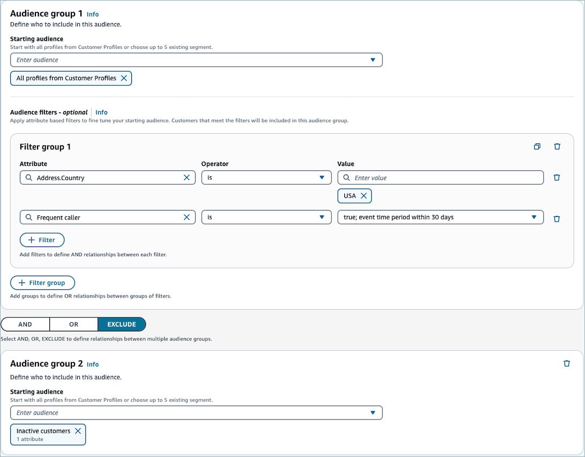

## Audience groups

When you create a customer segment, you create one or more audience groups.
An audience group consists of these components:

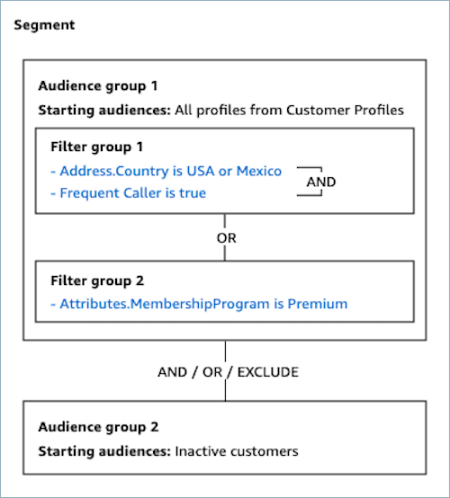

- **Starting audiences**: The customer
  segments that define the initial user population. You can specify up to
  5 starting audiences, or all of the profiles in your Customer Profiles
  domain.
- **Filter groups**: Categories of audience
  information that you apply on top of the starting audiences. You can add
  multiple groups of filters which are connected by OR relationships.
- **Filters**: Filters reduce the audience
  number that belong to the segment. You can add as many filters as you
  want in order to tailor the segment to your needs.

A customer segment has to have at least one audience group, but you can
optionally create a second audience group, and then create a relationship
(AND/OR/EXCLUDE) between the two audience groups. See [Step 5: Add
the second audience group (optional)](#step-5-add-the-second-audience-group-optional "#step-5-add-the-second-audience-group-optional") for more
details about the relationship.

## Creating a customer

segment

The following steps describe creating and configuring a customer segment:

- Step 1: Build a new segment
- Step 2: Configure name and description
- Step 3: Choose the starting audiences to include in audience group 1
- Step 4: Choose and configure the filter groups (optional)
- Step 5: Add audience group 2 (optional)

### Step 1: Build a new

segment

1. To create a segment, ensure that you have created security
   profiles permissions as a prerequisite. For more information,
   see [Assign security
   profile permissions to manage customer segments](security-profile-customer-profile-segmentation.md "security-profile-customer-profile-segmentation.md"). In addition, to best visualize the membership of your segment,
   we recommend data ingestion prior to segment creation. To ingest
   profiles through S3 or external applications, see [Create and ingest customer data
   into Customer Profiles](customer-profiles-object-type-mappings.md "customer-profiles-object-type-mappings.md")
   or [Integrate external
   applications with Amazon Connect Customer Profiles](integrate-external-apps-customer-profiles.md "integrate-external-apps-customer-profiles.md").
2. Choose **Create a segment** in the Customer
   segment table view.

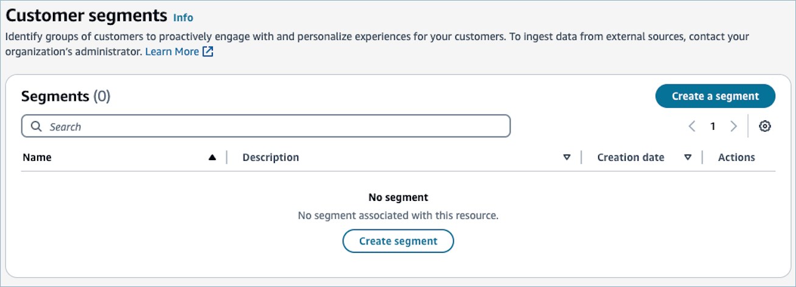

### Step 2:

Specify a name and description

- For **Name**, enter a name for the
  customer segment to make it easy to recognize later.

###### Note

The Amazon Connect admin website uses the entered name as
the `DisplayName` of the segment, and generates an
identifier based on it. The generated identifier is used as the
`SegmentDefinitionName` when you access the
segment by using Customer Profiles APIs.

- For **Description**, optionally
  enter a description for the customer segment.

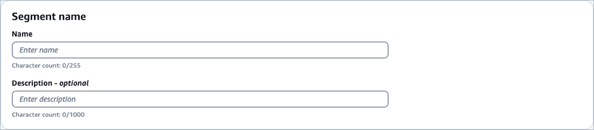

### Step 3: Choose the starting audiences to include in audience group

1

You'll first choose how you want to define the starting audience for the
audience group.

1. Under **Audience group 1**, for the
   **Starting audience** dropdown
   list, select one or more segments to include in the audience group,
   or choose **All profiles from Customer
   Profiles**.

###### Note

When you choose multiple segments as the starting audience,
the segments are connected by `OR` relationships. For
example, if you choose **Premium membership
customers** and **Basic membership
customers** segments as the starting audiences, all
profiles who are in either of the segments will be the included.

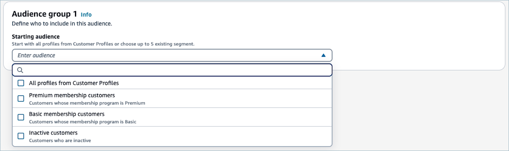 2. To create a segment with ProfileType, start by using **All
Accounts from Customer Profiles** as your initial
audience. This approach allows you to filter account-based profiles
effectively. It's important to note that unless you specify
otherwise, the segmentation process will automatically export all
profiles within the customer profiles domain. This default behavior
ensures comprehensive coverage but can be adjusted to meet specific
targeting needs.

The following is an example of how a segment definition can be
created (either account- or standard-profiles based):

**Filters all account-based profiles
(ProfileType=ACCOUNT_PROFILE)**

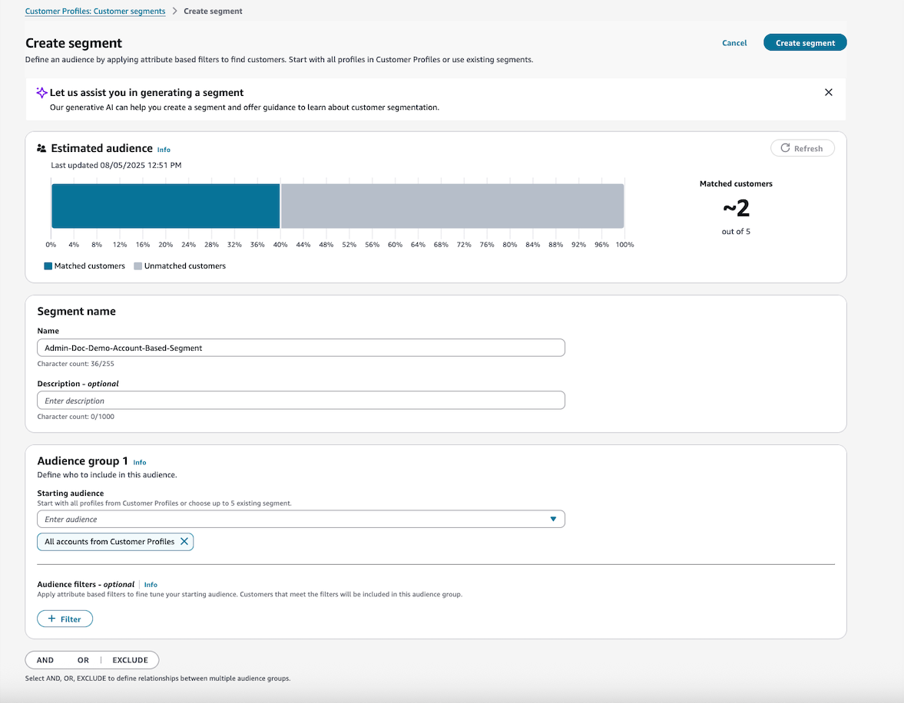

###### Note

To create a segment only with sub-profiles, create a new
audience that excludes account-based profiles. For example,
profiles with `ProfileType` is PROFILE or where
`ProfileType` is empty.

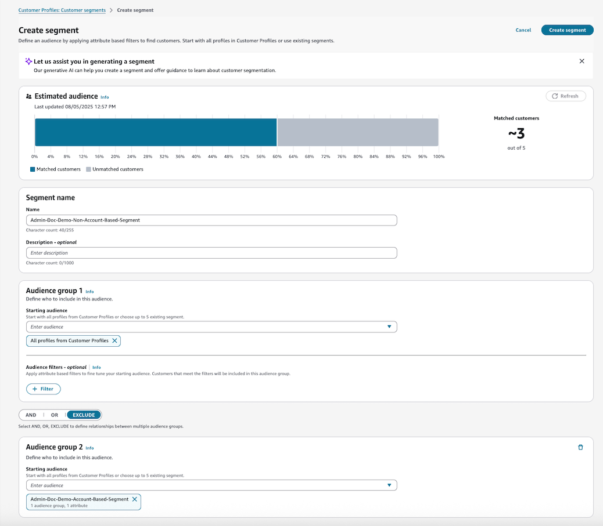

**Sample Campaign that targets accounts to be
reached out by using `Phone`**

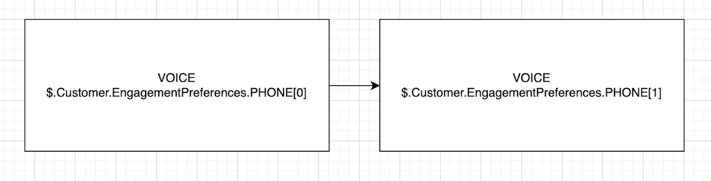

In this example, the campaign targets a single account with the
following call sequence:

    1. First attempts to reach John (ID: 2)
    2. If John doesn't answer, then calls Sally (ID: 3) as a
     backup contact

3. Once you choose a starting audience, the **Estimated audience** section updates to display the
   eligible profiles. Once you edit the audience groups, you can
   click **Refresh** button in the
   Estimated audience section to re-fetch the estimate.

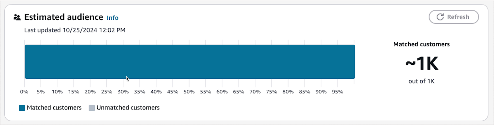

### Step 4:

Choose and apply audience filters (optional)

After you’ve chosen your starting audiences, you can further refine the
audiences by applying conditional logic to attributes. Segments supports
standard profile attributes, custom profile attributes, and calculated
attributes.

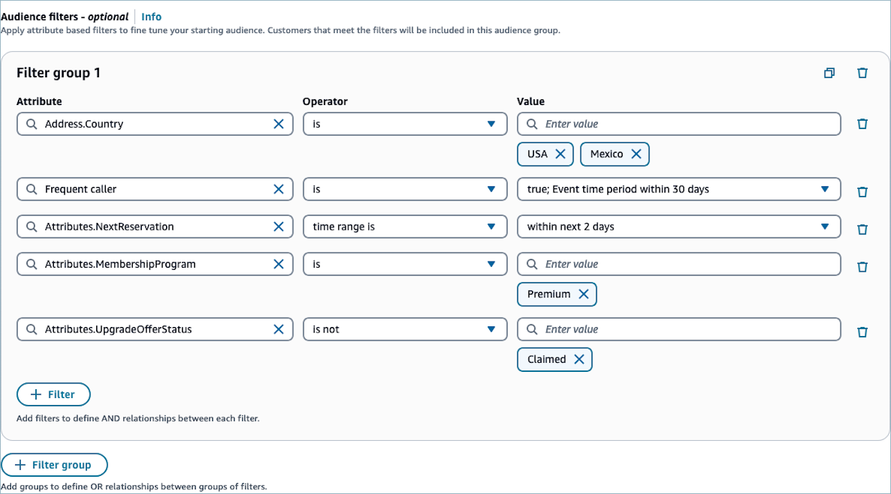

###### To choose and configure the audience filters

1. For **Attribute**, you can choose
   an attribute of the following types
   1. **Calculated attributes** -
      Filter the audience based on one of calculated attributes.

   See [Set up calculated attributes in
   Amazon Connect Customer Profiles](customerprofiles-calculated-attributes.md "customerprofiles-calculated-attributes.md")
   to learn about the default Calculated Attributes and how to
   configure custom Calculated Attributes. 2. **Standard attributes** -
   Filter the audience based on one of standard profile
   attributes.

   See [Standard profile definition in
   the Amazon Connect Customer Profiles](standard-profile-definition.md "standard-profile-definition.md") for the
   list of standard profile attributes. 3. **Custom attributes** -
   Filter the audience based on one of custom profile
   attributes.

   ###### Note

   We store up to 1000 most recent profile attributes
   within the domain. If your domain contains a large
   amount of attributes the oldest attributes may not be
   displayed in this list.

2. Choose the **Operator**. Operators
   determines the relationship of the attribute to a value you enter.
   The following describes the available operators. Available operators
   change based on the type of value of the attribute you selected.

| Supported type of attribute value                                                                                                                                                                                                                                                                                                                                                                                                                                                                    | Operator                                                                                                                                                                                                                                                     | Description                                                                                                                                                                               |
| ---------------------------------------------------------------------------------------------------------------------------------------------------------------------------------------------------------------------------------------------------------------------------------------------------------------------------------------------------------------------------------------------------------------------------------------------------------------------------------------------------- | ------------------------------------------------------------------------------------------------------------------------------------------------------------------------------------------------------------------------------------------------------------ | ----------------------------------------------------------------------------------------------------------------------------------------------------------------------------------------- |
| Number                                                                                                                                                                                                                                                                                                                                                                                                                                                                                               | Greater than                                                                                                                                                                                                                                                 | Used for numeric attributes only. This operator filters results that are greater than the number passed. For example, _Customer’s average hold time_ is greater than 10 seconds. |
| Greater than or equal                                                                                                                                                                                                                                                                                                                                                                                                                                                                                | Used for numeric attributes only. This operator filters results that are greater than or equal to the number passed. For example, Customer’s average hold time is greater than or equal to 10 seconds.                                              |
| Equals                                                                                                                                                                                                                                                                                                                                                                                                                                                                                               | Used for numeric attributes only. This operator filters the audience by numeric value equality. For example, \*Customer’s average hold time • equals 10 seconds.                                                                                 |
| Less than                                                                                                                                                                                                                                                                                                                                                                                                                                                                                            | Used for numeric attributes only. This operator filters results that are less than the number passed. For example, \*Customer’s average hold time • is less than 10 seconds.                                                                     |
| Less than or equal                                                                                                                                                                                                                                                                                                                                                                                                                                                                                   | Used for numeric attributes only. This operator filters results that are less than or equal to the number passed. For example, _Customer’s average hold_ time is less than or equal to 10 seconds.                                                  |
| String                                                                                                                                                                                                                                                                                                                                                                                                                                                                                               | Is                                                                                                                                                                                                                                                           | Filters the audience the matches to the given string. For example, customer’s _Address.Country_ is USA.                                                                             |
| Is not                                                                                                                                                                                                                                                                                                                                                                                                                                                                                               | Filters the audience that does not match a given string. For example, customer’s _Address.Country_ is not USA.                                                                                                                                         |
| Contains                                                                                                                                                                                                                                                                                                                                                                                                                                                                                             | Use this to filter the audience based on a substring within a string. For example, if you have a filter for \*Address.Country • attribute, you could pass the US to return US or USA.                                                            |
| Begind with                                                                                                                                                                                                                                                                                                                                                                                                                                                                                          | Filters the audience whose attribute begins with the given string. For example, customer’s \*Address.Country • begins with US.                                                                                                                      |
| Ends with                                                                                                                                                                                                                                                                                                                                                                                                                                                                                            | Filters the audience whose attribute ends with the given string. For example, customer’s EmailAddress ends with @amazon.com.                                                                                                                           |
| Date                                                                                                                                                                                                                                                                                                                                                                                                                                                                                                 | Before                                                                                                                                                                                                                                                       | Filters the audience whose attribute has a date value that is before a specific date. For example, customer’s whose \*Attributes.NextReservation • is before 2024/10/01.      |
| On                                                                                                                                                                                                                                                                                                                                                                                                                                                                                                   | Filters the audience whose attribute value matches with a specific date. For example, customer’s whose \*Attributes.NextReservation • is on 2024/10/01.                                                                                          |
| After                                                                                                                                                                                                                                                                                                                                                                                                                                                                                                | Filters the audience whose attribute has a date value that is after a specific date. For example, customer’s whose \*Attributes.NextReservation • is after 2024/10/01.                                                                           |
| Time range is                                                                                                                                                                                                                                                                                                                                                                                                                                                                                        | Filters the audience whose attribute has a date value that is between a specific time range. You can either specify the time range in absolute time mode or relative time mode.                                                                     |
| **Absolute time mode**: allows you to specify an absolute time range. For example, between 2024/10/01 12:00 AM and 2024/10/07 12:00 AM.                                                                                                                                                                                                                                                                                                                                                        |
| **Relative time mode**: allows you to specify the relative time range of furture or past X hours, days, weeks, months, or years. • Future time direction: will filter audience whose attribute has a date value that is between now and a speficied future time. For example, within the next 2 days. • Past time direction: will filter audience whose attribute has a date value that is between a speficied past time and now. For example, within the last 2 days. |
| Time range is not                                                                                                                                                                                                                                                                                                                                                                                                                                                                                    | Filters the audience whose attribute has a date value that is not between a specific time range. You can either specify the time range in absolute time mode or relative time mode. See "Time range is" operator in this table for more details. |

###### Note

Customer segments in the Amazon Connect admin website uses UTC
timezone and a default time of 00:00:00 UTC for all time-based
filters. You can filter on dates but times are recorded as the same
value. If you enter a date of 2024-01-01, the console passes the time as
2024-01-01T00:00:00Z.

###### Note

When you specify a filter for a calculated attribute, you can override
the time period of the calculated attribute definition. For example, the
filter `Frequent caller is true for the event time period of 60
 days` will override the _Frequent caller_
[Default calculated
attributes in Amazon Connect Customer Profiles](customerprofiles-default-calculated-attributes.md "customerprofiles-default-calculated-attributes.md") to
evaluate the value within the past 60 days instead of the [time period
configured in the calculated attribute definition](customerprofiles-calculated-attributes-apis.md "customerprofiles-calculated-attributes-apis.md"). This
override is specific to the segment, and does not affect the calculated
attribute definition itself.

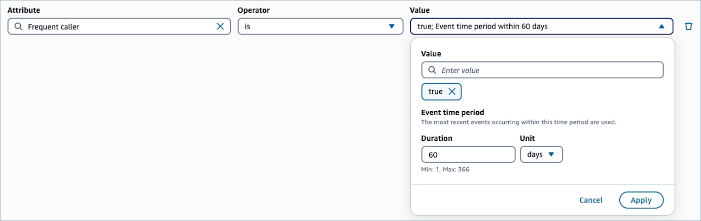

1. Specify the Value. You can specify multiple values connected by
   `OR` relationships. For example,
   `Address.Country` is `USA` or
   `Mexico`. The value input shows suggestions in the
   dropdown for string operators based on the customer profiles stored
   in the domain.

###### Note

Values are case-sensitive. For example,
_Address.Country is US_ returns different
results than _Address.Country is us_.

1. (Optional) To apply additional attributes to this filter group,
   choose **+ Filter**. To create
   another group of filters, choose **+
   Group**.

###### Note

When you have multiple filters in a filter group, the filters are
connected by AND relationships. For example, a filter group containing 2
filters, “_Address.Country_ is USA” and
“_Customer’s average hold time_ is more than 10
seconds”, the profiles whose _Address.Country_ is USA
**and**
_average hold time_ is more than 10 seconds will
belong to the segment.

When you have multiple filter groups in an audience group, Customer
segments in the Amazon Connect admin website use OR relationships to connect between the filter
groups.

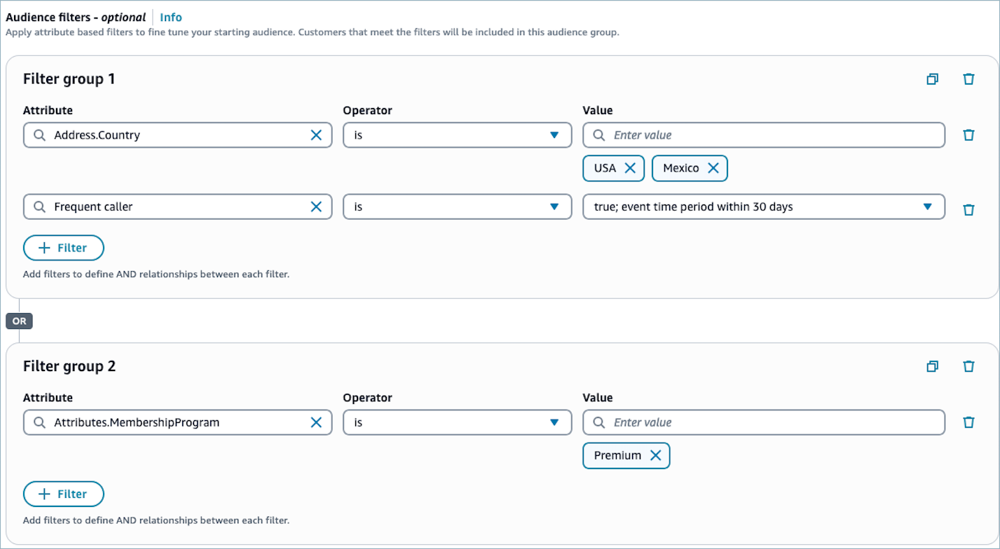

1. When you’re finished setting up the audience group,
   choose **Create segment**.

### Step 5: Add

the second audience group (optional)

Optionally add the second audience group and define a relationship with
audience group 1. When you create a customer segment by using the Amazon Connect admin website, you
can have a maximum of two audience groups per segment. If you add a second
audience group to your segment, you can choose one of two ways to specify
how the two audience groups are connected:

- **AND relationship** — If you use AND
  relationship to connect two audiences, your segment contains all
  profiles who meet the filters of both Audience group 1 and Audience
  group 2.
- **OR relationship** — If you use OR
  relationship to connect two audiences, your segment contains all
  profiles who meet the filters of either Audience group 1 or Audience
  group 2.
- **EXCLUDE relationship** — If you use
  EXCLUDE relationship to connect two audiences, the segment will
  contain profiles in Audience group 1 excluding the profiles in
  Audience group 2.

###### To configure second audience group

1. Choose **AND**, **OR**, or **EXCLUDE** relationship after configuring Audience
   group 1.

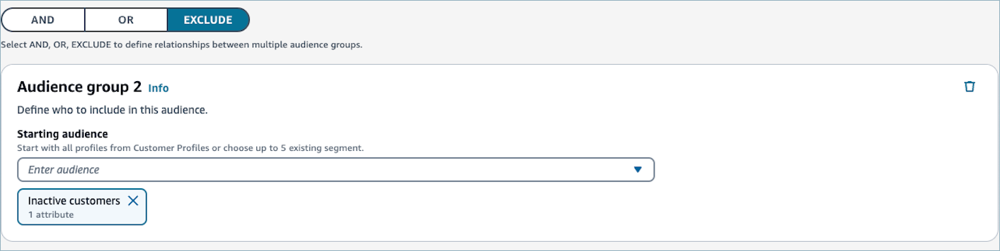 2. Choose the starting audience in Audience group 2. For reference,
see [Step 3: Choose the starting audiences to include in audience group
1](#step-3-choose-the-starting-audiences-to-include-in-audience-group "#step-3-choose-the-starting-audiences-to-include-in-audience-group"). 3. (Optional) Choose the filters by which you want to narrow down
your segments. For reference, see [Step 4:
Choose and apply audience filters (optional)](#step-4-choose-and-apply-audience-filters-optional "#step-4-choose-and-apply-audience-filters-optional") 4. When you finish setting up the segment, choose **Create segment**. Segment is created and
you can now use the segment in outbound campaigns or flows.

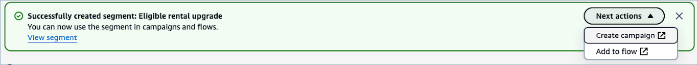

## Creating segments powered by Spark SQL

Segments powered by Spark SQL enables you to use complete Customer Profile
data and expanded functionality to define segments. You can use standard profile
object attributes and custom object attributes. You can also used SQL-based
functionality such as joining standard and custom objects together to use data
from various objects, filtering segments with statistics such as percentiles and
standardizing date fields to make comparisons.

You can start by entering in a natural language prompt into Segment Assistant
AI. Segment AI assistant will define the segment including its translation into
Spark SQL. Segment Assistant AI will provide the steps it took to define the
segment and you can validate it matches what you were aiming to create. You can
also view the SQL, the SQL steps in natural language and a AI-generated summary
of the Spark SQL to further help validate. If you want to make changes, you can
update your natural language prompt or make edits to the Spark SQL directly.

You also have the option to create the Spark SQL segment directly.

Segments powered by Spark SQL can be used in segment membership calls, Flow
blocks and Outbound Campaigns. They check the segment as of the last time the
segment was created (segment snapshot). If you receive a 4XX error, you will
have execute the segment snapshot.

###### Note

**SQL segmentation runs on Data store which has up to
10 years data. Classic segmentation uses latest data (data updated in
past 3 years)**

### Step 1: Build a new segment

In the Segment AI assistant, select “How to create a segment” for more
guidance on creating valuable segments or “I want to generate a segment” to
enter a natural language prompt to create the segment.

Alternatively, use SQL to define a new segment in the query editor.

### Step 2: Specify a name and description

For Name, enter a name for the customer segment to make it easy to
recognize later.

###### Note

The Amazon Connect admin website uses the entered name as the
`DisplayName` of the segment, and generates an
identifier based on it. The generated identifier is used as the
`SegmentDefinitionName` when you access the segment by
using Customer Profiles APIs.

For Description, optionally enter a description for the customer
segment.

### Step 3: Review and validate the segment

Review the data the Segment AI assistant used and the steps the AI model
it took to generate your segment. You can also review the SQL it created to
define the segment in the query editor. If it was not able to create the
segment, address the feedback it provided to help it create an accurate
segment. Once it has generated a segment, Customer Profiles will
automatically create a segment estimate for you.

If you want to make edits, you can provide a new prompt by clicking “New
conversation” or create/edit SQL in the query editor.

If you are not using the Segment AI assistant, you can validate the query
and create the estimate by clicking on the “Validate and estimate query”
button below the query editor.

###### Note

Segments powered by Spark SQL will take time depending on the amount
of profile data you use in the segment and the SQL used, similar to
other query engines (e.g., multiple joins across objects usually take
more time).

### Step 4: Create segment

Once you have build a segment and are satisfied, select “Create segment”
button on the top right. Once you have created the segment, you can select
Actions - exporting to .csv, using the segment in Flows and using the
segment in Outbound Campaigns.

###### Note

If you use the segment in Outbound Campaigns or Flow blocks, it will
check segment membership based on when the segment was last created. If
you need real-time segment membership checks as the Flow or campaign is
being executed, use Classic segmentation.
