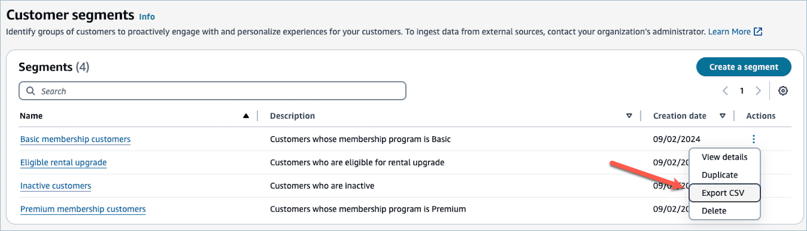
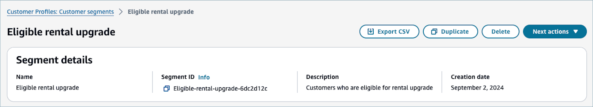

# Export customer segments to a

CSV file in Amazon Connect

From the **Customer segments** page in the Amazon Connect admin website, you can export
an existing segment to a file on your computer. When you do, Customer Profiles
exports all of the profile attributes that's associated with the profiles in the
customer segment to a CSV file.

###### To export a customer segment

1. On Customer segments page, choose **Export
   CSV** in the actions dropdown.

Alternatively, you can navigate to the **View details** page, and
choose **Next actions**, **Download**.

###### Note

The Amazon Connect admin website supports exporting a customer segment that contains up to 350,000
profiles. If you need to export a segment that contains a large number of
profiles, use the `CreateSegmentSnapshot` operation in Customer
Profiles API. The `CreateSegmentSnapshot` operation supports
exporting a segment in ORC, JSONL, and CSV files to an S3 bucket. Note that the
API outputs a test file in addition to the exported segment in the
bucket.

1. After the export job begins, keep the window or tab containing the
   download open until the process completes.

1. After the export job completes, the Amazon Connect admin website automatically starts downloading
   the file.

The exported CSV file contains all [standard and
customer profile attributes](standard-profile-definition.md "standard-profile-definition.md") populated across the exported
profiles.
