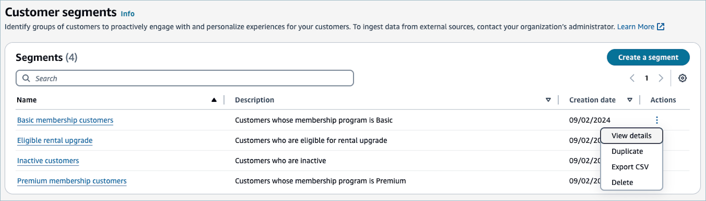

# Manage customer segments in

Amazon Connect

You can use the Amazon Connect admin website to create, view, copy, and perform other management tasks
for customer segments. If you open a customer segment to view its settings, you can
also quickly create a campaign that uses the segment. For more information on
creating segments, see [Build customer segments in
Amazon Connect](customer-segments-building-segments.md "customer-segments-building-segments.md") in the Amazon Connect
Developer Guide.

###### To manage customer segments

1. On the **Customer segments** page, navigate to the
   segment that you want to manage, or choose an action.

1. On the **Actions** menu, the following
   options are available:
   1. **View details** — Choose this option
      to show information about the customer segment, including the date
      and time when the segment was created, and the date and time when
      the segment was last updated. The Amazon Connect user needs the
      **CustomerProfiles.Segments.View** security
      profile permission to perform this action.
   2. **Duplicate** — Choose this option to
      create a new customer segment that's a copy of the selected segment.
      You can then modify any settings in the new segment, without
      changing the original segment. The Amazon Connect user needs the
      **CustomerProfiles.Segments.Create** security
      profile permission to perform this action.
   3. **Export CSV** — Choose this option to
      export the customer segment to a file on your computer. For more
      information, see [Export customer segments to a
      CSV file in Amazon Connect](customer-segments-exporting-segments.md "customer-segments-exporting-segments.md"). The
      Amazon Connect user needs the
      **CustomerProfiles.Segments.Export** security
      profile permission to perform this action.
   4. **Delete** — Choose this option to
      delete the customer segment permanently. You can't recover a segment
      after you delete it. The Amazon Connect user needs the
      **CustomerProfiles.Segments.Delete** security
      profile permission to perform this action.

###### Important

If you delete a segment, any active campaigns that use the segment will fail.
Similarly, any segments built on top of the segment will stop working. Before
you delete a segment, it's a good idea to first verify that a segment isn't
being used by any active campaigns or other segments.
