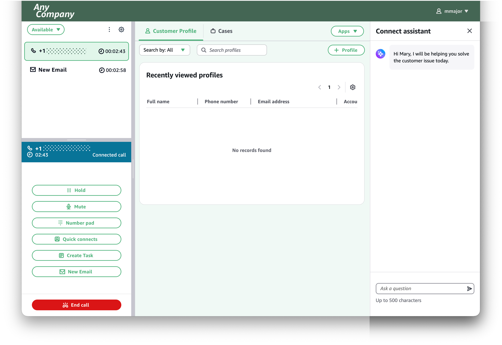
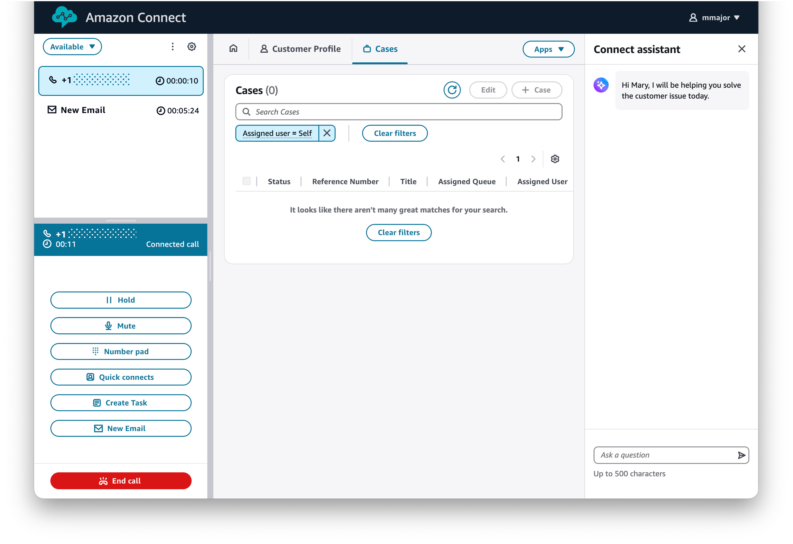
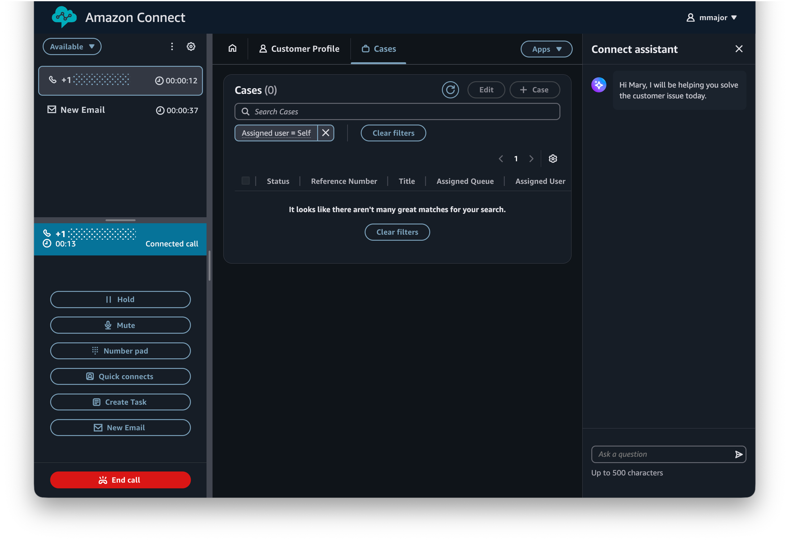

# Customize the theme of the agent workspace

By default, the agent workspace uses an Amazon Connect theme, which includes the logo, favicon, font family, and color palette.
You can use themes to customize the visual appearance of the agent workspace so it aligns with the brand identity of your organization.
To customize the visual appearance of the agent workspace, [create a workspace](amazon-connect-workspaces.md "amazon-connect-workspaces.md"), [customize its theme](custom-theme.md "custom-theme.md"), and assign it to your agents.

Agents can choose between light and dark modes to match their preference.
To change modes, go to the user settings at the top right of the agent workspace.

