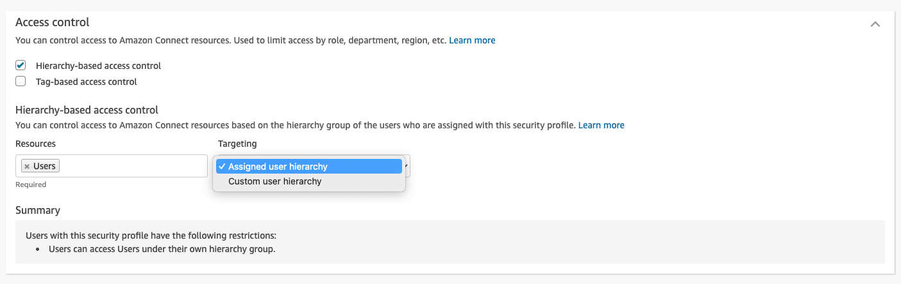
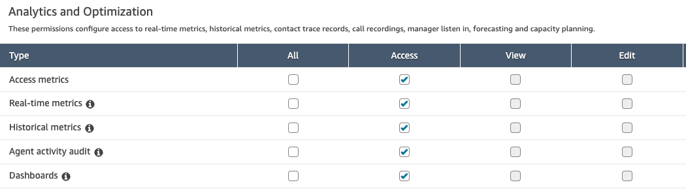
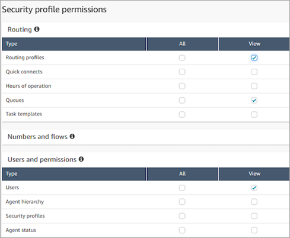

# Apply hierarchy-based access control to

dashboards and reports in Amazon Connect

You can leverage agent hierarchies to control who has access to view specific agents
and their performance related metrics in dashboards and reports.

Hierarchy-based access control enables you to configure granular access to users based
on the [agent hierarchy](agent-hierarchy.md "agent-hierarchy.md") that is assigned to a
user. You can [configure](hierarchy-based-access-control.md "hierarchy-based-access-control.md")
hierarchy-based access controls by using the API/SDK or the Amazon Connect admin website.

The only resource that supports hierarchy-based access control is agents. This
authorization model works with [tag-based access
control](tag-based-access-control.md "tag-based-access-control.md"), so you can restrict access to users,
allowing them to see only other agents who belong to the same hierarchy group and who
have specific tags associated to them.

###### Contents

- [How to enable hierarchy-based access control
  for reports and dashboards](#dashboard-ac-enable "#dashboard-ac-enable")
- [Assign security profiles permissions to
  access dashboards, reports, and resources](#dashboard-ac-permissions "#dashboard-ac-permissions")
- [Limitations](#dashboard-ac-limitations "#dashboard-ac-limitations")

## How to enable hierarchy-based access control

for reports and dashboards

To enable granular access control for a given user based on the hierarchy they
belong to, you configure the user as an access controlled resource. To do this, you
have the following two options:

- **Enforce hierarchy-based access control based on the
  user's hierarchy**

This option ensures that the user being given access can only manage
agents that belong to this hierarchy. For example, enabling this
configuration for a given user enables them to manage other agents that
either belong to their hierarchy group or a child hierarchy group.

- **Enforce hierarchy-based access control based on a
  specific/custom user hierarchy**

This option ensures that the user being given access can only manage
agents that belong to the hierarchy defined in the security profile. For
example, enabling this configuration for a given user enables them to manage
other users that either belong to the hierarchy group specified in the
security profile or a child hierarchy group.

## Assign security profiles permissions to

access dashboards, reports, and resources

The user will need one of the following permissions to view the reports and
dashboards:

- **Analytics and Optimization - Access metrics - Access**:
  If you choose this option, access is granted to Real-time metrics,
  Historical metrics reports, Dashboards, and Agent activity audit.

OR

- **Analytics and Optimization - Real-time metrics -
  Access**

OR

- **Analytics and Optimization - Historical metrics -
  Access**

OR

- **Analytics and Optimization - Dashboards - Access**

OR

- **Analytics and Optimization - Agent Activity Audit -
  Access**

Additionally, the user will need permissions to access resources. The following
image shows an example of security profile permissions that grant users the ability
to view routing profiles, queues, and Amazon Connect user accounts. **Routing
profiles - View**, **Queues - View**, and
**Users - View** are selected.

## Limitations

The following limitations apply when you use hierarchy-based access controls in
reports and dashboards:

- Access to view **Agent Queues** is disabled.
- There are additional things to consider if tag-based access control is
  being applied simultaneously with hierarchy-based access control:
  - If tag-based access control is enabled along with hierarchy-based
    access control, the [limitations](rtm-tag-based-access-control.md#rtm-tag-based-access-control-limitations "rtm-tag-based-access-control.md#rtm-tag-based-access-control-limitations")
    imposed by tag-based access will still be there.
  - When both tag-based and hierarchy-based access controls are in
    place, the system enforces each control method independently. This
    means that users must meet the requirements of both control types to
    gain access to resources.
  - When one security profile has tag-based access control and the
    other has hierarchy-based access control, we will restrict access on
    both tag and hierarchy as though tag-based access control and
    hierarchy-based access control are on a single security
    profile.
  - If two security profiles have hierarchy-based access control and
    one of the profiles has tag-based access control, the applicable
    tags will be enforced for resources in both hierarchies.
  - If two security profiles have tag-based access control and one of
    the profiles has hierarchy-based access control, then the hierarchy
    filter will be applied to resources with either tags.
  - If both security profiles have unique configurations for tag-based
    and hierarchy-based access control, we cannot enforce hierarchy-based
    access control effectively. This could allow users to access more
    data than intended in certain scenarios. In such cases, we recommend
    not granting access to Real-time and Historical reports for users
    with this type of access control setup, or just leverage
    hierarchy-based or tag-based controls to restrict users
    access.
  - If you have hierarchy-based access controls enabled in your
    Security Profile, the **Agent performance summary**
    widget on the dashboards will display a summary of metrics for the
    agent hierarchy you have access to.
