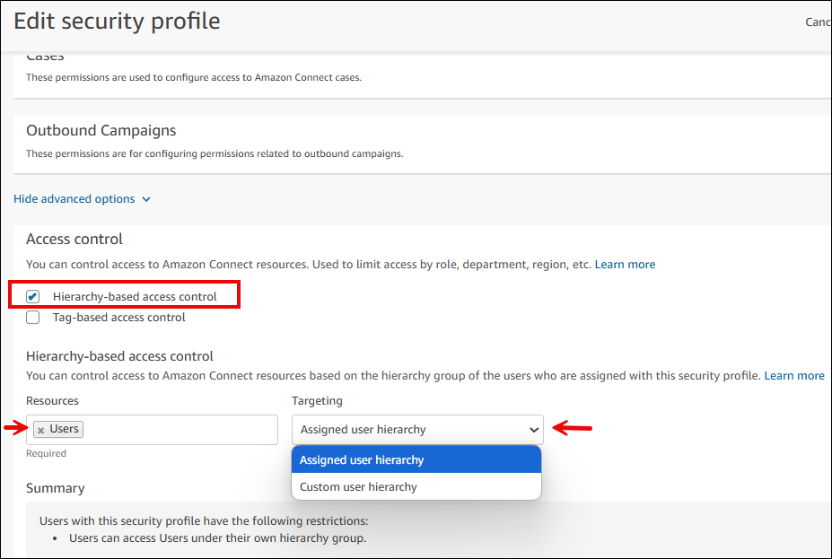
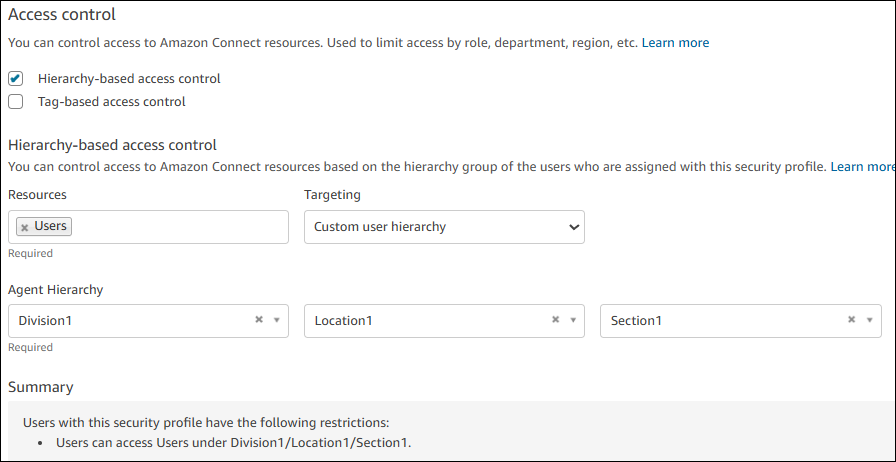
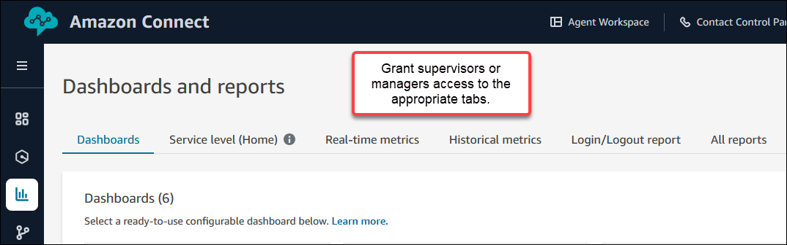
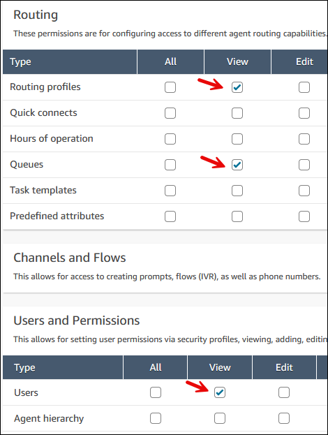
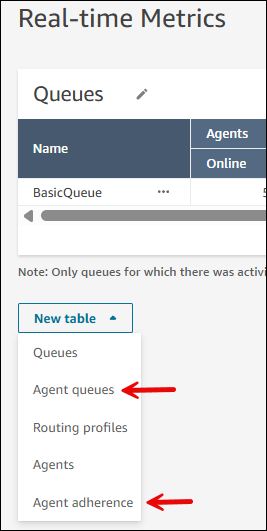

# Apply hierarchy-based access control to

dashboards and reports in Amazon Connect

You can leverage agent hierarchies to control which supervisors and managers have
access to view data about specific agents. For example, you can [set up hierarchy groups and levels](agent-hierarchy.md "agent-hierarchy.md") for a team, and
then you can specify that only supervisors assigned to a hierarchy group within that
team are able to see routing profiles, queues, and performance metrics for agents who
are assigned to that same hierarchy group. This is called _hierarchy-based
access control_.

You can use hierarchy-based access control together with tag-based access control.
This is useful to do when you have multiple lines of business and hierarchies within
each line of business. For example, you have a corporation with three lines of business:
Clothing, Loans, and Banking. You can use tags to segregate your
resources—agents, queues, routing profiles—to each line of business. With
each line of business, you can have hierarchical levels such as Level1 (country), Level2
(state), Level3 (site). You can then use hierarchies to configure these levels and use
hierarchy-based access control to restrict access of site level managers.

###### Contents

- [Important things to know when using tag-
  and hierarchy-based controls simultaneously](#dashboard-ac-important "#dashboard-ac-important")
- [Step 1: Enable hierarchy-based access control
  for reports and dashboards](#dashboard-ac-enable "#dashboard-ac-enable")
- [Step 2: Assign security profiles
  permissions to access dashboards, reports, and resources](#dashboard-ac-permissions "#dashboard-ac-permissions")
- [Limitations](#dashboard-ac-limitations "#dashboard-ac-limitations")

## Important things to know when using tag-

and hierarchy-based controls simultaneously

- When a supervisor or manager is assigned to two security profiles, and
  each security profile has unique configurations of both tag-based access
  control and hierarchy-based access control, Amazon Connect cannot enforce granular
  access control on reports.

In this scenario, to prevent supervisors or managers from viewing data
that may not be intended for them, we recommend that you do **not** grant them security profile permissions to
access real-time and historical metrics reports. (Dashboards don't support
tagging so only the hierarchy-based access control is enforced.)

- When you enable tag-based access control and hierarchy-based access
  control simultaneously, the [configuration
  limitations](tag-based-access-control.md#tag-based-access-control-config-limitations "tag-based-access-control.md#tag-based-access-control-config-limitations") imposed by tag-based access still exist.
- When you enable tag-based access control and hierarchy-based access
  control simultaneously, Amazon Connect enforces each control method independently.
  This means that supervisors or managers must meet the requirements of both
  control types in order to gain access to agent data and resources such as
  routing profiles, queues, and performance data.
- When a supervisor or manager is assigned to two security profiles, and one
  security profile has tag-based access control and the other security profile
  has hierarchy-based access control, Amazon Connect restricts access on both tag and
  hierarchy as though tag-based access control and hierarchy-based access
  control are on a single security profile.
- When a supervisor or manager is assigned to two security profiles, if both
  security profiles have hierarchy-based access control, but one of the
  security profiles has tag-based access control, the applicable tags are
  enforced for agents who are in both hierarchies.
- When a supervisor or manager is assigned to two security profiles, and
  both security profiles have tag-based access control, but one of the
  security profiles has hierarchy-based access control, then the hierarchy
  filter is applied to resources (agents, routing profiles, queues, and
  performance data) that have either set of tags.

## Step 1: Enable hierarchy-based access control

for reports and dashboards

You can configure hierarchy-based access controls by using the [API/SDK](hierarchy-based-access-control.md#hierarchy-based-access-control-api-sdk "hierarchy-based-access-control.md#hierarchy-based-access-control-api-sdk") or the Amazon Connect admin website.
The following instructions explain how to configure it using the Amazon Connect admin website.

1. Log in to the Amazon Connect admin website with an **Admin** account, or an
   account assigned to a security profile that has **Users and
   Permissions** - **Security profiles** -
   **Edit** permission.
2. On the left navigation menu, choose **Users**, and then
   choose the security profile you want to edit.
3. On the **Manage security profiles** page, choose the
   security profile you want to edit.
4. Scroll to the bottom of the **Edit security profile**
   page, choose **Show advanced options**, and then choose
   **Hierarchy-based access control**, as shown in the
   following image.

 5. Under **Resources**, choose
**Users**. 6. Under **Targeting**, use the dropdown list to select one
of the following options:

    * **Assigned user hierarchy**. Select this option
     to enable supervisor to manage agents who either belong to the
     supervisor's hierarchy group or a child hierarchy group.

    This option ensures that the supervisor or manager who is given
     access can only view data for agents who also belong to this same
     hierarchy or a child hierarchy group.
    * **Custom user hierarchy**. Select this option to
     to specify a custom hierarchy and the agent hierarchy level.
     Supervisors or managers can view data for agents who belong to a
     different hierarchy than them. For example, this option allows Site
     1 manager to view data for Site 2 agents.

    This option also enables you to be very specific about the
     hierarchy level a supervisor can access. For example, the following
     image shows a security profile that gives supervisors access to view
     reporting data for agents who are in Division1/Location1/Section1.

    

7. Choose **Save**.

## Step 2: Assign security profiles

permissions to access dashboards, reports, and resources

After you assign hierarchy-based access control to a supervisor or manager, you
must grant them one or more of the following permissions so they can access the
appropriate tabs on the **Dashboards and reports** page, as shown
in the following image.

1. On the **Edit security profile** page, assign the
   supervisor or manager the following permissions as needed so they can access
   dashboards and reports:
   - **Analytics and Optimization - Access metrics -
     Access**: Grants access to all the tabs on the
     **Dashboards and reports** page.
   - **Analytics and Optimization - Real-time metrics -
     Access**: Grants access to the **Real-time
     metrics** tab.
   - **Analytics and Optimization - Historical metrics -
     Access**: Grants access to the **Historical
     metrics** tab.
   - **Analytics and Optimization - Dashboards -
     Access**: Grants access to the
     **Dashboards** tab.
   - **Analytics and Optimization - Login/Logout -
     Access**: Grants access to the **Login/Logout
     report** tab.

2. Assign the supervisor or manager security profile permissions to access
   resources such as users, routing profiles, and queues.

For example, the following image shows security profile permissions that
grant the ability to view routing profiles, queues, and Amazon Connect users.
**Routing profiles - View**, **Queues -
View**, and **Users - View** are selected.

## Limitations

You can only apply hierarchy-based access control to agents; no other Amazon Connect
resource supports it.

The following limitations apply when you use hierarchy-based access controls in
reports and dashboards.

- Access to view the **Agent queues** is disabled.
- The **Agent Adherence** table on the Real-time
  metrics page is not supported.

The options for these tables are shown in the following image of the
**Real-times metrics** page.

