# Customize your Amazon Connect dashboard

You can customize specific widgets to create dashboards that best fit your business
needs. For example, you can create a single line chart that combines contacts queued,
average queue answer time, and abandoned contacts. You can apply filters to show your
most important queues so you can quickly see how increasing contact volumes impact both
wait time and customer abandonment rates.

You can delete or add new metrics, define widget level filters and groupings, re-order
and re-size columns, and more.

###### Contents

- [Choose which metrics to
  display](#dashboard-changing-metrics "#dashboard-changing-metrics")
- [Select custom time thresholds](#select-time-thresholds "#select-time-thresholds")
- [Re-order the metrics](#reorder-metrics "#reorder-metrics")
- [Re-size columns](#reorder-metrics "#reorder-metrics")
- [Add comparisons to the Trailing performance
  widgets](#add-comparisons "#add-comparisons")
- [Configure groupings](#configure-groupings "#configure-groupings")
- [Configure filters](#configure-filters "#configure-filters")
- [Modify thresholds for summary widgets and
  tables](#dashboard-thresholds "#dashboard-thresholds")
- [Add or remove
  widgets](#dashboard-add-widgets "#dashboard-add-widgets")
- [Move and resize
  widgets](#widgets-move-charts "#widgets-move-charts")
- [Create custom dashboards](#dashboard-create-custom "#dashboard-create-custom")
- [Create custom calculations of service level
  metrics](#dashboard-custom-sl "#dashboard-custom-sl")

## Choose which metrics to display in a

widget

1. In a widget, select the Actions icon and then choose
   **Edit**. The following image shows the Actions icon
   for the **Performance overview** widget.

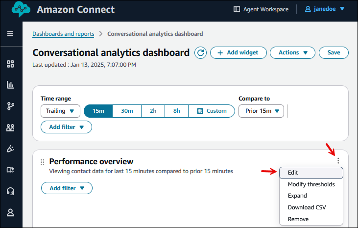 2. In the widget's **Edit** pane choose the metric column
you want to change; the available metrics for that column appear in the
dropdown list.

The following image shows a widget **Edit** pane, the
**Widget name** box (which you can edit), and the
dropdown list available for the **Metric 1** column of the
**Performance overview** widget.

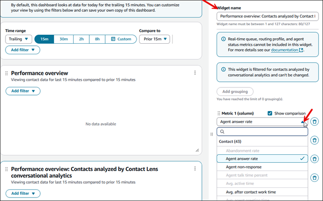

###### Note

In only specific widgets you can select the following real-time queue,
routing profile, and agent metrics. You cannot combine these metrics
with trailing near real-time metrics or historical metrics.

    * Agents online
    * Agents available
    * Agents in error
    * Agents in NPT
    * Agents staffed
    * Agents on contact
    * Agents online
    * Agents in ACW
    * Contacts active
    * Contact availability
    * Oldest contact
    * Contacts in queue

## Select custom time thresholds

In the widget's **Edit** pane you can select custom time
thresholds for metrics such as **Service level**,
**Contacts answered in X**, and **Contacts abandoned in
X**. To select a custom time threshold, choose **Add
custom**, as shown in the following image.

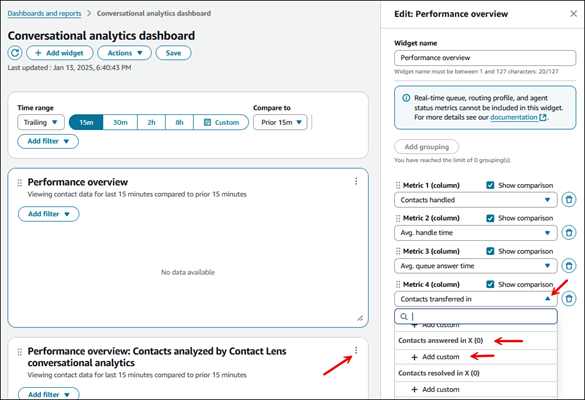

You can then select and choose which time threshold you want. The limit is between
one second and seven days. The following image shows the dialog box for adding
custom values for the **Contacts resolved by X** metric.

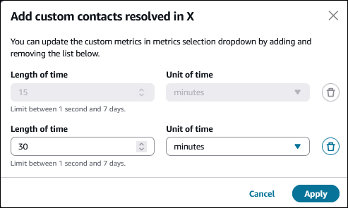

## Re-order the metrics

In the widget's **Edit** pane you can re-order the columns for
the metrics by selecting the dots next to the metric and moving the metric up or
down the Edit pane.

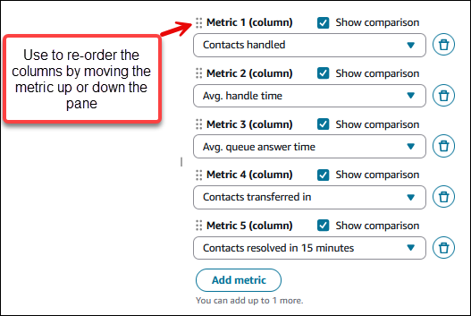

## Re-size columns

To re-size the columns in the dashboard, select the vertical bars in the column
headers and drag left or right to re-size. You can also re-size the grouping column.
The following image shows a vertical bar on a dashboard.

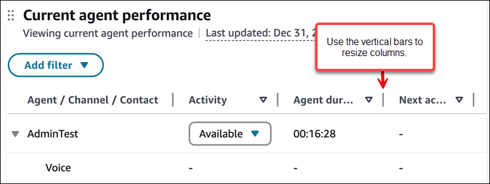

## Add comparisons to the Trailing performance

widgets

In the widget's **Edit** pane you can choose to show the
comparisons in your Trailing performance widgets by choosing the **Show
comparison** option. This allows you to see how your performance
compares to the previous time range.

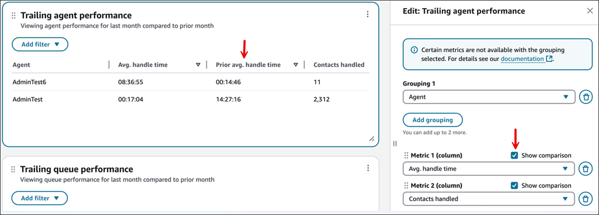

## Configure groupings

In the widget's **Edit** pane you can configure the groupings for
tables. You can add up to three groupings.

###### Note

- Groupings are available dynamically based on the metrics selected in
  the widgets to avoid incompatible metric/grouping combinations.
- Groupings change the metrics that are available within the
  widgets.

The following image shows two groupings for the Contact categories widget in the
**Edit** pane.

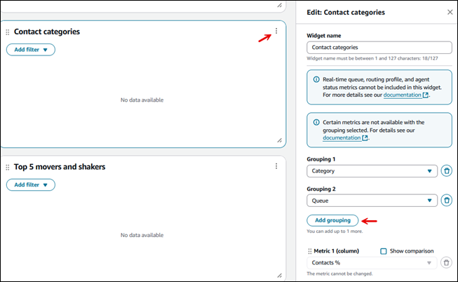

## Configure filters

In the widget you can select filters that apply to only to the widget you're on.
These filters are dynamically included based on the metrics selected.

The widget-level filters override any page-level filters.

The following image shows filters for the **Trailing agent
performance** metrics.

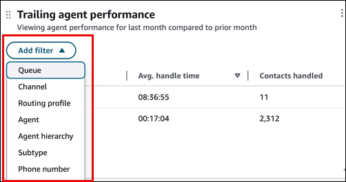

## Modify thresholds for summary widgets and

tables

You can add color coded thresholds to summary widgets and tables by choosing the
**Modify thresholds** option on the widget.

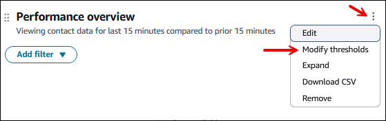

You can add up to three thresholds per metric (red, yellow, green). You can define
the thresholds that cause the metrics to change colors. Thresholds are evaluated in
the order they are applied, which means that if you have overlapping thresholds, the
first one that triggers, will color the respective metric. This means if you want to
create a red/yellow/green configuration for greater than 90% green, between 90%-70%
yellow, and less than 70% yellow, you should create three conditions in the
following order:

1. Greater than or equal to 90% = Green
2. Greater than or equal to 70% = Yellow
3. Less than 70% = Red

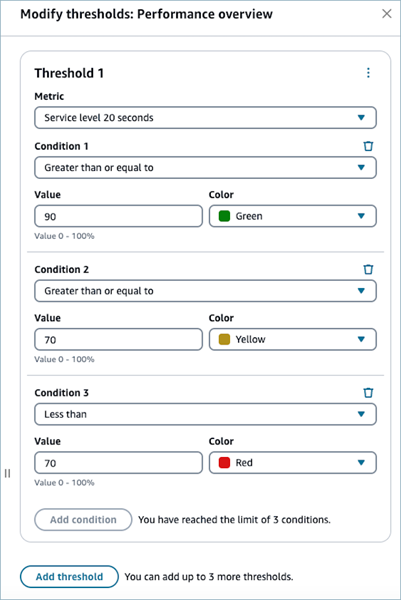

## Add or remove widgets on a dashboard

You add widgets to a dashboard by choosing from a list of pre-configured widgets
that is based on the dashboard you are using. You can have up to 10 widgets on each
dashboard.

###### To add a widget

1. On the dashboard page, choose **Add widget**, as shown in
   the following image.

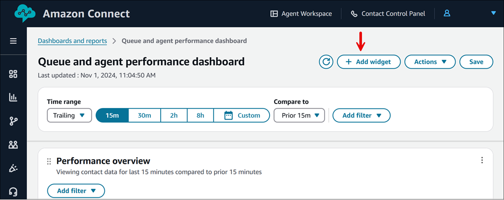 2. On the **Add widget** page, select a widget from the list
of pre-configured widgets based on the dashboard you are using. The widget
is added to the bottom of the dashboard.

The following example of an **Add widget** page shows
five Contact widgets that you can add.

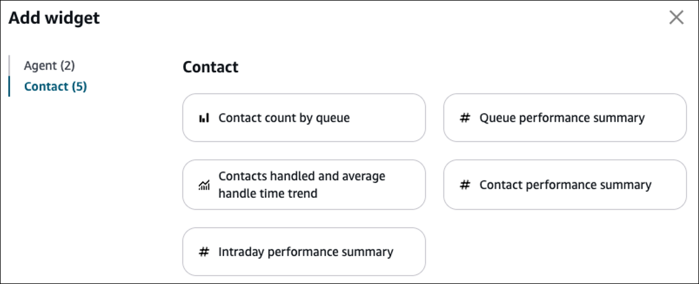

When you add a custom widget to the dashboard, you can apply both a widget-level
filter and a page-level filter.

The widget-level filters override any page-level filters. For example, you have
two queues:

- Queue1 is filtered at the page level.
- Queue2 is filtered at the widget level.

In this example, the widget would filter by Queue 2 and other widgets on the
dashboard would filter by Queue 1 at page level.

To remove a widget from your dashboard, choose the Actions icon and then choose
**Remove**, as shown in the following image.

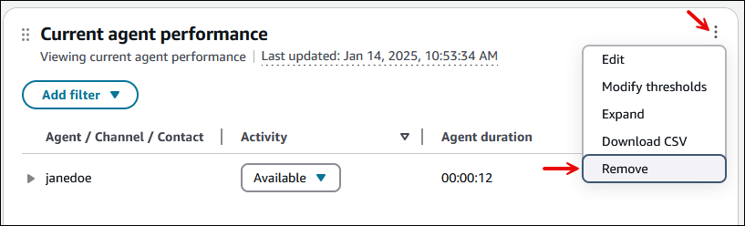

## Move and resize widgets

You can move charts around by choosing and holding the top left corner icon with
your mouse and then moving the widget. You can re-size widgets by choosing and
dragging the bottom right icon with your mouse. These two controls are shown in the
following image.

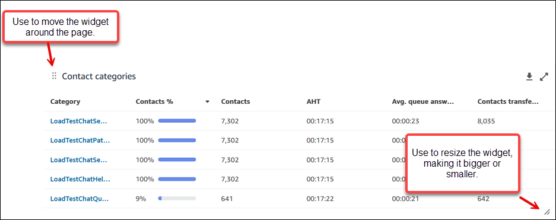

## Create custom dashboards

To create a custom dashboard, on the **Dashboards** tab choose
**Create custom**, as shown in the following image.

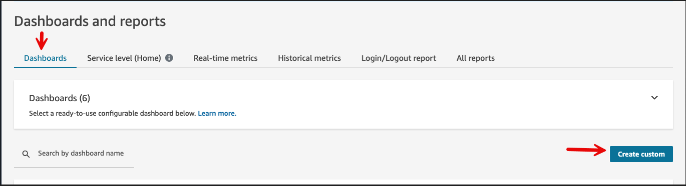

A new custom dashboard opens. Use the **Add widget** option to
customize the dashboard.

## Create custom calculations of service level

metrics

You can create custom calculations of service level metrics to measure the
percentage of contacts handled within your specified time threshold.

Complete the following steps to create a custom calculation.

1. Log in to Amazon Connect admin website using an Admin account, or an account that has the
   following permissions in its security profile:
   - **Analytics and Optimization - Access metrics -
     Access**s permission or the **Dashboard -
     Access** permission.
   - **Analytics and Optimization - Custom metrics**:
     These permission enables users to view, create and manage custom
     metrics.

2. From any [dashboard
   widget](#dashboard-changing-metrics "#dashboard-changing-metrics"), select the **Actions** icon and then
   choose **Edit**.
3. In the metric selection dropdown, under **Custom
   metrics**, choose **Add custom service level
   calculation**, as shown in the following image.

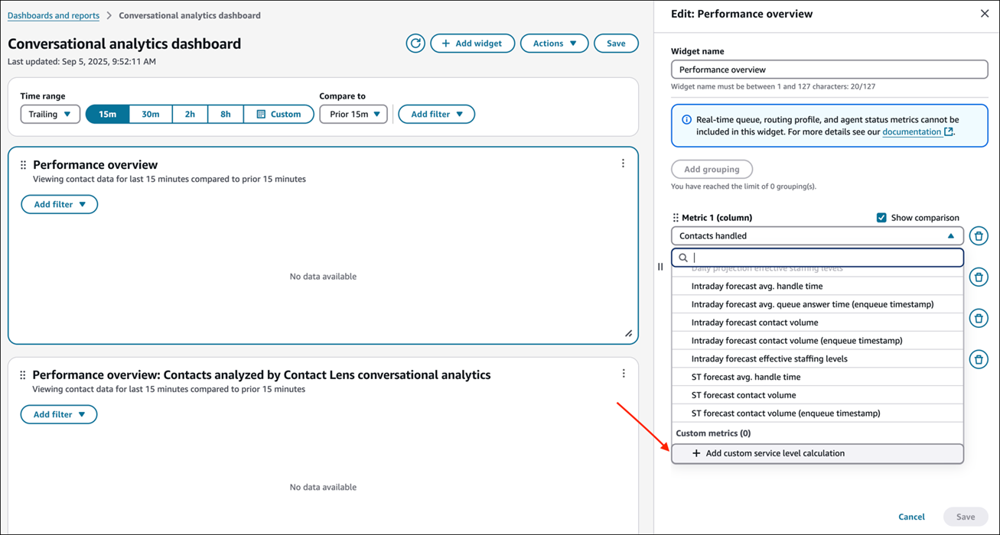 4. In the **Add custom service level calculation** form,
configure the following settings:

    * **Metric name**:- Enter a unique name (maximum
     128 characters)
    * **Description (optional)**: Provide details about
     the metric's purpose (maximum 500 characters)
    * **Target time**: Specify the service level
     threshold.

    	+ **Length**: Enter a value between 1
    	 second and 7 days
    	+ **Unit**: Select seconds, minutes, hours,
    	 or days
    * **Excluded contact outcomes**: Choose which types
     of contacts to exclude from the denominator:

    	+ **Contacts transferred**
    	+ **Contacts resulted in callbacks**
    	+ **Contacts abandoned in X
    	 seconds/minutes/hours/days**

5. The service level calculation preview updates automatically as you
   configure these settings.

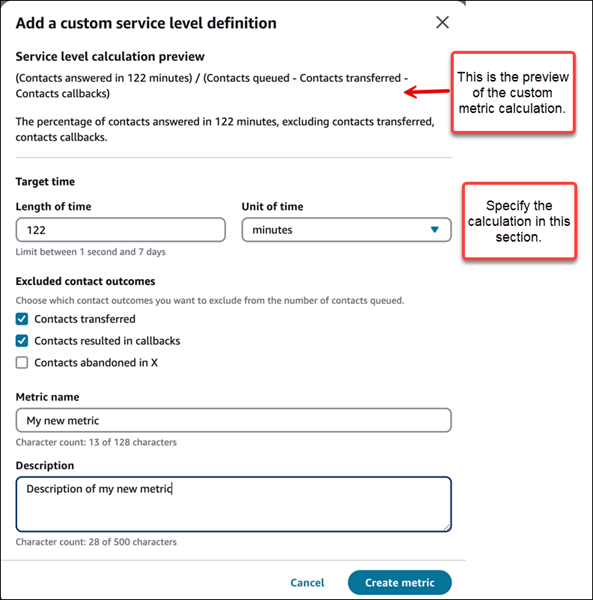

The preview shows:

    * The calculation formula.
    * A plain language explanation of what the metric measures.
    * The percentage of contacts answered within your target time,
     excluding any contact types you specified.

### Limitations

- You cannot delete custom SL metrics.
- You can add up to 10 custom metrics to a widget.

### Use custom service level metrics in

dashboards

After creating a custom service level metric, you can add it to any dashboard
widget. Complete the following procedure.

1. From any [dashboard
   widget](#dashboard-changing-metrics "#dashboard-changing-metrics"), select the **Actions** icon, and
   then choose **Edit**.
2. In the metric selection dropdown, locate your custom metric under the
   **Custom metrics** category.
3. Select your custom metric to add it to the widget.
4. Configure any additional widget settings like time range, comparisons,
   or filters.
5. Choose **Save** to apply your changes.
