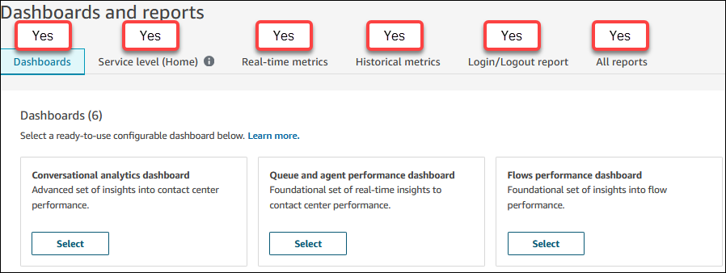
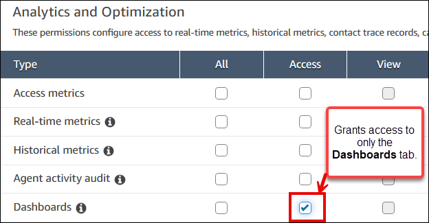

# Assign permissions to view dashboards

and reports in Amazon Connect

The following security profile permissions control access to dashboards and reports in
Amazon Connect. These permissions are in the **Analytics and Optimization**
section of the **Security profiles** page.

## Access metrics permission

When you select **Access metrics - Access**:

- Amazon Connect automatically assigns the following permissions:

      + **Real-time metrics - Access**
      + **Historical metrics - Access**
      + **Agent activity audit - Access**

  These permissions are shown in the following image:

- Also add the **Saved reports - View** permission.
- You gain access to:
  - All tabs on the **Dashboards and reports**
    page.
  - All real-time and historical metrics reports.

## Individual feature permissions

You can also assign permissions for individual features:

### Real-time metrics

permission

When you select only **Real-time metrics - Access**:

- You can access only real-time metrics reports.
- You cannot access other analytics pages or reports.

### Historical metrics

permission

When you select only **Historical metrics - Access**:

- You can access only historical metrics reports.
- You cannot access other analytics pages or reports.

### Dashboard permissions

When you select only **Dashboards - Access**:

- You can access only the **Dashboards** tab.
- You can view historical metrics displayed on dashboards.
- You must have the **Real-time metrics - Access**
  permission to view real-time metrics on dashboards.

The following image shows that you only have access to the
**Dashboards** tab on the **Dashboards and
reports** page.

## Custom service level metric calculation

permissions

To create customer service level metric calculations, you need the following
permissions:

- **Analytics and Optimization - Access metrics - Acces**s permission or the
  **Dashboard - Access** permission.
- **Analytics and Optimization - Custom metrics**: This permission enables
  users to view, create and manage custom metrics.
