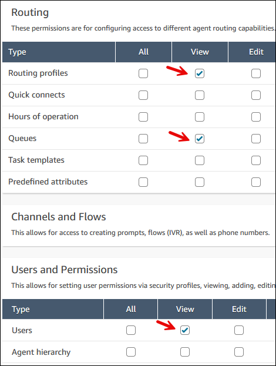
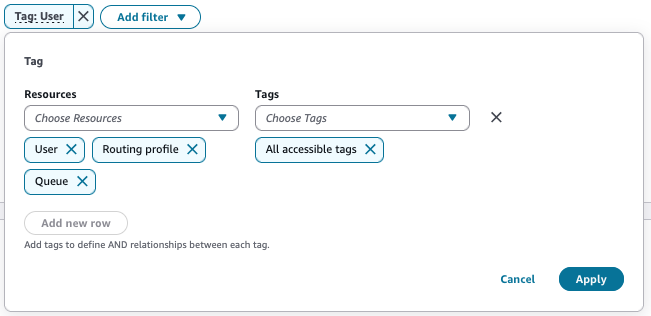

# Apply tag-based access controls to dashboards and reports in Connect Customer

You can use resource tags and access control tags to apply granular access to users,
queues, routing profiles, flows, flow modules, evaluation forms, and test cases on
analytics user interfaces.

Tag-based access controls enable you to configure granular access to specific
resources based on assigned resource tags. You can configure tag-based access controls
by using the API or the Connect Customer admin website for supported resources. You must configure resource tags
and access control tags before tag-based access control is applied to users, queues,
routing profiles, flows, flow modules, evaluation forms, and test cases on analytics
pages. For more information, see [Add tags to resources in Connect Customer](tagging.md "tagging.md") and
[Apply tag-based access control in Connect Customer](tag-based-access-control.md "tag-based-access-control.md").

###### Contents

- [How to enable tag-based access control for dashboards and reports](#dashboard-tbac-enable "#dashboard-tbac-enable")
- [Important things to know when using tag-based access controls](#dashboard-tbac-limitations "#dashboard-tbac-limitations")
- [How to transition to tag-based access control](#dashboard-tbac-transition "#dashboard-tbac-transition")

## How to enable tag-based access control for dashboards and reports

To apply tags to control access to users, queues, routing profiles, flows, flow
modules, evaluation forms, and test cases metrics in dashboards and reports:

- Apply tags to the resources that you're going to use in the dashboards and
  reports, such as users, queues, routing profiles, flows, flow modules,
  evaluation forms, and test cases. For more information, see [Add tags to resources in Connect Customer](tagging.md "tagging.md").
- You need to be assigned to a security profile that specifically grants you
  access to the resources that have been tagged. On the Security profiles
  page, choose **Show advanced** options to assign these
  permissions.
- You will need one of the following permissions to view the reports and
  dashboards in the same security profile that has tag based access controls
  enabled:

  - **Analytics and Optimization - Access metrics -
    Access**: If you choose this option, access is granted
    to Real-time metrics, Historical metrics reports, Dashboards, and
    Agent activity audit.
    OR

  - **Analytics and Optimization - Real-time metrics -
    Access**
    OR

  - **Analytics and Optimization - Historical metrics -
    Access**
    OR

  - **Analytics and Optimization - Dashboards -
    Access**
    OR

  - **Analytics and Optimization - Agent Activity Audit -
    Access**
    OR

  - **Analytics and Optimization - Login/Logout report -
    View**

Additionally, you will need one or more relevant permissions to view specific
resource data on dashboards and reports: **Routing profiles -
View**, **Queues - View**, **Users -
View**, **Test Cases - View**, **Evaluation forms

- manage form definitions - View**, **Flows - View**,
  **Flow modules - View**, and **Bot - View** are selected.
  The following image shows an example of security profile permissions that grant
  users the ability to view routing profiles, queues, and Connect Customer user accounts.

## Important things to know when using tag-based access controls

- The Dashboards support access controls on users, queues, routing profiles,
  flows, flow modules, evaluation forms, and test cases.
- Real-time metrics and Historical metrics support access controls on users,
  queues, and routing profiles.
- The Agent Activity Audit report supports access controls on users
  only.
- The tag-based access control experience on the **Historical metrics**,
  **Agent Activity Audit**, and **Login/Logout** pages remain unchanged after
  this launch for users that had tag based access controls enabled in their
  security profile before January 15, 2026. It will continue to work the same
  way. However, if you would like the enhanced tag based access controls
  experience on your historical metrics, Agent Activity
  Audit report or Login/Logout, please contact the Connect Customer service team to assist with the
  migration. When you migrate to the new tag based access controls experience,
  please note that, the historical metrics report shows data
  from November, 2025 to the current date. The Login/Logout report shows data
  from April 9, 2026 to the current date. The retention period will increase by 1 day each day.
- Agent queues do not support tag-based access controls.
- The cases performance dashboard does not support tag-based access controls.
- Scheduled reports are not supported.
- Changes to resource tags are eventually consistent. After a data update, a
  brief delay might occur before the system reflects the latest value.
- When you apply resource filters with tag-based access controls, you can
  view data only for resources in your security profile. For example, if you
  filter a widget by Queues Q1, Q2, and Q3, but your security profile grants
  access only to Q1 and Q2, the widget displays data for Q1 and Q2 only.
- Dashboards and reports automatically apply tag-based access controls,
  displaying only data for resources that match the tags in your security
  profile.
- When you filter metrics by resource tags you don't have access to, the
  dashboards and reports will display access restriction error.
- When you filter metrics by tags and select **All accessible
  tags**, the system restricts data to permitted tags for the
  selected resource types.
- If you have tag-based access controls enabled in your security profile,
  and you want to share a report with another user with a different security
  profile, use the Tag filter to select the resource(s) and select
  **All accessible tags** before saving the report, see
  example on the image below. This makes sure that the user opening the saved
  report with a different security profile will only view metrics on the same
  report based on the resource tags configured in their security profile.

- Dashboard widgets that do not have a default groupings are filtered by a
  default resource tag filter. The following table shows the resource type
  applied as a default filter for each widget:

| Widget Name                                            | Resource Type |
| ------------------------------------------------------ | ------------- |
| Agent assistance AI performance summary                | QUEUE         |
| Agent evaluation performance overview                  | AGENT         |
| Agent performance overview                             | AGENT         |
| AI agent performance trend                             | QUEUE         |
| Average execution duration                             | TEST\_CASE    |
| Average handle time                                    | AGENT         |
| Average queue answer time and contacts queued trend | QUEUE         |
| Average speed of answer                                | QUEUE         |
| Contact performance summary                            | AGENT         |
| Contact volume                                         | QUEUE         |
| Contacts analyzed by conversational analytics          | AGENT         |
| Contacts handled and average handle time trend         | QUEUE         |
| Current queue overview                                 | QUEUE         |
| Evaluation score trend                                 | AGENT         |
| Flow durations over time comparison                    | FLOWS         |
| Flow outcome rates over time comparison                | FLOWS         |
| Flows performance summary                              | FLOWS         |
| Intraday performance overview                          | QUEUE         |
| Queue performance summary                              | QUEUE         |
| Self service AI performance summary                    | QUEUE         |
| Test execution summary                                 | TEST\_CASE    |

## How to transition to tag-based access control

If you open a saved report that you don't have permission to access anymore due to
tag-based access control, or if groupings or filters that you don't have permissions
to access anymore are applied to widgets or tables, you won't see data in those
widgets or tables.

To view the data, perform one of the following steps:

- If your widget or report does not have any groupings configured, add
  relevant authorized groupings such as users, queues, routing profiles,
  flows, flow modules, evaluation forms, and test cases.

OR

- To view metrics on Summary widgets on the Dashboard, use the Tag filter to
  select the resource and tags you have access to by selecting the first
  filter value **All accessible tags**. This gives you access
  to metrics based on all the resource tags configured in your security
  profile.

OR

- Create a new report that includes the resources you have access to.
