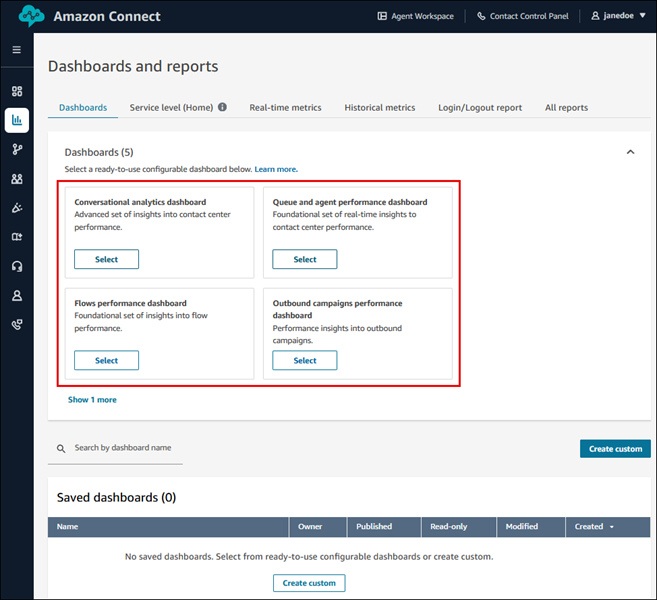
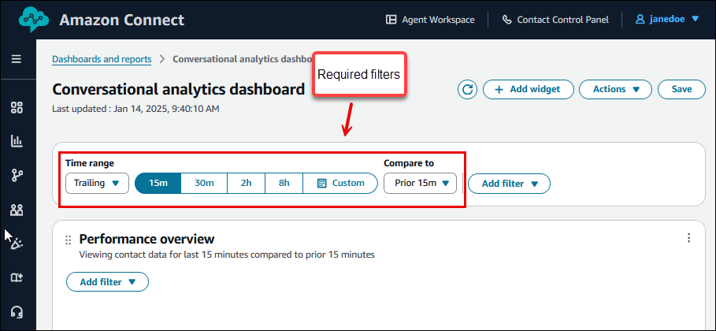
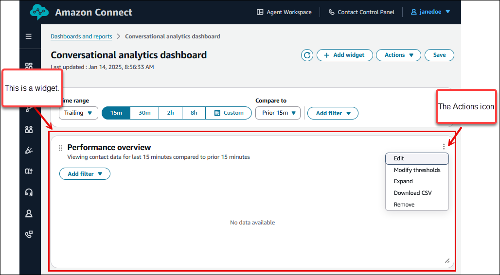
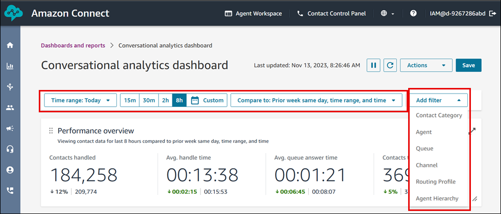
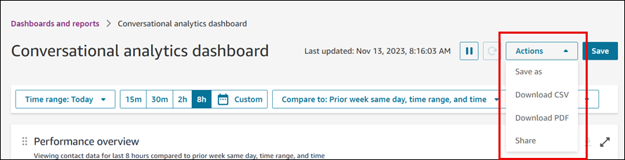

# Dashboards in Amazon Connect for getting contact center performance

data

Understanding your contact center at the most granular level is key to improving
performance and lowering costs. You can use the Amazon Connect visual dashboards to understand the
performance of your contact center.

Amazon Connect dashboards show real-time and historical metrics information and insights about your
contact center performance.

- Real-time dashboards are updated every 15 seconds, with the exception of
  timeseries widgets which refresh every 15 minutes.
- Embedded agent workspace dashboards are updated every 2 minutes, with the
  exception of timeseries widgets which refresh every 15 minutes.
- You can select historical data up to 3 months in the past.
  You can customize the dashboards (for example, re-size and re-arrange the visuals),
  specify a custom time range and custom benchmark comparison time range for each dashboard,
  and select filters for data to include for each report. You can also download the entire
  data set or individual widgets as CSV, download the dashboard as a PDF, save your own
  version to your saved dashboards, share with individuals, and publish to the entire
  instance.

###### Contents

- [Get started](#how-to-access-dashboards "#how-to-access-dashboards")
- [Specify time range and "Compare
  to" benchmark](#required-dashboard-filters "#required-dashboard-filters")
- [Save, download, and share your dashboard](#dashboard-actions "#dashboard-actions")
- [Customize your
  dashboard](dashboard-customize-widgets.md "dashboard-customize-widgets.md")
- [Contact Lens conversational analytics dashboard](contact-lens-conversational-analytics-dashboard.md "contact-lens-conversational-analytics-dashboard.md")
- [Agent performance
  evaluations dashboard](agent-performance-evaluation-dashboard.md "agent-performance-evaluation-dashboard.md")
- [AI Agent performance dashboard](ai-agent-performance-dashboard.md "ai-agent-performance-dashboard.md")
- [Flows and conversational bot
  performance dashboard](flows-performance-dashboard.md "flows-performance-dashboard.md")
- [Outbound
  campaigns performance dashboard](outbound-campaigns-performance-dashboard.md "outbound-campaigns-performance-dashboard.md")
- [Queue and agent performance
  dashboard](queue-performance-dashboard.md "queue-performance-dashboard.md")
- [Testing and simulation dashboard](testing-and-simulation-dashboard.md "testing-and-simulation-dashboard.md")
- [Intraday forecast
  performance dashboard](intraday-forecast-performance-dashboard.md "intraday-forecast-performance-dashboard.md")
- [Agent workspace performance
  dashboard](performance-dashboard-aw.md "performance-dashboard-aw.md")
- [Integrate a published
  dashboard into the agent workspace](integrate-published-dashboard.md "integrate-published-dashboard.md")
- [[New] Custom Metrics](custom-metrics-topic.md "custom-metrics-topic.md")

## Get started

1. Ensure users are assigned the appropriate security profile permissions so they
   can access the dashboards they need and view the metrics:
   - **Access metrics - Access permission** or the
     **Dashboard - Access permission**. For information
     about the difference in behavior, see [Assign permissions to view dashboards
     and reports in Amazon Connect](dashboard-required-permissions.md "dashboard-required-permissions.md").
   - Viewing the data on each dashboard requires the appropriate
     permissions. For example, to view flows data, you need **Flows -
     View** permissions. See the topics about each dashboard for
     the specific permissions.

2. In the Amazon Connect admin website, navigate to **Analytics and Optimization**,
   **Dashboards and reports**. Select the Amazon Connect dashboard you
   want to view. The following image shows an example **Dashboards and
   reports** page with four dashboards you can select.

 3. When you open a dashboard, use the required filters to specify the time range.
For more information, see [Specify time range and "Compare
to" benchmark](#required-dashboard-filters "#required-dashboard-filters").

 4. In a widget, you can choose **Actions**,
**Edit** to customize the widget to meet your business
needs. For more information, see [Customize your
dashboard](dashboard-customize-widgets.md "dashboard-customize-widgets.md").

## Specify time range and "Compare to"

benchmark

All dashboards have the following required filters:

1. **Time range**: You can select a real-time time range within
   the **Time range: Today** option and choose a trailing window
   of time. For additional windows, select **Custom**.

Following are tips for specifying the time range:

    * Select historical time ranges by altering your Time range to
     **Day**, **Week**,
     **Month**, or **Custom**.
    * Select a maximum of 35 days in the last 3 months using **Time
     Range: Custom**.
    * Under **Week** you can choose **Week to
     date**, which is the current ongoing week.
    * You can select **Month to Date** which starts on the
     1st of the selected month to the current date.

2. **Compare to** benchmark time range: You can customize a
   comparison time period to benchmark your Time range selection against, such as
   an exact week over week comparison called **Compare to: Prior week same
   day, time range, and time**. This benchmark time range powers the
   benchmarking in all of the widgets in the dashboard. Your benchmark time range
   must be a date in the past compared to your time range.

**Week to date** supports comparing to prior week same time
range. This means:

    * If your **Week to Date** selection covers Sunday to
     Wednesday of the current week, the **'Prior week same time
     range'** comparison automatically selects Sunday to
     Wednesday of the previous week.

**Month to Date** supports comparing to prior month same time
range.

Both **Week to Date** and **Month to Date**
support custom time range comparisons, to compare with a custom week or month
respectively.

Each dashboard has additional filters specific to that feature. For example, the
following image of the **Conversational analytics dashboard** shows the
available filters for that widget. **Contact category** is specific to
Contact Lens.

## Save, download, and share your dashboard

Use the following actions on your dashboards to save, download, and share them.

1. **Save**: You can save your dashboard and change your
   dashboard name by choosing **Actions** >
   **Save** and typing a new name and choosing
   **Save**. Your saved dashboard appears in your
   **Saved dashboards** in the **Dashboards and
   reports** page, the **Dashboards** tab.
2. **Save as**: You can re-name and save your dashboard by
   choosing **Actions** > **Save as** and
   typing a new name and choosing save. Your saved dashboard appears in your
   **Saved dashboards** in the **Dashboards and
   reports** page, the **Dashboards** tab.
3. **Download CSV**: You can download the entire dashboard data
   set to CSV by choosing **Actions** > **Download
   CSV**. You can also download each widget's data set individually by
   choosing the download arrow button in the top right of each widget.
4. **Download PDF**: You can download the entire dashboard as a
   PDF by choosing **Actions** > **Download
   PDF**.
5. **Share**: You can share and publish the dashboard like other
   Amazon Connect reports by choosing **Actions** >
   **Share**. For more information about sharing and
   publishing, see [Share reports](share-reports.md "share-reports.md"),
   [View shared
   reports](view-a-shared-report.md "view-a-shared-report.md"), and [Publishing
   reports](publish-reports.md "publish-reports.md").

The following image shows the actions that you can select on an example
dashboard.

