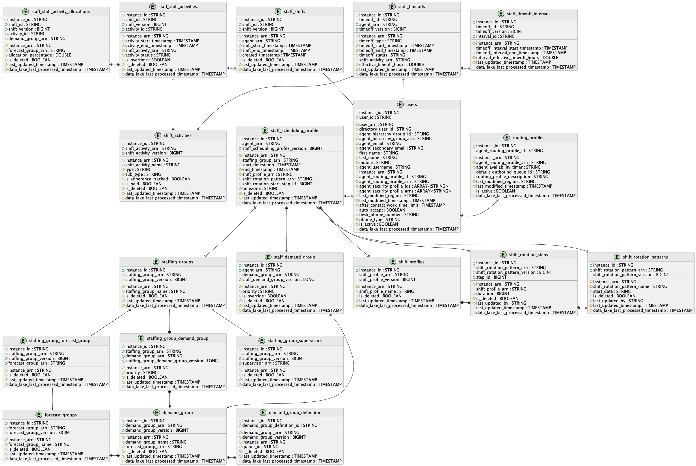

# Scheduling data in the Amazon Connect analytics data

lake

This topic details the content in the Amazon Connect analytics data lake scheduling tables.
The tables list the column, type, and description of the content.

There are two ways to access the analytics data lake and configure data to be
shared:

- [Option 1: Use the Amazon Connect
  console](access-datalake.md#option1-configure-data-to-be-shared "access-datalake.md#option1-configure-data-to-be-shared")
- [Option 2: Use CLI or
  CloudShell](access-datalake.md#option2-configure-data-to-be-shared "access-datalake.md#option2-configure-data-to-be-shared")
  If you are unable to access the scheduling tables by using Option 1, try using
  Option 2.

###### Contents

- [Staff scheduling
  profile](#data-lake-staff-scheduling-profile "#data-lake-staff-scheduling-profile")
- [Shift activities](#data-lake-shift-activities "#data-lake-shift-activities")
- [Shift profiles](#data-lake-shift-profiles "#data-lake-shift-profiles")
- [Staffing groups](#data-lake-staffing-groups "#data-lake-staffing-groups")
- [Staffing groups -
  Forecast groups](#data-lake-staffing-groups-forecast-groups "#data-lake-staffing-groups-forecast-groups")
- [Staffing groups -
  Supervisors](#data-lake-staffing-groups-supervisors "#data-lake-staffing-groups-supervisors")
- [Staff shifts](#staff-shifts "#staff-shifts")
- [Staff shift
  activities](#data-lake-staff-shift-activities "#data-lake-staff-shift-activities")
- [Staff timeoff balance
  changes](#data-lake-staff-timeoff-balance-changes "#data-lake-staff-timeoff-balance-changes")
- [Staff timeoffs](#data-lake-staff-timeoffs "#data-lake-staff-timeoffs")
- [Staff timeoff
  intervals](#data-lake-staff-timeoff-intervals "#data-lake-staff-timeoff-intervals")
- [Staff demand group](#data-lake-staff_demand_group "#data-lake-staff_demand_group")
- [Staffing groups demand group](#data-lake-staffing-groups-demand-groups "#data-lake-staffing-groups-demand-groups")
- [Staff shift activity allocation](#data-lake-staff-shift-activity-allocation "#data-lake-staff-shift-activity-allocation")
- [Schedule metrics](#data-lake-schedule-metrics "#data-lake-schedule-metrics")
- [Schedule goals](#data-lake-schedule-goals "#data-lake-schedule-goals")
- [Shift rotation patterns](#data-lake-shift-rotation-patterns "#data-lake-shift-rotation-patterns")
- [Shift rotation steps](#data-lake-shift-rotation-steps "#data-lake-shift-rotation-steps")
- [Data schema](#data-lake-data-schema "#data-lake-data-schema")
- [Sample queries](#data-lake-sample-queries "#data-lake-sample-queries")

## Staff scheduling

profile

Table Name: `staff_scheduling_profile`

Composite Primary Key: `{instance_id, agent_arn,
 staff_scheduling_profile_version}`

| Column                             | Type      | Description                                                                                                                                                                                       |
| ---------------------------------- | --------- | ------------------------------------------------------------------------------------------------------------------------------------------------------------------------------------------------- |
| instance_id                        | string    | The ID of the Amazon Connect instance.                                                                                                                                                            |
| agent_arn                          | string    | The ARN of the Agent.                                                                                                                                                                             |
| staff_scheduling_profile_version   | bigint    | The Staff Scheduling Profile Version.                                                                                                                                                             |
| instance_arn                       | string    | The ARN of the Amazon Connect instance.                                                                                                                                                           |
| staffing_group_arn                 | string    | The ARN of the Staffing Group to which the Agent is<br>assigned.                                                                                                                                  |
| start_timestamp                    | Timestamp | StartTimestamp for the Agent configured in Staff Rules<br>(schedules are generated only after this Timestamp).                                                                                    |
| end_timestamp                      | Timestamp | EndTimestamp for the Agent configured in Staff Rules<br>(schedules are not generated beyond this Timestamp).                                                                                      |
| shift_profile_arn                  | string    | The ARN of the Shift Profile assigned to the Agent in Staff Rules. Mutually exclusive with Shift Rotation Pattern.                                                                                |
| shift_rotation_pattern_arn         | string    | The ARN of the Shift Rotation Pattern assigned to the Agent in Staff Rules. Mutually exclusive with Shift Profile.                                                                                |
| shift_rotation_start_step_id       | bigint    | The step ID where the Agent begins in the assigned Shift Rotation Pattern.                                                                                                                        |
| timezone                           | string    | Timezone configured for the Agent.                                                                                                                                                                |
| is_deleted                         | Boolean   | Set to True if the Agent is deleted. Else set to False.                                                                                                                                           |
| last_updated_timestamp             | Timestamp | Timestamp when the Staff Scheduling Profile was<br>created/updated/deleted.                                                                                                                       |
| data_lake_last_processed_timestamp | Timestamp | Timestamp, which shows the last time the record was touched<br>by the data lake. This can include transformation and backfill.<br>This field cannot be used to determine reliably data freshness. |

## Shift activities

Table Name: `shift_activities`

Composite Primary Key: `{instance_id, shift_activity_arn,
 shift_activity_version}`

| Column                             | Type      | Description                                                                                                                                                                                              |
| ---------------------------------- | --------- | -------------------------------------------------------------------------------------------------------------------------------------------------------------------------------------------------------- |
| instance_id                        | string    | The ID of the Amazon Connect instance.                                                                                                                                                                   |
| shift_activity_arn                 | string    | The ARN of the Shift Activity.                                                                                                                                                                           |
| shift_activity_version             | bigint    | The Shift Activity Version.                                                                                                                                                                              |
| instance_arn                       | string    | The ARN of the Amazon Connect instance.                                                                                                                                                                  |
| shift_activity_name                | string    | Name of the Shift Activity.                                                                                                                                                                              |
| type                               | string    | Type of the Shift Activity. The possible values are:<br>PRODUCTIVE, NON_PRODUCTIVE, and LEAVE.                                                                                                           |
| sub_type                           | string    | The sub-type of the Shift Activity. This is only valid for<br>NON_PRODUCTIVE type activities. The possible values are:<br>BREAK_OR_MEAL and NONE.                                                        |
| is_adherence_tracked               | Boolean   | Set to True if the Shift Activity is configured for<br>Adherence tracking. Else set to False.                                                                                                            |
| is_paid                            | Boolean   | Set to True if the Shift Activity is configured as Paid.<br>Else set to False.                                                                                                                           |
| is_deleted                         | Boolean   | Set to True if the Shift Activity is deleted. Else set to<br>False.                                                                                                                                      |
| last_updated_timestamp             | Timestamp | The Timestamp when the Shift Activity was<br>created/updated/deleted.                                                                                                                                    |
| data_lake_last_processed_timestamp | Timestamp | The Timestamp, which shows the last time the record was<br>touched by the data lake. This can include transformation and<br>backfill. This field cannot be used to determine reliably data<br>freshness. |

## Shift profiles

Table Name: `shift_profiles`

Composite Primary Key: `{instance_id, shift_profile_arn,
 shift_profile_version}`

| Column                             | Type      | Description                                                                                                                                                                                              |
| ---------------------------------- | --------- | -------------------------------------------------------------------------------------------------------------------------------------------------------------------------------------------------------- |
| instance_id                        | string    | The ID of the Amazon Connect instance.                                                                                                                                                                   |
| shift_profile_arn                  | string    | The ARN of the Shift Profile.                                                                                                                                                                            |
| shift_profile_version              | bigint    | The Shift Profile Version.                                                                                                                                                                               |
| instance_arn                       | string    | The ARN of the Amazon Connect instance.                                                                                                                                                                  |
| shift_profile_name                 | string    | The name of the Shift Profile.                                                                                                                                                                           |
| is_deleted                         | Boolean   | Set to True if the Shift Profile is deleted. Else set to<br>False.                                                                                                                                       |
| last_updated_timestamp             | Timestamp | The Timestamp when the Shift Profile was<br>created/updated/deleted.                                                                                                                                     |
| data_lake_last_processed_timestamp | Timestamp | The Timestamp, which shows the last time the record was<br>touched by the data lake. This can include transformation and<br>backfill. This field cannot be used to determine reliably data<br>freshness. |

## Staffing groups

Table Name: `staffing_groups`

Composite Primary Key: `{instance_id, staffing_group_arn,
 staffing_group_version}`

| Column                             | Type      | Description                                                                                                                                                                                              |
| ---------------------------------- | --------- | -------------------------------------------------------------------------------------------------------------------------------------------------------------------------------------------------------- |
| instance_id                        | string    | The ID of the Amazon Connect instance.                                                                                                                                                                   |
| staffing_group_arn                 | string    | The ARN of the Staffing Group.                                                                                                                                                                           |
| staffing_group_version             | bigint    | The Staffing Group Version.                                                                                                                                                                              |
| instance_arn                       | string    | The ARN of the Amazon Connect instance.                                                                                                                                                                  |
| staffing_group_name                | string    | The name of the Staffing Group.                                                                                                                                                                          |
| is_deleted                         | Boolean   | Set to True if the Staffing Group is deleted. Else set to<br>False.                                                                                                                                      |
| last_updated_timestamp             | Timestamp | The Timestamp when the Staffing Group was<br>created/updated/deleted.                                                                                                                                    |
| data_lake_last_processed_timestamp | Timestamp | The Timestamp, which shows the last time the record was<br>touched by the data lake. This can include transformation and<br>backfill. This field cannot be used to determine reliably data<br>freshness. |

## Staffing groups -

Forecast groups

Table Name: `staffing_group_forecast_groups`

Composite Primary Key: `{instance_id, staffing_group_arn,
 staffing_group_version, forecast_group_arn}`

This table should be queried by joining with `staffing_groups`
table on `staffing_group_arn` and
`staffing_group_version`.

| Column                             | Type      | Description                                                                                                                                                                                              |
| ---------------------------------- | --------- | -------------------------------------------------------------------------------------------------------------------------------------------------------------------------------------------------------- |
| instance_id                        | string    | The ID of the Amazon Connect instance.                                                                                                                                                                   |
| staffing_group_arn                 | string    | The ARN of the Staffing Group.                                                                                                                                                                           |
| staffing_group_version             | bigint    | The Staffing Group Version.                                                                                                                                                                              |
| forecast_group_arn                 | string    | The ARN of the Forecast Group associated to the Staffing<br>Group.                                                                                                                                       |
| instance_arn                       | string    | The ARN of the Amazon Connect instance.                                                                                                                                                                  |
| is_deleted                         | Boolean   | Set to False when the StaffingGroup-ForecastGroup<br>association is valid.                                                                                                                               |
| last_updated_timestamp             | Timestamp | The Timestamp when the Staffing Group was created/updated.                                                                                                                                               |
| data_lake_last_processed_timestamp | Timestamp | The Timestamp, which shows the last time the record was<br>touched by the data lake. This can include transformation and<br>backfill. This field cannot be used to determine reliably data<br>freshness. |

## Staffing groups -

Supervisors

Table Name: `staffing_group_supervisors`

Composite Primary Key: `{instance_id, staffing_group_arn,
 staffing_group_version, supervisor_arn}`

This table should be queried by joining with `staffing_groups`
table on `staffing_group_arn` and
`staffing_group_version`.

| Column                             | Type      | Description                                                                                                                                                                                              |
| ---------------------------------- | --------- | -------------------------------------------------------------------------------------------------------------------------------------------------------------------------------------------------------- |
| instance_id                        | string    | The ID of the Amazon Connect instance.                                                                                                                                                                   |
| staffing_group_arn                 | string    | The ARN of the Staffing Group.                                                                                                                                                                           |
| staffing_group_version             | bigint    | The Staffing Group Version.                                                                                                                                                                              |
| supervisor_arn                     | string    | The Agent ARN of the Supervisor associated to the Staffing<br>Group.                                                                                                                                     |
| instance_arn                       | string    | The ARN of the Amazon Connect instance.                                                                                                                                                                  |
| is_deleted                         | Boolean   | Set to False when the StaffingGroup-ForecastGroup<br>association is valid.                                                                                                                               |
| last_updated_timestamp             | Timestamp | The Timestamp when the Staffing Group was created/updated.                                                                                                                                               |
| data_lake_last_processed_timestamp | Timestamp | The Timestamp, which shows the last time the record was<br>touched by the data lake. This can include transformation and<br>backfill. This field cannot be used to determine reliably data<br>freshness. |

## Staff shifts

Table Name: `staff_shifts`

Composite Primary Key: `{instance_id, shift_id, shift_version}`

| Column                             | Type      | Description                                                                                                                                                                                              |
| ---------------------------------- | --------- | -------------------------------------------------------------------------------------------------------------------------------------------------------------------------------------------------------- |
| instance_id                        | string    | The ID of the Amazon Connect instance.                                                                                                                                                                   |
| shift_id                           | string    | The ID of the Shift.                                                                                                                                                                                     |
| shift_version                      | bigint    | The Shift Version.                                                                                                                                                                                       |
| instance_arn                       | string    | The ARN of the Amazon Connect instance.                                                                                                                                                                  |
| agent_arn                          | string    | The ARN of the Agent.                                                                                                                                                                                    |
| shift_start_timestamp              | Timestamp | The Timestamp when the Shift Starts.                                                                                                                                                                     |
| shift_end_timestamp                | Timestamp | The Timestamp when the Shift Ends.                                                                                                                                                                       |
| created_timestamp                  | Timestamp | The Timestamp when the Shift was Created.                                                                                                                                                                |
| is_deleted                         | Boolean   | Set to True if the Shift is deleted. Else set to False.                                                                                                                                                  |
| last_updated_timestamp             | Timestamp | The Timestamp when the Shift was created/updated/deleted.                                                                                                                                                |
| data_lake_last_processed_timestamp | Timestamp | The Timestamp, which shows the last time the record was<br>touched by the data lake. This can include transformation and<br>backfill. This field cannot be used to determine reliably data<br>freshness. |

## Staff shift

activities

Table Name: `staff_shift_activities`

Composite Primary Key: `{instance_id, shift_id, shift_version,
 activity_id}`

This table should be queried by joining with `staff_shifts` table
on `shift_id` and `shift_version`.

| Column                             | Type      | Description                                                                                                                                                                                              |
| ---------------------------------- | --------- | -------------------------------------------------------------------------------------------------------------------------------------------------------------------------------------------------------- |
| instance_id                        | string    | The ID of the Amazon Connect instance.                                                                                                                                                                   |
| shift_id                           | string    | The ID of the Shift.                                                                                                                                                                                     |
| shift_version                      | bigint    | The Shift Version.                                                                                                                                                                                       |
| activity_id                        | string    | The ID of the Activity.                                                                                                                                                                                  |
| instance_arn                       | string    | The ARN of the Amazon Connect instance.                                                                                                                                                                  |
| activity_start_timestamp           | Timestamp | The Timestamp when the activity starts.                                                                                                                                                                  |
| activity_end_timestamp             | Timestamp | The Timestamp when the activity ends.                                                                                                                                                                    |
| shift_activity_arn                 | string    | The ARN of the Shift Activity. If the shift_activity_arn is<br>null, then it indicates 'Work' activity.                                                                                                  |
| activity_status                    | string    | Status of the Activity. This is set to INACTIVE if the<br>activity overlaps with a timeoff.                                                                                                              |
| is_overtime                        | Boolean   | Set to True if the Activity is part of Overtime. Else set to<br>False.                                                                                                                                   |
| is_deleted                         | Boolean   | Set to False when the Shift Activities are valid.                                                                                                                                                        |
| last_updated_timestamp             | Timestamp | The Timestamp when the Shift was created/updated.                                                                                                                                                        |
| data_lake_last_processed_timestamp | Timestamp | The Timestamp, which shows the last time the record was<br>touched by the data lake. This can include transformation and<br>backfill. This field cannot be used to determine reliably data<br>freshness. |

## Staff timeoff balance

changes

Table Name: `staff_timeoff_balance_changes`

Composite Primary Key: `{instance_id, agent_arn, shift_activity_arn,
 timeoff_balance_version}`

| Column                             | Type      | Description                                                                                                                                                                                                                                                                                  |
| ---------------------------------- | --------- | -------------------------------------------------------------------------------------------------------------------------------------------------------------------------------------------------------------------------------------------------------------------------------------------- |
| instance_arn                       | string    | The ARN of the Amazon Connect instance.                                                                                                                                                                                                                                                      |
| instance_id                        | string    | The ID of the Amazon Connect instance.                                                                                                                                                                                                                                                       |
| account_id                         | string    | The ID of the AWS account.                                                                                                                                                                                                                                                                   |
| agent_arn                          | string    | The ARN of the agent.                                                                                                                                                                                                                                                                        |
| shift_activity_arn                 | string    | The ARN of the Shift Activity this balance is allocated to.                                                                                                                                                                                                                                  |
| timeoff_balance_version            | bigint    | The Time Off balance version, an incrementing number to<br>denote order of changes.                                                                                                                                                                                                          |
| balance_update_source              | string    | Source of the balance update. The possible values are<br>TIME_OFF_BALANCE_UPLOAD, CONNECT_TIME_OFF_REQUEST,<br>SCHEDULE_PUBLISH, CSV_TIME_OFF_BALANCE_DELETION,<br>TIME_OFF_BALANCE_BACKFILL, SYSTEM_UPDATE                                                                                  |
| timeoff_id                         | string    | The ID of the Time Off that caused this balance change, if<br>one exists.                                                                                                                                                                                                                    |
| last_updated_by                    | string    | The ARN of the agent who caused this balance change, if one<br>exists.                                                                                                                                                                                                                       |
| balance_change_in_hours            | double    | Amount of Time Off balance updated through this change in<br>hours. If this value is positive, this change is crediting Time<br>Off balance. If this value is negative, this change is deducting<br>Time Off balance. This value is undefined for any balance upload<br>and deletion events. |
| remaining_balance_in_hours         | double    | Remaining Time Off balance hours after this change event.<br>This value is undefined for any balance deletion event.                                                                                                                                                                         |
| last_created_timestamp             | Timestamp | The Timestamp when the Time Off balance change record was<br>created.                                                                                                                                                                                                                        |
| data_lake_last_processed_timestamp | Timestamp | The Timestamp, which shows the last time the record was<br>touched by the data lake. This can include transformation and<br>backfill. This field cannot be used to determine reliably data<br>freshness.                                                                                     |

## Staff timeoffs

Table Name: `staff_timeoffs`

Composite Primary Key: `{instance_id, timeoff_id, agent_arn,
 timeoff_version}`

| Column                             | Type      | Description                                                                                                                                                                                                                                                                                                                                                                                              |
| ---------------------------------- | --------- | -------------------------------------------------------------------------------------------------------------------------------------------------------------------------------------------------------------------------------------------------------------------------------------------------------------------------------------------------------------------------------------------------------- |
| instance_id                        | string    | The ID of the Amazon Connect instance.                                                                                                                                                                                                                                                                                                                                                                   |
| timeoff_id                         | string    | The ID of the Time Off.                                                                                                                                                                                                                                                                                                                                                                                  |
| agent_arn                          | string    | The ARN of the Agent.                                                                                                                                                                                                                                                                                                                                                                                    |
| timeoff_version                    | bigint    | The Time Off Version.                                                                                                                                                                                                                                                                                                                                                                                    |
| instance_arn                       | string    | The ARN of the Amazon Connect instance.                                                                                                                                                                                                                                                                                                                                                                  |
| timeoff_type                       | string    | Type of Time Off. The possible values are: TIME_OFF and<br>VOLUNTARY_TIME_OFF.                                                                                                                                                                                                                                                                                                                           |
| timeoff_start_timestamp            | Timestamp | Timestamp when the Time Off starts.                                                                                                                                                                                                                                                                                                                                                                      |
| timeoff_end_timestamp              | Timestamp | Timestamp when the Time Off ends.                                                                                                                                                                                                                                                                                                                                                                        |
| timeoff_status                     | string    | Status of the Time Off. The possible values are:<br>PENDING_CREATE, PENDING_UPDATE, PENDING_CANCEL, PENDING_ACCEPT,<br>PENDING_APPROVE, PENDING_DECLINE, APPROVED, ACCEPTED, REJECTED,<br>CANCELLED, WAITING_ACCEPT, and WAITING_APPROVE. The WAITING<br>statuses indicate timeoff is waiting on User action. PENDING<br>statuses indicate timeoff is waiting for system processing of a<br>user action. |
| shift_activity_arn                 | string    | The ARN of the Shift Activity used for the Timeoff.                                                                                                                                                                                                                                                                                                                                                      |
| effective_timeoff_hours            | double    | Total effective Time Off hours. Effective timeoff hours are<br>calculated based on [timeoff deduction logic](upload-timeoff-balance.md#how-system-calculates-time-off-deductions "upload-timeoff-balance.md#how-system-calculates-time-off-deductions"). This is only set for<br>TIME_OFF type.                                                                                                          |
| last_updated_timestamp             | Timestamp | Timestamp when the Time Off was created/updated/deleted.                                                                                                                                                                                                                                                                                                                                                 |
| data_lake_last_processed_timestamp | Timestamp | Timestamp, which shows the last time the record was touched<br>by the data lake. This can include transformation and backfill.<br>This field cannot be used to determine reliably data freshness.                                                                                                                                                                                                        |

## Staff timeoff

intervals

Table Name: `staff_timeoff_intervals`

Composite Primary Key: {`instance_id, timeoff_id, timeoff_version,
 interval_id}`

This table should be queried by joining with `staff_timeoffs`
table on `timeoff_id` and `timeoff_version`.

| Column                             | Type      | Description                                                                                                                                                                                                                                                                               |
| ---------------------------------- | --------- | ----------------------------------------------------------------------------------------------------------------------------------------------------------------------------------------------------------------------------------------------------------------------------------------- |
| instance_id                        | string    | The ID of the Amazon Connect instance.                                                                                                                                                                                                                                                    |
| timeoff_id                         | string    | The ID of the Time Off.                                                                                                                                                                                                                                                                   |
| timeoff_version                    | bigint    | The Time Off Version.                                                                                                                                                                                                                                                                     |
| interval_id                        | string    | The ID of the Time Off Interval.                                                                                                                                                                                                                                                          |
| instance_arn                       | string    | The ARN of the Amazon Connect instance.                                                                                                                                                                                                                                                   |
| timeoff_interval_start_timestamp   | Timestamp | Timestamp when the specific interval of Time Off starts.                                                                                                                                                                                                                                  |
| timeoff_interval_end_timestamp     | Timestamp | Timestamp when the specific interval of Time Off ends.                                                                                                                                                                                                                                    |
| interval_effective_timeoff_hours   | double    | Effective Time Off hours for this specific interval of Time<br>Off. Effective timeoff hours are calculated based on [timeoff deduction logic](upload-timeoff-balance.md#how-system-calculates-time-off-deductions "upload-timeoff-balance.md#how-system-calculates-time-off-deductions"). |
| last_updated_timestamp             | Timestamp | Timestamp when the Time Off was created/updated/deleted.                                                                                                                                                                                                                                  |
| data_lake_last_processed_timestamp | Timestamp | Timestamp, which shows the last time the record was touched<br>by the data lake. This can include transformation and backfill.<br>This field cannot be used to determine reliably data freshness.                                                                                         |

## Staff demand group

Table name: `staff_demand_group`

Composite Primary Key: `{instance_id, agent_arn, demand_group_arn, staff_demand_group_version}`

| Column                             | Type      | Description                                                                                                                                                                                           |
| ---------------------------------- | --------- | ----------------------------------------------------------------------------------------------------------------------------------------------------------------------------------------------------- |
| instance_id                        | string    | The ID of the Amazon Connect instance.                                                                                                                                                                |
| agent_arn                          | string    | The ARN of the agent.                                                                                                                                                                                 |
| demand_group_arn                   | string    | The ARN of the demand group.                                                                                                                                                                          |
| staff_demand_group_version         | Long      | Version for this agent to demand group association                                                                                                                                                    |
| priority                           | string    | Priority of the demand group for this agent. Can be LOW, MEDIUM or<br>HIGH                                                                                                                            |
| instance_arn                       | string    | The ARN of the Amazon Connect instance.                                                                                                                                                               |
| is_override                        | Boolean   | Set to 'true' if this is Agent to Demand Group association is Agent level override.                                                                                                                   |
| is_deleted                         | Boolean   | Set to true if agent to demand group association is deleted.                                                                                                                                          |
| last_updated_timestamp             | Timestamp | The Timestamp when the agent to demand group association was created/updated.                                                                                                                         |
| data_lake_last_processed_timestamp | Timestamp | The Timestamp, which shows the last time the record was touched by the data lake.<br>This can include transformation and backfill. This field cannot be used to determine<br>reliably data freshness. |

## Staffing groups demand group

Table name: `staffing_group_demand_group`

Composite Primary Key: `{instance_id, staffing_group_arn, demand_group_arn,
 staffing_group_demand_group_version}`

| Column                              | Type      | Description                                                                                                                                                                                           |
| ----------------------------------- | --------- | ----------------------------------------------------------------------------------------------------------------------------------------------------------------------------------------------------- |
| instance_id                         | string    | The ID of the Amazon Connect instance.                                                                                                                                                                |
| staffing_group_arn                  | string    | The ARN of the Staffing Group.                                                                                                                                                                        |
| demand_group_arn                    | string    | The ARN of the demand group.                                                                                                                                                                          |
| staffing_group_demand_group_version | Long      | Version for this Staffing Group to Demand Group association                                                                                                                                           |
| priority                            | string    | Priority of the Demand Group for this Staffing Group. Can be LOW, MEDIUM or<br>HIGH                                                                                                                   |
| instance_arn                        | string    | The ARN of the Amazon Connect instance.                                                                                                                                                               |
| is_deleted                          | Boolean   | Set to true if the staffing group to demand group association is deleted.                                                                                                                             |
| last_updated_timestamp              | Timestamp | Timestamp when the staffing group to demand group association was created/updated/deleted.                                                                                                            |
| data_lake_last_processed_timestamp  | Timestamp | The Timestamp, which shows the last time the record was touched by the data lake.<br>This can include transformation and backfill. This field cannot be used to determine<br>reliably data freshness. |

## Staff shift activity allocation

Table name: `staff_shift_activity_allocations`

Composite Primary Key: `{instance_id, shift_id, shift_version, activity_id, demand_group_arn}`

| Column                             | Type      | Description                                                                                                                                                                                     |
| ---------------------------------- | --------- | ----------------------------------------------------------------------------------------------------------------------------------------------------------------------------------------------- |
| instance_id                        | string    | The ID of the Amazon Connect instance.                                                                                                                                                          |
| shift_id                           | string    | The ID of the shift.                                                                                                                                                                            |
| shift_version                      | Long      | The Shift Version.                                                                                                                                                                              |
| activity_id                        | string    | The ID of the activity.                                                                                                                                                                         |
| demand_group_arn                   | string    | The ARN of the demand group.                                                                                                                                                                    |
| foecast_group_arn                  | string    | The ARN of the forecast group.                                                                                                                                                                  |
| allocation_percentage              | double    | Percentage allocation of the Activity to the Demand Group.                                                                                                                                      |
| is_deleted                         | Boolean   | Set to False when the StaffingGroup-ForecastGroupassociation is valid.                                                                                                                          |
| last_updated_timestamp             | Timestamp | The Timestamp when the Staffing Group was created/updated.                                                                                                                                      |
| data_lake_last_processed_timestamp | Timestamp | The Timestamp, which shows the last time the record was touched by the data lake. This can include transformation and backfill. This field cannot be used to determine reliably data freshness. |

## Schedule metrics

Table Name: `schedule_metrics`

Composite Primary Key: `{instance_id, metric_id, interval_start_timestamp}`

| Column                             | Type      | Description                                                                                                                                                                            |
| ---------------------------------- | --------- | -------------------------------------------------------------------------------------------------------------------------------------------------------------------------------------- |
| instance_id                        | string    | The ARN of the Amazon Connect instance.                                                                                                                                                |
| instance_arn                       | string    | The ID of the Amazon Connect instance.                                                                                                                                                 |
| metric_id                          | string    | Unique identifier for the metric value                                                                                                                                                 |
| aws_account_id                     | string    | The ID of the AWS account.                                                                                                                                                             |
| entity_type                        | string    | Denotes whether the metric is for a forecast group or demand group.                                                                                                                    |
| entity_arn                         | string    | Arn of the forecast group or demand group                                                                                                                                              |
| channel                            | string    | Denotes the media channel like Voice, chat. If the row contains metrics that are not channel level, then it's populated as ALL                                                         |
| interval_start_timestamp           | timestamp | Timestamp denoting the start of the interval                                                                                                                                           |
| required_agent_count               | float     | Denotes the forecasted agents count                                                                                                                                                    |
| scheduled_agent_count              | float     | Denotes the schedule agents count                                                                                                                                                      |
| scheduled_occupancy                | float     | Denotes the occupancy percentage                                                                                                                                                       |
| scheduled_service_level_percentage | float     | Denotes the schedule service level percentage                                                                                                                                          |
| service_level_seconds              | integer   | Denotes the service level seconds                                                                                                                                                      |
| scheduled_average_speed_of_answer  | float     | Denotes the average speed of answer                                                                                                                                                    |
| is_deleted                         | boolean   | Denotes whether the metric is deleted                                                                                                                                                  |
| last_updated_timestamp             | timestamp | The Timestamp when the metric record was created.                                                                                                                                      |
| data_lake_last_processed_timestamp | timestamp | Timestamp, which shows the last time the data lake processed the record. This can include transformation and backfill. This field cannot be used to determine reliably data freshness. |

## Schedule goals

Table Name: `schedule_goals`

Composite Primary Key: `{instance_id, goal_id}`

| Column                             | Type      | Description                                                                                                                                                                            |
| ---------------------------------- | --------- | -------------------------------------------------------------------------------------------------------------------------------------------------------------------------------------- |
| instance_id                        | string    | The ARN of the Amazon Connect instance.                                                                                                                                                |
| instance_arn                       | string    | The ID of the Amazon Connect instance.                                                                                                                                                 |
| goal_id                            | string    | Unique identifier for the goal value                                                                                                                                                   |
| aws_account_id                     | string    | The ID of the AWS account.                                                                                                                                                             |
| entity_type                        | string    | Denotes whether the goal is for a forecast group or demand group.                                                                                                                      |
| entity_arn                         | string    | Arn of the forecast group or demand group                                                                                                                                              |
| channel                            | string    | Denotes the media channel like Voice, chat.                                                                                                                                            |
| start_date_timestamp               | timestamp | Timestamp denoting start of the goal                                                                                                                                                   |
| end_date_timestamp                 | timestamp | Timestamp denoting end of the goal                                                                                                                                                     |
| goal_service_level_percentage      | float     | Denotes the goal service level percentage                                                                                                                                              |
| goal_service_level_seconds         | integer   | Denotes the service level seconds                                                                                                                                                      |
| goal_average_speed_of_answer       | float     | Denotes the average speed of answer                                                                                                                                                    |
| is_deleted                         | boolean   | Denotes whether the goal is deleted                                                                                                                                                    |
| last_updated_timestamp             | timestamp | The Timestamp when the goals record was created.                                                                                                                                       |
| data_lake_last_processed_timestamp | timestamp | Timestamp, which shows the last time the data lake processed the record. This can include transformation and backfill. This field cannot be used to determine reliably data freshness. |

## Shift rotation patterns

Table Name: `shift_rotation_patterns`

Composite Primary Key: `{instance_id, shift_rotation_pattern_arn,
 shift_rotation_pattern_version}`

| Column                             | Type      | Description                                                                                                                                                                                     |
| ---------------------------------- | --------- | ----------------------------------------------------------------------------------------------------------------------------------------------------------------------------------------------- |
| instance_id                        | string    | The ID of the Amazon Connect instance.                                                                                                                                                          |
| shift_rotation_pattern_arn         | string    | The ARN of the Shift Rotation Pattern.                                                                                                                                                          |
| shift_rotation_pattern_version     | bigint    | The Shift Rotation Pattern Version.                                                                                                                                                             |
| instance_arn                       | string    | The ARN of the Amazon Connect instance.                                                                                                                                                         |
| shift_rotation_pattern_name        | string    | The name of the Shift Rotation Pattern.                                                                                                                                                         |
| start_date                         | string    | The start date of the Shift Rotation Pattern in `yyyy-mm-dd` format.                                                                                                                            |
| is_deleted                         | Boolean   | Set to True if the Shift Rotation Pattern is deleted. Else set to False.                                                                                                                        |
| last_updated_by                    | string    | The ARN of the user who created/updated/deleted the Shift Rotation Pattern.                                                                                                                     |
| last_updated_timestamp             | Timestamp | The Timestamp when the Shift Rotation Pattern was created/updated/deleted.                                                                                                                      |
| data_lake_last_processed_timestamp | Timestamp | The Timestamp, which shows the last time the record was touched by the data lake. This can include transformation and backfill. This field cannot be used to determine reliably data freshness. |

## Shift rotation steps

Table Name: `shift_rotation_steps`

Composite Primary Key: `{instance_id, shift_rotation_pattern_arn,
 shift_rotation_pattern_version, step_id}`

This table should be queried by joining with `shift_rotation_patterns`
table on `shift_rotation_pattern_arn` and
`shift_rotation_pattern_version`.

| Column                             | Type      | Description                                                                                                                                                                                     |
| ---------------------------------- | --------- | ----------------------------------------------------------------------------------------------------------------------------------------------------------------------------------------------- |
| instance_id                        | string    | The ID of the Amazon Connect instance.                                                                                                                                                          |
| shift_rotation_pattern_arn         | string    | The ARN of the Shift Rotation Pattern.                                                                                                                                                          |
| shift_rotation_pattern_version     | bigint    | The Shift Rotation Pattern Version.                                                                                                                                                             |
| step_id                            | bigint    | The ID of the step within the Shift Rotation Pattern. Steps are numbered sequentially (1, 2, 3, ... up to 52).                                                                                  |
| instance_arn                       | string    | The ARN of the Amazon Connect instance.                                                                                                                                                         |
| shift_profile_arn                  | string    | The ARN of the Shift Profile associated with the rotation step.                                                                                                                                 |
| duration                           | bigint    | The duration of the rotation step in weeks.                                                                                                                                                     |
| is_deleted                         | Boolean   | Set to False when the Shift Rotation Step is valid.                                                                                                                                             |
| last_updated_by                    | string    | The ARN of the user who created/updated the Shift Rotation Pattern.                                                                                                                             |
| last_updated_timestamp             | Timestamp | The Timestamp when the Shift Rotation Pattern was created/updated.                                                                                                                              |
| data_lake_last_processed_timestamp | Timestamp | The Timestamp, which shows the last time the record was touched by the data lake. This can include transformation and backfill. This field cannot be used to determine reliably data freshness. |

## Data schema

Following is an entity relationship diagram that shows the structure and
relationships between scheduling tables in the Amazon Connect analytics data lake.

Each table displays its primary keys and attributes with their data types.
The diagram illustrates how these tables relate to each other through foreign
key relationships, providing a comprehensive view of the scheduling data
model.



## Sample queries

### 1. Query to get all the Scheduled Shift Activities

of the Agents working on a specific Forecast Group

`SELECT * FROM agent_scheduled_shift_activities_view
 where forecast_group_name = 'AnyDepartmentForecastGroup'`

Complete the following steps to
create `agent_scheduled_shift_activities_view` mentioned
above.

**Step 1: Create a view to get supervisor
names**

```
CREATE OR REPLACE VIEW "latest_supervisor_names_view" AS
SELECT
  staffing_group_arn
, array_agg(supervisor_name ORDER BY supervisor_name ASC) supervisor_names
FROM
  (
   SELECT
     s.staffing_group_arn
   , CONCAT(u.first_name, ' ', u.last_name) supervisor_name
   FROM
     ((
      SELECT
        staffing_group_arn
      , supervisor_arn
      FROM
        (
         SELECT
           *
         , RANK() OVER (PARTITION BY staffing_group_arn ORDER BY staffing_group_version DESC) recency
         FROM
           staffing_group_supervisors
         WHERE (instance_id = 'YourAmazonConnectInstanceId')
      )  t
      WHERE (recency = 1)
   )  s
   INNER JOIN USERS u ON (s.supervisor_arn = u.user_arn))
)
GROUP BY staffing_group_arn
```

**Step 2: Create a view to get the staffing group and
forecast group associated with an agent**

```
CREATE OR REPLACE VIEW "latest_agent_staffing_group_forecast_group_view" AS
WITH
  latest_staff_scheduling_profile AS (
   SELECT
     agent_arn
   , staffing_group_arn
   , last_updated_timestamp
   FROM
     (
      SELECT
        *
      , RANK() OVER (PARTITION BY agent_arn ORDER BY staff_scheduling_profile_version DESC) recency
      FROM
        staff_scheduling_profile
      WHERE ((instance_id = 'YourAmazonConnectInstanceId') AND (is_deleted = false))
   )  t
   WHERE (recency = 1)
)
, latest_staffing_groups AS (
   SELECT
     staffing_group_name
   , staffing_group_arn
   FROM
     (
      SELECT
        *
      , RANK() OVER (PARTITION BY staffing_group_arn ORDER BY staffing_group_version DESC) recency
      FROM
        staffing_groups
      WHERE (instance_id = 'YourAmazonConnectInstanceId')
   )  t
   WHERE (recency = 1)
)
, latest_forecast_groups AS (
   SELECT
     forecast_group_arn
   , forecast_group_name
   FROM
     (
      SELECT
        *
      , RANK() OVER (PARTITION BY forecast_group_arn ORDER BY forecast_group_version DESC) recency
      FROM
        forecast_groups
      WHERE (instance_id = 'YourAmazonConnectInstanceId')
   )  t
   WHERE (recency = 1)
)
, latest_staffing_group_forecast_groups AS (
   SELECT
     staffing_group_arn
   , forecast_group_arn
   FROM
     (
      SELECT
        *
      , RANK() OVER (PARTITION BY staffing_group_arn ORDER BY staffing_group_version DESC) recency
      FROM
        staffing_group_forecast_groups
      WHERE (instance_id = 'YourAmazonConnectInstanceId')
   )  t
   WHERE (recency = 1)
)
SELECT
  ssp.agent_arn
, U.agent_username AS username
, U.agent_routing_profile_id AS routing_profile_id
, CONCAT(u.first_name, ' ', u.last_name) agent_name
, fg.forecast_group_arn
, fg.forecast_group_name
, sg.staffing_group_arn
, sg.staffing_group_name
FROM
 latest_staff_scheduling_profile ssp
INNER JOIN latest_staffing_groups sg ON ssp.staffing_group_arn = sg.staffing_group_arn
INNER JOIN latest_staffing_group_forecast_groups sgfg ON ssp.staffing_group_arn = sgfg.staffing_group_arn
INNER JOIN latest_forecast_groups fg ON fg.forecast_group_arn = sgfg.forecast_group_arn
INNER JOIN USERS u ON ssp.agent_arn = u.user_arn
```

**Step 3: Get the latest Shift activities**

```
CREATE OR REPLACE VIEW "latest_shift_activities_view" AS
SELECT
  shift_activity_arn
, shift_activity_name
, shift_activity_version
, type
, sub_type
, is_adherence_tracked
, is_paid
, last_updated_timestamp
FROM
  (
   SELECT
     *
   , RANK() OVER (PARTITION BY shift_activity_arn ORDER BY shift_activity_version DESC) recency
   FROM
     shift_activities
   WHERE (instance_id = 'YourAmazonConnectInstanceId')
)  t
WHERE (recency = 1)
```

**Step 4: Create a view to get the agent scheduled shift
activities**

```
CREATE OR REPLACE VIEW "agent_scheduled_shift_activities_view" AS
WITH
  latest_staff_shifts AS (
   SELECT
     agent_arn
   , shift_id
   , shift_version
   , shift_start_timestamp
   , shift_end_timestamp
   , created_timestamp
   , last_updated_timestamp
   , data_lake_last_processed_timestamp
   , recency
   FROM
     (
      SELECT
        RANK() OVER (PARTITION BY shift_id ORDER BY shift_version DESC) recency
      , *
      FROM
        staff_shifts sa
      WHERE (instance_id = 'YourAmazonConnectInstanceId')
   )  t
   WHERE ((recency = 1) AND (is_deleted = false))
)
SELECT
  asgfg.forecast_group_name
, array_join(sn.supervisor_names, ',') supervisor_names
, s.agent_arn
, u.first_name
, u.last_name
, asgfg.staffing_group_name
, ssa.activity_id
, (CASE WHEN (ssa.shift_activity_arn IS NULL) THEN COALESCE(sa.shift_activity_name, 'Work') ELSE sa.shift_activity_name END) shift_activity_name
, s.shift_start_timestamp
, s.shift_end_timestamp
, (CASE WHEN (ssa.shift_activity_arn IS NULL) THEN COALESCE(sa.type, 'PRODUCTIVE') ELSE sa.type END) type
, (CASE WHEN (ssa.shift_activity_arn IS NULL) THEN COALESCE(sa.is_paid, true) ELSE sa.is_paid END) is_paid
, ssa.activity_start_timestamp
, ssa.activity_end_timestamp
, ssa.last_updated_timestamp
, ssa.data_lake_last_processed_timestamp
, u.agent_username as username
, u.agent_routing_profile_id as routing_profile_id
FROM
  staff_shift_activities ssa
INNER JOIN latest_staff_shifts s ON s.shift_id = ssa.shift_id AND s.shift_version = ssa.shift_version
INNER JOIN USERS u ON s.agent_arn = u.user_arn
INNER JOIN latest_agent_staffing_group_forecast_group_view asgfg ON s.agent_arn = asgfg.agent_arn
LEFT JOIN latest_shift_activities_view sa ON sa.shift_activity_arn = ssa.shift_activity_arn
INNER JOIN latest_supervisor_names_view sn ON sn.staffing_group_arn = asgfg.staffing_group_arn
WHERE (ssa.is_deleted = false) AND (COALESCE(ssa.activity_status, ' ') <> 'INACTIVE') AND (ssa.instance_id = 'YourAmazonConnectInstanceId')
```

### 2. Query to get all the time off requests of the

Agents in a specific Forecast Group

`SELECT * FROM agent_timeoff_report_view where forecast_group_name =
 'AnyDepartmentForecastGroup'`

Use the following query to create `agent_timeoff_report_view`
mentioned above.

```
CREATE OR REPLACE VIEW "agent_timeoff_report_view" AS
WITH latest_staff_timeoffs AS (
        SELECT t1.*,
            CAST((t1.effective_timeoff_hours * 60) AS INT) total_effective_timeoff_minutes
        FROM (
                SELECT RANK() OVER (
                        PARTITION BY timeoff_id
                        ORDER BY timeoff_version DESC
                    ) recency,
                    agent_arn,
                    timeoff_id,
                    shift_activity_arn,
                    timeoff_status,
                    timeoff_version,
                    effective_timeoff_hours,
                    timeoff_start_timestamp,
                    timeoff_end_timestamp,
                    last_updated_timestamp,
                    data_lake_last_processed_timestamp
                FROM staff_timeoffs
                WHERE (
                        instance_id = 'YourAmazonConnectInstanceId'
                    )
            ) t1
        WHERE (recency = 1)
    )
SELECT asgfg.forecast_group_name,
    to.agent_arn,
    asgfg.agent_name,
    asgfg.staffing_group_name,
    asgfg.username,
    sa.shift_activity_name,
    to.timeoff_start_timestamp,
    to.timeoff_end_timestamp,
    to.timeoff_status,
    array_join(sn.supervisor_names, ',') AS supervisor_names,
    sa.is_paid,
    to.last_updated_timestamp,
    to.data_lake_last_processed_timestamp,
    u.agent_routing_profile_id AS routing_profile_id,
    to.timeoff_id,

    to.shift_activity_arn,
    to.total_effective_timeoff_minutes
FROM latest_staff_timeoffs to
    INNER JOIN latest_agent_staffing_group_forecast_group_view asgfg ON asgfg.agent_arn = to.agent_arn
    INNER JOIN latest_shift_activities_view sa ON sa.shift_activity_arn = to.shift_activity_arn
    INNER JOIN latest_supervisor_names_view sn ON sn.staffing_group_arn = asgfg.staffing_group_arn
    INNER JOIN users u ON u.user_arn = to.agent_arn
```
