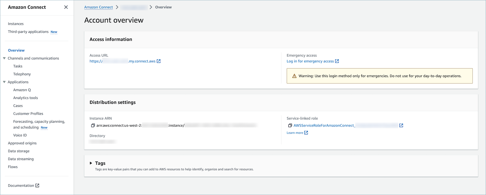

# Enable data streaming for your Amazon Connect instance

You can export contact records and agent events from Amazon Connect and perform real-time
analysis on contacts. Data streaming sends data to Amazon Kinesis.

###### To enable data streaming for your instance

1. Open the Amazon Connect console at
   [https://console.aws.amazon.com/connect/](https://console.aws.amazon.com/connect/ "https://console.aws.amazon.com/connect/").
2. On the instances page, choose the instance alias. The instance alias is also
   your **instance name**, which appears in your Amazon Connect
   URL. The following image shows the **Amazon Connect virtual contact center instances** page, with a box
   around the instance alias.

 3. In the navigation pane, choose **Data streaming**. 4. Choose **Enable data streaming**. 5. For **Contact records**, do one of the following:

    * Choose **Kinesis Firehose** and select an existing
     delivery stream, or choose **Create a new Kinesis
     firehose** to open the Kinesis Firehose console and create
     the delivery stream. For more information, see [Creating an Amazon Data Firehose Delivery Stream](../../../firehose/latest/dev/basic-create.md "../../../firehose/latest/dev/basic-create.md").
    * Choose **Kinesis Stream** and select an existing
     stream, or choose **Create a Kinesis stream** to open
     the Kinesis console and create the stream. For more information, see [Creating and
     Managing Streams](../../../streams/latest/dev/working-with-streams.md "../../../streams/latest/dev/working-with-streams.md").

6. For **Agent Events**, select an existing Kinesis stream or
   choose **Create a new Kinesis stream** to open the Kinesis console
   and create the stream.
7. Choose **Save**.

## Use server-side encryption for

the Kinesis stream

Amazon Connect supports streaming to Amazon Kinesis Data Streams and Firehose streams that have server-side
encryption with a [customer managed key](../../../kms/latest/developerguide/concepts.md#key-mgmt "../../../kms/latest/developerguide/concepts.md#key-mgmt")
enabled. For a general overview of this feature, see [What Is Server-Side Encryption for
Kinesis Data Streams?](../../../streams/latest/dev/what-is-sse.md "../../../streams/latest/dev/what-is-sse.md")

To stream to Kinesis Data Streams, you need to grant your Amazon Connect instance permission to use a
customer managed key. For details on the permissions needed for KMS keys, see [Permissions to Use User-Generated KMS Master Keys](../../../streams/latest/dev/permissions-user-key-KMS.md "../../../streams/latest/dev/permissions-user-key-KMS.md"). (Amazon Connect acts as the
Kinesis stream producer that is described in that topic.)

When Amazon Connect puts records into your Kinesis Data Streams, it uses the service-linked role of the
instance for authorization. This role needs permission to use the KMS key that
encrypts the data stream. To assign permissions to the role, perform the following
steps to update the [key policy](../../../kms/latest/developerguide/key-policies.md "../../../kms/latest/developerguide/key-policies.md") of that
KMS key.

###### Note

To avoid missing data, update the permission of the KMS key before using a
KMS key with Amazon Connect streaming.

### Step 1: Obtain the ARN for the service-linked role

of your Amazon Connect instance

You can use the Amazon Connect console or the AWS CLI to obtain the ARN.

###### Use the Amazon Connect console to obtain the ARN

1. Open the Amazon Connect console at
   [https://console.aws.amazon.com/connect/](https://console.aws.amazon.com/connect/ "https://console.aws.amazon.com/connect/").
2. On the instances page, choose the instance name, as shown in the
   following image.

 3. On the **Account overview** page, in the
**Distribution settings** section, the
service-linked role is displayed.

 4. Choose the copy icon to copy the role ARN to your clipboard, and save
that ARN. You're going to use it in [Step 2: Construct a policy statement](#step2-sse "#step2-sse").

###### Use the AWS CLI to obtain the ARN

1. Run the following command:

`aws connect describe-instance --instance-id
 `your_instance_id`` 2. Save the ServiceRole value from the CLI output.

### Step 2: Construct a policy statement

Construct a policy statement that gives permission to the ARN of the Amazon Connect
service-link role to generate data keys. The following code shows a sample
policy.

```
{
    "Sid": "Allow use of the key for Amazon Connect streaming",
    "Effect": "Allow",
    "Principal": {
        "AWS": "`the ARN of the Amazon Connect service-linked role`"
    },
    "Action": "kms:GenerateDataKey",
    "Resource": "*"
 }
```

Add this statement to the KMS key policy by using your preferred mechanism,
such as the AWS Key Management Service console, the AWS CLI, or the
AWS CDK.
